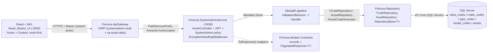
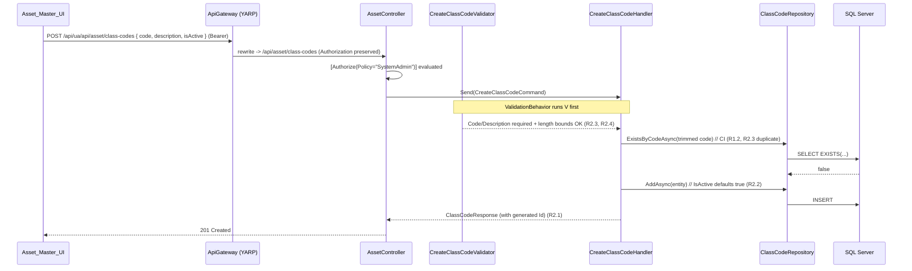
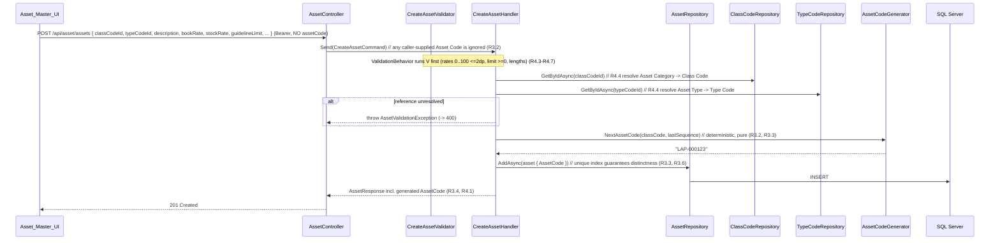
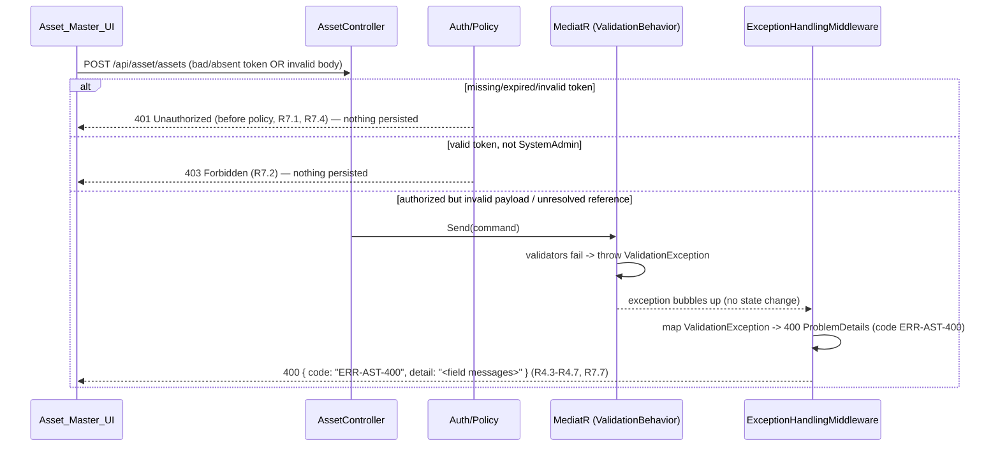

# Design Document: Asset Master Management (FINNOVA-14)

## Overview

The Asset Master Management feature re-engineers the legacy "Asset Master" ASP.NET screen into
a modern, full-stack, SystemAdmin-scoped capability. It lets a System Administrator maintain the
master data that classifies and describes fixed assets across the Finnova platform. The feature
preserves the two top-level areas of the legacy screen end-to-end (database -> repository ->
service -> controller -> gateway -> UI):

1. **Asset Definition** — four independent **code masters**: **Class Codes**, **Make Codes**,
   **Type Codes**, and **Model Codes**. Each is a set of records with a `Code` and a
   `Description` (plus an `IsActive` flag and timestamps), supporting list/paginate/search,
   create, update, and delete/deactivate. Together they form the classification vocabulary that
   assets draw on.
2. **Asset Mapping** — actual **asset records**, each carrying an auto-generated **Asset Code**,
   an Asset Code Description, an Asset Category (drawn from Class Codes), an Asset Type (drawn
   from Type Codes), book and stock depreciation categories and rates, a guideline limit, and an
   active indicator. Asset Mapping supports create (with **server-side Asset Code generation**),
   update, list/paginate/search, and get-by-id.

> Finnova is an India-only platform; all descriptions, labels, seed, and sample data are
> English-only. There are no bilingual (English/Arabic) fields, no non-English content, and no
> right-to-left rendering. Each display value is a single plain field (`Description`).

This design follows the platform's layered CQRS conventions exactly, as confirmed by inspecting
the existing Lookup (FINNOVA-8) and Nationality (FINNOVA-9) features:

`Finnova.Models` (entities, enums, exceptions, record request/response contracts) ->
`Finnova.Repository` (EF Core on **SQL Server**, generic `IRepository<T>` + `RepositoryBase<T>`,
per-entity repos, `IEntityTypeConfiguration<T>`, `DbSet`s on `FinnovaDbContext`) ->
`Finnova.Service` (MediatR Commands/Queries with FluentValidation validators behind the
`ValidationBehavior<,>` pipeline and static `.ToResponse()` mappers) -> the
`Finnova.SystemAdminService` host (:5030) with its controller(s) and `ExceptionHandlingMiddleware`
-> the `Finnova.ApiGateway` YARP reverse proxy -> the React 18 + TypeScript + Material UI
frontend (React hooks + Context, **no Redux, no RxJS**, mock-first interface/mock/real/toggle
service layer over the shared axios instance).

The platform `PaginatedResponse<T>` contract is reused for all list endpoints.

### Requirements coverage map

| Requirement | Covered by |
|---|---|
| R1 Code-master data model + taxonomy | `ClassCode`/`MakeCode`/`TypeCode`/`ModelCode` entities + EF configs (unique index on `Code`), `Asset.ClassCodeId`/`TypeCodeId` FKs, create/update validators & handlers (R1.1-R1.6) |
| R2 Code-master CRUD/list/search/paginate | Per-master CQRS slices (`CreateXxxCode`/`UpdateXxxCode`/`DeleteXxxCode`/`GetXxxCodesPaged`), `GetPagedAsync` substring search + `Code`-ascending/`Id` tie-break order, `PaginatedResponse<T>`, pagination validator (R2.1-R2.11) |
| R3 Asset data model + Asset Code generation | `Asset` entity + config (`DbSet` on `FinnovaDbContext`), `IAssetCodeGenerator` server-side generation, unique index on `AssetCode` (R3.1-R3.6) |
| R4 Asset create/update + validation | `CreateAsset`/`UpdateAsset` commands + validators (reference resolution, rate/limit/length bounds) + `.ToResponse()` mapper, `ValidationBehavior` (R4.1-R4.10) |
| R5 Asset list/search/paginate/get-by-id | `GetAssetsPaged` + `GetAssetById` queries, substring search on `AssetCode`/`Description`, `AssetCode`-ascending/`Id` order, `AssetNotFoundException` (R5.1-R5.10) |
| R6 Delete/deactivate rules | `IsActive` soft-delete semantics on all five entities, hard-delete in-use guard (`CodeInUseException`), not-found guards (R6.1-R6.4) |
| R7 AuthN/AuthZ + gateway | `[Authorize(Policy="SystemAdmin")]`, JWT Bearer scheme (reused from FINNOVA-8), gateway `systemadmin-route` + `ua-asset-alias-*`, `ExceptionHandlingMiddleware` asset branch (R7.1-R7.8) |
| R8 Screen shell + area/sub-tab nav | `AssetMaster.tsx` with area tabs + 4 code-master sub-tabs, route in `App.tsx`, nav in `Layout.tsx`, in-flight discard via request-token guard (R8.1-R8.6) |
| R9 Code-master grid + dialogs | `CodeMasterGrid` + `CodeMasterDialog` (MUI DataGrid, search, pagination, create/edit/delete, duplicate-code conflict handling, empty state) (R9.1-R9.12) |
| R10 Asset Mapping grid + view | `AssetMappingGrid` + active indicator cell, search/show-all/pagination, get-by-id detail view (R10.1-R10.7) |
| R11 Asset create/edit dialog | `AssetDialog` (read-only Asset Code, category select, depreciation + guideline fields with client validation, active default) (R11.1-R11.11) |
| R12 Class-code filter panel | `ClassCodeFilterPanel` (code search substring filter, checklist, selection retention, empty state) (R12.1-R12.5) |
| R13 Mock-first service layer | `Asset_Master_Service` interface, mock impl (in-memory + mock Asset Code generation), real axios impl, `VITE_USE_MOCK_API` toggle, barrels (R13.1-R13.6) |
| R14 Error/loading/timeout handling | Shared axios 401/403/409/timeout handling, per-grid/dialog loading state, conflict message preservation, unchanged-on-failure semantics (R14.1-R14.6) |

### Three platform notes (confirmed against the repository)

The requirements introduction records several cross-cutting assumptions. All three have been
**verified against the actual codebase** and are already satisfied by prior SystemAdmin features
(FINNOVA-8/9 and later). They are surfaced here so implementation treats them as prerequisites,
not new work.

1. **Persistence provider is SQL Server (confirmed).**
   `Finnova.Repository/DependencyInjection.cs` registers the context with
   `options.UseSqlServer(connectionString)`. All EF configuration, migrations, uniqueness, and
   index decisions in this design target SQL Server. Do not introduce Npgsql/PostgreSQL. SQL
   Server's default CI collation (`SQL_Latin1_General_CP1_CI_AS`) backs the case-insensitive
   `Code` uniqueness rule (R1.2); handlers additionally `Trim()` before persisting so stored
   values are canonical (mirroring `NationalityRepository`/`CreateNationalityCommandHandler`).

2. **JWT Bearer auth + `SystemAdmin` policy already exist (confirmed, reused).**
   `Finnova.SystemAdminService/Program.cs` configures `AddAuthentication(JwtBearer)` with
   `ValidateIssuer/Audience/Lifetime/IssuerSigningKey` and `RoleClaimType = ClaimTypes.Role`, and
   `AddAuthorization` with the `"SystemAdmin"` policy (`RequireRole("SystemAdmin")`). This was
   established by FINNOVA-8 as a prerequisite. Asset Master **reuses** this scheme and policy by
   decorating its controller actions with `[Authorize(Policy = "SystemAdmin")]`. Token *issuance*
   (login) lives in the Auth slice (`ITokenService`/`TokenService`) also wired in the host; no new
   auth plumbing is required. **No gap.**

3. **SystemAdmin host + gateway routing already exist (confirmed, extended).**
   `Finnova.SystemAdminService` (:5030) hosts Lookup, Nationality, OrgHierarchy, DCN, Court,
   Entity, DraweeBank, and User Management controllers. `Finnova.ApiGateway/appsettings.json`
   already defines `systemadmin-route` (`/api/systemadmin/{**catch-all}` ->
   `systemadmin-cluster`) and per-feature UI-prefix alias routes (e.g.
   `ua-nationality-alias-route`/`-root` rewriting `/api/ua/api/nationality/**` to `/api/**` on the
   SystemAdmin cluster). Asset Master **adds** an `ua-asset-alias-route` + `ua-asset-alias-root`
   pair following the identical transform pattern. **No new cluster is needed.**

### Additional confirmed facts (cross-cutting infrastructure is already present)

Unlike the original Lookup design (which had to *introduce* these), the following already exist
and are simply **reused**:

- **`ValidationBehavior<TRequest,TResponse>`** — `Finnova.Service/Behaviors/ValidationBehavior.cs`,
  registered in the host as a MediatR `IPipelineBehavior`. It runs FluentValidation before every
  handler and throws `FluentValidation.ValidationException` (-> 400) for all "SHALL reject with a
  validation error" criteria.
- **`ExceptionHandlingMiddleware`** — `Finnova.SystemAdminService/Middleware/ExceptionHandlingMiddleware.cs`.
  It maps typed domain exceptions to RFC 7807 `ProblemDetails` with a stable `code` extension and
  selects the validation/fallback `code` family from the request path. Asset Master adds a typed
  branch (see Error Handling) and an `/api/asset` path family for `ERR-AST-400`/`ERR-AST-500`.
- **`PaginatedResponse<T>`** — `Finnova.Models/Contracts/Common/PaginatedResponse.cs`
  (`Data`, `Total`, `Page`, `PageSize`, `TotalPages`), reused unchanged.

---

## Architecture

### High-level layered CQRS view



**Layer responsibilities**

- **Finnova.Models** — the four code-master entities (`ClassCode`, `MakeCode`, `TypeCode`,
  `ModelCode`), the `Asset` entity, domain exceptions, and request/response records; reuse of
  `PaginatedResponse<T>`.
- **Finnova.Repository** — `I{Class,Make,Type,Model}CodeRepository : IRepository<T>` + the
  `IAssetRepository`, their `RepositoryBase<T>` implementations, five
  `IEntityTypeConfiguration<T>` configs, five `DbSet`s on `FinnovaDbContext`, and DI registration.
- **Finnova.Service** — an `Assets/` feature area with per-master and asset CQRS slices
  (`Commands/`, `Queries/`), FluentValidation validators, `.ToResponse()` mappers, and the pure
  `AssetCodeGenerator` helper.
- **Finnova.SystemAdminService** — `AssetController` (SystemAdmin-only), the existing
  `ExceptionHandlingMiddleware` extended with the asset branch.
- **Finnova.ApiGateway** — the existing `systemadmin-route` plus a new `ua-asset-alias-*` pair.
- **Frontend** — `AssetMaster` page and children, `Asset_Master_Service` (interface/mock/real/
  toggle), route + nav.

### Sequence: code-master create (TC — Class Code create)



### Sequence: asset create (server-side Asset Code generation)



### Sequence: list / paginate query (code master or asset)

```mermaid
sequenceDiagram
    participant UI as Asset_Master_UI
    participant GW as ApiGateway
    participant C as AssetController
    participant M as MediatR (ValidationBehavior)
    participant H as GetAssetsPagedHandler
    participant R as AssetRepository
    participant DB as SQL Server

    UI->>GW: GET /api/ua/api/asset/assets?search=lap&page=1&pageSize=20 (Bearer)
    GW->>C: rewrite -> /api/asset/assets
    C->>M: Send(GetAssetsPagedQuery)
    M->>M: validate paging (page>=1, 1<=pageSize<=100) (R5.5)
    M->>H: Handle(query)
    H->>R: GetPagedAsync(search, page, pageSize)
    R->>DB: WHERE AssetCode LIKE %lap% OR Description LIKE %lap% ORDER BY AssetCode, Id OFFSET/FETCH
    DB-->>R: items + total (R5.2, R5.7)
    H-->>C: PaginatedResponse<AssetResponse> (R5.1); empty Data if page beyond last (R5.6)
    C-->>UI: 200 OK
```

### Sequence: auth / validation rejection through ExceptionHandlingMiddleware



---

## Data Models

All entities live in `Finnova.Models/Domain/Entities/`, mirroring `Nationality`/`LookupValue`.
The four code masters share an identical shape (`Id`, `Code`, `Description`, `IsActive`,
`CreatedAt`, `UpdatedAt`) but are **distinct entities/tables** so each enforces `Code` uniqueness
within its own master only (R1.2) and so taxonomy FKs are explicit.

### Code-master entities

```csharp
namespace Finnova.Models.Domain.Entities;

/// <summary>A Class Code: asset class / category grouping. India-only, single English Description.</summary>
public class ClassCode
{
    public Guid Id { get; set; } = Guid.NewGuid();
    public string Code { get; set; } = string.Empty;        // max 20, unique within class_codes (R1.2)
    public string Description { get; set; } = string.Empty; // max 100, single English value
    public bool IsActive { get; set; } = true;              // default true (R2.2)
    public DateTime CreatedAt { get; set; } = DateTime.UtcNow;
    public DateTime UpdatedAt { get; set; } = DateTime.UtcNow;
}

/// <summary>A Make Code: asset manufacturer/make.</summary>
public class MakeCode
{
    public Guid Id { get; set; } = Guid.NewGuid();
    public string Code { get; set; } = string.Empty;        // max 20, unique within make_codes
    public string Description { get; set; } = string.Empty; // max 100
    public bool IsActive { get; set; } = true;
    public DateTime CreatedAt { get; set; } = DateTime.UtcNow;
    public DateTime UpdatedAt { get; set; } = DateTime.UtcNow;
}

/// <summary>A Type Code: asset type.</summary>
public class TypeCode
{
    public Guid Id { get; set; } = Guid.NewGuid();
    public string Code { get; set; } = string.Empty;        // max 20, unique within type_codes
    public string Description { get; set; } = string.Empty; // max 100
    public bool IsActive { get; set; } = true;
    public DateTime CreatedAt { get; set; } = DateTime.UtcNow;
    public DateTime UpdatedAt { get; set; } = DateTime.UtcNow;
}

/// <summary>A Model Code: asset model.</summary>
public class ModelCode
{
    public Guid Id { get; set; } = Guid.NewGuid();
    public string Code { get; set; } = string.Empty;        // max 20, unique within model_codes
    public string Description { get; set; } = string.Empty; // max 100
    public bool IsActive { get; set; } = true;
    public DateTime CreatedAt { get; set; } = DateTime.UtcNow;
    public DateTime UpdatedAt { get; set; } = DateTime.UtcNow;
}
```

### `Asset` entity

```csharp
namespace Finnova.Models.Domain.Entities;

/// <summary>
/// A single asset record (Asset Mapping). AssetCode is generated server-side and read-only
/// after creation (R3.2, R3.5). Asset Category -> ClassCode, Asset Type -> TypeCode (R1.5, R1.6).
/// Make/Model are optional references per the taxonomy assumption (see Design Decisions).
/// </summary>
public class Asset
{
    public Guid Id { get; set; } = Guid.NewGuid();

    public string AssetCode { get; set; } = string.Empty;        // max 30, generated, unique (R3.3)
    public string Description { get; set; } = string.Empty;      // Asset Code Description, max 200 (R4.7)

    public Guid ClassCodeId { get; set; }                        // Asset Category -> Class Code (R1.5)
    public Guid TypeCodeId { get; set; }                         // Asset Type -> Type Code (R1.6)
    public Guid? MakeCodeId { get; set; }                        // optional (taxonomy assumption)
    public Guid? ModelCodeId { get; set; }                       // optional (taxonomy assumption)

    public string BookDepreciationCategory { get; set; } = string.Empty;   // max 50
    public decimal BookDepreciationRate { get; set; }                      // 0..100, decimal(5,2) (R4.5)
    public string StockDepreciationCategory { get; set; } = string.Empty;  // max 50
    public decimal StockDepreciationRate { get; set; }                     // 0..100, decimal(5,2) (R4.5)

    public decimal GuidelineLimit { get; set; }                            // >= 0, decimal(18,2) (R4.6)

    public bool IsActive { get; set; } = true;                             // default true (R4.2)

    public DateTime CreatedAt { get; set; } = DateTime.UtcNow;
    public DateTime UpdatedAt { get; set; } = DateTime.UtcNow;

    // Navigation (optional; FK ids above are authoritative).
    public ClassCode? ClassCode { get; set; }
    public TypeCode? TypeCode { get; set; }
    public MakeCode? MakeCode { get; set; }
    public ModelCode? ModelCode { get; set; }
}
```

### EF configurations

Each config lives in `Finnova.Repository/Configuration/`, mirroring `NationalityConfiguration`
(lowercase table name, `HasMaxLength`, unique `HasIndex` on `Code`, query index, `HasData` seed).
`ApplyConfigurationsFromAssembly` already discovers new configurations, so no `FinnovaDbContext`
change beyond the `DbSet`s is required.

```csharp
// ClassCodeConfiguration.cs (Make/Type/Model are identical with their own table name + seed)
using Microsoft.EntityFrameworkCore;
using Microsoft.EntityFrameworkCore.Metadata.Builders;
using Finnova.Models.Domain.Entities;

namespace Finnova.Repository.Configuration;

public class ClassCodeConfiguration : IEntityTypeConfiguration<ClassCode>
{
    private static readonly DateTime SeedDate = new(2024, 1, 1, 0, 0, 0, DateTimeKind.Utc);
    private static Guid Id(int n) => new($"00000000-0000-0000-00A1-{n:D12}"); // A1 = class master

    public void Configure(EntityTypeBuilder<ClassCode> builder)
    {
        builder.ToTable("class_codes");
        builder.HasKey(x => x.Id);

        builder.Property(x => x.Code).IsRequired().HasMaxLength(20);
        builder.Property(x => x.Description).IsRequired().HasMaxLength(100);
        builder.Property(x => x.IsActive).IsRequired();

        // Code unique within this master only (R1.2). CI collation backs case-insensitivity.
        builder.HasIndex(x => x.Code).IsUnique();
        // Query path: list ordered by Code (R2.11).
        builder.HasIndex(x => x.Code);

        builder.HasData(
            new ClassCode { Id = Id(1), Code = "LAP", Description = "Laptops & Computers", IsActive = true, CreatedAt = SeedDate, UpdatedAt = SeedDate },
            new ClassCode { Id = Id(2), Code = "FUR", Description = "Furniture & Fixtures",  IsActive = true, CreatedAt = SeedDate, UpdatedAt = SeedDate },
            new ClassCode { Id = Id(3), Code = "VEH", Description = "Vehicles",              IsActive = true, CreatedAt = SeedDate, UpdatedAt = SeedDate });
    }
}
```

Make/Type/Model configs use GUID prefixes `00A2`/`00A3`/`00A4` and India-market English seed
(e.g. Make: `DEL`/"Dell", `HP`/"HP"; Type: `HW`/"Hardware", `OFF`/"Office Equipment"; Model:
`MDL1`/"Model 2024 Series").

```csharp
// AssetConfiguration.cs
public class AssetConfiguration : IEntityTypeConfiguration<Asset>
{
    private static readonly DateTime SeedDate = new(2024, 1, 1, 0, 0, 0, DateTimeKind.Utc);
    private static Guid Id(int n) => new($"00000000-0000-0000-00A5-{n:D12}");
    private static Guid ClassId(int n) => new($"00000000-0000-0000-00A1-{n:D12}");
    private static Guid TypeId(int n)  => new($"00000000-0000-0000-00A3-{n:D12}");

    public void Configure(EntityTypeBuilder<Asset> builder)
    {
        builder.ToTable("assets");
        builder.HasKey(x => x.Id);

        builder.Property(x => x.AssetCode).IsRequired().HasMaxLength(30);
        builder.Property(x => x.Description).IsRequired().HasMaxLength(200);

        builder.Property(x => x.BookDepreciationCategory).IsRequired().HasMaxLength(50);
        builder.Property(x => x.StockDepreciationCategory).IsRequired().HasMaxLength(50);

        // Rates are percentages 0..100 with <=2 decimal places (R4.5).
        builder.Property(x => x.BookDepreciationRate).HasColumnType("decimal(5,2)");
        builder.Property(x => x.StockDepreciationRate).HasColumnType("decimal(5,2)");
        // Guideline limit is a non-negative monetary value (R4.6).
        builder.Property(x => x.GuidelineLimit).HasColumnType("decimal(18,2)");

        builder.Property(x => x.IsActive).IsRequired();

        // Generated Asset Code is globally unique (R3.3, R3.6).
        builder.HasIndex(x => x.AssetCode).IsUnique();
        // Query/order path (R5.7).
        builder.HasIndex(x => x.AssetCode);

        // Taxonomy FKs. Restrict delete so an in-use code cannot be hard-deleted at the DB
        // level (the service also guards this with CodeInUseException — R6.4).
        builder.HasOne(x => x.ClassCode).WithMany().HasForeignKey(x => x.ClassCodeId).OnDelete(DeleteBehavior.Restrict);
        builder.HasOne(x => x.TypeCode).WithMany().HasForeignKey(x => x.TypeCodeId).OnDelete(DeleteBehavior.Restrict);
        builder.HasOne(x => x.MakeCode).WithMany().HasForeignKey(x => x.MakeCodeId).OnDelete(DeleteBehavior.Restrict);
        builder.HasOne(x => x.ModelCode).WithMany().HasForeignKey(x => x.ModelCodeId).OnDelete(DeleteBehavior.Restrict);

        builder.HasData(new Asset
        {
            Id = Id(1), AssetCode = "LAP-000001", Description = "Standard Issue Laptop",
            ClassCodeId = ClassId(1), TypeCodeId = TypeId(1),
            BookDepreciationCategory = "Straight Line", BookDepreciationRate = 25.00m,
            StockDepreciationCategory = "WDV", StockDepreciationRate = 15.00m,
            GuidelineLimit = 60000.00m, IsActive = true, CreatedAt = SeedDate, UpdatedAt = SeedDate,
        });
    }
}
```

### `FinnovaDbContext` additions

Add five `DbSet`s (mirroring the existing style; `ApplyConfigurationsFromAssembly` already picks
up the configs):

```csharp
public DbSet<ClassCode> ClassCodes => Set<ClassCode>();
public DbSet<MakeCode> MakeCodes => Set<MakeCode>();
public DbSet<TypeCode> TypeCodes => Set<TypeCode>();
public DbSet<ModelCode> ModelCodes => Set<ModelCode>();
public DbSet<Asset> Assets => Set<Asset>();
```

### EF Core migration (SQL Server)

After adding the entities, configs, and `DbSet`s, generate one migration from the repository
project with the SystemAdmin host as startup (matching how every prior master was migrated):

```
dotnet ef migrations add AddAssetMaster \
  --project Finnova.Repository \
  --startup-project Finnova.SystemAdminService
dotnet ef database update --project Finnova.Repository --startup-project Finnova.SystemAdminService
```

The migration creates `class_codes`, `make_codes`, `type_codes`, `model_codes`, and `assets`
with `nvarchar(20/50/100/200)` columns, `decimal(5,2)`/`decimal(18,2)` rate/limit columns, unique
indexes on each `Code` and on `assets.AssetCode`, the taxonomy FKs with `Restrict` delete, and
the `HasData` seed rows.

---

## Contracts (records)

Live in `Finnova.Models/Contracts/Assets/`, mirroring the `Nationalities` records style. Create
requests make `IsActive` nullable so the service defaults it to `true`.

### Code-master contracts (shared shape; one record set per master)

```csharp
namespace Finnova.Models.Contracts.Assets;

// Create (R2.1). IsActive nullable -> service defaults true (R2.2).
public record CreateClassCodeRequest(string Code, string Description, bool? IsActive);
// Update editable fields (R2.5).
public record UpdateClassCodeRequest(string Code, string Description, bool IsActive);
// Admin-facing response (R2.1 returns id + resolved IsActive).
public record ClassCodeResponse(
    Guid Id, string Code, string Description, bool IsActive, DateTime CreatedAt, DateTime UpdatedAt);

// Slim projection for dropdowns / the class-code filter panel (R11.3, R12.1).
public record CodeListItemResponse(Guid Id, string Code, string Description);
```

`MakeCode`, `TypeCode`, and `ModelCode` have the identical `Create*/Update*/*Response` triple
(`CreateMakeCodeRequest`, `MakeCodeResponse`, etc.). `CodeListItemResponse` is shared across all
four masters.

### Asset contracts

```csharp
namespace Finnova.Models.Contracts.Assets;

// Create request MUST NOT include AssetCode — it is generated server-side (R3.2).
public record CreateAssetRequest(
    Guid ClassCodeId,                 // Asset Category (R4.1, R4.4)
    Guid TypeCodeId,                  // Asset Type (R4.4)
    Guid? MakeCodeId,                 // optional (taxonomy assumption)
    Guid? ModelCodeId,                // optional
    string Description,               // Asset Code Description (R4.1, R4.7)
    string BookDepreciationCategory,
    decimal BookDepreciationRate,     // 0..100 <=2dp (R4.5)
    string StockDepreciationCategory,
    decimal StockDepreciationRate,    // 0..100 <=2dp (R4.5)
    decimal GuidelineLimit,           // >= 0 (R4.6)
    bool? IsActive                    // defaults true (R4.2)
);

// Update preserves the existing AssetCode (R3.5) — it is not part of the request.
public record UpdateAssetRequest(
    Guid ClassCodeId,
    Guid TypeCodeId,
    Guid? MakeCodeId,
    Guid? ModelCodeId,
    string Description,
    string BookDepreciationCategory,
    decimal BookDepreciationRate,
    string StockDepreciationCategory,
    decimal StockDepreciationRate,
    decimal GuidelineLimit,
    bool IsActive
);

// Response includes the generated AssetCode (R3.4) and resolved reference codes for grid display.
public record AssetResponse(
    Guid Id,
    string AssetCode,
    string Description,
    Guid ClassCodeId,
    string? ClassCodeValue,           // resolved Class Code string for the grid (R10.1)
    Guid TypeCodeId,
    string? TypeCodeValue,            // resolved Type Code string for the grid (R10.1)
    Guid? MakeCodeId,
    Guid? ModelCodeId,
    string BookDepreciationCategory,
    decimal BookDepreciationRate,
    string StockDepreciationCategory,
    decimal StockDepreciationRate,
    decimal GuidelineLimit,
    bool IsActive,
    DateTime CreatedAt,
    DateTime UpdatedAt
);
```

Paginated listing reuses `PaginatedResponse<ClassCodeResponse>` / `PaginatedResponse<AssetResponse>`
etc. (R2.9, R5.1).

---

## Components and Interfaces

The feature is composed of the **Repository Layer** (data-access contracts + EF implementations),
the **Service Layer** (CQRS commands/queries, validators, mappers, and the Asset Code generator),
and the **API Layer** (`AssetController` + middleware branch + gateway routing), consumed by the
**Frontend**.

### Repository Layer

Each code master gets an interface extending the generic `IRepository<T>` plus a `GetPagedAsync`
(substring search, deterministic order) and `ExistsByCodeAsync` (trimmed, CI uniqueness) —
mirroring `INationalityRepository`. All four code-master interfaces are structurally identical;
`IClassCodeRepository` is shown.

```csharp
// Finnova.Repository/Interfaces/IClassCodeRepository.cs
using Finnova.Models.Domain.Entities;

namespace Finnova.Repository.Interfaces;

public interface IClassCodeRepository : IRepository<ClassCode>
{
    /// <summary>Paged list with case-insensitive substring search over Code or Description
    /// (R2.7, R2.8), ordered by Code asc then Id asc (R2.11). Returns items + total (R2.9).</summary>
    Task<(List<ClassCode> Items, int Total)> GetPagedAsync(
        string? searchTerm, int page, int pageSize, CancellationToken ct = default);

    /// <summary>Trimmed, case-insensitive Code uniqueness within this master (R1.2, R2.3).
    /// excludeId lets update skip the row being edited.</summary>
    Task<bool> ExistsByCodeAsync(string code, Guid? excludeId = null, CancellationToken ct = default);

    /// <summary>Active code list for dropdowns / the class-code filter panel (R11.3, R12).</summary>
    Task<List<ClassCode>> GetActiveAsync(CancellationToken ct = default);
}
```

The implementation mirrors `NationalityRepository` exactly:

```csharp
// Finnova.Repository/Repositories/ClassCodeRepository.cs
public class ClassCodeRepository : RepositoryBase<ClassCode>, IClassCodeRepository
{
    public ClassCodeRepository(FinnovaDbContext context) : base(context) { }

    public async Task<(List<ClassCode> Items, int Total)> GetPagedAsync(
        string? searchTerm, int page, int pageSize, CancellationToken ct = default)
    {
        var query = DbSet.AsNoTracking().AsQueryable();
        if (!string.IsNullOrWhiteSpace(searchTerm))
        {
            var term = searchTerm.Trim();  // Contains -> LIKE; CI via collation (R2.7)
            query = query.Where(x => x.Code.Contains(term) || x.Description.Contains(term));
        }
        var total = await query.CountAsync(ct);                              // R2.9
        var items = await query
            .OrderBy(x => x.Code).ThenBy(x => x.Id)                          // R2.11
            .Skip((page - 1) * pageSize).Take(pageSize)
            .ToListAsync(ct);
        return (items, total);
    }

    public async Task<bool> ExistsByCodeAsync(string code, Guid? excludeId = null, CancellationToken ct = default)
    {
        var c = code.Trim();
        return await DbSet.AsNoTracking().AnyAsync(
            x => x.Code == c && (excludeId == null || x.Id != excludeId), ct); // CI via collation (R1.2)
    }

    public async Task<List<ClassCode>> GetActiveAsync(CancellationToken ct = default)
        => await DbSet.AsNoTracking().Where(x => x.IsActive).OrderBy(x => x.Code).ToListAsync(ct);
}
```

`IAssetRepository` adds asset-specific queries plus the "last sequence" lookup the Asset Code
generator needs, and reference-in-use checks for the hard-delete guard (R6.4):

```csharp
// Finnova.Repository/Interfaces/IAssetRepository.cs
public interface IAssetRepository : IRepository<Asset>
{
    /// <summary>Paged list, CI substring search over AssetCode or Description (R5.2),
    /// ordered by AssetCode asc then Id asc (R5.7); items + total (R5.1).</summary>
    Task<(List<Asset> Items, int Total)> GetPagedAsync(
        string? searchTerm, int page, int pageSize, CancellationToken ct = default);

    /// <summary>Get-by-id including resolved Class/Type navigation for display (R5.8).</summary>
    Task<Asset?> GetByIdWithReferencesAsync(Guid id, CancellationToken ct = default);

    /// <summary>Whether a generated Asset Code already exists (R3.3 safety net).</summary>
    Task<bool> AssetCodeExistsAsync(string assetCode, CancellationToken ct = default);

    /// <summary>Highest existing sequence for a Class-Code prefix, 0 if none (Asset Code gen).</summary>
    Task<int> GetMaxSequenceForClassAsync(string classCode, CancellationToken ct = default);

    /// <summary>True when any asset references the given code-master row (R6.4 in-use guard).</summary>
    Task<bool> IsClassCodeReferencedAsync(Guid classCodeId, CancellationToken ct = default);
    Task<bool> IsTypeCodeReferencedAsync(Guid typeCodeId, CancellationToken ct = default);
    Task<bool> IsMakeCodeReferencedAsync(Guid makeCodeId, CancellationToken ct = default);
    Task<bool> IsModelCodeReferencedAsync(Guid modelCodeId, CancellationToken ct = default);
}
```

Register all five in `AddFinnovaRepository` (`Finnova.Repository/DependencyInjection.cs`):

```csharp
services.AddScoped<IClassCodeRepository, ClassCodeRepository>();
services.AddScoped<IMakeCodeRepository, MakeCodeRepository>();
services.AddScoped<ITypeCodeRepository, TypeCodeRepository>();
services.AddScoped<IModelCodeRepository, ModelCodeRepository>();
services.AddScoped<IAssetRepository, AssetRepository>();
```

### Service Layer (CQRS)

Feature area `Finnova.Service/Assets/` with sub-slices per master and for the asset, each a
`Commands/`+`Queries/` tree exactly like `Finnova.Service/Nationality/`. Every request is a
record implementing `IRequest<TResponse>`; handlers implement `IRequestHandler<,>`; validators
are `AbstractValidator<T>`; mappers are static `.ToResponse()` extensions.

#### Asset Code generation helper (pure, unit-testable)

Lives in `Finnova.Service/Assets/CodeGeneration/`. The generation rule is a **pure function** so
it is directly property-testable (R3.3, R3.6); the handler supplies the current max sequence from
the repository and persists the result inside a transaction-safe create.

```csharp
namespace Finnova.Service.Assets.CodeGeneration;

public interface IAssetCodeGenerator
{
    /// <summary>Deterministically builds the next Asset Code for a Class Code and the current
    /// highest sequence already used for that class. Format: "{CLASS}-{seq:D6}" (R3.2, R3.3).</summary>
    string NextAssetCode(string classCode, int currentMaxSequence);
}

public sealed class AssetCodeGenerator : IAssetCodeGenerator
{
    public string NextAssetCode(string classCode, int currentMaxSequence)
    {
        var prefix = (classCode ?? string.Empty).Trim().ToUpperInvariant();
        var next = currentMaxSequence + 1;
        return $"{prefix}-{next:D6}";   // e.g. "LAP-000123"
    }
}
```

Registered in the host DI as `services.AddScoped<IAssetCodeGenerator, AssetCodeGenerator>();`
(or in a service-layer DI extension if one is added).

#### Code-master command slice (per master; Class shown)

```csharp
// CreateClassCodeCommand.cs
public record CreateClassCodeCommand(string Code, string Description, bool? IsActive)
    : IRequest<ClassCodeResponse>;
```

```csharp
// CreateClassCodeCommandHandler.cs
public class CreateClassCodeCommandHandler : IRequestHandler<CreateClassCodeCommand, ClassCodeResponse>
{
    private readonly IClassCodeRepository _repository;
    public CreateClassCodeCommandHandler(IClassCodeRepository repository) => _repository = repository;

    public async Task<ClassCodeResponse> Handle(CreateClassCodeCommand request, CancellationToken ct)
    {
        var code = request.Code.Trim();
        if (await _repository.ExistsByCodeAsync(code, null, ct))     // R1.2 / R2.3 duplicate
            throw new DuplicateCodeException("Class Code");          // -> 409 ERR-AST-409

        var entity = new ClassCode
        {
            Code = code,
            Description = request.Description.Trim(),
            IsActive = request.IsActive ?? true,                     // R2.2 default true
        };
        await _repository.AddAsync(entity, ct);                      // R2.1
        return entity.ToResponse();
    }
}
```

```csharp
// CreateClassCodeCommandValidator.cs — R2.3, R2.4
public class CreateClassCodeCommandValidator : AbstractValidator<CreateClassCodeCommand>
{
    public CreateClassCodeCommandValidator()
    {
        RuleFor(x => x.Code).NotEmpty().WithMessage("Code is required.")
            .MaximumLength(20).WithMessage("Code must not exceed 20 characters.");
        RuleFor(x => x.Description).NotEmpty().WithMessage("Description is required.")
            .MaximumLength(100).WithMessage("Description must not exceed 100 characters.");
    }
}
```

`UpdateClassCodeCommand` resolves the row (`GetByIdAsync` -> `CodeNotFoundException` on miss, R2.6),
re-checks uniqueness excluding self on rename (R1.2), applies editable fields, sets `UpdatedAt`,
and calls `UpdateAsync`. `DeleteClassCodeCommand` performs **deactivation by default** (sets
`IsActive = false`, R6.1) and, if a hard delete is requested while referenced, throws
`CodeInUseException` (R6.4). Make/Type/Model slices are structurally identical.

#### Asset command slice

```csharp
// CreateAssetCommand.cs — note: NO AssetCode field; it is generated (R3.2)
public record CreateAssetCommand(
    Guid ClassCodeId, Guid TypeCodeId, Guid? MakeCodeId, Guid? ModelCodeId,
    string Description, string BookDepreciationCategory, decimal BookDepreciationRate,
    string StockDepreciationCategory, decimal StockDepreciationRate,
    decimal GuidelineLimit, bool? IsActive
) : IRequest<AssetResponse>;
```

```csharp
// CreateAssetCommandHandler.cs
public class CreateAssetCommandHandler : IRequestHandler<CreateAssetCommand, AssetResponse>
{
    private readonly IAssetRepository _assets;
    private readonly IClassCodeRepository _classes;
    private readonly ITypeCodeRepository _types;
    private readonly IAssetCodeGenerator _generator;
    // ctor injects all four

    public async Task<AssetResponse> Handle(CreateAssetCommand request, CancellationToken ct)
    {
        // R4.4 — references must resolve to existing code-master rows.
        var classCode = await _classes.GetByIdAsync(request.ClassCodeId, ct)
            ?? throw new AssetValidationException("Asset Category does not resolve to a Class Code.");
        _ = await _types.GetByIdAsync(request.TypeCodeId, ct)
            ?? throw new AssetValidationException("Asset Type does not resolve to a Type Code.");

        // R3.2 / R3.3 — server-side generation; caller-supplied Asset Code (if any) is ignored.
        var maxSeq = await _assets.GetMaxSequenceForClassAsync(classCode.Code, ct);
        var assetCode = _generator.NextAssetCode(classCode.Code, maxSeq);

        var entity = new Asset
        {
            AssetCode = assetCode,
            Description = request.Description.Trim(),
            ClassCodeId = request.ClassCodeId,
            TypeCodeId = request.TypeCodeId,
            MakeCodeId = request.MakeCodeId,
            ModelCodeId = request.ModelCodeId,
            BookDepreciationCategory = request.BookDepreciationCategory,
            BookDepreciationRate = request.BookDepreciationRate,
            StockDepreciationCategory = request.StockDepreciationCategory,
            StockDepreciationRate = request.StockDepreciationRate,
            GuidelineLimit = request.GuidelineLimit,
            IsActive = request.IsActive ?? true,                     // R4.2 default true
        };
        await _assets.AddAsync(entity, ct);                          // R4.1 (unique index guards R3.6)
        return entity.ToResponse(classCode.Code, /* typeCode */ null);
    }
}
```

```csharp
// CreateAssetCommandValidator.cs — R4.3, R4.5, R4.6, R4.7
public class CreateAssetCommandValidator : AbstractValidator<CreateAssetCommand>
{
    public CreateAssetCommandValidator()
    {
        RuleFor(x => x.ClassCodeId).NotEmpty().WithMessage("Asset Category is required.");
        RuleFor(x => x.TypeCodeId).NotEmpty().WithMessage("Asset Type is required.");
        RuleFor(x => x.Description).NotEmpty().WithMessage("Asset Code Description is required.")
            .MaximumLength(200).WithMessage("Asset Code Description must not exceed 200 characters.");

        RuleFor(x => x.BookDepreciationRate).Must(BeValidRate)
            .WithMessage("Book Depreciation Rate % must be between 0 and 100 with at most 2 decimal places.");
        RuleFor(x => x.StockDepreciationRate).Must(BeValidRate)
            .WithMessage("Stock Depreciation Rate % must be between 0 and 100 with at most 2 decimal places.");
        RuleFor(x => x.GuidelineLimit).GreaterThanOrEqualTo(0)
            .WithMessage("Guideline Limit must be greater than or equal to 0.");
    }

    // Pure, directly unit/property-testable (R4.5).
    public static bool BeValidRate(decimal r)
        => r >= 0m && r <= 100m && decimal.Round(r, 2) == r;
}
```

`UpdateAssetCommand` carries `Id` plus the same editable fields (no `AssetCode`); the handler
resolves the asset (`AssetNotFoundException` on miss, R4.9/R5.9), re-validates references (R4.4),
**preserves the existing `AssetCode`** (R3.5, R4.8), applies fields, sets `UpdatedAt`, and calls
`UpdateAsync`.

#### Queries

- `GetClassCodesPagedQuery(string? Search, int Page = 1, int PageSize = 20)` ->
  `PaginatedResponse<ClassCodeResponse>` (one per master); handler mirrors
  `GetNationalitiesPagedQueryHandler` (compute `TotalPages = ceil(total/pageSize)`).
- `GetActiveClassCodesQuery()` -> `List<CodeListItemResponse>` for the category select and the
  class-code filter panel (R11.3, R12.1).
- `GetAssetsPagedQuery(string? Search, int Page = 1, int PageSize = 20)` ->
  `PaginatedResponse<AssetResponse>` (R5.1-R5.7).
- `GetAssetByIdQuery(Guid Id)` -> `AssetResponse`, throwing `AssetNotFoundException` when absent
  (R5.8, R5.9).

All paged query validators enforce `Page >= 1` and `PageSize` in `[1, 100]` (R2.10, R5.5).

#### Mappers

`Finnova.Service/Mappers/AssetMapper.cs` provides `ToResponse()`/`ToResponseList()` for each code
master and for `Asset` (projecting resolved `ClassCodeValue`/`TypeCodeValue` for the grid), plus a
`ToListItem()` for `CodeListItemResponse` — mirroring `NationalityMapper`/`LookupMapper`.

### API Layer

#### `AssetController`

Lives in `Finnova.SystemAdminService/Controllers/AssetController.cs`, mirroring
`NationalityController` (attribute routing `api/[controller]` -> `/api/asset`, `IMediator`,
`[Authorize(Policy = "SystemAdmin")]` on every action, `CreatedAtAction` for POST). A **single
controller** exposes both areas under sub-routes (see Design Decisions for the rationale vs
per-area controllers):

```csharp
[ApiController]
[Route("api/[controller]")]            // -> /api/asset
public class AssetController : ControllerBase
{
    private readonly IMediator _mediator;
    public AssetController(IMediator mediator) => _mediator = mediator;

    // ----- Class Codes (and symmetrical routes for make-codes / type-codes / model-codes) -----
    [HttpGet("class-codes")]  [Authorize(Policy = "SystemAdmin")]
    public async Task<ActionResult<PaginatedResponse<ClassCodeResponse>>> GetClassCodes(
        [FromQuery] string? search, [FromQuery] int page = 1, [FromQuery] int pageSize = 20)
        => Ok(await _mediator.Send(new GetClassCodesPagedQuery(search, page, pageSize)));

    [HttpGet("class-codes/active")] [Authorize(Policy = "SystemAdmin")]
    public async Task<ActionResult<List<CodeListItemResponse>>> GetActiveClassCodes()
        => Ok(await _mediator.Send(new GetActiveClassCodesQuery()));

    [HttpPost("class-codes")] [Authorize(Policy = "SystemAdmin")]
    public async Task<ActionResult<ClassCodeResponse>> CreateClassCode([FromBody] CreateClassCodeRequest r)
    {
        var result = await _mediator.Send(new CreateClassCodeCommand(r.Code, r.Description, r.IsActive));
        return CreatedAtAction(nameof(GetClassCodes), new { search = result.Code }, result);
    }

    [HttpPut("class-codes/{id:guid}")] [Authorize(Policy = "SystemAdmin")]
    public async Task<ActionResult<ClassCodeResponse>> UpdateClassCode(Guid id, [FromBody] UpdateClassCodeRequest r)
        => Ok(await _mediator.Send(new UpdateClassCodeCommand(id, r.Code, r.Description, r.IsActive)));

    [HttpDelete("class-codes/{id:guid}")] [Authorize(Policy = "SystemAdmin")]
    public async Task<IActionResult> DeleteClassCode(Guid id)
    { await _mediator.Send(new DeleteClassCodeCommand(id)); return NoContent(); }

    // ----- Assets -----
    [HttpGet("assets")] [Authorize(Policy = "SystemAdmin")]
    public async Task<ActionResult<PaginatedResponse<AssetResponse>>> GetAssets(
        [FromQuery] string? search, [FromQuery] int page = 1, [FromQuery] int pageSize = 20)
        => Ok(await _mediator.Send(new GetAssetsPagedQuery(search, page, pageSize)));

    [HttpGet("assets/{id:guid}")] [Authorize(Policy = "SystemAdmin")]
    public async Task<ActionResult<AssetResponse>> GetAssetById(Guid id)
        => Ok(await _mediator.Send(new GetAssetByIdQuery(id)));

    [HttpPost("assets")] [Authorize(Policy = "SystemAdmin")]
    public async Task<ActionResult<AssetResponse>> CreateAsset([FromBody] CreateAssetRequest r)
    {
        var result = await _mediator.Send(new CreateAssetCommand(
            r.ClassCodeId, r.TypeCodeId, r.MakeCodeId, r.ModelCodeId, r.Description,
            r.BookDepreciationCategory, r.BookDepreciationRate, r.StockDepreciationCategory,
            r.StockDepreciationRate, r.GuidelineLimit, r.IsActive));
        return CreatedAtAction(nameof(GetAssetById), new { id = result.Id }, result);
    }

    [HttpPut("assets/{id:guid}")] [Authorize(Policy = "SystemAdmin")]
    public async Task<ActionResult<AssetResponse>> UpdateAsset(Guid id, [FromBody] UpdateAssetRequest r)
        => Ok(await _mediator.Send(new UpdateAssetCommand(id, r.ClassCodeId, r.TypeCodeId, r.MakeCodeId,
            r.ModelCodeId, r.Description, r.BookDepreciationCategory, r.BookDepreciationRate,
            r.StockDepreciationCategory, r.StockDepreciationRate, r.GuidelineLimit, r.IsActive)));
}
```

#### Endpoint summary (gateway-prefixed `/api/systemadmin/asset...` or UI alias `/api/ua/api/asset...`)

| Method | Route | Auth | Body | Success | Errors |
|---|---|---|---|---|---|
| GET | `/api/asset/{master}-codes` | SystemAdmin | — | 200 `PaginatedResponse<…CodeResponse>` | 400, 401, 403 |
| GET | `/api/asset/{master}-codes/active` | SystemAdmin | — | 200 `List<CodeListItemResponse>` | 401, 403 |
| POST | `/api/asset/{master}-codes` | SystemAdmin | `Create…CodeRequest` | 201 `…CodeResponse` | 400, 401, 403, 409 |
| PUT | `/api/asset/{master}-codes/{id}` | SystemAdmin | `Update…CodeRequest` | 200 `…CodeResponse` | 400, 401, 403, 404, 409 |
| DELETE | `/api/asset/{master}-codes/{id}` | SystemAdmin | — | 204 | 401, 403, 404, 409 |
| GET | `/api/asset/assets` | SystemAdmin | — | 200 `PaginatedResponse<AssetResponse>` | 400, 401, 403 |
| GET | `/api/asset/assets/{id}` | SystemAdmin | — | 200 `AssetResponse` | 401, 403, 404 |
| POST | `/api/asset/assets` | SystemAdmin | `CreateAssetRequest` | 201 `AssetResponse` | 400, 401, 403 |
| PUT | `/api/asset/assets/{id}` | SystemAdmin | `UpdateAssetRequest` | 200 `AssetResponse` | 400, 401, 403, 404 |

`{master}` ∈ `class`, `make`, `type`, `model`.

#### Middleware branch

`ExceptionHandlingMiddleware` gains an `/api/asset` path family (`ERR-AST-400`/`ERR-AST-500` for
the shared `ValidationException`/fallback) and typed branches:

```csharp
AssetNotFoundException        => (404, "ERR-AST-404", ex.Message),
CodeNotFoundException         => (404, "ERR-AST-404", ex.Message),
DuplicateCodeException        => (409, "ERR-AST-409", ex.Message),
CodeInUseException            => (409, "ERR-AST-409", ex.Message),
AssetValidationException      => (400, "ERR-AST-400", ex.Message),
```

#### Gateway

Add to `Finnova.ApiGateway/appsettings.json` the UI-prefix alias pair (identical transform to the
existing `ua-nationality-alias-*`); the `systemadmin-route` and `systemadmin-cluster` already
exist:

```jsonc
"ua-asset-alias-route": {
  "ClusterId": "systemadmin-cluster",
  "Match": { "Path": "/api/ua/api/asset/{**catch-all}" },
  "Transforms": [ { "PathRemovePrefix": "/api/ua/api" }, { "PathPrefix": "/api" } ]
},
"ua-asset-alias-root": {
  "ClusterId": "systemadmin-cluster",
  "Match": { "Path": "/api/ua/api/asset" },
  "Transforms": [ { "PathRemovePrefix": "/api/ua/api" }, { "PathPrefix": "/api" } ]
}
```

YARP forwards the `Authorization` header by default (R7.5, R7.6).

### Frontend (React + MUI, hooks + Context, mock-first)

> The Finnova-UI repository (`E:\Finnova\Finnova-UI`) is not mounted in this workspace. The
> frontend design below follows the documented patterns (`location.service.ts`/`lookup.service.ts`
> and `LookupMaster.tsx`/`LocationMaster.tsx`). Exact file names/paths are **Assumptions** to be
> confirmed when implementing in that repo.

**Service abstraction** (`src/services/interfaces/asset.service.ts`): the `AssetMasterService`
interface exposes, for each code master, `list{Master}Codes(params)`, `create{Master}Code`,
`update{Master}Code`, `delete{Master}Code`, and `listActive{Master}Codes()`; and for assets
`listAssets(params)`, `getAsset(id)`, `createAsset`, `updateAsset`, `deactivateAsset` (R13.1).
Model types in `src/models/asset.ts` mirror the backend records.

- **Mock** (`src/services/mock/asset.service.mock.ts`): in-memory English-only India-market
  sample data for the four masters and assets; implements search/pagination and a representative
  **Asset Code generation** (`${classCode}-${seq}`) so the UI runs without a backend (R13.2).
- **Real** (`src/services/real/asset.service.real.ts`): calls the shared axios instance
  (`src/services/api.ts`) against `/api/ua/api/asset/...`; no ad-hoc client (R13.3, R13.6, R8.5).
- **Toggle** (`src/services/asset.service.ts`): selects mock vs real via `VITE_USE_MOCK_API`
  (R13.4, R13.5). Barrels re-export the interface, impls, and toggle.

**Page + components** (`src/pages/AssetMaster.tsx` and `src/components/asset/*`):

```
AssetMaster
├─ AreaTabs                 // "Asset Definition" | "Asset Mapping" (R8.1, R8.2)
├─ AssetDefinitionPanel
│  ├─ CodeMasterSubTabs     // Class | Make | Type | Model (R8.3)
│  └─ CodeMasterGrid        // MUI DataGrid: Code, Description, Active + search + pagination (R9.1-R9.4, R9.11)
│     ├─ CodeMasterDialog   // create/edit: Code, Description, Active; field validation + dup conflict (R9.5-R9.9, R9.12)
│     └─ ConfirmDeleteDialog// delete/deactivate confirm (R9.10)
└─ AssetMappingPanel
   ├─ AssetMappingGrid      // DataGrid: Asset Code, Description, Asset Type, Active indicator + search/show-all (R10.1-R10.6)
   ├─ AssetDetailView       // get-by-id view (R10.7)
   └─ AssetDialog           // create/edit: read-only Asset Code, category select, depreciation, limit, active (R11)
      └─ ClassCodeFilterPanel // code search + class-code checklist, selection retention, empty state (R12)
```

State is held with `useState`/`useEffect`/`useCallback`; a per-view **request token** (incrementing
ref) lets the page discard in-flight responses when the user switches area/sub-tab (R8.6). The
Active column renders a chip/indicator rather than a raw boolean (R10.2). Loading, success, and
error states are per-grid/dialog (R14.1, R14.2); 401/403/409/timeout toasts come from the shared
axios interceptor (R14.3-R14.5), and grid data is left unchanged until a request succeeds
(R14.6). The page is registered as a single route in `App.tsx` (e.g. `/asset-master`) and linked
from `Layout.tsx` nav (R8.4).

---

## Error Handling

Errors are a small set of **typed domain exceptions** plus FluentValidation's
`ValidationException`, all translated to RFC 7807 `ProblemDetails` by the existing
`ExceptionHandlingMiddleware`, which exposes a stable `code` extension the UI branches on. New
exceptions live in `Finnova.Models/Domain/Exceptions/`, mirroring `NationalityNotFoundException`/
`NationalityDuplicateCodeException`.

### Error model

| Exception | Meaning | HTTP status | `code` |
|---|---|---|---|
| `AssetNotFoundException` | Asset id not found (R4.9, R5.9) | 404 | `ERR-AST-404` |
| `CodeNotFoundException` | Code-master id not found (R2.6, R6.3) | 404 | `ERR-AST-404` |
| `DuplicateCodeException` | Duplicate `Code` within a master (R1.2, R2.3) | 409 | `ERR-AST-409` |
| `CodeInUseException` | Hard-delete of a code referenced by assets (R6.4) | 409 | `ERR-AST-409` |
| `AssetValidationException` | Unresolved Class/Type reference (R4.4) | 400 | `ERR-AST-400` |
| `FluentValidation.ValidationException` | Field/length/rate/limit/paging failures (R2.3, R2.4, R2.10, R4.3, R4.5-R4.7, R5.5) | 400 | `ERR-AST-400` |
| any other `Exception` | Unexpected error | 500 | `ERR-AST-500` |

### Guarantees

- `ValidationBehavior<,>` runs validators before handlers, so invalid requests are rejected
  (-> 400) before any state change (R4.3-R4.7, R7.7).
- Domain guards (`ExistsByCodeAsync`, `GetByIdAsync`, reference resolution, in-use checks) throw
  **before** persisting, so rejected mutations leave stored state unchanged (R2.3, R6.3, R6.4).
- Server-side Asset Code generation plus the unique index on `assets.AssetCode` guarantee
  distinct codes even under concurrent creates (R3.3, R3.6); a `DbUpdateException` on the unique
  index is a last-resort safety net the handler retries/surfaces.
- The UI relies on the shared axios interceptor for 401/403/409/timeout toasts (R14.3-R14.5) and
  preserves entered values on 409 conflicts (duplicate code) while keeping the dialog open
  (R9.9, R11.10, R14.4).

---

## Security

- **Authentication (R7.1, R7.4).** The host's JWT Bearer scheme (reused from FINNOVA-8) validates
  signature, issuer, audience, and lifetime. A missing/expired/malformed/invalid token yields
  **401** before any authorization check runs, and no record is created/modified/deleted.
- **Authorization (R7.2, R7.3).** Every `AssetController` action is `[Authorize(Policy =
  "SystemAdmin")]` (`RequireRole("SystemAdmin")`, `RoleClaimType = ClaimTypes.Role`). An
  authenticated non-SystemAdmin caller gets **403**. ASP.NET Core evaluates authentication before
  authorization, satisfying the **401-before-403** ordering (R7.4) automatically.
- **Gateway passthrough (R7.5, R7.6).** The `systemadmin-route` and the new `ua-asset-alias-*`
  routes forward the `Authorization` header unchanged (YARP default); CORS already allows the UI
  origin `http://localhost:3000`.
- **Token attachment (R8.5).** The UI's shared axios instance injects
  `Authorization: Bearer <token>` from `localStorage('finnova_token')` on every request; no
  ad-hoc client is created (R13.6).
- **No secrets in code.** JWT signing key, issuer, and audience come from configuration
  (`Jwt` section), exactly as the existing host wires them.

---

## Design Decisions and Tradeoffs

1. **Asset Code generation — server-side, Class-prefixed zero-padded sequence.**
   `IAssetCodeGenerator.NextAssetCode(classCode, maxSeq)` returns `"{CLASS}-{seq:D6}"` (e.g.
   `LAP-000123`). Generation is a **pure function** (directly property-testable, R3.3/R3.6);
   the handler supplies the current max sequence for that class from the repository, and the
   unique index on `assets.AssetCode` is the authoritative distinctness guarantee under
   concurrency. *Tradeoff:* a per-class sequence is human-friendly and matches the legacy
   "category-derived" feel, but requires a max-sequence lookup; a global monotonic sequence or a
   GUID-based code would avoid the lookup at the cost of readability. The format is an
   **Assumption** flagged in requirements for confirmation.

2. **Delete-vs-deactivate — deactivate by default, hard delete guarded.**
   `DeleteXxxCode`/asset deactivation sets `IsActive = false` so historical references survive
   (R6.1, R6.2). A hard delete, if later enabled, is blocked while any asset references the code
   (`CodeInUseException` -> 409, R6.4), backed by the `Restrict` delete behavior on the FKs. This
   mirrors the platform's preference for soft retirement.

3. **Taxonomy linkage — Class + Type mandatory, Make + Model optional.**
   An asset references a Class Code (Asset Category, R1.5) and a Type Code (Asset Type, R1.6) as
   **required** FKs; `MakeCodeId`/`ModelCodeId` are **nullable** FKs because the legacy screen's
   mandatory linkage for Make/Model is unconfirmed (requirements Assumption). All four masters are
   maintained regardless. If Make/Model later become mandatory, only the entity nullability,
   validator, and config change — no restructuring.

4. **Per-master entities vs a single generic code-master.**
   The four masters are modeled as **four distinct entities/tables** rather than one generic
   `code_masters` table with a discriminator. *Rationale:* it enforces `Code` uniqueness within
   each master cleanly via a per-table unique index (R1.2), lets `Asset` hold explicit typed FKs,
   and matches the existing one-entity-per-master convention (`Nationality`, `LineOfBusiness`,
   etc.). *Tradeoff:* four near-identical slices (more files) vs one parameterized slice (less
   type safety, murkier FKs). The repetition is mechanical and consistent with the codebase.

5. **Single `AssetController` vs per-area controllers.**
   One `AssetController` exposes both areas under sub-routes (`/api/asset/class-codes`,
   `/api/asset/assets`, …). *Rationale:* a single `/api/asset` path family means one gateway alias
   pair and one middleware path branch, and keeps the feature cohesive. *Tradeoff:* a larger
   controller; acceptable because each action is a thin `IMediator.Send`. Per-area controllers
   would need multiple alias routes/path families for marginal separation benefit.

6. **Pagination defaults.** Default `page = 1`, `pageSize = 20`, max `pageSize = 100`; out-of-range
   paging is rejected with a validation error returning no records (R2.10, R5.5). This mirrors the
   Nationality master and is an **Assumption** flagged for confirmation.

7. **Case-insensitive, trimmed Code uniqueness.** Enforced the same way as Nationality: handlers
   `Trim()` before persisting and the SQL Server CI default collation backs the unique index, so
   no explicit `ToUpper` normalization column is needed (R1.2).

---

## Correctness Properties

*A property is a characteristic or behavior that should hold true across all valid executions of
a system — essentially, a formal statement about what the system should do. Properties serve as
the bridge between human-readable specifications and machine-verifiable correctness guarantees.*

This is predominantly a CRUD + UI feature, so most acceptance criteria are covered by
example/edge-case and integration tests (see Testing Strategy). The properties below are scoped
to the genuinely property-testable **pure logic** — the Asset Code generator, the rate/limit
validators, the trimmed/case-insensitive Code-uniqueness comparison, and the deterministic
paged-search contract — where a universally-quantified "for all inputs" statement adds real value
over a handful of examples. Each is implemented as a single FsCheck.Xunit property with a minimum
of 100 iterations.

### Property 1: Asset Code generation is unique, well-formed, and deterministic

*For any* class-code prefix and *any* strictly increasing sequence of non-negative max-sequence
values fed to `AssetCodeGenerator.NextAssetCode`, every generated Asset Code matches the format
`"{PREFIX}-{seq:D6}"` (uppercased, trimmed category-derived prefix + zero-padded 6-digit monotonic
sequence), all generated codes for that run are distinct, the numeric suffix is strictly
increasing with the input sequence, and the generator is a pure deterministic function —
identical `(prefix, maxSequence)` inputs always yield identical output.

**Component under test:** `Finnova.Service/Assets/CodeGeneration/AssetCodeGenerator.NextAssetCode`
**Validates: Requirements 3.2, 3.3, 3.6**

### Property 2: Asset Code is immutable across updates

*For any* existing asset record and *any* valid update request (which carries no `AssetCode`
field), applying the update preserves the record's `AssetCode` exactly — the stored Asset Code
after update equals the Asset Code assigned at creation.

**Component under test:** `UpdateAssetCommandHandler` (Asset Code preservation on update)
**Validates: Requirements 3.5, 4.8**

### Property 3: Depreciation rate validation accepts exactly the valid range and precision

*For any* decimal value, `CreateAssetCommandValidator.BeValidRate` returns true if and only if the
value lies in the inclusive range `[0, 100]` and has at most 2 decimal places; every other value
(negative, greater than 100, or with more than 2 decimal places) is rejected. The rule is applied
identically to both the Book and Stock depreciation rates.

**Component under test:** `CreateAssetCommandValidator.BeValidRate`
**Validates: Requirements 4.5**

### Property 4: Guideline limit validation accepts exactly the non-negative range

*For any* decimal value, the Guideline Limit rule validates as acceptable if and only if the value
is greater than or equal to 0; every negative value is rejected.

**Component under test:** `CreateAssetCommandValidator` (Guideline Limit rule)
**Validates: Requirements 4.6**

### Property 5: Code uniqueness is scoped per master, trimmed, and case-insensitive

*For any* pair of code-master records, two records within the **same** code master are treated as
a duplicate Code if and only if their Code strings are equal after trimming surrounding whitespace
and comparing case-insensitively; the same Code string is permitted to coexist across **different**
code masters (a Class Code and a Type Code may share a Code).

**Component under test:** `{Class,Make,Type,Model}CodeRepository.ExistsByCodeAsync` (trimmed, CI
scope) with per-master unique index
**Validates: Requirements 1.2, 2.3**

### Property 6: Paged search is a lossless, duplicate-free round-trip over the filtered set

*For any* dataset, search term, and page/pageSize within bounds (`page >= 1`, `1 <= pageSize <=
100`), concatenating the items of all pages in page order yields exactly the full
deterministically-ordered filtered result (substring match on Code/Description or
AssetCode/Description, ordered by Code/AssetCode ascending then Id ascending) — with no record
omitted and no record appearing more than once, and the reported total equaling that filtered
count.

**Component under test:** `{Class,Make,Type,Model}CodeRepository.GetPagedAsync` and
`AssetRepository.GetPagedAsync`
**Validates: Requirements 2.7, 2.11, 5.2, 5.7**

---

## Testing Strategy

Both backend and frontend ship tests in the same change (per steering).

### Backend (`Finnova.Tests`, xUnit)

**Property-based tests (FsCheck.Xunit, min 100 iterations)** target the **pure logic**, which is
where universally-quantified properties add value:

- **Asset Code generation** — `AssetCodeGenerator.NextAssetCode` is a pure function:
  *for all* class codes and non-negative max sequences, the result is `"{CLASS}-{seq+1:D6}"`,
  strictly increasing in sequence, and distinct for distinct `(class, seq)` inputs (R3.2, R3.3,
  R3.6).
- **Rate validation** — `CreateAssetCommandValidator.BeValidRate`: *for all* decimals, it accepts
  exactly those in `[0, 100]` with at most 2 decimal places and rejects all others (R4.5).
- **Guideline-limit validation** — *for all* decimals, accepted iff `>= 0` (R4.6).

Tag format: `// Feature: asset-master-management, Property {n}: {text}`.

**Example/edge-case tests (xUnit facts/theories with a mocked or in-memory repository):**

- Code-master create defaults `IsActive` true (R2.2); duplicate `Code` (trimmed, CI) ->
  `DuplicateCodeException` and nothing persisted (R2.3); missing/whitespace `Code`/`Description`
  rejected (R2.3); update of a missing id -> `CodeNotFoundException` (R2.6).
- Asset create ignores a caller-supplied Asset Code and returns a generated one (R3.2, R3.4);
  unresolved Class/Type reference -> `AssetValidationException` (R4.4); update preserves the
  existing Asset Code (R3.5, R4.8); get-by-id missing -> `AssetNotFoundException` (R5.9).
- Paged search substring + ordering (`Code`/`AssetCode` asc, `Id` tie-break) and page-beyond-last
  returns empty `Data` with correct totals (R2.7, R2.11, R5.6, R5.7, R5.10).
- Deactivation keeps the record retrievable (R6.1); hard-delete of a referenced code ->
  `CodeInUseException` (R6.4).

**Integration tests (`WebApplicationFactory<Program>` against the SystemAdmin host):**

- Auth: no/invalid token -> 401; non-SystemAdmin -> 403; SystemAdmin -> 2xx; 401-before-403
  ordering (R7.1-R7.4).
- End-to-end create/list/get/update over the real controller + MediatR pipeline + EF (SQLite
  in-memory or test SQL Server), confirming middleware maps exceptions to 400/404/409 with the
  `code` extension (R7.7).

### Frontend (Finnova-UI, Vitest + React Testing Library, jsdom)

- **Service tests:** mock impl returns seeded data, applies search/pagination, and generates a
  representative Asset Code (R13.2); real impl composes the correct `/api/ua/api/asset/...` URLs
  through the shared axios instance (mocked) (R13.3, R13.6); the toggle resolves per
  `VITE_USE_MOCK_API` (R13.4, R13.5).
- **Page/dialog behavior:** area/sub-tab switching renders the right panel and discards stale
  responses (R8.1-R8.3, R8.6); code-master grid search/pagination/empty-state (R9.1-R9.4, R9.11);
  create/edit dialog field validation and duplicate-code conflict keeps the dialog open with
  preserved values (R9.5-R9.9, R9.12); asset dialog read-only Asset Code, category select from
  Class Codes, rate/limit client validation, active default (R11); class-code filter panel
  substring filter, selection retention, empty state (R12); loading/success/error states and
  unchanged-on-failure semantics (R14).

PBT is deliberately **not** applied to the UI (rendering/interaction) or to simple CRUD plumbing;
those use example/interaction tests per the testing guidance.

---

## Implementation-ordered task list

The `tasks.md` should apply work in this dependency order (steering default for a SystemAdmin
master-data feature):

1. **Backend domain entities** — `ClassCode`, `MakeCode`, `TypeCode`, `ModelCode`, `Asset` in
   `Finnova.Models/Domain/Entities/` (no enums needed; depreciation categories are strings).
2. **Backend domain exceptions** — `AssetNotFoundException`, `CodeNotFoundException`,
   `DuplicateCodeException`, `CodeInUseException`, `AssetValidationException` in
   `Finnova.Models/Domain/Exceptions/`.
3. **Backend contracts** — `Finnova.Models/Contracts/Assets/` request/response records for the
   four masters and the asset, plus `CodeListItemResponse`.
4. **Backend EF configuration + DbSets + migration** — five `IEntityTypeConfiguration<T>` in
   `Finnova.Repository/Configuration/`, five `DbSet`s on `FinnovaDbContext`, then
   `dotnet ef migrations add AddAssetMaster` (SQL Server, `--project Finnova.Repository
   --startup-project Finnova.SystemAdminService`).
5. **Backend repositories + interfaces + DI** — `I{Class,Make,Type,Model}CodeRepository` +
   `IAssetRepository` and their `RepositoryBase<T>` implementations in
   `Finnova.Repository/`, registered in `AddFinnovaRepository`.
6. **Backend Asset Code helper** — `IAssetCodeGenerator` + `AssetCodeGenerator` (pure) in
   `Finnova.Service/Assets/CodeGeneration/`, registered in host DI.
7. **Backend service CQRS slices** — under `Finnova.Service/Assets/`: per-master
   create/update/delete commands + paged/active queries (+ validators), the asset
   create/update commands + paged/get-by-id queries (+ validators), and `AssetMapper`.
8. **Backend controller + middleware + gateway** — `AssetController` in
   `Finnova.SystemAdminService/Controllers/`, the `ExceptionHandlingMiddleware` asset branch +
   `/api/asset` path family, and the `ua-asset-alias-route`/`-root` additions in
   `Finnova.ApiGateway/appsettings.json`.
9. **Backend tests** — FsCheck property tests (Asset Code generation, rate/limit validation),
   xUnit facts/theories with mocked/in-memory repo, and `WebApplicationFactory<Program>`
   integration tests (auth + endpoints) in `Finnova.Tests`.
10. **Frontend service layer** — model types, `AssetMasterService` interface, real axios impl,
    mock impl (in-memory + Asset Code generation), `VITE_USE_MOCK_API` toggle, and barrels.
11. **Frontend page + components + route + nav** — `AssetMaster.tsx` with area tabs + four
    code-master sub-tabs + Asset Mapping grid, `CodeMasterGrid`/`CodeMasterDialog`,
    `AssetMappingGrid`/`AssetDetailView`/`AssetDialog`, `ClassCodeFilterPanel`; register the route
    in `App.tsx` and the nav entry in `Layout.tsx`.
12. **Frontend Vitest tests** — service (mock/real/toggle) and page/dialog behavior per the
    Testing Strategy.
