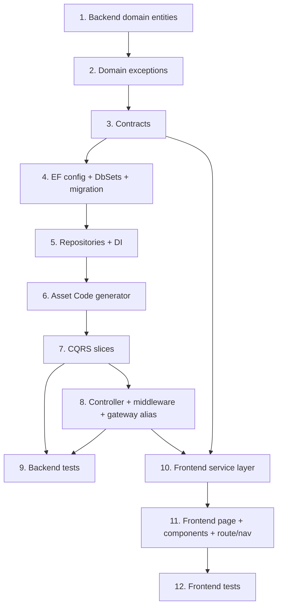

# Implementation Plan: Asset Master Management

**JIRA:** FINNOVA-14 · **Module:** SystemAdmin · **Master:** Asset

## Overview

This plan implements the Asset Master feature as a full-stack vertical slice inside the
**existing** `Finnova.SystemAdminService` host (:5030), mirroring the Nationality Master
(FINNOVA-9) and Lookup Master (FINNOVA-8) layered CQRS conventions. Work proceeds bottom-up by
dependency: backend domain entities → domain exceptions → contracts → EF configuration + DbSets +
migration → repositories + DI → the pure Asset Code generator → CQRS service slices (commands,
queries, validators, mappers) → controller + error-handling middleware branch + gateway alias →
backend tests → frontend service layer → frontend page/components + route/nav → frontend tests.
Each step builds on the previous and ends with wiring into the running host and UI.

The host's JWT authentication, `SystemAdmin` authorization policy, MediatR `ValidationBehavior`
pipeline, `ExceptionHandlingMiddleware`, `AddFinnovaRepository` registration, the generic
`IRepository<T>`/`RepositoryBase<T>`, and the `PaginatedResponse<T>` contract already exist and
are **reused, not re-created**.

Implementation language: **C#** (.NET) for the backend; **TypeScript/React** for the frontend
(per the design — no language selection needed, the design uses concrete languages, not
pseudocode).

> **This workspace is documents-only.** `tasks.md` is the file you copy-paste code from. Each
> sub-task that touches a file is marked **CREATE `<path>`** or **MODIFY `<path>`** and carries
> the complete code block to paste. Apply tasks top-to-bottom.

> **India-only / English-only.** Every display value is a single plain `Description` field. There
> are no bilingual (English/Arabic) fields, no non-English seed/sample/test data, and no RTL.

> **Frontend paths are Assumptions.** The `Finnova-UI` repo (`E:\Finnova\Finnova-UI\Finnova-UI`)
> is not mounted here. The frontend file paths in tasks 11–13 follow the documented
> `location.service.ts`/`lookup.service.ts` + `LookupMaster.tsx` patterns; **confirm/adjust the
> exact paths to match your repo** before applying.

## Task Dependency Graph

Top-level task order. Apply each task only after its predecessors are complete. The frontend
service layer depends on the backend contracts and endpoints being defined, and the backend tests
depend on the CQRS and controller tasks.



```json
{
  "waves": [
    { "id": 0, "tasks": ["1.1", "1.2"] },
    { "id": 1, "tasks": ["2.1", "3.1", "3.2"] },
    { "id": 2, "tasks": ["4.1", "4.2", "4.3"] },
    { "id": 3, "tasks": ["4.4"] },
    { "id": 4, "tasks": ["5.1", "5.2", "5.3", "5.4", "5.5"] },
    { "id": 5, "tasks": ["6.1", "6.2"] },
    { "id": 6, "tasks": ["7.1", "7.2", "7.3", "7.4", "7.5", "7.6", "7.7"] },
    { "id": 7, "tasks": ["8.1", "8.2", "8.3"] },
    { "id": 8, "tasks": ["9.1", "9.2", "9.3", "9.4", "9.5", "9.6", "9.7", "9.8", "11.1", "11.2", "11.3", "11.4", "11.5"] },
    { "id": 9, "tasks": ["12.1", "12.2", "12.3", "12.4", "12.5", "12.6", "12.7", "12.8", "12.9"] },
    { "id": 10, "tasks": ["13.1", "13.2"] }
  ]
}
```

## Tasks

- [ ] 1. Backend domain entities (code masters + asset)
  - [ ] 1.1 Add the four code-master entities
    - **CREATE `Finnova.Models/Domain/Entities/ClassCode.cs`**
      ```csharp
      namespace Finnova.Models.Domain.Entities;

      /// <summary>A Class Code: asset class / category grouping. India-only, single English Description.</summary>
      public class ClassCode
      {
          public Guid Id { get; set; } = Guid.NewGuid();
          public string Code { get; set; } = string.Empty;        // max 20, unique within class_codes (R1.2)
          public string Description { get; set; } = string.Empty; // max 100, single English value
          public bool IsActive { get; set; } = true;              // default true (R2.2)
          public DateTime CreatedAt { get; set; } = DateTime.UtcNow;
          public DateTime UpdatedAt { get; set; } = DateTime.UtcNow;
      }
      ```
    - **CREATE `Finnova.Models/Domain/Entities/MakeCode.cs`**
      ```csharp
      namespace Finnova.Models.Domain.Entities;

      /// <summary>A Make Code: asset manufacturer/make.</summary>
      public class MakeCode
      {
          public Guid Id { get; set; } = Guid.NewGuid();
          public string Code { get; set; } = string.Empty;        // max 20, unique within make_codes
          public string Description { get; set; } = string.Empty; // max 100
          public bool IsActive { get; set; } = true;
          public DateTime CreatedAt { get; set; } = DateTime.UtcNow;
          public DateTime UpdatedAt { get; set; } = DateTime.UtcNow;
      }
      ```
    - **CREATE `Finnova.Models/Domain/Entities/TypeCode.cs`**
      ```csharp
      namespace Finnova.Models.Domain.Entities;

      /// <summary>A Type Code: asset type.</summary>
      public class TypeCode
      {
          public Guid Id { get; set; } = Guid.NewGuid();
          public string Code { get; set; } = string.Empty;        // max 20, unique within type_codes
          public string Description { get; set; } = string.Empty; // max 100
          public bool IsActive { get; set; } = true;
          public DateTime CreatedAt { get; set; } = DateTime.UtcNow;
          public DateTime UpdatedAt { get; set; } = DateTime.UtcNow;
      }
      ```
    - **CREATE `Finnova.Models/Domain/Entities/ModelCode.cs`**
      ```csharp
      namespace Finnova.Models.Domain.Entities;

      /// <summary>A Model Code: asset model.</summary>
      public class ModelCode
      {
          public Guid Id { get; set; } = Guid.NewGuid();
          public string Code { get; set; } = string.Empty;        // max 20, unique within model_codes
          public string Description { get; set; } = string.Empty; // max 100
          public bool IsActive { get; set; } = true;
          public DateTime CreatedAt { get; set; } = DateTime.UtcNow;
          public DateTime UpdatedAt { get; set; } = DateTime.UtcNow;
      }
      ```
    - _Requirements: 1.1, 1.2, 2.2_

  - [ ] 1.2 Add the Asset entity
    - **CREATE `Finnova.Models/Domain/Entities/Asset.cs`**
      ```csharp
      namespace Finnova.Models.Domain.Entities;

      /// <summary>
      /// A single asset record (Asset Mapping). AssetCode is generated server-side and read-only
      /// after creation (R3.2, R3.5). Asset Category -> ClassCode, Asset Type -> TypeCode (R1.5, R1.6).
      /// Make/Model are optional references per the taxonomy assumption.
      /// </summary>
      public class Asset
      {
          public Guid Id { get; set; } = Guid.NewGuid();

          public string AssetCode { get; set; } = string.Empty;        // max 30, generated, unique (R3.3)
          public string Description { get; set; } = string.Empty;      // Asset Code Description, max 200 (R4.7)

          public Guid ClassCodeId { get; set; }                        // Asset Category -> Class Code (R1.5)
          public Guid TypeCodeId { get; set; }                         // Asset Type -> Type Code (R1.6)
          public Guid? MakeCodeId { get; set; }                        // optional (taxonomy assumption)
          public Guid? ModelCodeId { get; set; }                       // optional (taxonomy assumption)

          public string BookDepreciationCategory { get; set; } = string.Empty;   // max 50
          public decimal BookDepreciationRate { get; set; }                      // 0..100, decimal(5,2) (R4.5)
          public string StockDepreciationCategory { get; set; } = string.Empty;  // max 50
          public decimal StockDepreciationRate { get; set; }                     // 0..100, decimal(5,2) (R4.5)

          public decimal GuidelineLimit { get; set; }                            // >= 0, decimal(18,2) (R4.6)

          public bool IsActive { get; set; } = true;                             // default true (R4.2)

          public DateTime CreatedAt { get; set; } = DateTime.UtcNow;
          public DateTime UpdatedAt { get; set; } = DateTime.UtcNow;

          // Navigation (optional; FK ids above are authoritative).
          public ClassCode? ClassCode { get; set; }
          public TypeCode? TypeCode { get; set; }
          public MakeCode? MakeCode { get; set; }
          public ModelCode? ModelCode { get; set; }
      }
      ```
    - _Requirements: 3.1, 1.5, 1.6, 4.2_

- [ ] 2. Backend domain exceptions
  - [ ] 2.1 Add the five asset domain exceptions
    - **CREATE `Finnova.Models/Domain/Exceptions/AssetNotFoundException.cs`**
      ```csharp
      namespace Finnova.Models.Domain.Exceptions;

      /// <summary>Thrown when an asset id does not exist (R4.9, R5.9). Maps to ERR-AST-404.</summary>
      public class AssetNotFoundException : Exception
      {
          public AssetNotFoundException(Guid id)
              : base($"Asset '{id}' was not found.")
          {
          }
      }
      ```
    - **CREATE `Finnova.Models/Domain/Exceptions/CodeNotFoundException.cs`**
      ```csharp
      namespace Finnova.Models.Domain.Exceptions;

      /// <summary>Thrown when a code-master record id does not exist (R2.6, R6.3). Maps to ERR-AST-404.</summary>
      public class CodeNotFoundException : Exception
      {
          public CodeNotFoundException(string master, Guid id)
              : base($"{master} '{id}' was not found.")
          {
          }
      }
      ```
    - **CREATE `Finnova.Models/Domain/Exceptions/DuplicateCodeException.cs`**
      ```csharp
      namespace Finnova.Models.Domain.Exceptions;

      /// <summary>
      /// Thrown when a code-master create/update would duplicate a Code within its own master
      /// (case-insensitive, trimmed) (R1.2, R2.3). Carries the user-facing message and lets the
      /// middleware map it to 409 (ERR-AST-409) by type.
      /// </summary>
      public class DuplicateCodeException : Exception
      {
          public const string ErrorCode = "ERR-AST-409";

          public DuplicateCodeException(string master)
              : base($"{master} already exists.")
          {
          }
      }
      ```
    - **CREATE `Finnova.Models/Domain/Exceptions/CodeInUseException.cs`**
      ```csharp
      namespace Finnova.Models.Domain.Exceptions;

      /// <summary>
      /// Thrown when a hard-delete of a code-master record is attempted while one or more assets
      /// reference it (R6.4). Maps to 409 (ERR-AST-409).
      /// </summary>
      public class CodeInUseException : Exception
      {
          public const string ErrorCode = "ERR-AST-409";

          public CodeInUseException(string master)
              : base($"{master} is in use by one or more assets and cannot be deleted.")
          {
          }
      }
      ```
    - **CREATE `Finnova.Models/Domain/Exceptions/AssetValidationException.cs`**
      ```csharp
      namespace Finnova.Models.Domain.Exceptions;

      /// <summary>
      /// Thrown when an asset create/update references a Class/Type code that does not resolve to
      /// an existing code-master row (R4.4). Maps to 400 (ERR-AST-400).
      /// </summary>
      public class AssetValidationException : Exception
      {
          public const string ErrorCode = "ERR-AST-400";

          public AssetValidationException(string message) : base(message)
          {
          }
      }
      ```
    - _Requirements: 2.6, 4.4, 4.9, 5.9, 1.2, 2.3, 6.3, 6.4_

- [ ] 3. Backend contracts (request/response records)
  - [ ] 3.1 Add the code-master contracts (one record set per master + shared list item)
    - **CREATE `Finnova.Models/Contracts/Assets/ClassCodeContracts.cs`**
      ```csharp
      namespace Finnova.Models.Contracts.Assets;

      // Create (R2.1). IsActive nullable -> service defaults true (R2.2).
      public record CreateClassCodeRequest(string Code, string Description, bool? IsActive);
      // Update editable fields (R2.5).
      public record UpdateClassCodeRequest(string Code, string Description, bool IsActive);
      // Admin-facing response (R2.1 returns id + resolved IsActive).
      public record ClassCodeResponse(
          Guid Id, string Code, string Description, bool IsActive, DateTime CreatedAt, DateTime UpdatedAt);
      ```
    - **CREATE `Finnova.Models/Contracts/Assets/MakeCodeContracts.cs`**
      ```csharp
      namespace Finnova.Models.Contracts.Assets;

      public record CreateMakeCodeRequest(string Code, string Description, bool? IsActive);
      public record UpdateMakeCodeRequest(string Code, string Description, bool IsActive);
      public record MakeCodeResponse(
          Guid Id, string Code, string Description, bool IsActive, DateTime CreatedAt, DateTime UpdatedAt);
      ```
    - **CREATE `Finnova.Models/Contracts/Assets/TypeCodeContracts.cs`**
      ```csharp
      namespace Finnova.Models.Contracts.Assets;

      public record CreateTypeCodeRequest(string Code, string Description, bool? IsActive);
      public record UpdateTypeCodeRequest(string Code, string Description, bool IsActive);
      public record TypeCodeResponse(
          Guid Id, string Code, string Description, bool IsActive, DateTime CreatedAt, DateTime UpdatedAt);
      ```
    - **CREATE `Finnova.Models/Contracts/Assets/ModelCodeContracts.cs`**
      ```csharp
      namespace Finnova.Models.Contracts.Assets;

      public record CreateModelCodeRequest(string Code, string Description, bool? IsActive);
      public record UpdateModelCodeRequest(string Code, string Description, bool IsActive);
      public record ModelCodeResponse(
          Guid Id, string Code, string Description, bool IsActive, DateTime CreatedAt, DateTime UpdatedAt);
      ```
    - **CREATE `Finnova.Models/Contracts/Assets/CodeListItemResponse.cs`**
      ```csharp
      namespace Finnova.Models.Contracts.Assets;

      /// <summary>Slim projection for dropdowns / the class-code filter panel (R11.3, R12.1).</summary>
      public record CodeListItemResponse(Guid Id, string Code, string Description);
      ```
    - _Requirements: 2.1, 2.2, 2.5, 11.3, 12.1_

  - [ ] 3.2 Add the asset contracts
    - **CREATE `Finnova.Models/Contracts/Assets/AssetContracts.cs`**
      ```csharp
      namespace Finnova.Models.Contracts.Assets;

      // Create request MUST NOT include AssetCode — it is generated server-side (R3.2).
      public record CreateAssetRequest(
          Guid ClassCodeId,                 // Asset Category (R4.1, R4.4)
          Guid TypeCodeId,                  // Asset Type (R4.4)
          Guid? MakeCodeId,                 // optional (taxonomy assumption)
          Guid? ModelCodeId,                // optional
          string Description,               // Asset Code Description (R4.1, R4.7)
          string BookDepreciationCategory,
          decimal BookDepreciationRate,     // 0..100 <=2dp (R4.5)
          string StockDepreciationCategory,
          decimal StockDepreciationRate,    // 0..100 <=2dp (R4.5)
          decimal GuidelineLimit,           // >= 0 (R4.6)
          bool? IsActive                    // defaults true (R4.2)
      );

      // Update preserves the existing AssetCode (R3.5) — it is not part of the request.
      public record UpdateAssetRequest(
          Guid ClassCodeId,
          Guid TypeCodeId,
          Guid? MakeCodeId,
          Guid? ModelCodeId,
          string Description,
          string BookDepreciationCategory,
          decimal BookDepreciationRate,
          string StockDepreciationCategory,
          decimal StockDepreciationRate,
          decimal GuidelineLimit,
          bool IsActive
      );

      // Response includes the generated AssetCode (R3.4) and resolved reference codes for grid display.
      public record AssetResponse(
          Guid Id,
          string AssetCode,
          string Description,
          Guid ClassCodeId,
          string? ClassCodeValue,           // resolved Class Code string for the grid (R10.1)
          Guid TypeCodeId,
          string? TypeCodeValue,            // resolved Type Code string for the grid (R10.1)
          Guid? MakeCodeId,
          Guid? ModelCodeId,
          string BookDepreciationCategory,
          decimal BookDepreciationRate,
          string StockDepreciationCategory,
          decimal StockDepreciationRate,
          decimal GuidelineLimit,
          bool IsActive,
          DateTime CreatedAt,
          DateTime UpdatedAt
      );
      ```
    - Reuse the existing `PaginatedResponse<T>` for all paged listings (do not create a new paged contract).
    - _Requirements: 3.2, 3.4, 3.5, 4.1, 4.2, 4.5, 4.6, 4.7, 5.1, 10.1_

- [ ] 4. Backend EF configuration, DbSets, and migration
  - [ ] 4.1 Add the four code-master EF configurations (table name, lengths, unique Code index, English India seed)
    - **CREATE `Finnova.Repository/Configuration/ClassCodeConfiguration.cs`**
      ```csharp
      using Microsoft.EntityFrameworkCore;
      using Microsoft.EntityFrameworkCore.Metadata.Builders;
      using Finnova.Models.Domain.Entities;

      namespace Finnova.Repository.Configuration;

      public class ClassCodeConfiguration : IEntityTypeConfiguration<ClassCode>
      {
          private static readonly DateTime SeedDate = new(2024, 1, 1, 0, 0, 0, DateTimeKind.Utc);
          private static Guid Id(int n) => new($"00000000-0000-0000-00A1-{n:D12}"); // A1 = class master

          public void Configure(EntityTypeBuilder<ClassCode> builder)
          {
              builder.ToTable("class_codes");
              builder.HasKey(x => x.Id);

              builder.Property(x => x.Code).IsRequired().HasMaxLength(20);
              builder.Property(x => x.Description).IsRequired().HasMaxLength(100);
              builder.Property(x => x.IsActive).IsRequired();

              // Code unique within this master only (R1.2). SQL Server CI collation backs case-insensitivity.
              builder.HasIndex(x => x.Code).IsUnique();
              // Query path: list ordered by Code (R2.11).
              builder.HasIndex(x => x.Code);

              builder.HasData(
                  new ClassCode { Id = Id(1), Code = "LAP", Description = "Laptops & Computers", IsActive = true, CreatedAt = SeedDate, UpdatedAt = SeedDate },
                  new ClassCode { Id = Id(2), Code = "FUR", Description = "Furniture & Fixtures",  IsActive = true, CreatedAt = SeedDate, UpdatedAt = SeedDate },
                  new ClassCode { Id = Id(3), Code = "VEH", Description = "Vehicles",              IsActive = true, CreatedAt = SeedDate, UpdatedAt = SeedDate });
          }
      }
      ```
    - **CREATE `Finnova.Repository/Configuration/MakeCodeConfiguration.cs`**
      ```csharp
      using Microsoft.EntityFrameworkCore;
      using Microsoft.EntityFrameworkCore.Metadata.Builders;
      using Finnova.Models.Domain.Entities;

      namespace Finnova.Repository.Configuration;

      public class MakeCodeConfiguration : IEntityTypeConfiguration<MakeCode>
      {
          private static readonly DateTime SeedDate = new(2024, 1, 1, 0, 0, 0, DateTimeKind.Utc);
          private static Guid Id(int n) => new($"00000000-0000-0000-00A2-{n:D12}"); // A2 = make master

          public void Configure(EntityTypeBuilder<MakeCode> builder)
          {
              builder.ToTable("make_codes");
              builder.HasKey(x => x.Id);

              builder.Property(x => x.Code).IsRequired().HasMaxLength(20);
              builder.Property(x => x.Description).IsRequired().HasMaxLength(100);
              builder.Property(x => x.IsActive).IsRequired();

              builder.HasIndex(x => x.Code).IsUnique();
              builder.HasIndex(x => x.Code);

              builder.HasData(
                  new MakeCode { Id = Id(1), Code = "DEL", Description = "Dell",   IsActive = true, CreatedAt = SeedDate, UpdatedAt = SeedDate },
                  new MakeCode { Id = Id(2), Code = "HP",  Description = "HP",     IsActive = true, CreatedAt = SeedDate, UpdatedAt = SeedDate },
                  new MakeCode { Id = Id(3), Code = "TAT", Description = "Tata",   IsActive = true, CreatedAt = SeedDate, UpdatedAt = SeedDate });
          }
      }
      ```
    - **CREATE `Finnova.Repository/Configuration/TypeCodeConfiguration.cs`**
      ```csharp
      using Microsoft.EntityFrameworkCore;
      using Microsoft.EntityFrameworkCore.Metadata.Builders;
      using Finnova.Models.Domain.Entities;

      namespace Finnova.Repository.Configuration;

      public class TypeCodeConfiguration : IEntityTypeConfiguration<TypeCode>
      {
          private static readonly DateTime SeedDate = new(2024, 1, 1, 0, 0, 0, DateTimeKind.Utc);
          private static Guid Id(int n) => new($"00000000-0000-0000-00A3-{n:D12}"); // A3 = type master

          public void Configure(EntityTypeBuilder<TypeCode> builder)
          {
              builder.ToTable("type_codes");
              builder.HasKey(x => x.Id);

              builder.Property(x => x.Code).IsRequired().HasMaxLength(20);
              builder.Property(x => x.Description).IsRequired().HasMaxLength(100);
              builder.Property(x => x.IsActive).IsRequired();

              builder.HasIndex(x => x.Code).IsUnique();
              builder.HasIndex(x => x.Code);

              builder.HasData(
                  new TypeCode { Id = Id(1), Code = "HW",  Description = "Hardware",          IsActive = true, CreatedAt = SeedDate, UpdatedAt = SeedDate },
                  new TypeCode { Id = Id(2), Code = "OFF", Description = "Office Equipment",  IsActive = true, CreatedAt = SeedDate, UpdatedAt = SeedDate },
                  new TypeCode { Id = Id(3), Code = "TRN", Description = "Transport",         IsActive = true, CreatedAt = SeedDate, UpdatedAt = SeedDate });
          }
      }
      ```
    - **CREATE `Finnova.Repository/Configuration/ModelCodeConfiguration.cs`**
      ```csharp
      using Microsoft.EntityFrameworkCore;
      using Microsoft.EntityFrameworkCore.Metadata.Builders;
      using Finnova.Models.Domain.Entities;

      namespace Finnova.Repository.Configuration;

      public class ModelCodeConfiguration : IEntityTypeConfiguration<ModelCode>
      {
          private static readonly DateTime SeedDate = new(2024, 1, 1, 0, 0, 0, DateTimeKind.Utc);
          private static Guid Id(int n) => new($"00000000-0000-0000-00A4-{n:D12}"); // A4 = model master

          public void Configure(EntityTypeBuilder<ModelCode> builder)
          {
              builder.ToTable("model_codes");
              builder.HasKey(x => x.Id);

              builder.Property(x => x.Code).IsRequired().HasMaxLength(20);
              builder.Property(x => x.Description).IsRequired().HasMaxLength(100);
              builder.Property(x => x.IsActive).IsRequired();

              builder.HasIndex(x => x.Code).IsUnique();
              builder.HasIndex(x => x.Code);

              builder.HasData(
                  new ModelCode { Id = Id(1), Code = "MDL1", Description = "Model 2024 Series", IsActive = true, CreatedAt = SeedDate, UpdatedAt = SeedDate },
                  new ModelCode { Id = Id(2), Code = "MDL2", Description = "Model 2023 Series", IsActive = true, CreatedAt = SeedDate, UpdatedAt = SeedDate });
          }
      }
      ```
    - _Requirements: 1.2, 1.4, 2.11, 2.2_

  - [ ] 4.2 Add the Asset EF configuration (lengths, decimal precision, unique AssetCode, Restrict FKs, English seed)
    - **CREATE `Finnova.Repository/Configuration/AssetConfiguration.cs`**
      ```csharp
      using Microsoft.EntityFrameworkCore;
      using Microsoft.EntityFrameworkCore.Metadata.Builders;
      using Finnova.Models.Domain.Entities;

      namespace Finnova.Repository.Configuration;

      public class AssetConfiguration : IEntityTypeConfiguration<Asset>
      {
          private static readonly DateTime SeedDate = new(2024, 1, 1, 0, 0, 0, DateTimeKind.Utc);
          private static Guid Id(int n) => new($"00000000-0000-0000-00A5-{n:D12}");
          private static Guid ClassId(int n) => new($"00000000-0000-0000-00A1-{n:D12}");
          private static Guid TypeId(int n)  => new($"00000000-0000-0000-00A3-{n:D12}");

          public void Configure(EntityTypeBuilder<Asset> builder)
          {
              builder.ToTable("assets");
              builder.HasKey(x => x.Id);

              builder.Property(x => x.AssetCode).IsRequired().HasMaxLength(30);
              builder.Property(x => x.Description).IsRequired().HasMaxLength(200);

              builder.Property(x => x.BookDepreciationCategory).IsRequired().HasMaxLength(50);
              builder.Property(x => x.StockDepreciationCategory).IsRequired().HasMaxLength(50);

              // Rates are percentages 0..100 with <=2 decimal places (R4.5).
              builder.Property(x => x.BookDepreciationRate).HasColumnType("decimal(5,2)");
              builder.Property(x => x.StockDepreciationRate).HasColumnType("decimal(5,2)");
              // Guideline limit is a non-negative monetary value (R4.6).
              builder.Property(x => x.GuidelineLimit).HasColumnType("decimal(18,2)");

              builder.Property(x => x.IsActive).IsRequired();

              // Generated Asset Code is globally unique (R3.3, R3.6).
              builder.HasIndex(x => x.AssetCode).IsUnique();
              // Query/order path (R5.7).
              builder.HasIndex(x => x.AssetCode);

              // Taxonomy FKs. Restrict delete so an in-use code cannot be hard-deleted at the DB
              // level (the service also guards this with CodeInUseException — R6.4).
              builder.HasOne(x => x.ClassCode).WithMany().HasForeignKey(x => x.ClassCodeId).OnDelete(DeleteBehavior.Restrict);
              builder.HasOne(x => x.TypeCode).WithMany().HasForeignKey(x => x.TypeCodeId).OnDelete(DeleteBehavior.Restrict);
              builder.HasOne(x => x.MakeCode).WithMany().HasForeignKey(x => x.MakeCodeId).OnDelete(DeleteBehavior.Restrict);
              builder.HasOne(x => x.ModelCode).WithMany().HasForeignKey(x => x.ModelCodeId).OnDelete(DeleteBehavior.Restrict);

              builder.HasData(new Asset
              {
                  Id = Id(1), AssetCode = "LAP-000001", Description = "Standard Issue Laptop",
                  ClassCodeId = ClassId(1), TypeCodeId = TypeId(1),
                  BookDepreciationCategory = "Straight Line", BookDepreciationRate = 25.00m,
                  StockDepreciationCategory = "WDV", StockDepreciationRate = 15.00m,
                  GuidelineLimit = 60000.00m, IsActive = true, CreatedAt = SeedDate, UpdatedAt = SeedDate,
              });
          }
      }
      ```
    - _Requirements: 3.1, 3.3, 3.6, 4.5, 4.6, 5.7, 6.4_

  - [ ] 4.3 Register the five DbSets on FinnovaDbContext
    - **MODIFY `Finnova.Repository/Context/FinnovaDbContext.cs`** — add these `DbSet`s alongside the existing ones (e.g. directly after the `DraweeBankAuditEntries` line, before `OnModelCreating`). `ApplyConfigurationsFromAssembly` already discovers the new configs, so no other change is needed.
      ```csharp
          public DbSet<ClassCode> ClassCodes => Set<ClassCode>();
          public DbSet<MakeCode> MakeCodes => Set<MakeCode>();
          public DbSet<TypeCode> TypeCodes => Set<TypeCode>();
          public DbSet<ModelCode> ModelCodes => Set<ModelCode>();
          public DbSet<Asset> Assets => Set<Asset>();
      ```
    - _Requirements: 1.4, 3.1_

  - [ ] 4.4 Generate the AddAssetMaster migration (SQL Server)
    - Run from the repository root (startup project is the SystemAdmin host, matching every prior master):
      ```
      dotnet ef migrations add AddAssetMaster --project Finnova.Repository --startup-project Finnova.SystemAdminService
      dotnet ef database update --project Finnova.Repository --startup-project Finnova.SystemAdminService
      ```
    - Verify the generated migration creates `class_codes`, `make_codes`, `type_codes`,
      `model_codes`, and `assets` with the `nvarchar(20/50/100/200)` columns,
      `decimal(5,2)`/`decimal(18,2)` rate/limit columns, unique indexes on each `Code` and on
      `assets.AssetCode`, the taxonomy FKs with `Restrict` delete, and the `HasData` seed rows.
    - _Requirements: 1.4, 3.1, 3.3_

- [ ] 5. Backend repositories, interfaces, and DI registration
  - [ ] 5.1 Add the four code-master repository interfaces
    - **CREATE `Finnova.Repository/Interfaces/IClassCodeRepository.cs`**
      ```csharp
      using Finnova.Models.Domain.Entities;

      namespace Finnova.Repository.Interfaces;

      public interface IClassCodeRepository : IRepository<ClassCode>
      {
          /// <summary>Paged list, CI substring search over Code or Description (R2.7, R2.8),
          /// ordered by Code asc then Id asc (R2.11). Returns items + total (R2.9).</summary>
          Task<(List<ClassCode> Items, int Total)> GetPagedAsync(
              string? searchTerm, int page, int pageSize, CancellationToken ct = default);

          /// <summary>Trimmed, case-insensitive Code uniqueness within this master (R1.2, R2.3).</summary>
          Task<bool> ExistsByCodeAsync(string code, Guid? excludeId = null, CancellationToken ct = default);

          /// <summary>Active code list for dropdowns / the class-code filter panel (R11.3, R12).</summary>
          Task<List<ClassCode>> GetActiveAsync(CancellationToken ct = default);
      }
      ```
    - **CREATE `Finnova.Repository/Interfaces/IMakeCodeRepository.cs`**
      ```csharp
      using Finnova.Models.Domain.Entities;

      namespace Finnova.Repository.Interfaces;

      public interface IMakeCodeRepository : IRepository<MakeCode>
      {
          Task<(List<MakeCode> Items, int Total)> GetPagedAsync(
              string? searchTerm, int page, int pageSize, CancellationToken ct = default);
          Task<bool> ExistsByCodeAsync(string code, Guid? excludeId = null, CancellationToken ct = default);
          Task<List<MakeCode>> GetActiveAsync(CancellationToken ct = default);
      }
      ```
    - **CREATE `Finnova.Repository/Interfaces/ITypeCodeRepository.cs`**
      ```csharp
      using Finnova.Models.Domain.Entities;

      namespace Finnova.Repository.Interfaces;

      public interface ITypeCodeRepository : IRepository<TypeCode>
      {
          Task<(List<TypeCode> Items, int Total)> GetPagedAsync(
              string? searchTerm, int page, int pageSize, CancellationToken ct = default);
          Task<bool> ExistsByCodeAsync(string code, Guid? excludeId = null, CancellationToken ct = default);
          Task<List<TypeCode>> GetActiveAsync(CancellationToken ct = default);
      }
      ```
    - **CREATE `Finnova.Repository/Interfaces/IModelCodeRepository.cs`**
      ```csharp
      using Finnova.Models.Domain.Entities;

      namespace Finnova.Repository.Interfaces;

      public interface IModelCodeRepository : IRepository<ModelCode>
      {
          Task<(List<ModelCode> Items, int Total)> GetPagedAsync(
              string? searchTerm, int page, int pageSize, CancellationToken ct = default);
          Task<bool> ExistsByCodeAsync(string code, Guid? excludeId = null, CancellationToken ct = default);
          Task<List<ModelCode>> GetActiveAsync(CancellationToken ct = default);
      }
      ```
    - _Requirements: 1.2, 2.3, 2.7, 2.8, 2.9, 2.11, 11.3, 12.1_

  - [ ] 5.2 Add the asset repository interface
    - **CREATE `Finnova.Repository/Interfaces/IAssetRepository.cs`**
      ```csharp
      using Finnova.Models.Domain.Entities;

      namespace Finnova.Repository.Interfaces;

      public interface IAssetRepository : IRepository<Asset>
      {
          /// <summary>Paged list, CI substring search over AssetCode or Description (R5.2),
          /// ordered by AssetCode asc then Id asc (R5.7); items + total (R5.1).</summary>
          Task<(List<Asset> Items, int Total)> GetPagedAsync(
              string? searchTerm, int page, int pageSize, CancellationToken ct = default);

          /// <summary>Get-by-id including resolved Class/Type navigation for display (R5.8).</summary>
          Task<Asset?> GetByIdWithReferencesAsync(Guid id, CancellationToken ct = default);

          /// <summary>Whether a generated Asset Code already exists (R3.3 safety net).</summary>
          Task<bool> AssetCodeExistsAsync(string assetCode, CancellationToken ct = default);

          /// <summary>Highest existing sequence for a Class-Code prefix, 0 if none (Asset Code gen).</summary>
          Task<int> GetMaxSequenceForClassAsync(string classCode, CancellationToken ct = default);

          /// <summary>True when any asset references the given code-master row (R6.4 in-use guard).</summary>
          Task<bool> IsClassCodeReferencedAsync(Guid classCodeId, CancellationToken ct = default);
          Task<bool> IsTypeCodeReferencedAsync(Guid typeCodeId, CancellationToken ct = default);
          Task<bool> IsMakeCodeReferencedAsync(Guid makeCodeId, CancellationToken ct = default);
          Task<bool> IsModelCodeReferencedAsync(Guid modelCodeId, CancellationToken ct = default);
      }
      ```
    - _Requirements: 3.3, 5.1, 5.2, 5.7, 5.8, 6.4_

  - [ ] 5.3 Implement the four code-master repositories (extend RepositoryBase<T>)
    - **CREATE `Finnova.Repository/Repositories/ClassCodeRepository.cs`**
      ```csharp
      using Microsoft.EntityFrameworkCore;
      using Finnova.Models.Domain.Entities;
      using Finnova.Repository.Context;
      using Finnova.Repository.Interfaces;

      namespace Finnova.Repository.Repositories;

      public class ClassCodeRepository : RepositoryBase<ClassCode>, IClassCodeRepository
      {
          public ClassCodeRepository(FinnovaDbContext context) : base(context) { }

          public async Task<(List<ClassCode> Items, int Total)> GetPagedAsync(
              string? searchTerm, int page, int pageSize, CancellationToken ct = default)
          {
              var query = DbSet.AsNoTracking().AsQueryable();
              if (!string.IsNullOrWhiteSpace(searchTerm))
              {
                  var term = searchTerm.Trim();                                 // Contains -> LIKE; CI via collation (R2.7)
                  query = query.Where(x => x.Code.Contains(term) || x.Description.Contains(term));
              }
              var total = await query.CountAsync(ct);                           // R2.9
              var items = await query
                  .OrderBy(x => x.Code).ThenBy(x => x.Id)                        // R2.11
                  .Skip((page - 1) * pageSize).Take(pageSize)
                  .ToListAsync(ct);
              return (items, total);
          }

          public async Task<bool> ExistsByCodeAsync(string code, Guid? excludeId = null, CancellationToken ct = default)
          {
              var c = code.Trim();
              return await DbSet.AsNoTracking().AnyAsync(
                  x => x.Code == c && (excludeId == null || x.Id != excludeId), ct); // CI via collation (R1.2)
          }

          public async Task<List<ClassCode>> GetActiveAsync(CancellationToken ct = default)
              => await DbSet.AsNoTracking().Where(x => x.IsActive).OrderBy(x => x.Code).ToListAsync(ct);
      }
      ```
    - **CREATE `Finnova.Repository/Repositories/MakeCodeRepository.cs`** — identical to `ClassCodeRepository` with `MakeCode`/`IMakeCodeRepository` substituted:
      ```csharp
      using Microsoft.EntityFrameworkCore;
      using Finnova.Models.Domain.Entities;
      using Finnova.Repository.Context;
      using Finnova.Repository.Interfaces;

      namespace Finnova.Repository.Repositories;

      public class MakeCodeRepository : RepositoryBase<MakeCode>, IMakeCodeRepository
      {
          public MakeCodeRepository(FinnovaDbContext context) : base(context) { }

          public async Task<(List<MakeCode> Items, int Total)> GetPagedAsync(
              string? searchTerm, int page, int pageSize, CancellationToken ct = default)
          {
              var query = DbSet.AsNoTracking().AsQueryable();
              if (!string.IsNullOrWhiteSpace(searchTerm))
              {
                  var term = searchTerm.Trim();
                  query = query.Where(x => x.Code.Contains(term) || x.Description.Contains(term));
              }
              var total = await query.CountAsync(ct);
              var items = await query
                  .OrderBy(x => x.Code).ThenBy(x => x.Id)
                  .Skip((page - 1) * pageSize).Take(pageSize)
                  .ToListAsync(ct);
              return (items, total);
          }

          public async Task<bool> ExistsByCodeAsync(string code, Guid? excludeId = null, CancellationToken ct = default)
          {
              var c = code.Trim();
              return await DbSet.AsNoTracking().AnyAsync(
                  x => x.Code == c && (excludeId == null || x.Id != excludeId), ct);
          }

          public async Task<List<MakeCode>> GetActiveAsync(CancellationToken ct = default)
              => await DbSet.AsNoTracking().Where(x => x.IsActive).OrderBy(x => x.Code).ToListAsync(ct);
      }
      ```
    - **CREATE `Finnova.Repository/Repositories/TypeCodeRepository.cs`** — identical with `TypeCode`/`ITypeCodeRepository`:
      ```csharp
      using Microsoft.EntityFrameworkCore;
      using Finnova.Models.Domain.Entities;
      using Finnova.Repository.Context;
      using Finnova.Repository.Interfaces;

      namespace Finnova.Repository.Repositories;

      public class TypeCodeRepository : RepositoryBase<TypeCode>, ITypeCodeRepository
      {
          public TypeCodeRepository(FinnovaDbContext context) : base(context) { }

          public async Task<(List<TypeCode> Items, int Total)> GetPagedAsync(
              string? searchTerm, int page, int pageSize, CancellationToken ct = default)
          {
              var query = DbSet.AsNoTracking().AsQueryable();
              if (!string.IsNullOrWhiteSpace(searchTerm))
              {
                  var term = searchTerm.Trim();
                  query = query.Where(x => x.Code.Contains(term) || x.Description.Contains(term));
              }
              var total = await query.CountAsync(ct);
              var items = await query
                  .OrderBy(x => x.Code).ThenBy(x => x.Id)
                  .Skip((page - 1) * pageSize).Take(pageSize)
                  .ToListAsync(ct);
              return (items, total);
          }

          public async Task<bool> ExistsByCodeAsync(string code, Guid? excludeId = null, CancellationToken ct = default)
          {
              var c = code.Trim();
              return await DbSet.AsNoTracking().AnyAsync(
                  x => x.Code == c && (excludeId == null || x.Id != excludeId), ct);
          }

          public async Task<List<TypeCode>> GetActiveAsync(CancellationToken ct = default)
              => await DbSet.AsNoTracking().Where(x => x.IsActive).OrderBy(x => x.Code).ToListAsync(ct);
      }
      ```
    - **CREATE `Finnova.Repository/Repositories/ModelCodeRepository.cs`** — identical with `ModelCode`/`IModelCodeRepository`:
      ```csharp
      using Microsoft.EntityFrameworkCore;
      using Finnova.Models.Domain.Entities;
      using Finnova.Repository.Context;
      using Finnova.Repository.Interfaces;

      namespace Finnova.Repository.Repositories;

      public class ModelCodeRepository : RepositoryBase<ModelCode>, IModelCodeRepository
      {
          public ModelCodeRepository(FinnovaDbContext context) : base(context) { }

          public async Task<(List<ModelCode> Items, int Total)> GetPagedAsync(
              string? searchTerm, int page, int pageSize, CancellationToken ct = default)
          {
              var query = DbSet.AsNoTracking().AsQueryable();
              if (!string.IsNullOrWhiteSpace(searchTerm))
              {
                  var term = searchTerm.Trim();
                  query = query.Where(x => x.Code.Contains(term) || x.Description.Contains(term));
              }
              var total = await query.CountAsync(ct);
              var items = await query
                  .OrderBy(x => x.Code).ThenBy(x => x.Id)
                  .Skip((page - 1) * pageSize).Take(pageSize)
                  .ToListAsync(ct);
              return (items, total);
          }

          public async Task<bool> ExistsByCodeAsync(string code, Guid? excludeId = null, CancellationToken ct = default)
          {
              var c = code.Trim();
              return await DbSet.AsNoTracking().AnyAsync(
                  x => x.Code == c && (excludeId == null || x.Id != excludeId), ct);
          }

          public async Task<List<ModelCode>> GetActiveAsync(CancellationToken ct = default)
              => await DbSet.AsNoTracking().Where(x => x.IsActive).OrderBy(x => x.Code).ToListAsync(ct);
      }
      ```
    - _Requirements: 1.2, 2.3, 2.7, 2.8, 2.9, 2.11, 11.3, 12.1_

  - [ ] 5.4 Implement the asset repository
    - **CREATE `Finnova.Repository/Repositories/AssetRepository.cs`**
      ```csharp
      using Microsoft.EntityFrameworkCore;
      using Finnova.Models.Domain.Entities;
      using Finnova.Repository.Context;
      using Finnova.Repository.Interfaces;

      namespace Finnova.Repository.Repositories;

      public class AssetRepository : RepositoryBase<Asset>, IAssetRepository
      {
          public AssetRepository(FinnovaDbContext context) : base(context) { }

          public async Task<(List<Asset> Items, int Total)> GetPagedAsync(
              string? searchTerm, int page, int pageSize, CancellationToken ct = default)
          {
              var query = DbSet.AsNoTracking()
                  .Include(x => x.ClassCode)
                  .Include(x => x.TypeCode)
                  .AsQueryable();
              if (!string.IsNullOrWhiteSpace(searchTerm))
              {
                  var term = searchTerm.Trim();                                 // CI via collation (R5.2)
                  query = query.Where(x => x.AssetCode.Contains(term) || x.Description.Contains(term));
              }
              var total = await query.CountAsync(ct);                           // R5.1
              var items = await query
                  .OrderBy(x => x.AssetCode).ThenBy(x => x.Id)                   // R5.7
                  .Skip((page - 1) * pageSize).Take(pageSize)
                  .ToListAsync(ct);
              return (items, total);
          }

          public async Task<Asset?> GetByIdWithReferencesAsync(Guid id, CancellationToken ct = default)
              => await DbSet.AsNoTracking()
                  .Include(x => x.ClassCode)
                  .Include(x => x.TypeCode)
                  .Include(x => x.MakeCode)
                  .Include(x => x.ModelCode)
                  .FirstOrDefaultAsync(x => x.Id == id, ct);                     // R5.8

          public async Task<bool> AssetCodeExistsAsync(string assetCode, CancellationToken ct = default)
              => await DbSet.AsNoTracking().AnyAsync(x => x.AssetCode == assetCode, ct); // R3.3

          public async Task<int> GetMaxSequenceForClassAsync(string classCode, CancellationToken ct = default)
          {
              // Asset Codes for a class are "{CLASS}-{seq:D6}". Pull the matching prefix, parse the
              // numeric suffix, and return the maximum (0 when none exist). Done client-side after a
              // prefix filter so the D6 suffix parse is simple and provider-agnostic.
              var prefix = (classCode ?? string.Empty).Trim().ToUpperInvariant() + "-";
              var codes = await DbSet.AsNoTracking()
                  .Where(x => x.AssetCode.StartsWith(prefix))
                  .Select(x => x.AssetCode)
                  .ToListAsync(ct);

              var max = 0;
              foreach (var code in codes)
              {
                  var suffix = code.Substring(prefix.Length);
                  if (int.TryParse(suffix, out var n) && n > max) max = n;
              }
              return max;
          }

          public async Task<bool> IsClassCodeReferencedAsync(Guid classCodeId, CancellationToken ct = default)
              => await DbSet.AsNoTracking().AnyAsync(x => x.ClassCodeId == classCodeId, ct);   // R6.4

          public async Task<bool> IsTypeCodeReferencedAsync(Guid typeCodeId, CancellationToken ct = default)
              => await DbSet.AsNoTracking().AnyAsync(x => x.TypeCodeId == typeCodeId, ct);

          public async Task<bool> IsMakeCodeReferencedAsync(Guid makeCodeId, CancellationToken ct = default)
              => await DbSet.AsNoTracking().AnyAsync(x => x.MakeCodeId == makeCodeId, ct);

          public async Task<bool> IsModelCodeReferencedAsync(Guid modelCodeId, CancellationToken ct = default)
              => await DbSet.AsNoTracking().AnyAsync(x => x.ModelCodeId == modelCodeId, ct);
      }
      ```
    - _Requirements: 3.3, 5.1, 5.2, 5.7, 5.8, 6.4_

  - [ ] 5.5 Register all five repositories in DI
    - **MODIFY `Finnova.Repository/DependencyInjection.cs`** — add these registrations inside `AddFinnovaRepository`, directly after the `IUserManagementRepository` line and before `return services;`:
      ```csharp
          services.AddScoped<IClassCodeRepository, ClassCodeRepository>();
          services.AddScoped<IMakeCodeRepository, MakeCodeRepository>();
          services.AddScoped<ITypeCodeRepository, TypeCodeRepository>();
          services.AddScoped<IModelCodeRepository, ModelCodeRepository>();
          services.AddScoped<IAssetRepository, AssetRepository>();
      ```
    - _Requirements: 1.4, 3.1_

- [ ] 6. Backend Asset Code generation helper (pure, unit/property-testable)
  - [ ] 6.1 Add the Asset Code generator
    - **CREATE `Finnova.Service/Assets/CodeGeneration/IAssetCodeGenerator.cs`**
      ```csharp
      namespace Finnova.Service.Assets.CodeGeneration;

      public interface IAssetCodeGenerator
      {
          /// <summary>Deterministically builds the next Asset Code for a Class Code and the current
          /// highest sequence already used for that class. Format: "{CLASS}-{seq:D6}" (R3.2, R3.3).</summary>
          string NextAssetCode(string classCode, int currentMaxSequence);
      }
      ```
    - **CREATE `Finnova.Service/Assets/CodeGeneration/AssetCodeGenerator.cs`**
      ```csharp
      namespace Finnova.Service.Assets.CodeGeneration;

      public sealed class AssetCodeGenerator : IAssetCodeGenerator
      {
          public string NextAssetCode(string classCode, int currentMaxSequence)
          {
              var prefix = (classCode ?? string.Empty).Trim().ToUpperInvariant();
              var next = currentMaxSequence + 1;
              return $"{prefix}-{next:D6}";   // e.g. "LAP-000123"
          }
      }
      ```
    - _Requirements: 3.2, 3.3, 3.6_

  - [ ] 6.2 Register the generator in host DI
    - **MODIFY `Finnova.SystemAdminService/Program.cs`** — register the generator alongside the other service registrations (e.g. directly after the `AddScoped<IPasswordPolicy, DefaultPasswordPolicy>()` line, before `var app = builder.Build();`). Add the `using` at the top of the file.
      ```csharp
      using Finnova.Service.Assets.CodeGeneration;
      ```
      ```csharp
      // Asset Master — pure, deterministic Asset Code generator (R3.2, R3.3).
      builder.Services.AddScoped<IAssetCodeGenerator, AssetCodeGenerator>();
      ```
    - _Requirements: 3.2, 3.3_

- [ ] 7. Backend service CQRS slices (commands, queries, validators, mapper)
  - [ ] 7.1 Add the static AssetMapper
    - **CREATE `Finnova.Service/Mappers/AssetMapper.cs`**
      ```csharp
      using Finnova.Models.Contracts.Assets;
      using Finnova.Models.Domain.Entities;

      namespace Finnova.Service.Mappers;

      public static class AssetMapper
      {
          // ---- Class Code ----
          public static ClassCodeResponse ToResponse(this ClassCode x) =>
              new(x.Id, x.Code, x.Description, x.IsActive, x.CreatedAt, x.UpdatedAt);
          public static List<ClassCodeResponse> ToResponseList(this IEnumerable<ClassCode> items)
              => items.Select(i => i.ToResponse()).ToList();

          // ---- Make Code ----
          public static MakeCodeResponse ToResponse(this MakeCode x) =>
              new(x.Id, x.Code, x.Description, x.IsActive, x.CreatedAt, x.UpdatedAt);
          public static List<MakeCodeResponse> ToResponseList(this IEnumerable<MakeCode> items)
              => items.Select(i => i.ToResponse()).ToList();

          // ---- Type Code ----
          public static TypeCodeResponse ToResponse(this TypeCode x) =>
              new(x.Id, x.Code, x.Description, x.IsActive, x.CreatedAt, x.UpdatedAt);
          public static List<TypeCodeResponse> ToResponseList(this IEnumerable<TypeCode> items)
              => items.Select(i => i.ToResponse()).ToList();

          // ---- Model Code ----
          public static ModelCodeResponse ToResponse(this ModelCode x) =>
              new(x.Id, x.Code, x.Description, x.IsActive, x.CreatedAt, x.UpdatedAt);
          public static List<ModelCodeResponse> ToResponseList(this IEnumerable<ModelCode> items)
              => items.Select(i => i.ToResponse()).ToList();

          // ---- Slim list item (shared across the four masters) ----
          public static CodeListItemResponse ToListItem(this ClassCode x) => new(x.Id, x.Code, x.Description);
          public static CodeListItemResponse ToListItem(this MakeCode x)  => new(x.Id, x.Code, x.Description);
          public static CodeListItemResponse ToListItem(this TypeCode x)  => new(x.Id, x.Code, x.Description);
          public static CodeListItemResponse ToListItem(this ModelCode x) => new(x.Id, x.Code, x.Description);

          // ---- Asset ----
          /// <summary>Maps an asset, projecting resolved Class/Type code strings for the grid (R10.1).
          /// Pass the resolved code strings explicitly, or rely on loaded navigation properties.</summary>
          public static AssetResponse ToResponse(this Asset x, string? classCodeValue = null, string? typeCodeValue = null) =>
              new(
                  x.Id,
                  x.AssetCode,
                  x.Description,
                  x.ClassCodeId,
                  classCodeValue ?? x.ClassCode?.Code,
                  x.TypeCodeId,
                  typeCodeValue ?? x.TypeCode?.Code,
                  x.MakeCodeId,
                  x.ModelCodeId,
                  x.BookDepreciationCategory,
                  x.BookDepreciationRate,
                  x.StockDepreciationCategory,
                  x.StockDepreciationRate,
                  x.GuidelineLimit,
                  x.IsActive,
                  x.CreatedAt,
                  x.UpdatedAt);

          public static List<AssetResponse> ToResponseList(this IEnumerable<Asset> items)
              => items.Select(i => i.ToResponse()).ToList();
      }
      ```
    - _Requirements: 2.1, 2.5, 3.4, 4.1, 5.1, 5.8, 10.1, 11.3, 12.1_

  - [ ] 7.2 Implement the Class Code command slice (create / update / delete)
    - **CREATE `Finnova.Service/Assets/ClassCodes/Commands/CreateClassCode/CreateClassCodeCommand.cs`**
      ```csharp
      using MediatR;
      using Finnova.Models.Contracts.Assets;

      namespace Finnova.Service.Assets.ClassCodes.Commands.CreateClassCode;

      public record CreateClassCodeCommand(string Code, string Description, bool? IsActive)
          : IRequest<ClassCodeResponse>;
      ```
    - **CREATE `Finnova.Service/Assets/ClassCodes/Commands/CreateClassCode/CreateClassCodeCommandValidator.cs`**
      ```csharp
      using FluentValidation;

      namespace Finnova.Service.Assets.ClassCodes.Commands.CreateClassCode;

      public class CreateClassCodeCommandValidator : AbstractValidator<CreateClassCodeCommand>
      {
          public CreateClassCodeCommandValidator()
          {
              RuleFor(x => x.Code).NotEmpty().WithMessage("Code is required.")
                  .MaximumLength(20).WithMessage("Code must not exceed 20 characters.");
              RuleFor(x => x.Description).NotEmpty().WithMessage("Description is required.")
                  .MaximumLength(100).WithMessage("Description must not exceed 100 characters.");
          }
      }
      ```
    - **CREATE `Finnova.Service/Assets/ClassCodes/Commands/CreateClassCode/CreateClassCodeCommandHandler.cs`**
      ```csharp
      using MediatR;
      using Finnova.Models.Contracts.Assets;
      using Finnova.Models.Domain.Entities;
      using Finnova.Models.Domain.Exceptions;
      using Finnova.Repository.Interfaces;
      using Finnova.Service.Mappers;

      namespace Finnova.Service.Assets.ClassCodes.Commands.CreateClassCode;

      public class CreateClassCodeCommandHandler : IRequestHandler<CreateClassCodeCommand, ClassCodeResponse>
      {
          private readonly IClassCodeRepository _repository;
          public CreateClassCodeCommandHandler(IClassCodeRepository repository) => _repository = repository;

          public async Task<ClassCodeResponse> Handle(CreateClassCodeCommand request, CancellationToken ct)
          {
              var code = request.Code.Trim();
              if (await _repository.ExistsByCodeAsync(code, null, ct))     // R1.2 / R2.3 duplicate
                  throw new DuplicateCodeException("Class Code");          // -> 409 ERR-AST-409

              var entity = new ClassCode
              {
                  Code = code,
                  Description = request.Description.Trim(),
                  IsActive = request.IsActive ?? true,                     // R2.2 default true
              };
              await _repository.AddAsync(entity, ct);                      // R2.1
              return entity.ToResponse();
          }
      }
      ```
    - **CREATE `Finnova.Service/Assets/ClassCodes/Commands/UpdateClassCode/UpdateClassCodeCommand.cs`**
      ```csharp
      using MediatR;
      using Finnova.Models.Contracts.Assets;

      namespace Finnova.Service.Assets.ClassCodes.Commands.UpdateClassCode;

      public record UpdateClassCodeCommand(Guid Id, string Code, string Description, bool IsActive)
          : IRequest<ClassCodeResponse>;
      ```
    - **CREATE `Finnova.Service/Assets/ClassCodes/Commands/UpdateClassCode/UpdateClassCodeCommandValidator.cs`**
      ```csharp
      using FluentValidation;

      namespace Finnova.Service.Assets.ClassCodes.Commands.UpdateClassCode;

      public class UpdateClassCodeCommandValidator : AbstractValidator<UpdateClassCodeCommand>
      {
          public UpdateClassCodeCommandValidator()
          {
              RuleFor(x => x.Id).NotEmpty();
              RuleFor(x => x.Code).NotEmpty().WithMessage("Code is required.")
                  .MaximumLength(20).WithMessage("Code must not exceed 20 characters.");
              RuleFor(x => x.Description).NotEmpty().WithMessage("Description is required.")
                  .MaximumLength(100).WithMessage("Description must not exceed 100 characters.");
          }
      }
      ```
    - **CREATE `Finnova.Service/Assets/ClassCodes/Commands/UpdateClassCode/UpdateClassCodeCommandHandler.cs`**
      ```csharp
      using MediatR;
      using Finnova.Models.Contracts.Assets;
      using Finnova.Models.Domain.Exceptions;
      using Finnova.Repository.Interfaces;
      using Finnova.Service.Mappers;

      namespace Finnova.Service.Assets.ClassCodes.Commands.UpdateClassCode;

      public class UpdateClassCodeCommandHandler : IRequestHandler<UpdateClassCodeCommand, ClassCodeResponse>
      {
          private readonly IClassCodeRepository _repository;
          public UpdateClassCodeCommandHandler(IClassCodeRepository repository) => _repository = repository;

          public async Task<ClassCodeResponse> Handle(UpdateClassCodeCommand request, CancellationToken ct)
          {
              var entity = await _repository.GetByIdAsync(request.Id, ct)
                  ?? throw new CodeNotFoundException("Class Code", request.Id);   // R2.6 -> 404

              var code = request.Code.Trim();
              if (await _repository.ExistsByCodeAsync(code, request.Id, ct))       // R1.2 excluding self
                  throw new DuplicateCodeException("Class Code");                  // -> 409

              entity.Code = code;
              entity.Description = request.Description.Trim();
              entity.IsActive = request.IsActive;
              entity.UpdatedAt = DateTime.UtcNow;
              await _repository.UpdateAsync(entity, ct);                           // R2.5
              return entity.ToResponse();
          }
      }
      ```
    - **CREATE `Finnova.Service/Assets/ClassCodes/Commands/DeleteClassCode/DeleteClassCodeCommand.cs`**
      ```csharp
      using MediatR;

      namespace Finnova.Service.Assets.ClassCodes.Commands.DeleteClassCode;

      /// <summary>Deactivates by default (IsActive=false, R6.1). HardDelete=true removes the row,
      /// guarded by an in-use check (R6.4).</summary>
      public record DeleteClassCodeCommand(Guid Id, bool HardDelete = false) : IRequest;
      ```
    - **CREATE `Finnova.Service/Assets/ClassCodes/Commands/DeleteClassCode/DeleteClassCodeCommandHandler.cs`**
      ```csharp
      using MediatR;
      using Finnova.Models.Domain.Exceptions;
      using Finnova.Repository.Interfaces;

      namespace Finnova.Service.Assets.ClassCodes.Commands.DeleteClassCode;

      public class DeleteClassCodeCommandHandler : IRequestHandler<DeleteClassCodeCommand>
      {
          private readonly IClassCodeRepository _repository;
          private readonly IAssetRepository _assets;
          public DeleteClassCodeCommandHandler(IClassCodeRepository repository, IAssetRepository assets)
          {
              _repository = repository;
              _assets = assets;
          }

          public async Task Handle(DeleteClassCodeCommand request, CancellationToken ct)
          {
              var entity = await _repository.GetByIdAsync(request.Id, ct)
                  ?? throw new CodeNotFoundException("Class Code", request.Id);    // R6.3 -> 404

              if (request.HardDelete)
              {
                  if (await _assets.IsClassCodeReferencedAsync(request.Id, ct))    // R6.4
                      throw new CodeInUseException("Class Code");                  // -> 409
                  await _repository.DeleteAsync(entity, ct);
                  return;
              }

              entity.IsActive = false;                                             // R6.1 soft retire
              entity.UpdatedAt = DateTime.UtcNow;
              await _repository.UpdateAsync(entity, ct);
          }
      }
      ```
    - _Requirements: 1.2, 2.1, 2.2, 2.3, 2.5, 2.6, 6.1, 6.3, 6.4_

  - [ ] 7.3 Implement the Class Code query slice (paged + active)
    - **CREATE `Finnova.Service/Assets/ClassCodes/Queries/GetClassCodesPaged/GetClassCodesPagedQuery.cs`**
      ```csharp
      using MediatR;
      using Finnova.Models.Contracts.Assets;
      using Finnova.Models.Contracts.Common;

      namespace Finnova.Service.Assets.ClassCodes.Queries.GetClassCodesPaged;

      public record GetClassCodesPagedQuery(string? Search, int Page = 1, int PageSize = 20)
          : IRequest<PaginatedResponse<ClassCodeResponse>>;
      ```
    - **CREATE `Finnova.Service/Assets/ClassCodes/Queries/GetClassCodesPaged/GetClassCodesPagedQueryValidator.cs`**
      ```csharp
      using FluentValidation;

      namespace Finnova.Service.Assets.ClassCodes.Queries.GetClassCodesPaged;

      public class GetClassCodesPagedQueryValidator : AbstractValidator<GetClassCodesPagedQuery>
      {
          public GetClassCodesPagedQueryValidator()
          {
              RuleFor(x => x.Page).GreaterThanOrEqualTo(1)
                  .WithMessage("Page must be greater than or equal to 1.");             // R2.10
              RuleFor(x => x.PageSize).InclusiveBetween(1, 100)
                  .WithMessage("Page size must be between 1 and 100.");                 // R2.10
          }
      }
      ```
    - **CREATE `Finnova.Service/Assets/ClassCodes/Queries/GetClassCodesPaged/GetClassCodesPagedQueryHandler.cs`**
      ```csharp
      using MediatR;
      using Finnova.Models.Contracts.Assets;
      using Finnova.Models.Contracts.Common;
      using Finnova.Repository.Interfaces;
      using Finnova.Service.Mappers;

      namespace Finnova.Service.Assets.ClassCodes.Queries.GetClassCodesPaged;

      public class GetClassCodesPagedQueryHandler
          : IRequestHandler<GetClassCodesPagedQuery, PaginatedResponse<ClassCodeResponse>>
      {
          private readonly IClassCodeRepository _repository;
          public GetClassCodesPagedQueryHandler(IClassCodeRepository repository) => _repository = repository;

          public async Task<PaginatedResponse<ClassCodeResponse>> Handle(
              GetClassCodesPagedQuery request, CancellationToken ct)
          {
              var (items, total) = await _repository.GetPagedAsync(
                  request.Search, request.Page, request.PageSize, ct);              // R2.7, R2.8, R2.11
              var totalPages = (int)Math.Ceiling(total / (double)request.PageSize); // R2.9
              return new PaginatedResponse<ClassCodeResponse>(
                  items.ToResponseList(), total, request.Page, request.PageSize, totalPages);
          }
      }
      ```
    - **CREATE `Finnova.Service/Assets/ClassCodes/Queries/GetActiveClassCodes/GetActiveClassCodesQuery.cs`**
      ```csharp
      using MediatR;
      using Finnova.Models.Contracts.Assets;

      namespace Finnova.Service.Assets.ClassCodes.Queries.GetActiveClassCodes;

      public record GetActiveClassCodesQuery() : IRequest<List<CodeListItemResponse>>;
      ```
    - **CREATE `Finnova.Service/Assets/ClassCodes/Queries/GetActiveClassCodes/GetActiveClassCodesQueryHandler.cs`**
      ```csharp
      using MediatR;
      using Finnova.Models.Contracts.Assets;
      using Finnova.Repository.Interfaces;
      using Finnova.Service.Mappers;

      namespace Finnova.Service.Assets.ClassCodes.Queries.GetActiveClassCodes;

      public class GetActiveClassCodesQueryHandler
          : IRequestHandler<GetActiveClassCodesQuery, List<CodeListItemResponse>>
      {
          private readonly IClassCodeRepository _repository;
          public GetActiveClassCodesQueryHandler(IClassCodeRepository repository) => _repository = repository;

          public async Task<List<CodeListItemResponse>> Handle(GetActiveClassCodesQuery request, CancellationToken ct)
          {
              var items = await _repository.GetActiveAsync(ct);                     // R11.3, R12.1
              return items.Select(x => x.ToListItem()).ToList();
          }
      }
      ```
    - _Requirements: 2.7, 2.8, 2.9, 2.10, 2.11, 11.3, 12.1_

  - [ ] 7.4 Implement the Make / Type / Model slices by copy-paste substitution
    - These three masters are **structurally identical** to the Class Code slice (tasks 7.2 + 7.3).
      For each of `Make`, `Type`, `Model`, copy every file created in 7.2 and 7.3 and apply this
      exact find/replace (whole-word), keeping the per-master namespace/folder:
      - `ClassCode` → `MakeCode` / `TypeCode` / `ModelCode`
      - `ClassCodes` (folder/namespace segment) → `MakeCodes` / `TypeCodes` / `ModelCodes`
      - `IClassCodeRepository` → `IMakeCodeRepository` / `ITypeCodeRepository` / `IModelCodeRepository`
      - `ClassCodeResponse` → `MakeCodeResponse` / `TypeCodeResponse` / `ModelCodeResponse`
      - `"Class Code"` (exception label) → `"Make Code"` / `"Type Code"` / `"Model Code"`
      - the in-use guard in the Delete handler uses the matching asset check:
        `IsClassCodeReferencedAsync` → `IsMakeCodeReferencedAsync` / `IsTypeCodeReferencedAsync` / `IsModelCodeReferencedAsync`
    - Create exactly these files per master (shown for Make; repeat for Type and Model):
      - `Finnova.Service/Assets/MakeCodes/Commands/CreateMakeCode/CreateMakeCodeCommand.cs`
      - `.../CreateMakeCode/CreateMakeCodeCommandValidator.cs`
      - `.../CreateMakeCode/CreateMakeCodeCommandHandler.cs`
      - `.../Commands/UpdateMakeCode/UpdateMakeCodeCommand.cs`
      - `.../UpdateMakeCode/UpdateMakeCodeCommandValidator.cs`
      - `.../UpdateMakeCode/UpdateMakeCodeCommandHandler.cs`
      - `.../Commands/DeleteMakeCode/DeleteMakeCodeCommand.cs`
      - `.../DeleteMakeCode/DeleteMakeCodeCommandHandler.cs`
      - `Finnova.Service/Assets/MakeCodes/Queries/GetMakeCodesPaged/GetMakeCodesPagedQuery.cs`
      - `.../GetMakeCodesPaged/GetMakeCodesPagedQueryValidator.cs`
      - `.../GetMakeCodesPaged/GetMakeCodesPagedQueryHandler.cs`
      - `.../Queries/GetActiveMakeCodes/GetActiveMakeCodesQuery.cs`
      - `.../GetActiveMakeCodes/GetActiveMakeCodesQueryHandler.cs`
    - Example of the one substitution subtlety — the Make Create handler (the rest follow the same
      mechanical rename):
      ```csharp
      using MediatR;
      using Finnova.Models.Contracts.Assets;
      using Finnova.Models.Domain.Entities;
      using Finnova.Models.Domain.Exceptions;
      using Finnova.Repository.Interfaces;
      using Finnova.Service.Mappers;

      namespace Finnova.Service.Assets.MakeCodes.Commands.CreateMakeCode;

      public class CreateMakeCodeCommandHandler : IRequestHandler<CreateMakeCodeCommand, MakeCodeResponse>
      {
          private readonly IMakeCodeRepository _repository;
          public CreateMakeCodeCommandHandler(IMakeCodeRepository repository) => _repository = repository;

          public async Task<MakeCodeResponse> Handle(CreateMakeCodeCommand request, CancellationToken ct)
          {
              var code = request.Code.Trim();
              if (await _repository.ExistsByCodeAsync(code, null, ct))
                  throw new DuplicateCodeException("Make Code");
              var entity = new MakeCode
              {
                  Code = code,
                  Description = request.Description.Trim(),
                  IsActive = request.IsActive ?? true,
              };
              await _repository.AddAsync(entity, ct);
              return entity.ToResponse();
          }
      }
      ```
    - _Requirements: 1.2, 2.1, 2.2, 2.3, 2.5, 2.6, 2.7, 2.8, 2.9, 2.10, 2.11, 6.1, 6.3, 6.4, 11.3, 12.1_

  - [ ] 7.5 Implement the Asset create command slice
    - **CREATE `Finnova.Service/Assets/Assets/Commands/CreateAsset/CreateAssetCommand.cs`**
      ```csharp
      using MediatR;
      using Finnova.Models.Contracts.Assets;

      namespace Finnova.Service.Assets.Assets.Commands.CreateAsset;

      // Note: NO AssetCode field; it is generated server-side (R3.2).
      public record CreateAssetCommand(
          Guid ClassCodeId, Guid TypeCodeId, Guid? MakeCodeId, Guid? ModelCodeId,
          string Description, string BookDepreciationCategory, decimal BookDepreciationRate,
          string StockDepreciationCategory, decimal StockDepreciationRate,
          decimal GuidelineLimit, bool? IsActive
      ) : IRequest<AssetResponse>;
      ```
    - **CREATE `Finnova.Service/Assets/Assets/Commands/CreateAsset/CreateAssetCommandValidator.cs`**
      ```csharp
      using FluentValidation;

      namespace Finnova.Service.Assets.Assets.Commands.CreateAsset;

      public class CreateAssetCommandValidator : AbstractValidator<CreateAssetCommand>
      {
          public CreateAssetCommandValidator()
          {
              RuleFor(x => x.ClassCodeId).NotEmpty().WithMessage("Asset Category is required.");   // R4.3
              RuleFor(x => x.TypeCodeId).NotEmpty().WithMessage("Asset Type is required.");        // R4.3
              RuleFor(x => x.Description).NotEmpty().WithMessage("Asset Code Description is required.")
                  .MaximumLength(200).WithMessage("Asset Code Description must not exceed 200 characters."); // R4.3, R4.7

              RuleFor(x => x.BookDepreciationRate).Must(BeValidRate)
                  .WithMessage("Book Depreciation Rate % must be between 0 and 100 with at most 2 decimal places."); // R4.5
              RuleFor(x => x.StockDepreciationRate).Must(BeValidRate)
                  .WithMessage("Stock Depreciation Rate % must be between 0 and 100 with at most 2 decimal places."); // R4.5
              RuleFor(x => x.GuidelineLimit).GreaterThanOrEqualTo(0)
                  .WithMessage("Guideline Limit must be greater than or equal to 0.");             // R4.6
          }

          // Pure, directly unit/property-testable (R4.5).
          public static bool BeValidRate(decimal r)
              => r >= 0m && r <= 100m && decimal.Round(r, 2) == r;
      }
      ```
    - **CREATE `Finnova.Service/Assets/Assets/Commands/CreateAsset/CreateAssetCommandHandler.cs`**
      ```csharp
      using MediatR;
      using Finnova.Models.Contracts.Assets;
      using Finnova.Models.Domain.Entities;
      using Finnova.Models.Domain.Exceptions;
      using Finnova.Repository.Interfaces;
      using Finnova.Service.Assets.CodeGeneration;
      using Finnova.Service.Mappers;

      namespace Finnova.Service.Assets.Assets.Commands.CreateAsset;

      public class CreateAssetCommandHandler : IRequestHandler<CreateAssetCommand, AssetResponse>
      {
          private readonly IAssetRepository _assets;
          private readonly IClassCodeRepository _classes;
          private readonly ITypeCodeRepository _types;
          private readonly IAssetCodeGenerator _generator;

          public CreateAssetCommandHandler(
              IAssetRepository assets, IClassCodeRepository classes,
              ITypeCodeRepository types, IAssetCodeGenerator generator)
          {
              _assets = assets;
              _classes = classes;
              _types = types;
              _generator = generator;
          }

          public async Task<AssetResponse> Handle(CreateAssetCommand request, CancellationToken ct)
          {
              // R4.4 — references must resolve to existing code-master rows.
              var classCode = await _classes.GetByIdAsync(request.ClassCodeId, ct)
                  ?? throw new AssetValidationException("Asset Category does not resolve to a Class Code.");
              var typeCode = await _types.GetByIdAsync(request.TypeCodeId, ct)
                  ?? throw new AssetValidationException("Asset Type does not resolve to a Type Code.");

              // R3.2 / R3.3 — server-side generation; caller-supplied Asset Code (if any) is ignored.
              var maxSeq = await _assets.GetMaxSequenceForClassAsync(classCode.Code, ct);
              var assetCode = _generator.NextAssetCode(classCode.Code, maxSeq);

              var entity = new Asset
              {
                  AssetCode = assetCode,
                  Description = request.Description.Trim(),
                  ClassCodeId = request.ClassCodeId,
                  TypeCodeId = request.TypeCodeId,
                  MakeCodeId = request.MakeCodeId,
                  ModelCodeId = request.ModelCodeId,
                  BookDepreciationCategory = request.BookDepreciationCategory,
                  BookDepreciationRate = request.BookDepreciationRate,
                  StockDepreciationCategory = request.StockDepreciationCategory,
                  StockDepreciationRate = request.StockDepreciationRate,
                  GuidelineLimit = request.GuidelineLimit,
                  IsActive = request.IsActive ?? true,                     // R4.2 default true
              };
              await _assets.AddAsync(entity, ct);                          // R4.1 (unique index guards R3.6)
              return entity.ToResponse(classCode.Code, typeCode.Code);     // R3.4, R10.1
          }
      }
      ```
    - _Requirements: 3.2, 3.3, 3.4, 3.6, 4.1, 4.2, 4.3, 4.4, 4.5, 4.6, 4.7_

  - [ ] 7.6 Implement the Asset update command slice (preserves Asset Code)
    - **CREATE `Finnova.Service/Assets/Assets/Commands/UpdateAsset/UpdateAssetCommand.cs`**
      ```csharp
      using MediatR;
      using Finnova.Models.Contracts.Assets;

      namespace Finnova.Service.Assets.Assets.Commands.UpdateAsset;

      // No AssetCode field — the existing generated code is preserved (R3.5, R4.8).
      public record UpdateAssetCommand(
          Guid Id, Guid ClassCodeId, Guid TypeCodeId, Guid? MakeCodeId, Guid? ModelCodeId,
          string Description, string BookDepreciationCategory, decimal BookDepreciationRate,
          string StockDepreciationCategory, decimal StockDepreciationRate,
          decimal GuidelineLimit, bool IsActive
      ) : IRequest<AssetResponse>;
      ```
    - **CREATE `Finnova.Service/Assets/Assets/Commands/UpdateAsset/UpdateAssetCommandValidator.cs`**
      ```csharp
      using FluentValidation;
      using Finnova.Service.Assets.Assets.Commands.CreateAsset;

      namespace Finnova.Service.Assets.Assets.Commands.UpdateAsset;

      public class UpdateAssetCommandValidator : AbstractValidator<UpdateAssetCommand>
      {
          public UpdateAssetCommandValidator()
          {
              RuleFor(x => x.Id).NotEmpty();
              RuleFor(x => x.ClassCodeId).NotEmpty().WithMessage("Asset Category is required.");
              RuleFor(x => x.TypeCodeId).NotEmpty().WithMessage("Asset Type is required.");
              RuleFor(x => x.Description).NotEmpty().WithMessage("Asset Code Description is required.")
                  .MaximumLength(200).WithMessage("Asset Code Description must not exceed 200 characters.");
              RuleFor(x => x.BookDepreciationRate).Must(CreateAssetCommandValidator.BeValidRate)
                  .WithMessage("Book Depreciation Rate % must be between 0 and 100 with at most 2 decimal places.");
              RuleFor(x => x.StockDepreciationRate).Must(CreateAssetCommandValidator.BeValidRate)
                  .WithMessage("Stock Depreciation Rate % must be between 0 and 100 with at most 2 decimal places.");
              RuleFor(x => x.GuidelineLimit).GreaterThanOrEqualTo(0)
                  .WithMessage("Guideline Limit must be greater than or equal to 0.");
          }
      }
      ```
    - **CREATE `Finnova.Service/Assets/Assets/Commands/UpdateAsset/UpdateAssetCommandHandler.cs`**
      ```csharp
      using MediatR;
      using Finnova.Models.Contracts.Assets;
      using Finnova.Models.Domain.Exceptions;
      using Finnova.Repository.Interfaces;
      using Finnova.Service.Mappers;

      namespace Finnova.Service.Assets.Assets.Commands.UpdateAsset;

      public class UpdateAssetCommandHandler : IRequestHandler<UpdateAssetCommand, AssetResponse>
      {
          private readonly IAssetRepository _assets;
          private readonly IClassCodeRepository _classes;
          private readonly ITypeCodeRepository _types;

          public UpdateAssetCommandHandler(
              IAssetRepository assets, IClassCodeRepository classes, ITypeCodeRepository types)
          {
              _assets = assets;
              _classes = classes;
              _types = types;
          }

          public async Task<AssetResponse> Handle(UpdateAssetCommand request, CancellationToken ct)
          {
              var entity = await _assets.GetByIdAsync(request.Id, ct)
                  ?? throw new AssetNotFoundException(request.Id);                 // R4.9 -> 404

              // R4.4 — references must still resolve.
              var classCode = await _classes.GetByIdAsync(request.ClassCodeId, ct)
                  ?? throw new AssetValidationException("Asset Category does not resolve to a Class Code.");
              var typeCode = await _types.GetByIdAsync(request.TypeCodeId, ct)
                  ?? throw new AssetValidationException("Asset Type does not resolve to a Type Code.");

              // R3.5 / R4.8 — AssetCode is preserved (never reassigned on update).
              entity.Description = request.Description.Trim();
              entity.ClassCodeId = request.ClassCodeId;
              entity.TypeCodeId = request.TypeCodeId;
              entity.MakeCodeId = request.MakeCodeId;
              entity.ModelCodeId = request.ModelCodeId;
              entity.BookDepreciationCategory = request.BookDepreciationCategory;
              entity.BookDepreciationRate = request.BookDepreciationRate;
              entity.StockDepreciationCategory = request.StockDepreciationCategory;
              entity.StockDepreciationRate = request.StockDepreciationRate;
              entity.GuidelineLimit = request.GuidelineLimit;
              entity.IsActive = request.IsActive;
              entity.UpdatedAt = DateTime.UtcNow;

              await _assets.UpdateAsync(entity, ct);                              // R4.8
              return entity.ToResponse(classCode.Code, typeCode.Code);
          }
      }
      ```
    - _Requirements: 3.5, 4.4, 4.8, 4.9, 4.5, 4.6, 4.7_

  - [ ] 7.7 Implement the Asset query slice (paged + get-by-id)
    - **CREATE `Finnova.Service/Assets/Assets/Queries/GetAssetsPaged/GetAssetsPagedQuery.cs`**
      ```csharp
      using MediatR;
      using Finnova.Models.Contracts.Assets;
      using Finnova.Models.Contracts.Common;

      namespace Finnova.Service.Assets.Assets.Queries.GetAssetsPaged;

      public record GetAssetsPagedQuery(string? Search, int Page = 1, int PageSize = 20)
          : IRequest<PaginatedResponse<AssetResponse>>;
      ```
    - **CREATE `Finnova.Service/Assets/Assets/Queries/GetAssetsPaged/GetAssetsPagedQueryValidator.cs`**
      ```csharp
      using FluentValidation;

      namespace Finnova.Service.Assets.Assets.Queries.GetAssetsPaged;

      public class GetAssetsPagedQueryValidator : AbstractValidator<GetAssetsPagedQuery>
      {
          public GetAssetsPagedQueryValidator()
          {
              RuleFor(x => x.Page).GreaterThanOrEqualTo(1)
                  .WithMessage("Page must be greater than or equal to 1.");         // R5.5
              RuleFor(x => x.PageSize).InclusiveBetween(1, 100)
                  .WithMessage("Page size must be between 1 and 100.");             // R5.5
          }
      }
      ```
    - **CREATE `Finnova.Service/Assets/Assets/Queries/GetAssetsPaged/GetAssetsPagedQueryHandler.cs`**
      ```csharp
      using MediatR;
      using Finnova.Models.Contracts.Assets;
      using Finnova.Models.Contracts.Common;
      using Finnova.Repository.Interfaces;
      using Finnova.Service.Mappers;

      namespace Finnova.Service.Assets.Assets.Queries.GetAssetsPaged;

      public class GetAssetsPagedQueryHandler
          : IRequestHandler<GetAssetsPagedQuery, PaginatedResponse<AssetResponse>>
      {
          private readonly IAssetRepository _repository;
          public GetAssetsPagedQueryHandler(IAssetRepository repository) => _repository = repository;

          public async Task<PaginatedResponse<AssetResponse>> Handle(
              GetAssetsPagedQuery request, CancellationToken ct)
          {
              var (items, total) = await _repository.GetPagedAsync(
                  request.Search, request.Page, request.PageSize, ct);              // R5.2, R5.6, R5.7
              var totalPages = (int)Math.Ceiling(total / (double)request.PageSize); // R5.1
              return new PaginatedResponse<AssetResponse>(
                  items.ToResponseList(), total, request.Page, request.PageSize, totalPages);
          }
      }
      ```
    - **CREATE `Finnova.Service/Assets/Assets/Queries/GetAssetById/GetAssetByIdQuery.cs`**
      ```csharp
      using MediatR;
      using Finnova.Models.Contracts.Assets;

      namespace Finnova.Service.Assets.Assets.Queries.GetAssetById;

      public record GetAssetByIdQuery(Guid Id) : IRequest<AssetResponse>;
      ```
    - **CREATE `Finnova.Service/Assets/Assets/Queries/GetAssetById/GetAssetByIdQueryHandler.cs`**
      ```csharp
      using MediatR;
      using Finnova.Models.Contracts.Assets;
      using Finnova.Models.Domain.Exceptions;
      using Finnova.Repository.Interfaces;
      using Finnova.Service.Mappers;

      namespace Finnova.Service.Assets.Assets.Queries.GetAssetById;

      public class GetAssetByIdQueryHandler : IRequestHandler<GetAssetByIdQuery, AssetResponse>
      {
          private readonly IAssetRepository _repository;
          public GetAssetByIdQueryHandler(IAssetRepository repository) => _repository = repository;

          public async Task<AssetResponse> Handle(GetAssetByIdQuery request, CancellationToken ct)
          {
              var entity = await _repository.GetByIdWithReferencesAsync(request.Id, ct)
                  ?? throw new AssetNotFoundException(request.Id);                 // R5.9 -> 404
              return entity.ToResponse();                                          // R5.8 (nav props loaded)
          }
      }
      ```
    - _Requirements: 5.1, 5.2, 5.5, 5.6, 5.7, 5.8, 5.9, 5.10_

- [ ] 8. Backend controller, middleware branch, and gateway alias
  - [ ] 8.1 Implement the AssetController (SystemAdmin-only; both areas)
    - **CREATE `Finnova.SystemAdminService/Controllers/AssetController.cs`**
      ```csharp
      using MediatR;
      using Microsoft.AspNetCore.Authorization;
      using Microsoft.AspNetCore.Mvc;
      using Finnova.Models.Contracts.Assets;
      using Finnova.Models.Contracts.Common;
      using Finnova.Service.Assets.ClassCodes.Commands.CreateClassCode;
      using Finnova.Service.Assets.ClassCodes.Commands.UpdateClassCode;
      using Finnova.Service.Assets.ClassCodes.Commands.DeleteClassCode;
      using Finnova.Service.Assets.ClassCodes.Queries.GetClassCodesPaged;
      using Finnova.Service.Assets.ClassCodes.Queries.GetActiveClassCodes;
      using Finnova.Service.Assets.MakeCodes.Commands.CreateMakeCode;
      using Finnova.Service.Assets.MakeCodes.Commands.UpdateMakeCode;
      using Finnova.Service.Assets.MakeCodes.Commands.DeleteMakeCode;
      using Finnova.Service.Assets.MakeCodes.Queries.GetMakeCodesPaged;
      using Finnova.Service.Assets.MakeCodes.Queries.GetActiveMakeCodes;
      using Finnova.Service.Assets.TypeCodes.Commands.CreateTypeCode;
      using Finnova.Service.Assets.TypeCodes.Commands.UpdateTypeCode;
      using Finnova.Service.Assets.TypeCodes.Commands.DeleteTypeCode;
      using Finnova.Service.Assets.TypeCodes.Queries.GetTypeCodesPaged;
      using Finnova.Service.Assets.TypeCodes.Queries.GetActiveTypeCodes;
      using Finnova.Service.Assets.ModelCodes.Commands.CreateModelCode;
      using Finnova.Service.Assets.ModelCodes.Commands.UpdateModelCode;
      using Finnova.Service.Assets.ModelCodes.Commands.DeleteModelCode;
      using Finnova.Service.Assets.ModelCodes.Queries.GetModelCodesPaged;
      using Finnova.Service.Assets.ModelCodes.Queries.GetActiveModelCodes;
      using Finnova.Service.Assets.Assets.Commands.CreateAsset;
      using Finnova.Service.Assets.Assets.Commands.UpdateAsset;
      using Finnova.Service.Assets.Assets.Queries.GetAssetsPaged;
      using Finnova.Service.Assets.Assets.Queries.GetAssetById;

      namespace Finnova.SystemAdminService.Controllers;

      /// <summary>
      /// Asset Master endpoints (FINNOVA-14). A single controller exposes both areas
      /// (Asset Definition code masters + Asset Mapping) under /api/asset. Every action is
      /// SystemAdmin-only (R7.1-R7.3); all work flows through MediatR so ValidationBehavior runs.
      /// </summary>
      [ApiController]
      [Route("api/[controller]")]            // -> /api/asset
      [Authorize(Policy = "SystemAdmin")]
      public class AssetController : ControllerBase
      {
          private readonly IMediator _mediator;
          public AssetController(IMediator mediator) => _mediator = mediator;

          // ---------------- Class Codes ----------------
          [HttpGet("class-codes")]
          public async Task<ActionResult<PaginatedResponse<ClassCodeResponse>>> GetClassCodes(
              [FromQuery] string? search, [FromQuery] int page = 1, [FromQuery] int pageSize = 20)
              => Ok(await _mediator.Send(new GetClassCodesPagedQuery(search, page, pageSize)));

          [HttpGet("class-codes/active")]
          public async Task<ActionResult<List<CodeListItemResponse>>> GetActiveClassCodes()
              => Ok(await _mediator.Send(new GetActiveClassCodesQuery()));

          [HttpPost("class-codes")]
          public async Task<ActionResult<ClassCodeResponse>> CreateClassCode([FromBody] CreateClassCodeRequest r)
          {
              var result = await _mediator.Send(new CreateClassCodeCommand(r.Code, r.Description, r.IsActive));
              return CreatedAtAction(nameof(GetClassCodes), new { search = result.Code }, result);
          }

          [HttpPut("class-codes/{id:guid}")]
          public async Task<ActionResult<ClassCodeResponse>> UpdateClassCode(Guid id, [FromBody] UpdateClassCodeRequest r)
              => Ok(await _mediator.Send(new UpdateClassCodeCommand(id, r.Code, r.Description, r.IsActive)));

          [HttpDelete("class-codes/{id:guid}")]
          public async Task<IActionResult> DeleteClassCode(Guid id, [FromQuery] bool hardDelete = false)
          { await _mediator.Send(new DeleteClassCodeCommand(id, hardDelete)); return NoContent(); }

          // ---------------- Make Codes ----------------
          [HttpGet("make-codes")]
          public async Task<ActionResult<PaginatedResponse<MakeCodeResponse>>> GetMakeCodes(
              [FromQuery] string? search, [FromQuery] int page = 1, [FromQuery] int pageSize = 20)
              => Ok(await _mediator.Send(new GetMakeCodesPagedQuery(search, page, pageSize)));

          [HttpGet("make-codes/active")]
          public async Task<ActionResult<List<CodeListItemResponse>>> GetActiveMakeCodes()
              => Ok(await _mediator.Send(new GetActiveMakeCodesQuery()));

          [HttpPost("make-codes")]
          public async Task<ActionResult<MakeCodeResponse>> CreateMakeCode([FromBody] CreateMakeCodeRequest r)
          {
              var result = await _mediator.Send(new CreateMakeCodeCommand(r.Code, r.Description, r.IsActive));
              return CreatedAtAction(nameof(GetMakeCodes), new { search = result.Code }, result);
          }

          [HttpPut("make-codes/{id:guid}")]
          public async Task<ActionResult<MakeCodeResponse>> UpdateMakeCode(Guid id, [FromBody] UpdateMakeCodeRequest r)
              => Ok(await _mediator.Send(new UpdateMakeCodeCommand(id, r.Code, r.Description, r.IsActive)));

          [HttpDelete("make-codes/{id:guid}")]
          public async Task<IActionResult> DeleteMakeCode(Guid id, [FromQuery] bool hardDelete = false)
          { await _mediator.Send(new DeleteMakeCodeCommand(id, hardDelete)); return NoContent(); }

          // ---------------- Type Codes ----------------
          [HttpGet("type-codes")]
          public async Task<ActionResult<PaginatedResponse<TypeCodeResponse>>> GetTypeCodes(
              [FromQuery] string? search, [FromQuery] int page = 1, [FromQuery] int pageSize = 20)
              => Ok(await _mediator.Send(new GetTypeCodesPagedQuery(search, page, pageSize)));

          [HttpGet("type-codes/active")]
          public async Task<ActionResult<List<CodeListItemResponse>>> GetActiveTypeCodes()
              => Ok(await _mediator.Send(new GetActiveTypeCodesQuery()));

          [HttpPost("type-codes")]
          public async Task<ActionResult<TypeCodeResponse>> CreateTypeCode([FromBody] CreateTypeCodeRequest r)
          {
              var result = await _mediator.Send(new CreateTypeCodeCommand(r.Code, r.Description, r.IsActive));
              return CreatedAtAction(nameof(GetTypeCodes), new { search = result.Code }, result);
          }

          [HttpPut("type-codes/{id:guid}")]
          public async Task<ActionResult<TypeCodeResponse>> UpdateTypeCode(Guid id, [FromBody] UpdateTypeCodeRequest r)
              => Ok(await _mediator.Send(new UpdateTypeCodeCommand(id, r.Code, r.Description, r.IsActive)));

          [HttpDelete("type-codes/{id:guid}")]
          public async Task<IActionResult> DeleteTypeCode(Guid id, [FromQuery] bool hardDelete = false)
          { await _mediator.Send(new DeleteTypeCodeCommand(id, hardDelete)); return NoContent(); }

          // ---------------- Model Codes ----------------
          [HttpGet("model-codes")]
          public async Task<ActionResult<PaginatedResponse<ModelCodeResponse>>> GetModelCodes(
              [FromQuery] string? search, [FromQuery] int page = 1, [FromQuery] int pageSize = 20)
              => Ok(await _mediator.Send(new GetModelCodesPagedQuery(search, page, pageSize)));

          [HttpGet("model-codes/active")]
          public async Task<ActionResult<List<CodeListItemResponse>>> GetActiveModelCodes()
              => Ok(await _mediator.Send(new GetActiveModelCodesQuery()));

          [HttpPost("model-codes")]
          public async Task<ActionResult<ModelCodeResponse>> CreateModelCode([FromBody] CreateModelCodeRequest r)
          {
              var result = await _mediator.Send(new CreateModelCodeCommand(r.Code, r.Description, r.IsActive));
              return CreatedAtAction(nameof(GetModelCodes), new { search = result.Code }, result);
          }

          [HttpPut("model-codes/{id:guid}")]
          public async Task<ActionResult<ModelCodeResponse>> UpdateModelCode(Guid id, [FromBody] UpdateModelCodeRequest r)
              => Ok(await _mediator.Send(new UpdateModelCodeCommand(id, r.Code, r.Description, r.IsActive)));

          [HttpDelete("model-codes/{id:guid}")]
          public async Task<IActionResult> DeleteModelCode(Guid id, [FromQuery] bool hardDelete = false)
          { await _mediator.Send(new DeleteModelCodeCommand(id, hardDelete)); return NoContent(); }

          // ---------------- Assets (Asset Mapping) ----------------
          [HttpGet("assets")]
          public async Task<ActionResult<PaginatedResponse<AssetResponse>>> GetAssets(
              [FromQuery] string? search, [FromQuery] int page = 1, [FromQuery] int pageSize = 20)
              => Ok(await _mediator.Send(new GetAssetsPagedQuery(search, page, pageSize)));

          [HttpGet("assets/{id:guid}")]
          public async Task<ActionResult<AssetResponse>> GetAssetById(Guid id)
              => Ok(await _mediator.Send(new GetAssetByIdQuery(id)));

          [HttpPost("assets")]
          public async Task<ActionResult<AssetResponse>> CreateAsset([FromBody] CreateAssetRequest r)
          {
              var result = await _mediator.Send(new CreateAssetCommand(
                  r.ClassCodeId, r.TypeCodeId, r.MakeCodeId, r.ModelCodeId, r.Description,
                  r.BookDepreciationCategory, r.BookDepreciationRate, r.StockDepreciationCategory,
                  r.StockDepreciationRate, r.GuidelineLimit, r.IsActive));
              return CreatedAtAction(nameof(GetAssetById), new { id = result.Id }, result);
          }

          [HttpPut("assets/{id:guid}")]
          public async Task<ActionResult<AssetResponse>> UpdateAsset(Guid id, [FromBody] UpdateAssetRequest r)
              => Ok(await _mediator.Send(new UpdateAssetCommand(id, r.ClassCodeId, r.TypeCodeId, r.MakeCodeId,
                  r.ModelCodeId, r.Description, r.BookDepreciationCategory, r.BookDepreciationRate,
                  r.StockDepreciationCategory, r.StockDepreciationRate, r.GuidelineLimit, r.IsActive)));
      }
      ```
    - _Requirements: 2.1, 2.5, 2.6, 2.9, 3.4, 4.1, 4.8, 5.1, 5.8, 6.1, 7.1, 7.2, 7.3_

  - [ ] 8.2 Extend ExceptionHandlingMiddleware with the asset branch + /api/asset path family
    - **MODIFY `Finnova.SystemAdminService/Middleware/ExceptionHandlingMiddleware.cs`**
    - Add an `/api/asset` path-scoped code family. Insert directly after the `isUser` block (just before the `var (status, code, detail) = ex switch` line):
      ```csharp
          var isAsset = ctx.Request.Path.StartsWithSegments("/api/asset", StringComparison.OrdinalIgnoreCase);
          var validationAssetCode = isAsset ? "ERR-AST-400" : validationUserCode;
          var fallbackAssetCode = isAsset ? "ERR-AST-500" : fallbackUserCode;
      ```
    - Add the typed asset branches to the `ex switch` (place them with the other feature branches,
      directly above the `// ---- shared: validation failures ...` comment):
      ```csharp
                  // ---- new Asset Master branch (typed, no message sniffing) ----
                  AssetNotFoundException => (404, "ERR-AST-404", ex.Message),
                  CodeNotFoundException => (404, "ERR-AST-404", ex.Message),
                  DuplicateCodeException => (409, "ERR-AST-409", ex.Message),
                  CodeInUseException => (409, "ERR-AST-409", ex.Message),
                  AssetValidationException => (400, "ERR-AST-400", ex.Message),
      ```
    - Point the shared validation/fallback arms at the asset-aware codes so an asset request yields
      `ERR-AST-400`/`ERR-AST-500` while every other request keeps its existing behavior. Replace the
      two shared arms at the end of the switch:
      ```csharp
                  // ---- shared: validation failures and unhandled fallback (path-scoped code) ----
                  FluentValidation.ValidationException v => (StatusCodes.Status400BadRequest, validationAssetCode, v.Message),
                  _ => (StatusCodes.Status500InternalServerError, fallbackAssetCode, "Unexpected error.")
      ```
    - Add the exception namespace if not already imported (it is — the file already uses
      `Finnova.Models.Domain.Exceptions`).
    - _Requirements: 7.7, 2.3, 2.6, 4.4, 4.9, 5.9, 6.3, 6.4_

  - [ ] 8.3 Add the gateway UI-alias routes for asset
    - **MODIFY `Finnova.ApiGateway/appsettings.json`** — add the following two routes inside
      `ReverseProxy.Routes` (e.g. after the `ua-user-alias-root` route). The `systemadmin-route`
      and `systemadmin-cluster` already exist, so no cluster change is needed. YARP forwards the
      `Authorization` header by default (R7.5, R7.6).
      ```jsonc
            "ua-asset-alias-route": {
              "ClusterId": "systemadmin-cluster",
              "Match": {
                "Path": "/api/ua/api/asset/{**catch-all}"
              },
              "Transforms": [
                { "PathRemovePrefix": "/api/ua/api" },
                { "PathPrefix": "/api" }
              ]
            },
            "ua-asset-alias-root": {
              "ClusterId": "systemadmin-cluster",
              "Match": {
                "Path": "/api/ua/api/asset"
              },
              "Transforms": [
                { "PathRemovePrefix": "/api/ua/api" },
                { "PathPrefix": "/api" }
              ]
            },
      ```
    - _Requirements: 7.5, 7.6_

- [ ] 9. Backend tests (Finnova.Tests)
  - [ ]* 9.1 Write property tests for the Asset Code generator
    - **Property 1: Asset Code generation is unique, well-formed, and deterministic**
    - **Validates: Requirements 3.2, 3.3, 3.6**
    - **CREATE `Finnova.Tests/Assets/AssetCodeGeneratorPropertyTests.cs`**
      ```csharp
      using FsCheck;
      using FsCheck.Xunit;
      using Finnova.Service.Assets.CodeGeneration;
      using Xunit;

      namespace Finnova.Tests.Assets;

      // Feature: asset-master-management, Property 1: Asset Code generation is unique, well-formed, deterministic.
      public class AssetCodeGeneratorPropertyTests
      {
          private static readonly IAssetCodeGenerator Gen = new AssetCodeGenerator();

          [Property(MaxTest = 100)]
          public Property NextAssetCode_is_well_formed_and_deterministic()
          {
              var arb = Arb.From(
                  from prefix in Gen.NonWhitespaceLetters()
                  from seq in Gen.Positive().Select(p => (int)p - 1) // 0..n
                  select (prefix, seq));

              return Prop.ForAll(arb, t =>
              {
                  var (prefix, seq) = t;
                  var code = AssetCodeGeneratorPropertyTests.Gen.NextAssetCode(prefix, seq);
                  var expectedPrefix = prefix.Trim().ToUpperInvariant();

                  // format "{PREFIX}-{seq+1:D6}"
                  var dash = code.IndexOf('-');
                  var head = code.Substring(0, dash);
                  var tail = code.Substring(dash + 1);

                  var deterministic = code == AssetCodeGeneratorPropertyTests.Gen.NextAssetCode(prefix, seq);
                  var formatOk = head == expectedPrefix && tail.Length == 6 && int.Parse(tail) == seq + 1;
                  return deterministic && formatOk;
              });
          }

          [Property(MaxTest = 100)]
          public bool Numeric_suffix_strictly_increases_with_sequence(NonNegativeInt a, NonNegativeInt b)
          {
              var ca = Gen.NextAssetCode("LAP", a.Get);
              var cb = Gen.NextAssetCode("LAP", b.Get);
              var sa = int.Parse(ca.Split('-')[1]);
              var sb = int.Parse(cb.Split('-')[1]);
              return a.Get < b.Get ? sa < sb : (a.Get > b.Get ? sa > sb : sa == sb);
          }
      }
      ```
      > Helper generators (`NonWhitespaceLetters`, `Positive`) can live in a small `FsCheck`
      > `Gen` extension or be inlined with `Gen.Elements`/`Arb.Default`. Keep all seed/sample
      > strings English-only.
    - _Requirements: 3.2, 3.3, 3.6_

  - [ ]* 9.2 Write property test for Asset Code immutability on update
    - **Property 2: Asset Code is immutable across updates**
    - **Validates: Requirements 3.5, 4.8**
    - Add to `Finnova.Tests/Assets/UpdateAssetPropertyTests.cs`: for any seeded asset and any valid
      `UpdateAssetCommand`, after `UpdateAssetCommandHandler.Handle` the stored `AssetCode` equals
      the creation-time value (use an in-memory `IAssetRepository` + stub `IClassCodeRepository`/
      `ITypeCodeRepository` returning the referenced rows).
    - _Requirements: 3.5, 4.8_

  - [ ]* 9.3 Write property test for depreciation rate validation
    - **Property 3: Depreciation rate validation accepts exactly [0,100] with <=2dp**
    - **Validates: Requirements 4.5**
    - **CREATE `Finnova.Tests/Assets/RateValidationPropertyTests.cs`**
      ```csharp
      using FsCheck;
      using FsCheck.Xunit;
      using Finnova.Service.Assets.Assets.Commands.CreateAsset;

      namespace Finnova.Tests.Assets;

      // Feature: asset-master-management, Property 3: rate valid iff in [0,100] with <=2 decimal places.
      public class RateValidationPropertyTests
      {
          [Property(MaxTest = 100)]
          public bool BeValidRate_matches_range_and_precision(decimal r)
          {
              var expected = r >= 0m && r <= 100m && decimal.Round(r, 2) == r;
              return CreateAssetCommandValidator.BeValidRate(r) == expected;
          }
      }
      ```
    - _Requirements: 4.5_

  - [ ]* 9.4 Write property test for guideline limit validation
    - **Property 4: Guideline limit validation accepts exactly the non-negative range**
    - **Validates: Requirements 4.6**
    - Add `GuidelineLimitPropertyTests` asserting the `GreaterThanOrEqualTo(0)` rule on
      `CreateAssetCommandValidator` accepts a value iff `>= 0` (drive the validator with
      `TestValidate` from FluentValidation.TestHelper, varying only `GuidelineLimit`).
    - _Requirements: 4.6_

  - [ ]* 9.5 Write property test for per-master trimmed/CI code uniqueness scope
    - **Property 5: Code uniqueness is scoped per master, trimmed, and case-insensitive**
    - **Validates: Requirements 1.2, 2.3**
    - Using in-memory code-master repositories, assert `ExistsByCodeAsync` treats two codes within
      the same master as duplicates iff equal after trim + case-fold, while the same string in a
      different master repository is not a duplicate.
    - _Requirements: 1.2, 2.3_

  - [ ]* 9.6 Write property test for paged-search round-trip
    - **Property 6: Paged search is a lossless, duplicate-free round-trip over the filtered set**
    - **Validates: Requirements 2.7, 2.11, 5.2, 5.7**
    - For any dataset + search term + valid page/pageSize, concatenating all pages (in page order)
      from `GetPagedAsync` equals the full deterministically-ordered filtered set (ordered by
      Code/AssetCode asc then Id asc), with no omissions or duplicates and `Total` equal to the
      filtered count. Run against both a code-master repo and the asset repo (SQLite in-memory).
    - _Requirements: 2.7, 2.11, 5.2, 5.7_

  - [ ]* 9.7 Write example/edge-case unit tests (mocked / in-memory repo)
    - **CREATE `Finnova.Tests/Assets/AssetMasterUnitTests.cs`** covering:
      - Code-master create defaults `IsActive` true (R2.2); duplicate trimmed/CI `Code` throws
        `DuplicateCodeException` and nothing persisted (R2.3); missing/whitespace `Code`/`Description`
        rejected by the validator (R2.3); update of a missing id throws `CodeNotFoundException` (R2.6).
      - Asset create ignores a caller-supplied Asset Code and returns a generated one (R3.2, R3.4);
        unresolved Class/Type reference throws `AssetValidationException` (R4.4); update preserves
        the existing Asset Code (R3.5, R4.8); get-by-id missing throws `AssetNotFoundException` (R5.9).
      - Paged search substring + ordering and page-beyond-last returns empty `Data` with correct
        totals (R5.6, R5.7, R5.10); deactivation keeps the record retrievable (R6.1); hard-delete of
        a referenced code throws `CodeInUseException` (R6.4).
    - _Requirements: 2.2, 2.3, 2.6, 3.2, 3.4, 3.5, 4.4, 4.8, 5.6, 5.7, 5.9, 5.10, 6.1, 6.4_

  - [ ]* 9.8 Write authorization + end-to-end integration tests (WebApplicationFactory<Program>)
    - **CREATE `Finnova.Tests/Assets/AssetControllerIntegrationTests.cs`** (mirror the existing
      SystemAdmin app factory, EF Core InMemory/SQLite provider, dev-signed JWTs):
      - 401 for missing/expired/invalid token on every endpoint; 403 for a valid non-admin token;
        2xx for a valid `SystemAdmin` token; 401-before-403 ordering (R7.1-R7.4).
      - End-to-end: create a class code (201) → create an asset (201, generated Asset Code) → list
        assets (200) → get-by-id (200) → update (200, Asset Code unchanged); assert duplicate code
        returns 409 `ERR-AST-409` and an invalid rate returns 400 `ERR-AST-400` with the `code`
        extension (R7.7).
    - _Requirements: 7.1, 7.2, 7.3, 7.4, 7.7_

- [ ] 10. Checkpoint — backend build and tests green
  - Run `dotnet build` and `dotnet test`. Ensure all tests pass, ask the user if questions arise.

- [ ] 11. Frontend service layer (Finnova-UI repo)
  - **Implemented in the separate `Finnova-UI` repository at `E:\Finnova\Finnova-UI\Finnova-UI`
    (React 18 + TS + MUI + Vite; hooks + Context; no Redux/RxJS). Paths below are Assumptions —
    confirm/adjust to match your repo before applying.**
  - [ ] 11.1 Add model types
    - **CREATE `src/models/asset.ts`**
      ```typescript
      // Asset Master model types (FINNOVA-14). India-only, English-only: single `description` field.

      export interface CodeMaster {
        id: string;
        code: string;
        description: string;
        isActive: boolean;
        createdAt: string;
        updatedAt: string;
      }

      export interface CodeListItem {
        id: string;
        code: string;
        description: string;
      }

      export interface CodeMasterFormData {
        code: string;
        description: string;
        isActive: boolean;
      }

      export type CodeMasterKind = 'class' | 'make' | 'type' | 'model';

      export interface Asset {
        id: string;
        assetCode: string;                 // read-only, server-generated
        description: string;
        classCodeId: string;
        classCodeValue?: string | null;
        typeCodeId: string;
        typeCodeValue?: string | null;
        makeCodeId?: string | null;
        modelCodeId?: string | null;
        bookDepreciationCategory: string;
        bookDepreciationRate: number;
        stockDepreciationCategory: string;
        stockDepreciationRate: number;
        guidelineLimit: number;
        isActive: boolean;
        createdAt: string;
        updatedAt: string;
      }

      // Create payload — no assetCode (generated server-side).
      export interface AssetFormData {
        classCodeId: string;
        typeCodeId: string;
        makeCodeId?: string | null;
        modelCodeId?: string | null;
        description: string;
        bookDepreciationCategory: string;
        bookDepreciationRate: number;
        stockDepreciationCategory: string;
        stockDepreciationRate: number;
        guidelineLimit: number;
        isActive: boolean;
      }

      export interface Paginated<T> {
        data: T[];
        total: number;
        page: number;
        pageSize: number;
        totalPages: number;
      }

      export interface QueryParams {
        search?: string;
        page?: number;
        pageSize?: number;
      }
      ```
    - _Requirements: 13.1_

  - [ ] 11.2 Add the service interface
    - **CREATE `src/services/interfaces/asset.service.ts`**
      ```typescript
      import type {
        Asset, AssetFormData, CodeListItem, CodeMaster, CodeMasterFormData,
        CodeMasterKind, Paginated, QueryParams,
      } from '../../models/asset';

      export interface AssetMasterService {
        // Code masters (class | make | type | model)
        listCodes(kind: CodeMasterKind, params: QueryParams): Promise<Paginated<CodeMaster>>;
        listActiveCodes(kind: CodeMasterKind): Promise<CodeListItem[]>;
        createCode(kind: CodeMasterKind, data: CodeMasterFormData): Promise<CodeMaster>;
        updateCode(kind: CodeMasterKind, id: string, data: CodeMasterFormData): Promise<CodeMaster>;
        deleteCode(kind: CodeMasterKind, id: string, hardDelete?: boolean): Promise<void>;

        // Assets (Asset Mapping)
        listAssets(params: QueryParams): Promise<Paginated<Asset>>;
        getAsset(id: string): Promise<Asset>;
        createAsset(data: AssetFormData): Promise<Asset>;
        updateAsset(id: string, data: AssetFormData): Promise<Asset>;
        deactivateAsset(id: string): Promise<void>;
      }
      ```
    - _Requirements: 13.1_

  - [ ] 11.3 Implement the real axios service
    - **CREATE `src/services/real/asset.service.real.ts`** — reuse the shared axios instance; the
      base URL already includes the gateway `/api/ua/api` prefix, so compose paths relative to
      `/asset/...`. (If your `api` base URL differs, point these at the correct gateway prefix.)
      ```typescript
      import { api } from '../api';
      import type { AssetMasterService } from '../interfaces/asset.service';
      import type {
        Asset, AssetFormData, CodeListItem, CodeMaster, CodeMasterFormData,
        CodeMasterKind, Paginated, QueryParams,
      } from '../../models/asset';

      const codePath: Record<CodeMasterKind, string> = {
        class: '/asset/class-codes',
        make: '/asset/make-codes',
        type: '/asset/type-codes',
        model: '/asset/model-codes',
      };

      export const assetServiceReal: AssetMasterService = {
        async listCodes(kind, params) {
          const { data } = await api.get<Paginated<CodeMaster>>(codePath[kind], { params });
          return data;
        },
        async listActiveCodes(kind) {
          const { data } = await api.get<CodeListItem[]>(`${codePath[kind]}/active`);
          return data;
        },
        async createCode(kind, body) {
          const { data } = await api.post<CodeMaster>(codePath[kind], body);
          return data;
        },
        async updateCode(kind, id, body) {
          const { data } = await api.put<CodeMaster>(`${codePath[kind]}/${id}`, body);
          return data;
        },
        async deleteCode(kind, id, hardDelete = false) {
          await api.delete(`${codePath[kind]}/${id}`, { params: { hardDelete } });
        },

        async listAssets(params) {
          const { data } = await api.get<Paginated<Asset>>('/asset/assets', { params });
          return data;
        },
        async getAsset(id) {
          const { data } = await api.get<Asset>(`/asset/assets/${id}`);
          return data;
        },
        async createAsset(body: AssetFormData) {
          const { data } = await api.post<Asset>('/asset/assets', body);
          return data;
        },
        async updateAsset(id, body: AssetFormData) {
          const { data } = await api.put<Asset>(`/asset/assets/${id}`, body);
          return data;
        },
        async deactivateAsset(id) {
          const current = await assetServiceReal.getAsset(id);
          await api.put(`/asset/assets/${id}`, { ...current, isActive: false });
        },
      };
      ```
    - _Requirements: 13.3, 13.6, 8.5_

  - [ ] 11.4 Implement the mock service (in-memory, English-only, Asset Code generation)
    - **CREATE `src/services/mock/asset.service.mock.ts`**
      ```typescript
      import type { AssetMasterService } from '../interfaces/asset.service';
      import type {
        Asset, AssetFormData, CodeListItem, CodeMaster, CodeMasterFormData,
        CodeMasterKind, Paginated, QueryParams,
      } from '../../models/asset';

      const now = () => new Date().toISOString();
      const uid = () => (crypto?.randomUUID ? crypto.randomUUID() : `${Date.now()}-${Math.random()}`);

      // English-only, India-market representative seed data.
      const seedCodes = (): Record<CodeMasterKind, CodeMaster[]> => ({
        class: [
          { id: uid(), code: 'LAP', description: 'Laptops & Computers', isActive: true, createdAt: now(), updatedAt: now() },
          { id: uid(), code: 'FUR', description: 'Furniture & Fixtures', isActive: true, createdAt: now(), updatedAt: now() },
          { id: uid(), code: 'VEH', description: 'Vehicles', isActive: true, createdAt: now(), updatedAt: now() },
        ],
        make: [
          { id: uid(), code: 'DEL', description: 'Dell', isActive: true, createdAt: now(), updatedAt: now() },
          { id: uid(), code: 'HP', description: 'HP', isActive: true, createdAt: now(), updatedAt: now() },
          { id: uid(), code: 'TAT', description: 'Tata', isActive: true, createdAt: now(), updatedAt: now() },
        ],
        type: [
          { id: uid(), code: 'HW', description: 'Hardware', isActive: true, createdAt: now(), updatedAt: now() },
          { id: uid(), code: 'OFF', description: 'Office Equipment', isActive: true, createdAt: now(), updatedAt: now() },
          { id: uid(), code: 'TRN', description: 'Transport', isActive: true, createdAt: now(), updatedAt: now() },
        ],
        model: [
          { id: uid(), code: 'MDL1', description: 'Model 2024 Series', isActive: true, createdAt: now(), updatedAt: now() },
          { id: uid(), code: 'MDL2', description: 'Model 2023 Series', isActive: true, createdAt: now(), updatedAt: now() },
        ],
      });

      const codes = seedCodes();
      const assets: Asset[] = [];

      const page = <T>(items: T[], params: QueryParams): Paginated<T> => {
        const p = params.page ?? 1;
        const size = params.pageSize ?? 20;
        const start = (p - 1) * size;
        const data = items.slice(start, start + size);
        return { data, total: items.length, page: p, pageSize: size, totalPages: Math.ceil(items.length / size) };
      };

      const filterSort = (items: CodeMaster[], search?: string) => {
        const term = (search ?? '').trim().toLowerCase();
        const matched = term
          ? items.filter(x => x.code.toLowerCase().includes(term) || x.description.toLowerCase().includes(term))
          : [...items];
        return matched.sort((a, b) => a.code.localeCompare(b.code) || a.id.localeCompare(b.id));
      };

      const dupError = () => {
        const err: any = new Error('Code already exists.');
        err.response = { status: 409, data: { code: 'ERR-AST-409', message: 'Code already exists.' } };
        return err;
      };

      // Representative Asset Code generation: "{CLASS}-{seq:000000}".
      const nextAssetCode = (classCode: string): string => {
        const prefix = `${classCode.trim().toUpperCase()}-`;
        const max = assets
          .filter(a => a.assetCode.startsWith(prefix))
          .reduce((m, a) => Math.max(m, parseInt(a.assetCode.slice(prefix.length), 10) || 0), 0);
        return `${prefix}${String(max + 1).padStart(6, '0')}`;
      };

      export const assetServiceMock: AssetMasterService = {
        async listCodes(kind, params) {
          return page(filterSort(codes[kind], params.search), params);
        },
        async listActiveCodes(kind) {
          return codes[kind].filter(c => c.isActive).map<CodeListItem>(c => ({ id: c.id, code: c.code, description: c.description }));
        },
        async createCode(kind, body: CodeMasterFormData) {
          const code = body.code.trim();
          if (codes[kind].some(c => c.code.trim().toLowerCase() === code.toLowerCase())) throw dupError();
          const row: CodeMaster = { id: uid(), code, description: body.description.trim(), isActive: body.isActive, createdAt: now(), updatedAt: now() };
          codes[kind].push(row);
          return row;
        },
        async updateCode(kind, id, body: CodeMasterFormData) {
          const row = codes[kind].find(c => c.id === id);
          if (!row) { const e: any = new Error('Not found'); e.response = { status: 404, data: { code: 'ERR-AST-404' } }; throw e; }
          const code = body.code.trim();
          if (codes[kind].some(c => c.id !== id && c.code.trim().toLowerCase() === code.toLowerCase())) throw dupError();
          row.code = code; row.description = body.description.trim(); row.isActive = body.isActive; row.updatedAt = now();
          return row;
        },
        async deleteCode(kind, id, hardDelete = false) {
          const idx = codes[kind].findIndex(c => c.id === id);
          if (idx < 0) return;
          if (hardDelete) codes[kind].splice(idx, 1);
          else { codes[kind][idx].isActive = false; codes[kind][idx].updatedAt = now(); }
        },

        async listAssets(params) {
          const term = (params.search ?? '').trim().toLowerCase();
          const matched = term
            ? assets.filter(a => a.assetCode.toLowerCase().includes(term) || a.description.toLowerCase().includes(term))
            : [...assets];
          matched.sort((a, b) => a.assetCode.localeCompare(b.assetCode) || a.id.localeCompare(b.id));
          return page(matched, params);
        },
        async getAsset(id) {
          const a = assets.find(x => x.id === id);
          if (!a) { const e: any = new Error('Not found'); e.response = { status: 404, data: { code: 'ERR-AST-404' } }; throw e; }
          return a;
        },
        async createAsset(body: AssetFormData) {
          const cls = codes.class.find(c => c.id === body.classCodeId);
          const typ = codes.type.find(c => c.id === body.typeCodeId);
          const asset: Asset = {
            id: uid(),
            assetCode: nextAssetCode(cls?.code ?? 'AST'),
            description: body.description.trim(),
            classCodeId: body.classCodeId, classCodeValue: cls?.code ?? null,
            typeCodeId: body.typeCodeId, typeCodeValue: typ?.code ?? null,
            makeCodeId: body.makeCodeId ?? null, modelCodeId: body.modelCodeId ?? null,
            bookDepreciationCategory: body.bookDepreciationCategory, bookDepreciationRate: body.bookDepreciationRate,
            stockDepreciationCategory: body.stockDepreciationCategory, stockDepreciationRate: body.stockDepreciationRate,
            guidelineLimit: body.guidelineLimit, isActive: body.isActive, createdAt: now(), updatedAt: now(),
          };
          assets.push(asset);
          return asset;
        },
        async updateAsset(id, body: AssetFormData) {
          const a = await assetServiceMock.getAsset(id);
          const cls = codes.class.find(c => c.id === body.classCodeId);
          const typ = codes.type.find(c => c.id === body.typeCodeId);
          Object.assign(a, {
            description: body.description.trim(),
            classCodeId: body.classCodeId, classCodeValue: cls?.code ?? null,
            typeCodeId: body.typeCodeId, typeCodeValue: typ?.code ?? null,
            makeCodeId: body.makeCodeId ?? null, modelCodeId: body.modelCodeId ?? null,
            bookDepreciationCategory: body.bookDepreciationCategory, bookDepreciationRate: body.bookDepreciationRate,
            stockDepreciationCategory: body.stockDepreciationCategory, stockDepreciationRate: body.stockDepreciationRate,
            guidelineLimit: body.guidelineLimit, isActive: body.isActive, updatedAt: now(),
          }); // assetCode preserved
          return a;
        },
        async deactivateAsset(id) {
          const a = await assetServiceMock.getAsset(id);
          a.isActive = false; a.updatedAt = now();
        },
      };
      ```
    - _Requirements: 13.2_

  - [ ] 11.5 Add the toggle module and barrels
    - **CREATE `src/services/asset.service.ts`**
      ```typescript
      import type { AssetMasterService } from './interfaces/asset.service';
      import { assetServiceReal } from './real/asset.service.real';
      import { assetServiceMock } from './mock/asset.service.mock';

      const useMock = import.meta.env.VITE_USE_MOCK_API === 'true';

      export const assetService: AssetMasterService = useMock ? assetServiceMock : assetServiceReal;
      ```
    - **MODIFY `src/services/index.ts`** — re-export the toggle (mirror how `lookup.service`/
      `nationality.service` are re-exported):
      ```typescript
      export { assetService } from './asset.service';
      export type { AssetMasterService } from './interfaces/asset.service';
      ```
    - _Requirements: 13.4, 13.5, 13.6_

- [ ] 12. Frontend page, components, route, and nav (Finnova-UI repo)
  - **Implemented in the `Finnova-UI` repository. Paths are Assumptions — confirm/adjust to match
    your repo. Mirror `LookupMaster.tsx`/`LocationMaster.tsx` for grid/dialog conventions.**
  - [ ] 12.1 Add the shared confirm-delete dialog
    - **CREATE `src/components/asset/ConfirmDeleteDialog.tsx`**
      ```tsx
      import { Dialog, DialogTitle, DialogContent, DialogContentText, DialogActions, Button } from '@mui/material';

      interface Props {
        open: boolean;
        title?: string;
        message: string;
        onCancel: () => void;
        onConfirm: () => void;
      }

      export default function ConfirmDeleteDialog({ open, title = 'Confirm', message, onCancel, onConfirm }: Props) {
        return (
          <Dialog open={open} onClose={onCancel}>
            <DialogTitle>{title}</DialogTitle>
            <DialogContent>
              <DialogContentText>{message}</DialogContentText>
            </DialogContent>
            <DialogActions>
              <Button onClick={onCancel}>Cancel</Button>
              <Button color="error" variant="contained" onClick={onConfirm}>Deactivate</Button>
            </DialogActions>
          </Dialog>
        );
      }
      ```
    - _Requirements: 9.10_

  - [ ] 12.2 Add the code-master create/edit dialog
    - **CREATE `src/components/asset/CodeMasterDialog.tsx`**
      ```tsx
      import { useEffect, useState } from 'react';
      import {
        Dialog, DialogTitle, DialogContent, DialogActions, Button, TextField,
        FormControlLabel, Switch, Stack, Alert,
      } from '@mui/material';
      import type { CodeMaster, CodeMasterFormData } from '../../models/asset';

      interface Props {
        open: boolean;
        initial?: CodeMaster | null;        // null => create
        conflictMessage?: string | null;    // duplicate-code 409 message
        onCancel: () => void;
        onSubmit: (data: CodeMasterFormData) => void;
      }

      export default function CodeMasterDialog({ open, initial, conflictMessage, onCancel, onSubmit }: Props) {
        const [code, setCode] = useState('');
        const [description, setDescription] = useState('');
        const [isActive, setIsActive] = useState(true);
        const [touched, setTouched] = useState(false);

        useEffect(() => {
          if (open) {
            setCode(initial?.code ?? '');
            setDescription(initial?.description ?? '');
            setIsActive(initial?.isActive ?? true);
            setTouched(false);
          }
        }, [open, initial]);

        const codeError = touched && !code.trim() ? 'Code is required.' : '';
        const descError = touched && !description.trim() ? 'Description is required.' : '';

        const submit = () => {
          setTouched(true);
          if (!code.trim() || !description.trim()) return;   // R9.8 block submission
          onSubmit({ code: code.trim(), description: description.trim(), isActive });
        };

        return (
          <Dialog open={open} onClose={onCancel} fullWidth maxWidth="sm">
            <DialogTitle>{initial ? 'Edit Code' : 'Add Code'}</DialogTitle>
            <DialogContent>
              <Stack spacing={2} sx={{ mt: 1 }}>
                {conflictMessage && <Alert severity="error">{conflictMessage}</Alert>}
                <TextField label="Code" value={code} onChange={e => setCode(e.target.value)}
                  error={!!codeError} helperText={codeError} inputProps={{ maxLength: 20 }} fullWidth />
                <TextField label="Description" value={description} onChange={e => setDescription(e.target.value)}
                  error={!!descError} helperText={descError} inputProps={{ maxLength: 100 }} fullWidth />
                <FormControlLabel control={<Switch checked={isActive} onChange={e => setIsActive(e.target.checked)} />} label="Active" />
              </Stack>
            </DialogContent>
            <DialogActions>
              <Button onClick={onCancel}>Cancel</Button>
              <Button variant="contained" onClick={submit}>Save</Button>
            </DialogActions>
          </Dialog>
        );
      }
      ```
    - _Requirements: 9.5, 9.6, 9.8, 9.9, 9.12_

  - [ ] 12.3 Add the code-master grid
    - **CREATE `src/components/asset/CodeMasterGrid.tsx`**
      ```tsx
      import { useCallback, useEffect, useRef, useState } from 'react';
      import { Box, Button, Chip, Stack, TextField } from '@mui/material';
      import { DataGrid, type GridColDef } from '@mui/x-data-grid';
      import type { CodeMaster, CodeMasterFormData, CodeMasterKind } from '../../models/asset';
      import { assetService } from '../../services/asset.service';
      import CodeMasterDialog from './CodeMasterDialog';
      import ConfirmDeleteDialog from './ConfirmDeleteDialog';

      export default function CodeMasterGrid({ kind }: { kind: CodeMasterKind }) {
        const [rows, setRows] = useState<CodeMaster[]>([]);
        const [total, setTotal] = useState(0);
        const [loading, setLoading] = useState(false);
        const [search, setSearch] = useState('');
        const [page, setPage] = useState(0);
        const [pageSize, setPageSize] = useState(20);
        const [editing, setEditing] = useState<CodeMaster | null | undefined>(undefined); // undefined=closed
        const [conflict, setConflict] = useState<string | null>(null);
        const [deleting, setDeleting] = useState<CodeMaster | null>(null);
        const token = useRef(0);                                   // request-token guard (R8.6)

        const load = useCallback(async () => {
          const my = ++token.current;
          setLoading(true);
          try {
            const res = await assetService.listCodes(kind, { search, page: page + 1, pageSize });
            if (my !== token.current) return;                      // discard stale (R8.6)
            setRows(res.data); setTotal(res.total);
          } finally {
            if (my === token.current) setLoading(false);
          }
        }, [kind, search, page, pageSize]);

        useEffect(() => { void load(); }, [load]);

        const columns: GridColDef<CodeMaster>[] = [
          { field: 'code', headerName: 'Code', width: 160 },
          { field: 'description', headerName: 'Description', flex: 1 },
          {
            field: 'isActive', headerName: 'Active', width: 120,
            renderCell: p => <Chip size="small" color={p.value ? 'success' : 'default'} label={p.value ? 'Active' : 'Inactive'} />,
          },
          {
            field: 'actions', headerName: 'Actions', width: 180, sortable: false,
            renderCell: p => (
              <Stack direction="row" spacing={1}>
                <Button size="small" onClick={() => { setConflict(null); setEditing(p.row); }}>Edit</Button>
                <Button size="small" color="error" onClick={() => setDeleting(p.row)}>Deactivate</Button>
              </Stack>
            ),
          },
        ];

        const submit = async (data: CodeMasterFormData) => {
          try {
            if (editing) await assetService.updateCode(kind, editing.id, data);
            else await assetService.createCode(kind, data);
            setEditing(undefined); setConflict(null);
            await load();                                          // R9.7 refresh
          } catch (e: any) {
            if (e?.response?.status === 409) setConflict(e.response.data?.message ?? 'Code already exists.'); // R9.9
            // 401/403/timeout handled by the shared axios interceptor (R14.3-R14.5)
          }
        };

        return (
          <Box>
            <Stack direction="row" spacing={2} sx={{ mb: 2 }}>
              <TextField size="small" label="Search" value={search}
                onChange={e => { setPage(0); setSearch(e.target.value); }} />
              <Button variant="contained" onClick={() => { setConflict(null); setEditing(null); }}>Add</Button>
            </Stack>
            <DataGrid
              autoHeight rows={rows} columns={columns} loading={loading}
              rowCount={total} paginationMode="server"
              paginationModel={{ page, pageSize }}
              onPaginationModelChange={m => { setPage(m.page); setPageSize(m.pageSize); }}
              pageSizeOptions={[10, 20, 50, 100]}
              localeText={{ noRowsLabel: 'No records found' }}  // R9.11 empty state
            />
            <CodeMasterDialog
              open={editing !== undefined} initial={editing ?? null} conflictMessage={conflict}
              onCancel={() => { setEditing(undefined); setConflict(null); }} onSubmit={submit} />
            <ConfirmDeleteDialog
              open={!!deleting} message={`Deactivate code "${deleting?.code ?? ''}"?`}
              onCancel={() => setDeleting(null)}
              onConfirm={async () => { if (deleting) { await assetService.deleteCode(kind, deleting.id); } setDeleting(null); await load(); }} />
          </Box>
        );
      }
      ```
    - _Requirements: 9.1, 9.2, 9.3, 9.4, 9.7, 9.9, 9.10, 9.11, 8.6, 14.1, 14.2_

  - [ ] 12.4 Add the class-code filter panel
    - **CREATE `src/components/asset/ClassCodeFilterPanel.tsx`**
      ```tsx
      import { useEffect, useMemo, useState } from 'react';
      import { Box, List, ListItemButton, ListItemText, Radio, TextField, Typography } from '@mui/material';
      import type { CodeListItem } from '../../models/asset';
      import { assetService } from '../../services/asset.service';

      interface Props {
        selectedId?: string | null;
        onSelect: (item: CodeListItem) => void;
      }

      export default function ClassCodeFilterPanel({ selectedId, onSelect }: Props) {
        const [all, setAll] = useState<CodeListItem[]>([]);
        const [filter, setFilter] = useState('');

        useEffect(() => { void assetService.listActiveCodes('class').then(setAll); }, []);

        const visible = useMemo(() => {
          const term = filter.trim().toLowerCase();
          return term ? all.filter(c => c.code.toLowerCase().includes(term)) : all;  // R12.2, R12.4
        }, [all, filter]);

        return (
          <Box>
            <TextField size="small" fullWidth label="Filter class codes by Code"
              value={filter} onChange={e => setFilter(e.target.value)} sx={{ mb: 1 }} />
            {visible.length === 0 ? (
              <Typography color="text.secondary" sx={{ p: 2 }}>No class codes found</Typography>  // R12.5
            ) : (
              <List dense sx={{ maxHeight: 240, overflow: 'auto' }}>
                {visible.map(c => (
                  <ListItemButton key={c.id} selected={c.id === selectedId} onClick={() => onSelect(c)}>
                    <Radio checked={c.id === selectedId} tabIndex={-1} />
                    <ListItemText primary={c.code} secondary={c.description} />
                  </ListItemButton>
                ))}
              </List>
            )}
          </Box>
        );
      }
      ```
    - _Requirements: 12.1, 12.2, 12.3, 12.4, 12.5_

  - [ ] 12.5 Add the asset create/edit dialog
    - **CREATE `src/components/asset/AssetDialog.tsx`**
      ```tsx
      import { useEffect, useState } from 'react';
      import {
        Dialog, DialogTitle, DialogContent, DialogActions, Button, TextField,
        FormControlLabel, Switch, Stack, Alert, Divider, Typography,
      } from '@mui/material';
      import type { Asset, AssetFormData } from '../../models/asset';
      import ClassCodeFilterPanel from './ClassCodeFilterPanel';

      interface Props {
        open: boolean;
        initial?: Asset | null;            // null => create
        errorMessage?: string | null;
        onCancel: () => void;
        onSubmit: (data: AssetFormData) => void;
      }

      const validRate = (v: number) => Number.isFinite(v) && v >= 0 && v <= 100 && Math.round(v * 100) === v * 100;

      export default function AssetDialog({ open, initial, errorMessage, onCancel, onSubmit }: Props) {
        const [classCodeId, setClassCodeId] = useState('');
        const [typeCodeId, setTypeCodeId] = useState('');
        const [description, setDescription] = useState('');
        const [bookCat, setBookCat] = useState('');
        const [bookRate, setBookRate] = useState('0');
        const [stockCat, setStockCat] = useState('');
        const [stockRate, setStockRate] = useState('0');
        const [limit, setLimit] = useState('0');
        const [isActive, setIsActive] = useState(true);
        const [touched, setTouched] = useState(false);

        useEffect(() => {
          if (open) {
            setClassCodeId(initial?.classCodeId ?? '');
            setTypeCodeId(initial?.typeCodeId ?? '');
            setDescription(initial?.description ?? '');
            setBookCat(initial?.bookDepreciationCategory ?? '');
            setBookRate(String(initial?.bookDepreciationRate ?? 0));
            setStockCat(initial?.stockDepreciationCategory ?? '');
            setStockRate(String(initial?.stockDepreciationRate ?? 0));
            setLimit(String(initial?.guidelineLimit ?? 0));
            setIsActive(initial?.isActive ?? true);          // R11.1 default active
            setTouched(false);
          }
        }, [open, initial]);

        const nb = (s: string) => Number(s);
        const errors = {
          classCodeId: touched && !classCodeId ? 'Asset Category is required.' : '',
          description: touched && !description.trim() ? 'Asset Code Description is required.' : '',
          bookRate: touched && !validRate(nb(bookRate)) ? '0–100 with up to 2 decimals.' : '',
          stockRate: touched && !validRate(nb(stockRate)) ? '0–100 with up to 2 decimals.' : '',
          limit: touched && !(Number.isFinite(nb(limit)) && nb(limit) >= 0) ? 'Must be ≥ 0.' : '',
        };

        const submit = () => {
          setTouched(true);
          if (!classCodeId || !description.trim() || !validRate(nb(bookRate)) || !validRate(nb(stockRate)) || !(nb(limit) >= 0)) return; // R11.4-R11.6
          onSubmit({
            classCodeId, typeCodeId, description: description.trim(),
            bookDepreciationCategory: bookCat, bookDepreciationRate: nb(bookRate),
            stockDepreciationCategory: stockCat, stockDepreciationRate: nb(stockRate),
            guidelineLimit: nb(limit), isActive,
          });
        };

        return (
          <Dialog open={open} onClose={onCancel} fullWidth maxWidth="md">
            <DialogTitle>{initial ? 'Edit Asset' : 'Create Asset'}</DialogTitle>
            <DialogContent>
              <Stack spacing={2} sx={{ mt: 1 }}>
                {errorMessage && <Alert severity="error">{errorMessage}</Alert>}

                {/* Asset Code is read-only, populated from the server-generated value (R11.2) */}
                <TextField label="Asset Code" value={initial?.assetCode ?? '(generated on save)'}
                  InputProps={{ readOnly: true }} fullWidth />

                <Typography variant="subtitle2">Asset Category (Class Code)</Typography>
                <ClassCodeFilterPanel selectedId={classCodeId} onSelect={c => setClassCodeId(c.id)} />
                {errors.classCodeId && <Alert severity="error">{errors.classCodeId}</Alert>}

                <TextField label="Asset Type (Type Code Id)" value={typeCodeId}
                  onChange={e => setTypeCodeId(e.target.value)} fullWidth
                  helperText="Bind to a Type Code select in your repo's convention." />

                <TextField label="Asset Code Description" value={description}
                  onChange={e => setDescription(e.target.value)} error={!!errors.description}
                  helperText={errors.description} inputProps={{ maxLength: 200 }} fullWidth />

                <Divider />
                <Stack direction="row" spacing={2}>
                  <TextField label="Book Depreciation Category" value={bookCat} onChange={e => setBookCat(e.target.value)} fullWidth />
                  <TextField label="Book Depreciation Rate %" value={bookRate} onChange={e => setBookRate(e.target.value)}
                    error={!!errors.bookRate} helperText={errors.bookRate} type="number" fullWidth />
                </Stack>
                <Stack direction="row" spacing={2}>
                  <TextField label="Stock Depreciation Category" value={stockCat} onChange={e => setStockCat(e.target.value)} fullWidth />
                  <TextField label="Stock Depreciation Rate %" value={stockRate} onChange={e => setStockRate(e.target.value)}
                    error={!!errors.stockRate} helperText={errors.stockRate} type="number" fullWidth />
                </Stack>
                <TextField label="Guideline Limit" value={limit} onChange={e => setLimit(e.target.value)}
                  error={!!errors.limit} helperText={errors.limit} type="number" fullWidth />
                <FormControlLabel control={<Switch checked={isActive} onChange={e => setIsActive(e.target.checked)} />} label="Active" />
              </Stack>
            </DialogContent>
            <DialogActions>
              <Button onClick={onCancel}>Cancel</Button>
              <Button variant="contained" onClick={submit}>Save</Button>
            </DialogActions>
          </Dialog>
        );
      }
      ```
    - _Requirements: 11.1, 11.2, 11.3, 11.4, 11.5, 11.6, 11.7, 11.8, 11.9, 11.10, 11.11_

  - [ ] 12.6 Add the asset detail view
    - **CREATE `src/components/asset/AssetDetailView.tsx`**
      ```tsx
      import { Dialog, DialogTitle, DialogContent, DialogActions, Button, Stack, Typography, Chip } from '@mui/material';
      import type { Asset } from '../../models/asset';

      export default function AssetDetailView({ asset, onClose }: { asset: Asset | null; onClose: () => void }) {
        return (
          <Dialog open={!!asset} onClose={onClose} fullWidth maxWidth="sm">
            <DialogTitle>Asset {asset?.assetCode}</DialogTitle>
            <DialogContent>
              {asset && (
                <Stack spacing={1} sx={{ mt: 1 }}>
                  <Typography><b>Description:</b> {asset.description}</Typography>
                  <Typography><b>Category (Class):</b> {asset.classCodeValue}</Typography>
                  <Typography><b>Type:</b> {asset.typeCodeValue}</Typography>
                  <Typography><b>Book Depreciation:</b> {asset.bookDepreciationCategory} @ {asset.bookDepreciationRate}%</Typography>
                  <Typography><b>Stock Depreciation:</b> {asset.stockDepreciationCategory} @ {asset.stockDepreciationRate}%</Typography>
                  <Typography><b>Guideline Limit:</b> {asset.guidelineLimit}</Typography>
                  <Chip size="small" color={asset.isActive ? 'success' : 'default'} label={asset.isActive ? 'Active' : 'Inactive'} />
                </Stack>
              )}
            </DialogContent>
            <DialogActions><Button onClick={onClose}>Close</Button></DialogActions>
          </Dialog>
        );
      }
      ```
    - _Requirements: 10.7_

  - [ ] 12.7 Add the asset mapping grid
    - **CREATE `src/components/asset/AssetMappingGrid.tsx`**
      ```tsx
      import { useCallback, useEffect, useRef, useState } from 'react';
      import { Box, Button, Chip, Stack, TextField } from '@mui/material';
      import { DataGrid, type GridColDef } from '@mui/x-data-grid';
      import type { Asset, AssetFormData } from '../../models/asset';
      import { assetService } from '../../services/asset.service';
      import AssetDialog from './AssetDialog';
      import AssetDetailView from './AssetDetailView';

      export default function AssetMappingGrid() {
        const [rows, setRows] = useState<Asset[]>([]);
        const [total, setTotal] = useState(0);
        const [loading, setLoading] = useState(false);
        const [search, setSearch] = useState('');
        const [page, setPage] = useState(0);
        const [pageSize, setPageSize] = useState(20);
        const [editing, setEditing] = useState<Asset | null | undefined>(undefined);
        const [viewing, setViewing] = useState<Asset | null>(null);
        const [error, setError] = useState<string | null>(null);
        const token = useRef(0);

        const load = useCallback(async () => {
          const my = ++token.current;
          setLoading(true);
          try {
            const res = await assetService.listAssets({ search, page: page + 1, pageSize });
            if (my !== token.current) return;
            setRows(res.data); setTotal(res.total);
          } finally {
            if (my === token.current) setLoading(false);
          }
        }, [search, page, pageSize]);

        useEffect(() => { void load(); }, [load]);

        const columns: GridColDef<Asset>[] = [
          { field: 'assetCode', headerName: 'Asset Code', width: 160 },
          { field: 'description', headerName: 'Asset Code Description', flex: 1 },
          { field: 'typeCodeValue', headerName: 'Asset Type', width: 140 },
          {
            field: 'isActive', headerName: 'Active', width: 120,
            renderCell: p => <Chip size="small" color={p.value ? 'success' : 'default'} label={p.value ? 'Active' : 'Inactive'} />,
          },
          {
            field: 'actions', headerName: 'Actions', width: 200, sortable: false,
            renderCell: p => (
              <Stack direction="row" spacing={1}>
                <Button size="small" onClick={async () => setViewing(await assetService.getAsset(p.row.id))}>View</Button>
                <Button size="small" onClick={() => { setError(null); setEditing(p.row); }}>Edit</Button>
              </Stack>
            ),
          },
        ];

        const submit = async (data: AssetFormData) => {
          try {
            if (editing) await assetService.updateAsset(editing.id, data);
            else await assetService.createAsset(data);
            setEditing(undefined); setError(null);
            await load();                                        // R11.7 refresh
          } catch (e: any) {
            setError(e?.response?.data?.message ?? 'Request failed.'); // R11.10 keep open, preserve values
          }
        };

        return (
          <Box>
            <Stack direction="row" spacing={2} sx={{ mb: 2 }}>
              <TextField size="small" label="Search" value={search}
                onChange={e => { setPage(0); setSearch(e.target.value); }} />
              <Button onClick={() => { setPage(0); setSearch(''); }}>Show all</Button>
              <Button variant="contained" onClick={() => { setError(null); setEditing(null); }}>Create Asset</Button>
            </Stack>
            <DataGrid
              autoHeight rows={rows} columns={columns} loading={loading}
              rowCount={total} paginationMode="server"
              paginationModel={{ page, pageSize }}
              onPaginationModelChange={m => { setPage(m.page); setPageSize(m.pageSize); }}
              pageSizeOptions={[10, 20, 50, 100]}
              localeText={{ noRowsLabel: 'No records found' }}  // R10.6
            />
            <AssetDialog open={editing !== undefined} initial={editing ?? null} errorMessage={error}
              onCancel={() => { setEditing(undefined); setError(null); }} onSubmit={submit} />
            <AssetDetailView asset={viewing} onClose={() => setViewing(null)} />
          </Box>
        );
      }
      ```
    - _Requirements: 10.1, 10.2, 10.3, 10.4, 10.5, 10.6, 10.7, 11.7, 11.10, 14.1, 14.2, 14.6_

  - [ ] 12.8 Add the AssetMaster page (area tabs + code-master sub-tabs + asset mapping)
    - **CREATE `src/pages/AssetMaster.tsx`**
      ```tsx
      import { useState } from 'react';
      import { Box, Paper, Tab, Tabs, Typography } from '@mui/material';
      import type { CodeMasterKind } from '../models/asset';
      import CodeMasterGrid from '../components/asset/CodeMasterGrid';
      import AssetMappingGrid from '../components/asset/AssetMappingGrid';

      const codeTabs: { kind: CodeMasterKind; label: string }[] = [
        { kind: 'class', label: 'Class Codes' },
        { kind: 'make', label: 'Make Codes' },
        { kind: 'type', label: 'Type Codes' },
        { kind: 'model', label: 'Model Codes' },
      ];

      export default function AssetMaster() {
        const [area, setArea] = useState(0);          // 0 = Asset Definition, 1 = Asset Mapping (R8.1)
        const [codeTab, setCodeTab] = useState(0);     // Class selected by default (R8.3)

        return (
          <Box sx={{ p: 3 }}>
            <Typography variant="h5" sx={{ mb: 2 }}>Asset Master</Typography>
            <Paper>
              <Tabs value={area} onChange={(_, v) => setArea(v)}>
                <Tab label="Asset Definition" />
                <Tab label="Asset Mapping" />
              </Tabs>

              {area === 0 && (
                <Box sx={{ p: 2 }}>
                  <Tabs value={codeTab} onChange={(_, v) => setCodeTab(v)} sx={{ mb: 2 }}>
                    {codeTabs.map(t => <Tab key={t.kind} label={t.label} />)}
                  </Tabs>
                  {/* key forces a clean remount per sub-tab so stale state/requests are dropped (R8.6) */}
                  <CodeMasterGrid key={codeTabs[codeTab].kind} kind={codeTabs[codeTab].kind} />
                </Box>
              )}

              {area === 1 && (
                <Box sx={{ p: 2 }}>
                  <AssetMappingGrid />
                </Box>
              )}
            </Paper>
          </Box>
        );
      }
      ```
    - _Requirements: 8.1, 8.2, 8.3, 8.6_

  - [ ] 12.9 Register the route and nav entry
    - **MODIFY `src/App.tsx`** — register the page as a single route (mirror the other master routes):
      ```tsx
      import AssetMaster from './pages/AssetMaster';
      // ...inside the authenticated <Routes> block, alongside the other master routes:
      <Route path="/asset-master" element={<AssetMaster />} />
      ```
    - **MODIFY `src/components/Layout.tsx`** (or wherever the nav list lives) — add the nav entry
      next to the other SystemAdmin masters:
      ```tsx
      // in the nav items list, mirroring the existing master entries:
      { label: 'Asset Master', path: '/asset-master' },
      ```
    - _Requirements: 8.4, 8.5_

- [ ] 13. Frontend tests (Finnova-UI repo; Vitest + React Testing Library, jsdom)
  - [ ]* 13.1 Write service tests (mock / real / toggle)
    - **CREATE `src/services/__tests__/asset.service.test.ts`**
      ```typescript
      import { describe, it, expect, vi, beforeEach } from 'vitest';
      import { assetServiceMock } from '../mock/asset.service.mock';

      describe('assetServiceMock — code masters', () => {
        it('creates and lists class codes (English-only seed)', async () => {
          const created = await assetServiceMock.createCode('class', { code: 'NET', description: 'Networking', isActive: true });
          expect(created.code).toBe('NET');
          const res = await assetServiceMock.listCodes('class', { search: 'net', page: 1, pageSize: 20 });
          expect(res.data.some(c => c.code === 'NET')).toBe(true);
        });

        it('rejects duplicate code case-insensitively with a 409 shape', async () => {
          await assetServiceMock.createCode('make', { code: 'ZZ', description: 'Z', isActive: true });
          await expect(assetServiceMock.createCode('make', { code: 'zz', description: 'dup', isActive: true }))
            .rejects.toMatchObject({ response: { status: 409 } });
        });

        it('paginates and orders by code then id', async () => {
          const res = await assetServiceMock.listCodes('class', { page: 1, pageSize: 2 });
          expect(res.pageSize).toBe(2);
          const codes = res.data.map(c => c.code);
          expect([...codes].sort()).toEqual(codes);
        });
      });

      describe('assetServiceMock — assets', () => {
        it('generates a {CLASS}-NNNNNN Asset Code on create and preserves it on update', async () => {
          const cls = (await assetServiceMock.listActiveCodes('class'))[0];
          const typ = (await assetServiceMock.listActiveCodes('type'))[0];
          const a = await assetServiceMock.createAsset({
            classCodeId: cls.id, typeCodeId: typ.id, description: 'Test asset',
            bookDepreciationCategory: 'SL', bookDepreciationRate: 10, stockDepreciationCategory: 'WDV',
            stockDepreciationRate: 5, guidelineLimit: 1000, isActive: true,
          });
          expect(a.assetCode).toMatch(/^[A-Z]+-\d{6}$/);
          const updated = await assetServiceMock.updateAsset(a.id, {
            classCodeId: cls.id, typeCodeId: typ.id, description: 'Renamed',
            bookDepreciationCategory: 'SL', bookDepreciationRate: 12, stockDepreciationCategory: 'WDV',
            stockDepreciationRate: 6, guidelineLimit: 2000, isActive: true,
          });
          expect(updated.assetCode).toBe(a.assetCode); // immutable
        });
      });

      describe('assetServiceReal — URL composition', () => {
        beforeEach(() => vi.resetModules());
        it('composes /asset/... paths through the shared axios instance', async () => {
          vi.doMock('../api', () => ({ api: { get: vi.fn().mockResolvedValue({ data: { data: [], total: 0, page: 1, pageSize: 20, totalPages: 0 } }) } }));
          const { assetServiceReal } = await import('../real/asset.service.real');
          const { api } = await import('../api');
          await assetServiceReal.listCodes('type', { search: 'x', page: 1, pageSize: 20 });
          expect((api.get as any)).toHaveBeenCalledWith('/asset/type-codes', { params: { search: 'x', page: 1, pageSize: 20 } });
        });
      });
      ```
    - _Requirements: 13.2, 13.3, 13.6_

  - [ ]* 13.2 Write page/dialog behavior tests
    - **CREATE `src/pages/__tests__/AssetMaster.test.tsx`** (mock the toggle module and assert):
      - area/sub-tab switching renders the right panel (Asset Definition shows the four code
        sub-tabs with Class selected; Asset Mapping shows the asset grid) (R8.1-R8.3).
      - code-master grid search/pagination/empty-state and create/edit dialog field validation; a
        duplicate-code 409 keeps the dialog open with preserved values and shows the conflict
        message (R9.1-R9.4, R9.8, R9.9, R9.11, R9.12).
      - asset dialog shows a read-only Asset Code, blocks submit on empty category/description and
        on invalid rate/limit, and surfaces the error without closing on a failed save (R11.2,
        R11.4-R11.6, R11.10); loading/success states and unchanged-on-failure semantics (R14.1,
        R14.2, R14.6).
      - class-code filter panel substring filter, selection retention, and empty state (R12.2-R12.5).
    - _Requirements: 8.1, 8.2, 8.3, 9.1, 9.2, 9.3, 9.4, 9.8, 9.9, 9.11, 9.12, 10.1, 10.2, 10.6, 11.2, 11.4, 11.5, 11.6, 11.10, 12.2, 12.3, 12.4, 12.5, 14.1, 14.2, 14.6_

- [ ] 14. Final checkpoint — all builds and tests green
  - Run `dotnet build` / `dotnet test` in the backend and `npm run build` / `npm test` in
    `Finnova-UI`. Ensure all tests pass, ask the user if questions arise.

## Notes

- `tasks.md` is a copy-paste source for this workspace: each file-touching sub-task carries the
  complete code (CREATE) or the exact snippet + placement (MODIFY). Apply top-to-bottom.
- Tasks marked with `*` are optional test sub-tasks and can be skipped for a faster MVP; core
  implementation tasks are never optional.
- Each sub-task references the specific requirements it implements; each property test references
  a specific correctness property from the design (Properties 1–6).
- Property tests use FsCheck.Xunit with a minimum of 100 iterations; they target the pure logic
  (Asset Code generation, rate/limit validation, trimmed/CI uniqueness scope, paged-search
  round-trip). Example/edge behavior and authorization are covered by xUnit facts/theories and
  `WebApplicationFactory<Program>` integration tests, not property tests.
- The four code masters (Class/Make/Type/Model) are structurally identical. The Class slice is
  given in full (tasks 7.2–7.3); Make/Type/Model are produced by the mechanical rename recipe in
  task 7.4. The Asset slice (tasks 7.5–7.7) is given in full.
- The SystemAdmin host, JWT scheme, `SystemAdmin` policy, `ValidationBehavior`,
  `ExceptionHandlingMiddleware`, `IRepository<T>`/`RepositoryBase<T>`, the gateway
  `systemadmin-cluster`/`systemadmin-route`, and `PaginatedResponse<T>` already exist and are
  reused, not re-created.
- Frontend tasks (11–13) are implemented in the separate `Finnova-UI` repository
  (`E:\Finnova\Finnova-UI\Finnova-UI`), not in this backend workspace. The frontend file paths are
  **Assumptions** — confirm/adjust them (and the shared axios base-URL prefix) to match your repo
  before applying.
- India-only / English-only throughout: a single plain `Description`/`description` field, no
  bilingual fields, no non-English seed/sample/test data, and no RTL.
