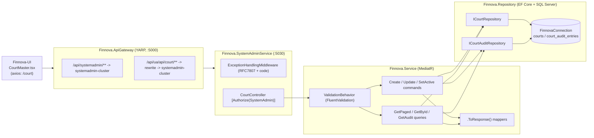

# Design Document — Court Master Management

**JIRA:** FINNOVA-13 · **Module:** SystemAdmin · **Master:** Court
**Related features:** Nationality Master (FINNOVA-9) and Document Number Control Master (FINNOVA-7) — this design mirrors their layered CQRS conventions. Court Master is a **flat** master with a multi-field editable surface and an immutable audit trail; it is closest to Nationality but with more attributes (like DCN's config audit).

## Overview

Court Master is a master-data capability that lets a System Administrator maintain a catalog of courts. A court carries a code, an English name, a court type, a jurisdiction, a location, and an active flag. A System Administrator can create a court, modify its editable attributes, search courts by code/name/jurisdiction with pagination, read a single court, and deactivate/reactivate a court. Every configuration change is captured in an immutable, court-scoped audit trail. All operations — including reads — are SystemAdmin-only.

The feature is delivered as an API-only slice inside the **existing** `Finnova.SystemAdminService` host, reached through the **existing** `Finnova.ApiGateway`. The screen lives in `Finnova-UI`.

### What already exists and is reused (NOT re-established here)

| Concern | Existing asset | Reuse |
| --- | --- | --- |
| Host | `Finnova.SystemAdminService` (:5030), `public partial class Program {}` shim | Add `CourtController`; no new host |
| AuthN | JWT Bearer (`RoleClaimType = ClaimTypes.Role`) | Reused as-is |
| AuthZ | `SystemAdmin` policy = `RequireRole("SystemAdmin")` | Applied to every Court endpoint |
| Mediation | MediatR + `Finnova.Service.Behaviors.ValidationBehavior<,>` | New commands/queries flow through it |
| Errors | `ExceptionHandlingMiddleware` → RFC 7807 `ProblemDetails` + `code` extension | **Extended** with a Court branch |
| Persistence | `AddFinnovaRepository` → EF Core + SQL Server, `FinnovaConnection` | Two new repositories + DbSets registered here |
| Gateway | `systemadmin-route` + UI-alias routes for lookup/nationality/orghierarchy/dcn | **Add** a `court` UI-alias route |
| JSON | Host registers `JsonStringEnumConverter` (added in FINNOVA-7) | Court Type enum serializes/binds as its string name |
| Contracts | `Finnova.Models`, `IRepository<T>`/`RepositoryBase<T>`, `PaginatedResponse<T>`, `.ToResponse()` | Followed exactly |
| Tests | xUnit + FsCheck.Xunit v2 + `WebApplicationFactory<Program>` in `Finnova.Tests` | Extended with Court suites |

### What is new (designed here)

- A `Court` entity and a `CourtAuditEntry` entity + repositories + tables.
- Enums `CourtType { Supreme, High, District, Tribunal, Other }` and `CourtAuditAction { Create, Update }`.
- New domain exceptions (`CourtNotFoundException`, `CourtDuplicateCodeException`) plus an extension to `ExceptionHandlingMiddleware` mapping them to `ERR-CRT-xxx` codes.
- `CourtController` with paged search, single read, create, update, activate, deactivate, and audit-trail read.
- The `Finnova-UI` Court Master screen (React + MUI), mirroring `NationalityMaster`.

### Localization

India-only, English-only. One English `Name`. No bilingual fields, no RTL.

## Requirements Coverage Map

| Requirement | Covered by |
| --- | --- |
| R1 Create court (defaults, validation, type) | `CreateCourtCommand` (+validator, handler), `CourtController.Create`, `Court` entity, audit-on-create |
| R2 Duplicate code + immutability + validation-before-duplicate | `ExistsByCodeAsync` + unique index; `CourtDuplicateCodeException` ("Court code must be unique"); Code not in update contract; validator runs before handler duplicate check |
| R3 Query/search/read | `GetCourtsPagedQuery`, `GetCourtByIdQuery` (+validators, handlers), `GetPagedAsync`, `PaginatedResponse<CourtResponse>` |
| R4 Modify court (editable-only, no-op) | `UpdateCourtCommand` (+validator, handler), no-op detection, audit-on-update |
| R5 Audit trail (create/update, immutable, ordering) | `CourtAuditEntry` entity/repo, `GetCourtAuditTrailQuery`, audit in same unit of work |
| R6 Deactivate/reactivate (soft) | `SetCourtActiveCommand` (+handler), audit-on-toggle |
| R7 AuthN/AuthZ | `[Authorize(Policy="SystemAdmin")]` on all endpoints; 401-before-403 via middleware order |

## Architecture

Vertical slice through the platform's four layers. Requests enter through the gateway, are authenticated/authorized at the host, dispatched via MediatR (with the validation pipeline), and executed by handlers over the repository layer.



### Request lifecycle (cross-cutting)

`ExceptionHandlingMiddleware` runs first (outermost), then `UseAuthentication` → `UseAuthorization` → controller. This ordering guarantees a request that is both unauthenticated and lacking the role is rejected with **401** before authorization evaluates to 403 (R7.4). MediatR's `ValidationBehavior` runs FluentValidation before each handler; a failure throws a validation exception mapped to 400. Duplicate-code and not-found are enforced in the handler and raised as typed exceptions.

## Data Models

Two new entities in `Finnova.Models/Domain/Entities`; two enums in `Finnova.Models/Domain/Enums`. `nvarchar` columns, consistent with the platform.

### `Court` entity

```csharp
using Finnova.Models.Domain.Enums;

namespace Finnova.Models.Domain.Entities;

public class Court
{
    public Guid Id { get; set; } = Guid.NewGuid();
    public string Code { get; set; } = string.Empty;         // max 20, unique (CI, trimmed)
    public string Name { get; set; } = string.Empty;         // max 150, English
    public CourtType CourtType { get; set; }                 // Supreme/High/District/Tribunal/Other
    public string Jurisdiction { get; set; } = string.Empty; // max 100
    public string Location { get; set; } = string.Empty;     // max 100
    public bool IsActive { get; set; } = true;               // default true
    public DateTime CreatedAt { get; set; } = DateTime.UtcNow;
    public DateTime UpdatedAt { get; set; } = DateTime.UtcNow;
}
```

### `CourtAuditEntry` entity

Multi-field editable surface, so before/after is captured as a compact JSON snapshot plus a human-readable summary (same shape as DCN's audit, decision 3 there).

```csharp
using Finnova.Models.Domain.Enums;

namespace Finnova.Models.Domain.Entities;

public class CourtAuditEntry
{
    public Guid Id { get; set; } = Guid.NewGuid();
    public Guid CourtId { get; set; }
    public CourtAuditAction Action { get; set; }             // Create | Update
    public string? OldValues { get; set; }                   // JSON snapshot (null on Create)
    public string NewValues { get; set; } = string.Empty;    // JSON snapshot of resulting fields
    public string Summary { get; set; } = string.Empty;      // e.g. "Renamed; IsActive true->false"
    public string ChangedBy { get; set; } = string.Empty;
    public DateTime ChangedAtUtc { get; set; } = DateTime.UtcNow;
}
```

### Enums

```csharp
namespace Finnova.Models.Domain.Enums;

public enum CourtType { Supreme = 0, High = 1, District = 2, Tribunal = 3, Other = 4 }

public enum CourtAuditAction { Create = 0, Update = 1 }
```

### EF Core configuration

Two `IEntityTypeConfiguration<T>` classes in `Finnova.Repository/Configuration`, auto-discovered by the existing `ApplyConfigurationsFromAssembly` call.

- `courts`: PK `Id`; `Code` required max 20, **unique index** (CI collation backs case-insensitivity; handler trims); `Name` required max 150; `CourtType` required (int); `Jurisdiction` required max 100; `Location` required max 100; `IsActive` required; index on `Name`.
- `court_audit_entries`: PK `Id`; `CourtId` required; `Action` required (int); `OldValues` nullable; `NewValues` required; `Summary` required max 400; `ChangedBy` required max 200; `ChangedAtUtc` required; composite index `(CourtId, ChangedAtUtc)`. No FK to `courts` (audit outlives edits; missing-id read returns empty). Immutability by omission (no update/delete path).

DbSets added to `FinnovaDbContext`:

```csharp
public DbSet<Court> Courts => Set<Court>();
public DbSet<CourtAuditEntry> CourtAuditEntries => Set<CourtAuditEntry>();
```

### Migration

```
dotnet ef migrations add AddCourtAndAudit --project Finnova.Repository --startup-project Finnova.SystemAdminService
```

## Contracts

Records under `Finnova.Models/Contracts/Courts`.

```csharp
public record CreateCourtRequest(string Code, string Name, CourtType CourtType, string Jurisdiction, string Location, bool? IsActive);
public record UpdateCourtRequest(string Name, CourtType CourtType, string Jurisdiction, string Location, bool IsActive); // Code immutable
public record CourtResponse(Guid Id, string Code, string Name, CourtType CourtType, string Jurisdiction, string Location, bool IsActive, DateTime CreatedAt, DateTime UpdatedAt);
public record CourtAuditEntryResponse(Guid Id, Guid CourtId, string Action, string? OldValues, string NewValues, string Summary, string ChangedBy, DateTime ChangedAtUtc);
```

Paged search reuses `PaginatedResponse<CourtResponse>` (from `Finnova.Models.Contracts.Common`).

## Components and Interfaces

### Repository layer (`Finnova.Repository`)

```csharp
public interface ICourtRepository : IRepository<Court>
{
    // Search over Code/Name/Jurisdiction (substring, CI; blank = no filter). Ordered Name asc, Code asc (R3.7).
    Task<(List<Court> Items, int Total)> GetPagedAsync(string? searchTerm, int page, int pageSize, CancellationToken ct = default);
    // Case-insensitive, trimmed uniqueness check on Code (R2). excludeId supports a future code-edit path.
    Task<bool> ExistsByCodeAsync(string code, Guid? excludeId = null, CancellationToken ct = default);
}

public interface ICourtAuditRepository : IRepository<CourtAuditEntry>
{
    // Entries for a court ordered ChangedAtUtc desc then Id desc (R5.5). Missing id -> empty (R5.6).
    Task<List<CourtAuditEntry>> GetByCourtIdAsync(Guid courtId, CancellationToken ct = default);
}
```

Implementations mirror `NumberingSchemeRepository`/`NationalityRepository`: `GetPagedAsync` filters with `Contains` (CI collation) and orders `Name` then `Code`; `ExistsByCodeAsync` trims + `AnyAsync`; audit `GetByCourtIdAsync` orders desc/desc. Registered in `AddFinnovaRepository`.

### Service layer (`Finnova.Service/Court`)

CQRS slice mirroring `Finnova.Service/DocumentNumberControl`. ActingAdmin resolved in the controller from the JWT and passed into commands. A small `CourtAuditSnapshot` helper serializes the editable fields to JSON for the audit (mirrors `SchemeAuditSnapshot`).

**Commands**
- `CreateCourtCommand(...) : IRequest<CourtResponse>` — validator: required + lengths (R1.3, R1.4), `CourtType` `IsInEnum` (R1.5). Handler: trim Code; `ExistsByCodeAsync` → `CourtDuplicateCodeException`; default `IsActive ?? true`; persist; write Create audit.
- `UpdateCourtCommand(...) : IRequest<CourtResponse>` — validator: required + lengths + enum (R4.3). Handler: load-or-404; no-op detection over editable fields (R4.5); else apply, refresh `UpdatedAt`, persist; write Update audit with old/new JSON + summary.
- `SetCourtActiveCommand(Guid Id, bool IsActive, string ActingAdmin) : IRequest<CourtResponse>` — load-or-404 (R6.3); no-op if already in target state (no audit); else toggle, audit as Update with IsActive old→new (R6.1/6.2, R5.3).

**Queries**
- `GetCourtsPagedQuery(string? SearchTerm, int Page = 1, int PageSize = 20)` — validator: Page ≥ 1, PageSize ∈ [1,100] (R3.5). Handler → `GetPagedAsync`, `PaginatedResponse<CourtResponse>`.
- `GetCourtByIdQuery(Guid Id)` — load-or-404 (R3.9).
- `GetCourtAuditTrailQuery(Guid CourtId)` — `GetByCourtIdAsync`, missing id → `[]` (R5.6).

**Mapper** (`Finnova.Service/Mappers/CourtMapper.cs`) — static `.ToResponse()` for both entities (Action projected to its enum name).

### API layer (`Finnova.SystemAdminService/Controllers/CourtController.cs`)

`[ApiController]`, `[Route("api/court")]`, every action `[Authorize(Policy = "SystemAdmin")]`. ActingAdmin from `User` claims (`NameIdentifier`/`sub` → `Name`).

| Method | Route | Body / Query | Success | Reqs |
| --- | --- | --- | --- | --- |
| GET | `api/court` | `?search=&page=1&pageSize=20` | 200 `PaginatedResponse<CourtResponse>` | R3.1–R3.8 |
| GET | `api/court/{id:guid}` | — | 200 `CourtResponse` | R3.9 |
| POST | `api/court` | `CreateCourtRequest` | 201 `CourtResponse` | R1, R2 |
| PUT | `api/court/{id:guid}` | `UpdateCourtRequest` | 200 `CourtResponse` | R4 |
| POST | `api/court/{id:guid}/activate` | — | 200 `CourtResponse` | R6.2 |
| POST | `api/court/{id:guid}/deactivate` | — | 200 `CourtResponse` | R6.1 |
| GET | `api/court/{id:guid}/audit` | — | 200 `List<CourtAuditEntryResponse>` | R5.5/5.6 |

`Create` returns `CreatedAtAction(nameof(GetById), new { id = result.Id }, result)`.

## Error Handling

Extend the existing `ExceptionHandlingMiddleware` with a **Court branch** (typed) and add the Court path to the path-scoped validation/fallback code family:

```csharp
var isCourt = ctx.Request.Path.StartsWithSegments("/api/court", StringComparison.OrdinalIgnoreCase);
// validationCode/fallbackCode: ERR-CRT-400 / ERR-CRT-500 when isCourt (extend the existing chain).

CourtNotFoundException => (404, "ERR-CRT-404", ex.Message),
CourtDuplicateCodeException => (409, "ERR-CRT-409", ex.Message),
```

| Condition | HTTP | code | Reqs |
| --- | --- | --- | --- |
| Court not found (update/read/audit/toggle) | 404 | ERR-CRT-404 | R3.9, R4.4, R6.3 |
| Duplicate code | 409 | ERR-CRT-409 | R2.2 |
| Required/length/enum, bad page range | 400 | ERR-CRT-400 | R1.3–R1.5, R4.3, R3.5 |
| Missing/expired/invalid token | 401 | (auth) | R7.1 |
| Authenticated non-admin | 403 | (auth) | R7.2 |

Rejected create/update writes no record and no audit (R5.4). No-op update writes no audit (R4.5). Audit read for a missing id returns 200 `[]` (R5.6).

## Security & Authentication Flow

No new auth infrastructure. All seven endpoints carry `[Authorize(Policy = "SystemAdmin")]`. Middleware order enforces 401-before-403 (R7.4). `ChangedBy` derives from the validated principal, not request input.

## Design Decisions & Tradeoffs

1. **Reuse the SystemAdmin host.** Court is a SystemAdmin master; adding a controller keeps host separation and reuses auth/validation/ProblemDetails wiring.
2. **Code immutable after create; only Name/CourtType/Jurisdiction/Location/IsActive editable** (R4). `ExistsByCodeAsync` keeps an `excludeId` for a future rename-code path.
3. **Config audit as JSON snapshot + summary**, not per-field columns — the editable surface is multi-field; matches the DCN audit approach. Immutability by omission.
4. **Soft retire (deactivate), no hard delete** — the ticket lists Create/Modify/Query only; deactivation preserves history (flagged for confirmation).
5. **Typed exceptions over message-sniffing** — `CourtNotFoundException` → 404, `CourtDuplicateCodeException` → 409; validation is path-scoped to `ERR-CRT-400`.
6. **Court Type as an enum** serialized by name via the host's `JsonStringEnumConverter` (already registered). Jurisdiction/Location are free-text English (flagged: could later be structured references).
7. **Gateway UI-alias** `/api/ua/api/court/**` mirrors the existing aliases so the UI keeps one axios base URL.
8. **English-only single `Name`** per product-context.

### Confirmation-flagged assumptions
- Length bounds (Code 20, Name 150, Jurisdiction 100, Location 100).
- Create and toggle are audited in addition to updates.
- Soft-retire only (no hard delete).
- Jurisdiction/Location are free-text (not structured references).

## Frontend Design (Finnova-UI)

React 18 + TS + MUI + Vite; hooks + Context; **no Redux/RxJS**; Vitest + RTL. Mirrors the **Nationality/DCN masters**. Namespace **`court` / `Court`**, route **`/courts`**, service `basePath = '/court'`. No new npm dependency (`@mui/x-data-grid` already installed). CourtType/enum fields render as MUI `Select`s of the fixed string unions.

- **Model** (`src/models/court.model.ts`): `CourtType` string union; `Court`, `CourtFormData`, `CourtUpdateData`, `CourtAuditEntry` interfaces.
- **Service interface** (`src/services/interfaces/court.interface.ts`): `ICourtService` (`getPaged`, `getById`, `create`, `update`, `setActive`, `getAuditTrail`) + `CourtQueryParams`.
- **Real service** (`src/services/real/court.real.ts`): shared `api`, `basePath='/court'`; paths `GET /court`, `GET /court/{id}`, `POST /court`, `PUT /court/{id}`, `POST /court/{id}/activate|deactivate`, `GET /court/{id}/audit`.
- **Mock service** (`src/services/mock/court.mock.ts`): backend-shaped `ERR-CRT-4xx/409` errors; code uniqueness (CI), enum/required validation, defaults, substring search, `Name asc → Code asc` ordering, pagination, audit append on create/update/toggle (not on no-op); English-only seeds; `resetToSeed()`.
- **Toggle** (`src/services/court.service.ts`) + barrels (`models/index.ts`, `services/interfaces/index.ts`, `services/index.ts`).
- **Page** (`src/pages/CourtMaster.tsx`): debounced search, grid, Add/Edit/Audit dialogs, activate/deactivate row action.
- **Components** (`src/components/court/`): `CourtGrid.tsx`, `CourtAddDialog.tsx`, `CourtEditDialog.tsx` (Code read-only), `CourtAuditDialog.tsx`.
- **Wiring**: route `/courts` in `App.tsx`; nav item "Court Master" (e.g. `GavelIcon`) in `Layout.tsx` Administration group.
- **Tests**: `court.mock.test.ts`, `court.real.test.ts`, `CourtMaster.test.tsx`.

## Implementation-Ordered Task List

Apply the tasks in `tasks.md` in this dependency order:

1. **Backend domain** — `CourtType` + `CourtAuditAction` enums; `Court` + `CourtAuditEntry` entities.
2. **Backend exceptions** — `CourtNotFoundException`, `CourtDuplicateCodeException`.
3. **Backend contracts** — `CreateCourtRequest`, `UpdateCourtRequest`, `CourtResponse`, `CourtAuditEntryResponse`.
4. **Backend EF config + DbContext + migration** — `CourtConfiguration`, `CourtAuditEntryConfiguration`, DbSets, `AddCourtAndAudit` migration.
5. **Backend repositories + DI** — `ICourtRepository`/`CourtRepository`, `ICourtAuditRepository`/`CourtAuditRepository`, DI registration.
6. **Backend service slice** — `CourtAuditSnapshot` helper; Create/Update/SetCourtActive commands (+validators, handlers); GetPaged/GetById/GetAudit queries (+validators, handlers); `CourtMapper`.
7. **Backend controller + middleware + gateway** — `CourtController`; `ExceptionHandlingMiddleware` Court branch + path-scoped code; gateway `court` alias routes.
8. **Backend tests** — unit (validators, handlers over in-memory repos), integration (authorization + E2E create/update/toggle/audit + duplicate/not-found).
9. **Frontend model + services** — `court.model.ts`; `court.interface.ts`; `court.real.ts`; `court.mock.ts`; `court.service.ts`; barrels.
10. **Frontend page + components + wiring** — `CourtMaster.tsx`; `CourtGrid/CourtAddDialog/CourtEditDialog/CourtAuditDialog`; route in `App.tsx`; nav in `Layout.tsx`.
11. **Frontend tests** — `court.mock.test.ts`, `court.real.test.ts`, `CourtMaster.test.tsx`.
