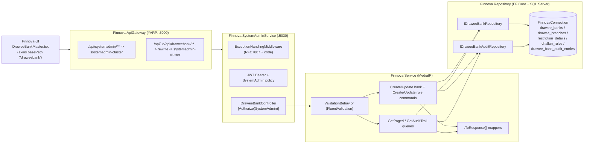
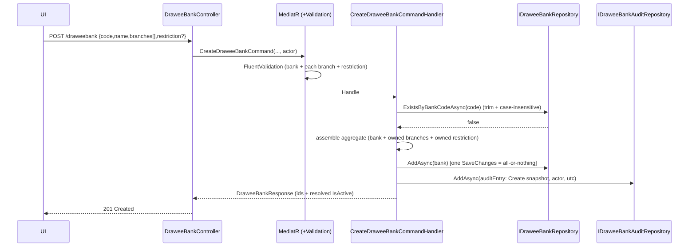
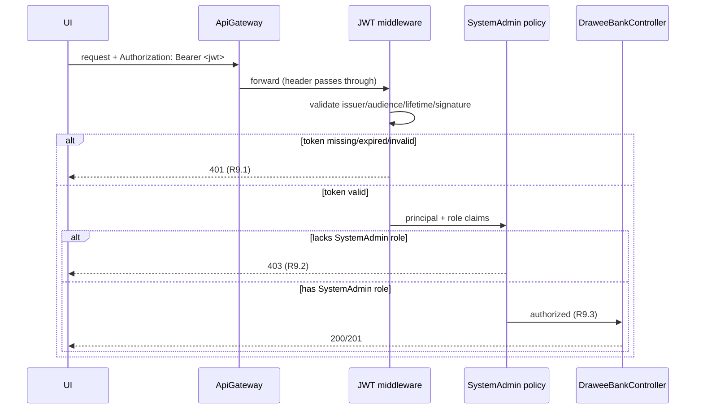

# Design Document — Drawee Bank & Challan Rules Master Management

**JIRA:** FINNOVA-16 · **Module:** SystemAdmin · **Master:** Drawee Bank & Challan Rules
**Related features:** Lookup Master Management (FINNOVA-8) and Nationality Master Management (FINNOVA-9) — this design mirrors their established layered CQRS conventions and the gateway/middleware patterns already in the repo.

## Overview

Drawee Bank & Challan Rules Master Management is a master-data capability that lets a System Administrator maintain standardized drawee bank reference data used across the Finnova platform (instrument clearing and payment routing flows). The user-facing **Drawee Bank Master** screen is organized around three regions, mirroring the attached mockup:

- a **Bank header** carrying the Bank **Code** and the single English Bank **Name** (plus the Is Active flag);
- a **"List of Branches"** grid of Drawee Branches (Drawee Places) owned by the bank — each with a Place Code, a single English Place Name, an Address, a six-digit PIN (Postal Code), and an effective date range;
- a **"Restriction Details"** panel with Clearing Days and an effective date range;

and, extending the mockup from the ticket's description ("formats, validations, routing"), a **Challan Rules** configuration set associated with the bank (Rule Code, Format Pattern, Validation Expression, Routing Target, Is Active). The screen offers **Save / Clear / Cancel** actions: Save persists the bank aggregate atomically, Clear resets the in-progress form, and Cancel abandons edits and returns to the list.

Challan rules are **decoupled from the DraweeBank aggregate**: they are a standalone configuration set managed and read **only** through their own challan-rule endpoints, never created inline with the bank nor returned on the bank response. From the screen an admin can create a drawee bank (code + name + branches + optional restriction), modify an existing bank (name, branches, restriction), configure challan rules under a bank through the dedicated rule dialog/endpoints, search drawee banks by code or name with pagination, and view a bank's audit trail. Every create and modify is captured in an immutable, drawee-bank-scoped audit trail so changes to standardized reference data are traceable. All operations — including reads — are restricted to System Administrators.

The feature is delivered as an API-only slice inside the **existing** `Finnova.SystemAdminService` host (the same host that already exposes Lookup, Nationality, Org-Hierarchy, DCN, Court, Entity, and User masters), reached through the **existing** `Finnova.ApiGateway` YARP reverse proxy at the gateway prefix `/api/systemadmin/**` (plus a UI alias under `/api/ua/api/draweebank/**`). The user-facing screen lives in the separate `Finnova-UI` React application.

### Localization

Finnova is an **India-only, English-only** platform. A drawee bank carries a **single** English `BankName`; a branch carries a **single** English `PlaceName`. There are **no** bilingual fields (`...En`/`...Ar`), no Arabic seed/sample data, and no right-to-left (RTL) rendering. Postal codes are six-digit **Indian PIN** codes. All sample data in this spec is India-appropriate — e.g. `HDFC` / `HDFC Bank Ltd`, branch places such as `Mumbai` and `Pune`, PINs such as `400001` / `411001`. Any region-specific sample data from the source mockup is not carried into this spec. Any future multi-language need must be raised explicitly for confirmation.

### What already exists and is reused (NOT re-established by this feature)

The following infrastructure was established by FINNOVA-8 (and extended by FINNOVA-9 and the SystemAdmin masters that followed). It is a fixed dependency; this design **adds to** it and does not recreate or re-wire it.

| Concern | Existing asset | Reuse in this feature |
| --- | --- | --- |
| Host | `Finnova.SystemAdminService` (port 5030), `public partial class Program {}` shim present | Add `DraweeBankController`; **no new host** |
| AuthN | JWT Bearer (`ValidateIssuer/Audience/Lifetime/SigningKey`, `RoleClaimType = ClaimTypes.Role`) — from FINNOVA-8 | Reused as-is |
| AuthZ | `SystemAdmin` policy = `RequireRole("SystemAdmin")` | Applied to every drawee-bank endpoint |
| Mediation | MediatR + `Finnova.Service.Behaviors.ValidationBehavior<,>` pipeline | New commands/queries flow through it |
| Errors | `ExceptionHandlingMiddleware` → RFC 7807 `ProblemDetails` with a `code` extension | **Extended** with a drawee-bank branch (see Error Handling); not replaced |
| Persistence | `AddFinnovaRepository` → EF Core + SQL Server, connection string `FinnovaConnection`; `ApplyConfigurationsFromAssembly` auto-discovery | New repositories + DbSets registered here; new `IEntityTypeConfiguration<T>` classes auto-discovered |
| Contracts | `Finnova.Models`, generic `IRepository<T>` / `RepositoryBase<T>`, `PaginatedResponse<T>`, `.ToResponse()` mappers | Followed exactly; `PaginatedResponse<T>` reused |
| Gateway | `systemadmin-route` `/api/systemadmin/{**catch-all}` → `systemadmin-cluster`; UI aliases for `lookup`/`nationality`/`orghierarchy`/`dcn`/`court`/`entity`/`user` | **Add** an equivalent `draweebank` UI-alias pair |
| DbContext | Real `FinnovaDbContext` already declares every `DbSet<T>` via `=> Set<T>()` | New DbSets follow the same `=> Set<T>()` pattern |
| Tests | xUnit + FsCheck.Xunit (v2) + `WebApplicationFactory<Program>` in `Finnova.Tests` | Extended with drawee-bank suites |

### What is new in this feature (designed here)

- Domain entities: a `DraweeBank` aggregate root owning a collection of `DraweeBranch` and an optional `RestrictionDetail` (owned); a **standalone** `ChallanRule` configuration entity keyed by `DraweeBankId` (not part of the bank aggregate); and an immutable `DraweeBankAuditEntry`.
- A `DraweeBankAuditAction` enum (`Create | Update | Delete`).
- New typed domain exceptions (`DraweeBankNotFoundException`, `DraweeBankDuplicateCodeException`, `DraweeBranchDuplicatePlaceCodeException`, `ChallanRuleNotFoundException`, `ChallanRuleDuplicateCodeException`, `DraweeBankValidationException`) and an extension to `ExceptionHandlingMiddleware` mapping them to `ERR-DRB-xxx` codes.
- New record-based contracts under `Finnova.Models/Contracts/DraweeBanks`.
- Two new repositories (`IDraweeBankRepository`, `IDraweeBankAuditRepository`) + DI registration.
- A CQRS slice under `Finnova.Service/DraweeBank` (commands, queries, validators, handlers, mappers).
- `DraweeBankController` with paged search, create, update, challan-rule sub-routes (read/create/update), and audit-trail-read endpoints.
- The `Finnova-UI` Drawee Bank Master screen (React + MUI), mirroring `NationalityMaster.tsx` / `LookupMaster.tsx`.

## Requirements Coverage Map

| Requirement | Covered by |
| --- | --- |
| R1 Create drawee bank (atomic aggregate) | `CreateDraweeBankCommand` (+ validator, handler), `DraweeBankController.Create`, `DraweeBank` + owned `DraweeBranch`/`RestrictionDetail`, single `SaveChanges` unit of work, audit-on-create |
| R2 Prevent duplicate bank code | `ExistsByBankCodeAsync` (trimmed, case-insensitive) + unique index on `BankCode`; `DraweeBankDuplicateCodeException` → `"Bank code must be unique"`; `excludeId` for self-exclusion on update |
| R3 Manage drawee branches | Owned `DraweeBranch` collection, branch validation in the create/update validators, in-aggregate place-code uniqueness (`DraweeBranchDuplicatePlaceCodeException`), PIN + date-range rules, branch removal on update |
| R4 Maintain restriction details | Optional owned `RestrictionDetail`, clearing-days range (0–365), date-range rule, omit-is-no-restriction |
| R5 Modify drawee bank | `UpdateDraweeBankCommand` (+ validator, handler), `DraweeBankNotFoundException`, UpdatedAt refresh, no-op-on-identical, audit-on-update |
| R6 Configure challan rules | `CreateChallanRuleCommand` / `UpdateChallanRuleCommand` (+ validators, handlers) and `GetChallanRulesByBankIdAsync`-backed read, standalone `ChallanRule` entity (decoupled from the bank aggregate), per-bank rule-code uniqueness (`ChallanRuleDuplicateCodeException`), field length/parse validation, owning-bank existence check; managed/read only via the dedicated challan-rule endpoints |
| R7 Audit trail on create/modify | `DraweeBankAuditEntry` entity/repo, `GetDraweeBankAuditTrailQuery`, immutability (no update/delete path), no-audit-on-rejection, UTC + deterministic ordering |
| R8 Query & search | `GetDraweeBanksPagedQuery` (+ validator, handler), `GetPagedAsync`, `PaginatedResponse<DraweeBankResponse>`, Name asc → Code asc ordering, page defaults/bounds |
| R9 AuthN/AuthZ | `[Authorize(Policy="SystemAdmin")]` on all endpoints; existing JWT scheme + `SystemAdmin` policy; middleware order enforces 401-before-403 |

## Architecture

The feature is a vertical slice through the platform's four layers. Requests enter through the gateway, are authenticated/authorized at the host, dispatched via MediatR (with the validation pipeline), and executed by handlers over the repository layer.



### Request lifecycle (cross-cutting)

`ExceptionHandlingMiddleware` runs first (outermost), then `UseAuthentication` → `UseAuthorization` → controller. This ordering guarantees a request that is both unauthenticated and lacking the role is rejected with **401** before authorization evaluates to 403 (R9.4). MediatR's `ValidationBehavior` runs FluentValidation before each handler; a failure throws `FluentValidation.ValidationException`, which the middleware maps to 400.

### Aggregate boundary

A `DraweeBank` is the **aggregate root**. `DraweeBranch` records and the optional `RestrictionDetail` are **owned** by the bank — persisted and loaded with it, and only mutated through the bank. `ChallanRule` records are **not part of the bank aggregate**: they are a standalone configuration entity keyed by `DraweeBankId`, created/read/updated exclusively through their own challan-rule endpoints. They never appear on the `DraweeBank` entity, are never loaded with the bank, and are never returned on the bank response or mapper. (See Design Decisions for the decoupling rationale, confirmed by the user.)

### Create sequence (happy path + audit, atomic)



### Duplicate-code rejection sequence (no audit, nothing persisted)

```mermaid
sequenceDiagram
    participant UI
    participant H as CreateDraweeBankCommandHandler
    participant DR as IDraweeBankRepository
    participant AR as IDraweeBankAuditRepository
    UI->>H: CreateDraweeBankCommand(bankCode="HDFC")
    H->>DR: ExistsByBankCodeAsync("hdfc")  (trim + case-insensitive)
    DR-->>H: true
    H-->>UI: throw DraweeBankDuplicateCodeException -> 409 ERR-DRB-409
    Note over AR: No audit entry is written (R7.3); master unchanged
```

### Update-with-audit sequence

```mermaid
sequenceDiagram
    participant UI
    participant H as UpdateDraweeBankCommandHandler
    participant DR as IDraweeBankRepository
    participant AR as IDraweeBankAuditRepository
    UI->>H: UpdateDraweeBankCommand(id, name, branches[], restriction?, actor)
    H->>DR: GetByIdAsync(id)  (incl. owned branches + restriction)
    alt not found
        DR-->>H: null
        H-->>UI: throw DraweeBankNotFoundException -> 404 ERR-DRB-404
    else found
        DR-->>H: bank (before snapshot)
        alt submitted values equal current
            H-->>UI: 200 (no-op, no audit)  (R5.5)
        else changed
            H->>DR: UpdateAsync(bank; add/update/remove branches; set/clear restriction; UpdatedAt=utc)
            H->>AR: AddAsync(auditEntry: Update, before->after snapshot, actor, utc)
            H-->>UI: 200 DraweeBankResponse
        end
    end
```

## Data Models

New entities under `Finnova.Models/Domain/Entities` and the enum under `Finnova.Models/Domain/Enums`. All string columns are `nvarchar` (SQL Server), consistent with the platform.

### `DraweeBank` entity (aggregate root)

```csharp
namespace Finnova.Models.Domain.Entities;

/// <summary>
/// Aggregate root: a drawee bank reference record. India-only platform: one English BankName.
/// Owns its DraweeBranch collection and an optional RestrictionDetail (R1, R3, R4).
/// </summary>
public class DraweeBank
{
    public Guid Id { get; set; } = Guid.NewGuid();

    public string BankCode { get; set; } = string.Empty;   // max 20, unique case-insensitive (R1, R2)
    public string BankName { get; set; } = string.Empty;   // max 150, single English name (R1, R5)

    public bool IsActive { get; set; } = true;             // default true (R1.2)

    // Owned children — persisted/loaded with the aggregate.
    public List<DraweeBranch> Branches { get; set; } = new();   // R3
    public RestrictionDetail? Restriction { get; set; }         // optional (R4.4)

    public DateTime CreatedAt { get; set; } = DateTime.UtcNow;
    public DateTime UpdatedAt { get; set; } = DateTime.UtcNow;
}
```

### `DraweeBranch` entity (Drawee Place — owned)

```csharp
namespace Finnova.Models.Domain.Entities;

/// <summary>
/// A branch/place under a drawee bank. Place Code is unique within the owning bank (R3.3).
/// EndDate null => open-ended effective period (R3.5). PostalCode is a six-digit Indian PIN (R3.6).
/// </summary>
public class DraweeBranch
{
    public Guid Id { get; set; } = Guid.NewGuid();
    public Guid DraweeBankId { get; set; }                  // owner FK (R3.1)

    public string PlaceCode { get; set; } = string.Empty;   // max 20, unique within bank (R3.2, R3.3)
    public string PlaceName { get; set; } = string.Empty;   // max 150, single English name (R3.2)
    public string Address { get; set; } = string.Empty;     // max 300 (R3.1)
    public string PostalCode { get; set; } = string.Empty;  // six-digit numeric PIN (R3.6)

    public DateTime StartDate { get; set; }                 // R3.1
    public DateTime? EndDate { get; set; }                  // null => open-ended (R3.4, R3.5)
}
```

### `RestrictionDetail` entity (owned, optional)

```csharp
namespace Finnova.Models.Domain.Entities;

/// <summary>
/// Per-bank clearing-day / effective-period constraint. Optional: a bank may have none (R4.4).
/// ClearingDays in [0, 365] (R4.2, R4.5). EndDate on or after StartDate (R4.3).
/// </summary>
public class RestrictionDetail
{
    public Guid Id { get; set; } = Guid.NewGuid();
    public Guid DraweeBankId { get; set; }                  // owner FK (R4.1)

    public int ClearingDays { get; set; }                   // >= 0 and <= 365 (R4.2, R4.5)
    public DateTime StartDate { get; set; }                 // R4.1
    public DateTime EndDate { get; set; }                   // on/after StartDate (R4.3)
}
```

### `ChallanRule` entity (related configuration set)

```csharp
namespace Finnova.Models.Domain.Entities;

/// <summary>
/// A standalone challan rule associated with a drawee bank by DraweeBankId. NOT part of the
/// DraweeBank aggregate: it is never navigated from, loaded with, or returned on the bank.
/// Rule Code is unique within the owning bank (R6.4). Managed only through its own endpoints.
/// </summary>
public class ChallanRule
{
    public Guid Id { get; set; } = Guid.NewGuid();
    public Guid DraweeBankId { get; set; }                       // owning bank (R6.1, R6.7)

    public string RuleCode { get; set; } = string.Empty;         // max 50, unique within bank (R6.3, R6.4)
    public string FormatPattern { get; set; } = string.Empty;    // max 500, parseable (R6.3, R6.8)
    public string ValidationExpression { get; set; } = string.Empty; // max 500, parseable (R6.3, R6.8)
    public string RoutingTarget { get; set; } = string.Empty;    // max 200 (R6.3)

    public bool IsActive { get; set; } = true;                   // default true (R6.2)

    public DateTime CreatedAt { get; set; } = DateTime.UtcNow;
    public DateTime UpdatedAt { get; set; } = DateTime.UtcNow;
}
```

### `DraweeBankAuditEntry` entity (new audit trail, immutable)

Because the bank aggregate has several editable surfaces (name, branches, restriction, and related rules), the audit stores a **before/after snapshot** (a serialized JSON projection of the relevant state) rather than a per-field pair. This keeps one entry per create/modify of the aggregate while remaining extensible (R7.1, R7.2; audit granularity flagged in Design Decisions).

```csharp
namespace Finnova.Models.Domain.Entities;

/// <summary>
/// Immutable audit record capturing one create/update/delete on a drawee bank (or a challan rule
/// under it) (R7). Written within the same unit of work as the change. Never updated or deleted
/// (R7.6). No FK to DraweeBank so entries survive independently and a missing-id read returns []
/// without error (R7.5).
/// </summary>
public class DraweeBankAuditEntry
{
    public Guid Id { get; set; } = Guid.NewGuid();

    public Guid DraweeBankId { get; set; }                   // affected aggregate (R7.1/7.2)
    public DraweeBankAuditAction Action { get; set; }        // Create | Update | Delete (R7.1/7.2)

    public string? BeforeSnapshot { get; set; }              // prior state (JSON); null on Create
    public string? AfterSnapshot { get; set; }               // new state (JSON); null on Delete

    public string ChangedBy { get; set; } = string.Empty;    // acting admin id from JWT (R7.1/7.2)
    public DateTime ChangedAtUtc { get; set; } = DateTime.UtcNow; // UTC timestamp (R7.1/7.2)
}
```

```csharp
namespace Finnova.Models.Domain.Enums;

/// <summary>Discriminates the mutation an audit entry records (R7.1, R7.2).</summary>
public enum DraweeBankAuditAction
{
    Create = 0,
    Update = 1,
    Delete = 2
}
```

### EF Core configuration

New `IEntityTypeConfiguration<T>` classes in `Finnova.Repository/Configuration`, auto-discovered by the existing `ApplyConfigurationsFromAssembly` call. `DraweeBranch` and `RestrictionDetail` are modeled as **owned/related** children of `DraweeBank` (`OwnsMany` / `OwnsOne` or a FK with cascade delete so removing a branch during update deletes it, R3.7). `ChallanRule` is a **standalone** table keyed by `DraweeBankId` with no navigation from `DraweeBank` — it is not part of the bank aggregate and is never included in bank loads.

```csharp
// DraweeBankConfiguration
builder.ToTable("drawee_banks");
builder.HasKey(x => x.Id);
builder.Property(x => x.BankCode).IsRequired().HasMaxLength(20);
builder.Property(x => x.BankName).IsRequired().HasMaxLength(150);
builder.Property(x => x.IsActive).IsRequired();
// Case-insensitive uniqueness of BankCode (R2). SQL Server default CI collation backs the index;
// codes are trimmed by the handler so stored values are canonical.
builder.HasIndex(x => x.BankCode).IsUnique();
builder.HasIndex(x => x.BankName);                       // search/order path (R8.10)
// Owned branches + optional restriction (cascade so update-removal deletes the branch, R3.7).
builder.HasMany(x => x.Branches).WithOne().HasForeignKey(b => b.DraweeBankId).OnDelete(DeleteBehavior.Cascade);
builder.HasOne(x => x.Restriction).WithOne().HasForeignKey<RestrictionDetail>(r => r.DraweeBankId).OnDelete(DeleteBehavior.Cascade);
```

```csharp
// DraweeBranchConfiguration
builder.ToTable("drawee_branches");
builder.HasKey(x => x.Id);
builder.Property(x => x.PlaceCode).IsRequired().HasMaxLength(20);
builder.Property(x => x.PlaceName).IsRequired().HasMaxLength(150);
builder.Property(x => x.Address).HasMaxLength(300);
builder.Property(x => x.PostalCode).IsRequired().HasMaxLength(6);  // six-digit PIN (R3.6)
builder.Property(x => x.StartDate).IsRequired();
builder.Property(x => x.EndDate);                                   // nullable (R3.5)
// Place Code unique within the owning bank (R3.3).
builder.HasIndex(x => new { x.DraweeBankId, x.PlaceCode }).IsUnique();
```

```csharp
// RestrictionDetailConfiguration
builder.ToTable("restriction_details");
builder.HasKey(x => x.Id);
builder.Property(x => x.ClearingDays).IsRequired();
builder.Property(x => x.StartDate).IsRequired();
builder.Property(x => x.EndDate).IsRequired();
builder.HasIndex(x => x.DraweeBankId).IsUnique();        // at most one restriction per bank
```

```csharp
// ChallanRuleConfiguration
builder.ToTable("challan_rules");
builder.HasKey(x => x.Id);
builder.Property(x => x.DraweeBankId).IsRequired();
builder.Property(x => x.RuleCode).IsRequired().HasMaxLength(50);
builder.Property(x => x.FormatPattern).IsRequired().HasMaxLength(500);
builder.Property(x => x.ValidationExpression).IsRequired().HasMaxLength(500);
builder.Property(x => x.RoutingTarget).IsRequired().HasMaxLength(200);
builder.Property(x => x.IsActive).IsRequired();
// Rule Code unique within the owning bank (R6.4).
builder.HasIndex(x => new { x.DraweeBankId, x.RuleCode }).IsUnique();
```

```csharp
// DraweeBankAuditEntryConfiguration
builder.ToTable("drawee_bank_audit_entries");
builder.HasKey(x => x.Id);
builder.Property(x => x.DraweeBankId).IsRequired();
builder.Property(x => x.Action).IsRequired();            // stored as int
builder.Property(x => x.BeforeSnapshot);                 // nullable nvarchar(max)
builder.Property(x => x.AfterSnapshot);                  // nullable nvarchar(max)
builder.Property(x => x.ChangedBy).IsRequired().HasMaxLength(200);
builder.Property(x => x.ChangedAtUtc).IsRequired();
// Read path: entries for a bank ordered by time desc then id desc (R7.4).
builder.HasIndex(x => new { x.DraweeBankId, x.ChangedAtUtc });
```

No FK constraint links `DraweeBankAuditEntry.DraweeBankId` to `DraweeBank.Id`, so audit entries survive independently and the "missing id returns empty" read (R7.5) needs no special handling. Immutability (R7.6) is enforced by never exposing an update/delete path for audit entries.

New DbSets on `FinnovaDbContext` (same `=> Set<T>()` pattern the real context already uses):

```csharp
public DbSet<DraweeBank> DraweeBanks => Set<DraweeBank>();
public DbSet<DraweeBranch> DraweeBranches => Set<DraweeBranch>();
public DbSet<RestrictionDetail> RestrictionDetails => Set<RestrictionDetail>();
public DbSet<ChallanRule> ChallanRules => Set<ChallanRule>();
public DbSet<DraweeBankAuditEntry> DraweeBankAuditEntries => Set<DraweeBankAuditEntry>();
```

### Migration note

A single EF Core migration adds all five tables and the unique indexes, generated with the platform's convention:

```
dotnet ef migrations add AddDraweeBankChallanRulesAndAudit \
  --project Finnova.Repository --startup-project Finnova.SystemAdminService
```

Applied via `dotnet ef database update` (or the host's existing startup migration path). No seed data is required; if a smoke seed is desired it must be India-only / English-only (e.g. `HDFC` / `HDFC Bank Ltd`, place `Mumbai`, PIN `400001`).

## Contracts

New records under `Finnova.Models/Contracts/DraweeBanks` (following the `Lookups` / `Nationalities` folder pattern). Nested child records model the atomic aggregate submission (R1).

```csharp
// ---- Create ----

// Child submitted inside a create/update. Dates ISO-8601; EndDate nullable (open-ended branch).
public record DraweeBranchRequest(
    string PlaceCode, string PlaceName, string Address, string PostalCode,
    DateTime StartDate, DateTime? EndDate);

// Optional restriction submitted inside a create/update.
public record RestrictionDetailRequest(int ClearingDays, DateTime StartDate, DateTime EndDate);

// POST /draweebank — IsActive nullable so the service defaults it to true (R1.2).
// Challan rules are NOT created inline with the bank; they are managed only via their own route.
public record CreateDraweeBankRequest(
    string BankCode,
    string BankName,
    bool? IsActive,
    IReadOnlyList<DraweeBranchRequest> Branches,       // zero or more (R1.1)
    RestrictionDetailRequest? Restriction);            // optional (R4.4)

// ---- Update ----

// PUT /draweebank/{id} — BankCode immutable post-create (see Design Decisions). Branches/restriction
// are the full desired set; omitted branches are removed (R3.7), null restriction clears it (R4.4).
public record UpdateDraweeBankRequest(
    string BankName,
    IReadOnlyList<DraweeBranchRequest> Branches,
    RestrictionDetailRequest? Restriction);

// ---- Challan rule sub-routes ----

public record CreateChallanRuleRequest(
    string RuleCode, string FormatPattern, string ValidationExpression, string RoutingTarget,
    bool? IsActive);

// RuleCode immutable on update (mirrors BankCode); only mutable fields accepted (R6.5).
public record UpdateChallanRuleRequest(
    string FormatPattern, string ValidationExpression, string RoutingTarget, bool IsActive);

// ---- Responses ----

public record DraweeBranchResponse(
    Guid Id, Guid DraweeBankId, string PlaceCode, string PlaceName, string Address,
    string PostalCode, DateTime StartDate, DateTime? EndDate);

public record RestrictionDetailResponse(
    Guid Id, Guid DraweeBankId, int ClearingDays, DateTime StartDate, DateTime EndDate);

public record ChallanRuleResponse(
    Guid Id, Guid DraweeBankId, string RuleCode, string FormatPattern, string ValidationExpression,
    string RoutingTarget, bool IsActive, DateTime CreatedAt, DateTime UpdatedAt);

// Admin-facing response (R1.1 returns ids + resolved IsActive). Includes the owned children only.
// Challan rules are decoupled and NOT part of this response; they are read via GET /{id}/challan-rules.
public record DraweeBankResponse(
    Guid Id,
    string BankCode,
    string BankName,
    bool IsActive,
    IReadOnlyList<DraweeBranchResponse> Branches,
    RestrictionDetailResponse? Restriction,
    DateTime CreatedAt,
    DateTime UpdatedAt);

// One audit row (R7.4).
public record DraweeBankAuditEntryResponse(
    Guid Id,
    Guid DraweeBankId,
    string Action,                 // "Create" | "Update" | "Delete"
    string? BeforeSnapshot,
    string? AfterSnapshot,
    string ChangedBy,
    DateTime ChangedAtUtc);
```

The paged search reuses the existing `PaginatedResponse<T>` exactly:

```csharp
PaginatedResponse<DraweeBankResponse>(List<DraweeBankResponse> Data, int Total, int Page, int PageSize, int TotalPages)
```

### TypeScript shapes the UI depends on

JSON is camelCase; the UI models mirror the responses one-for-one and `PaginatedResponse<T>` comes from `src/models/api.model.ts`.

```typescript
export interface DraweeBranch {
  id: string; draweeBankId: string;
  placeCode: string; placeName: string; address: string; postalCode: string;
  startDate: string; endDate: string | null;   // null => open-ended
}
export interface RestrictionDetail {
  id: string; draweeBankId: string;
  clearingDays: number; startDate: string; endDate: string;
}
export interface ChallanRule {
  id: string; draweeBankId: string;
  ruleCode: string; formatPattern: string; validationExpression: string; routingTarget: string;
  isActive: boolean; createdAt: string; updatedAt: string;
}
// Bank does NOT carry challan rules; the standalone ChallanRule type above is loaded separately.
export interface DraweeBank {
  id: string; bankCode: string; bankName: string; isActive: boolean;
  branches: DraweeBranch[];
  restriction: RestrictionDetail | null;
  createdAt: string; updatedAt: string;
}
export interface DraweeBankAuditEntry {
  id: string; draweeBankId: string;
  action: 'Create' | 'Update' | 'Delete';
  beforeSnapshot: string | null; afterSnapshot: string | null;
  changedBy: string; changedAtUtc: string;
}

// Form payloads (dialogs). BankCode immutable on edit; RuleCode immutable on rule edit.
export interface DraweeBranchFormData {
  placeCode: string; placeName: string; address: string; postalCode: string;
  startDate: string; endDate: string | null;
}
export interface RestrictionDetailFormData { clearingDays: number; startDate: string; endDate: string; }
export interface ChallanRuleFormData {
  ruleCode: string; formatPattern: string; validationExpression: string; routingTarget: string; isActive: boolean;
}
// Bank form carries no challan rules; rules are created/edited via the standalone rule dialog.
export interface DraweeBankFormData {
  bankCode: string; bankName: string; isActive: boolean;
  branches: DraweeBranchFormData[];
  restriction: RestrictionDetailFormData | null;
}
export interface DraweeBankUpdateData {
  bankName: string;
  branches: DraweeBranchFormData[];
  restriction: RestrictionDetailFormData | null;
}
```

## Components and Interfaces

### Repository Layer (`Finnova.Repository`)

Two feature repositories, each a specialization of the generic base, registered in `DependencyInjection.AddFinnovaRepository`.

```csharp
public interface IDraweeBankRepository : IRepository<DraweeBank>
{
    /// <summary>Search + page (R8). Term filters BankCode OR BankName (substring, case-insensitive);
    /// null/blank term = no filter. Ordered by BankName asc then BankCode asc (R8.10). Returns page +
    /// total. Includes owned branches/restriction for the page items (challan rules are not loaded).</summary>
    Task<(List<DraweeBank> Items, int Total)> GetPagedAsync(
        string? searchTerm, int page, int pageSize, CancellationToken ct = default);

    /// <summary>Load the bank aggregate (bank + branches + restriction) by id, or null if absent
    /// (R5, R6.7). Challan rules are not part of the aggregate and are not loaded here.</summary>
    Task<DraweeBank?> GetAggregateByIdAsync(Guid id, CancellationToken ct = default);

    /// <summary>Case-insensitive, trimmed uniqueness check on BankCode (R2). excludeId supports
    /// self-exclusion on update (R2.4).</summary>
    Task<bool> ExistsByBankCodeAsync(string bankCode, Guid? excludeId = null, CancellationToken ct = default);

    /// <summary>Standalone challan-rule helpers (R6). List rules for a bank, load/insert/update a
    /// rule, and check per-bank rule-code uniqueness (trimmed, case-insensitive; excludeId for
    /// self-exclusion on update). Rules are accessed only through these helpers, never with the bank.</summary>
    Task<List<ChallanRule>> GetChallanRulesByBankIdAsync(Guid draweeBankId, CancellationToken ct = default);
    Task<ChallanRule?> GetChallanRuleByIdAsync(Guid ruleId, CancellationToken ct = default);
    Task<bool> ChallanRuleCodeExistsAsync(Guid draweeBankId, string ruleCode, Guid? excludeId = null, CancellationToken ct = default);
    Task AddChallanRuleAsync(ChallanRule rule, CancellationToken ct = default);
    Task UpdateChallanRuleAsync(ChallanRule rule, CancellationToken ct = default);
}

public interface IDraweeBankAuditRepository : IRepository<DraweeBankAuditEntry>
{
    /// <summary>Audit entries for a drawee bank, ordered ChangedAtUtc desc then Id desc (R7.4).
    /// Missing id returns an empty list, never an error (R7.5).</summary>
    Task<List<DraweeBankAuditEntry>> GetByDraweeBankIdAsync(Guid draweeBankId, CancellationToken ct = default);
}
```

`DraweeBankRepository` implementation notes (mirror `NationalityRepository`): `GetPagedAsync` uses `AsNoTracking`, `Include`s the owned branches/restriction only (challan rules are **not** loaded or attached to bank items), filters `BankCode.Contains || BankName.Contains` when a term is present (EF `LIKE`, CI collation → R8.1), counts before paging (R8.4), orders `BankName` then `BankCode` (R8.10), and applies `Skip/Take`. `GetAggregateByIdAsync` loads the bank with its branches/restriction only. `GetChallanRulesByBankIdAsync` queries the standalone `challan_rules` table by `DraweeBankId` (ordered by `RuleCode`) independently of any bank load. `ExistsByBankCodeAsync` trims and compares (CI via collation) with optional `excludeId`. The audit repository's `GetByDraweeBankIdAsync` orders `ChangedAtUtc desc, Id desc` and returns `[]` when none match.

DI registration additions:

```csharp
services.AddScoped<IDraweeBankRepository, DraweeBankRepository>();
services.AddScoped<IDraweeBankAuditRepository, DraweeBankAuditRepository>();
```

> **Unit of work note:** The create handler builds the whole aggregate (bank + owned branches + owned restriction) and persists it with a **single** `SaveChanges`, so the aggregate is all-or-nothing (R1.7). The accompanying audit entry is written in the same scoped `FinnovaDbContext` immediately after. If strict single-transaction atomicity across the aggregate save and the audit save is required, wrap both in an explicit `IDbContextTransaction` (flagged in Design Decisions).

### Service Layer (`Finnova.Service/DraweeBank`)

CQRS slice mirroring `Finnova.Service/Nationality`. The acting administrator identifier is resolved in the controller from the JWT and passed into commands so handlers stay free of `HttpContext`.

**Commands**

- `CreateDraweeBankCommand(string BankCode, string BankName, bool? IsActive, IReadOnlyList<DraweeBranchRequest> Branches, RestrictionDetailRequest? Restriction, string ActingAdmin) : IRequest<DraweeBankResponse>`
  - Validator: `BankCode` NotEmpty + MaxLength(20) (R1.3, R1.4, R2.5); `BankName` NotEmpty + MaxLength(150) (R1.3, R1.4); each branch via a `DraweeBranchRequestValidator` (R3.2 required, R3.6 six-digit PIN regex `^\d{6}$`, R3.4 EndDate ≥ StartDate when present); in-collection place-code uniqueness (trimmed, CI) (R3.3); restriction via `RestrictionDetailRequestValidator` (R4.2 ClearingDays 0–365, R4.5, R4.3 date range). No challan rules are accepted inline.
  - Handler: trim `BankCode`; `ExistsByBankCodeAsync` → throw `DraweeBankDuplicateCodeException("Bank code must be unique")` if duplicate (R2.2), persisting nothing and no audit (R7.3); assemble the bank aggregate (branch/restriction entities with `IsActive ?? true`, R1.2) and `AddAsync` in one unit of work (R1.7); write a `Create` audit entry (`BeforeSnapshot=null`, `AfterSnapshot=<created state JSON>`) (R7.2). Returns `entity.ToResponse()`. Challan rules are not created here — they are added later via `CreateChallanRuleCommand`.

- `UpdateDraweeBankCommand(Guid Id, string BankName, IReadOnlyList<DraweeBranchRequest> Branches, RestrictionDetailRequest? Restriction, string ActingAdmin) : IRequest<DraweeBankResponse>`
  - Validator: `Id` NotEmpty; `BankName` NotEmpty + MaxLength(150) (R5.2, R5.3); branches + restriction validated as on create (R3, R4).
  - Handler: `GetAggregateByIdAsync` or throw `DraweeBankNotFoundException` (R5.4). If submitted `BankName`, branch set, and restriction all equal the current values, return the existing record as a successful no-op with **no** audit (R5.5). Otherwise capture a before-snapshot, apply the diff (add/update/remove branches — removal deletes via cascade, R3.7; set/clear restriction, R4.4), refresh `UpdatedAt`, `UpdateAsync`, write an `Update` audit entry (R7.1). Returns `entity.ToResponse()`.

- `CreateChallanRuleCommand(Guid DraweeBankId, string RuleCode, string FormatPattern, string ValidationExpression, string RoutingTarget, bool? IsActive, string ActingAdmin) : IRequest<ChallanRuleResponse>`
  - Validator: all four fields NotEmpty with max lengths 50/500/500/200 (R6.3); pattern/expression parseable (R6.8).
  - Handler: `GetByIdAsync(DraweeBankId)` or throw `DraweeBankNotFoundException` (R6.7); `ChallanRuleCodeExistsAsync` → throw `ChallanRuleDuplicateCodeException("Rule code must be unique within the bank")` if duplicate (R6.4); `AddChallanRuleAsync` with `IsActive ?? true` (R6.2); write an audit entry on the owning bank. Returns `rule.ToResponse()`.

- `UpdateChallanRuleCommand(Guid DraweeBankId, Guid RuleId, string FormatPattern, string ValidationExpression, string RoutingTarget, bool IsActive, string ActingAdmin) : IRequest<ChallanRuleResponse>`
  - Validator: lengths/required (R6.3); pattern/expression parseable (R6.8).
  - Handler: `GetChallanRuleByIdAsync` or throw `ChallanRuleNotFoundException` (R6.6); apply mutable fields, refresh `UpdatedAt`, `UpdateChallanRuleAsync` (R6.5); write an audit entry on the owning bank.

**Queries**

- `GetDraweeBanksPagedQuery(string? SearchTerm, int Page = 1, int PageSize = 20) : IRequest<PaginatedResponse<DraweeBankResponse>>`
  - Validator: `Page >= 1` (R8.7); `PageSize` InclusiveBetween(1, 100) (R8.8). Blank/whitespace term treated as no term (R8.2).
  - Handler: calls `GetPagedAsync`, computes `TotalPages = ceil(Total / PageSize)`, returns `PaginatedResponse<DraweeBankResponse>` (R8.4, R8.9, R8.11).

- `GetDraweeBankAuditTrailQuery(Guid DraweeBankId) : IRequest<List<DraweeBankAuditEntryResponse>>`
  - Handler: `GetByDraweeBankIdAsync`, maps to responses. Missing id → empty list (R7.5).

- `GetChallanRulesByBankIdQuery(Guid DraweeBankId) : IRequest<List<ChallanRuleResponse>>`
  - Handler: `GetChallanRulesByBankIdAsync`, maps each via `ChallanRule.ToResponse()`. Backs the read endpoint so rules are retrievable on their own, independent of the bank response (R6).

**Mappers** (`Finnova.Service/Mappers/DraweeBankMapper.cs`) — static `.ToResponse()` extensions preserving every field, including nested children:

```csharp
public static DraweeBranchResponse ToResponse(this DraweeBranch b) =>
    new(b.Id, b.DraweeBankId, b.PlaceCode, b.PlaceName, b.Address, b.PostalCode, b.StartDate, b.EndDate);

public static RestrictionDetailResponse ToResponse(this RestrictionDetail r) =>
    new(r.Id, r.DraweeBankId, r.ClearingDays, r.StartDate, r.EndDate);

// Standalone rule mapper used by the challan-rule endpoints (read/create/update).
public static ChallanRuleResponse ToResponse(this ChallanRule c) =>
    new(c.Id, c.DraweeBankId, c.RuleCode, c.FormatPattern, c.ValidationExpression, c.RoutingTarget, c.IsActive, c.CreatedAt, c.UpdatedAt);

// Bank response carries owned children only — challan rules are decoupled and never mapped here.
public static DraweeBankResponse ToResponse(this DraweeBank x) =>
    new(x.Id, x.BankCode, x.BankName, x.IsActive,
        x.Branches.Select(b => b.ToResponse()).ToList(),
        x.Restriction?.ToResponse(),
        x.CreatedAt, x.UpdatedAt);

public static DraweeBankAuditEntryResponse ToResponse(this DraweeBankAuditEntry a) =>
    new(a.Id, a.DraweeBankId, a.Action.ToString(), a.BeforeSnapshot, a.AfterSnapshot, a.ChangedBy, a.ChangedAtUtc);
```

### API Layer (`Finnova.SystemAdminService/Controllers/DraweeBankController.cs`)

`[ApiController]`, `[Route("api/[controller]")]` → `/api/draweebank`, every action `[Authorize(Policy = "SystemAdmin")]` (R9.1–R9.3 — read is admin-only too). The acting admin id is read from `User` claims (`ClaimTypes.NameIdentifier`/`sub` → `Name`).

#### Endpoint summary

| Method | Route | Auth | Body / Query | Success | Purpose | Reqs |
| --- | --- | --- | --- | --- | --- | --- |
| GET | `api/draweebank` | SystemAdmin | `?search=&page=1&pageSize=20` | 200 `PaginatedResponse<DraweeBankResponse>` | Paged search | R8 |
| POST | `api/draweebank` | SystemAdmin | `CreateDraweeBankRequest` | 201 `DraweeBankResponse` | Create aggregate | R1, R2, R3, R4 |
| PUT | `api/draweebank/{id:guid}` | SystemAdmin | `UpdateDraweeBankRequest` | 200 `DraweeBankResponse` | Update aggregate | R5, R3, R4 |
| GET | `api/draweebank/{id:guid}/challan-rules` | SystemAdmin | — | 200 `List<ChallanRuleResponse>` | Read a bank's challan rules (decoupled from bank response) | R6 |
| POST | `api/draweebank/{id:guid}/challan-rules` | SystemAdmin | `CreateChallanRuleRequest` | 201 `ChallanRuleResponse` | Create rule under bank | R6.1–R6.4, R6.7 |
| PUT | `api/draweebank/{id:guid}/challan-rules/{ruleId:guid}` | SystemAdmin | `UpdateChallanRuleRequest` | 200 `ChallanRuleResponse` | Update rule | R6.5, R6.6 |
| GET | `api/draweebank/{id:guid}/audit` | SystemAdmin | — | 200 `List<DraweeBankAuditEntryResponse>` | Audit trail (desc) | R7.4, R7.5 |

`Create` returns `CreatedAtAction(nameof(GetPaged), new { search = result.BankCode }, result)` → 201. `GetAuditTrail` always returns 200 with a possibly-empty list (R7.5). `GetChallanRules` always returns 200 with a possibly-empty `List<ChallanRuleResponse>`. The bank create/update endpoints neither accept nor return challan rules — rules are managed solely through the challan-rule sub-routes.

#### Exception-to-status mapping (Drawee Bank branch)

| Exception / condition | HTTP | `code` | Requirement |
| --- | --- | --- | --- |
| `DraweeBankNotFoundException` / `ChallanRuleNotFoundException` | 404 | `ERR-DRB-404` | R5.4, R6.6, R6.7 |
| `DraweeBankDuplicateCodeException` | 409 | `ERR-DRB-409` | R2.2, R2.3 |
| `DraweeBranchDuplicatePlaceCodeException` | 409 | `ERR-DRB-409` | R3.3 |
| `ChallanRuleDuplicateCodeException` | 409 | `ERR-DRB-409` | R6.4 |
| `DraweeBankValidationException` / `FluentValidation.ValidationException` (required/length/PIN/date-range/range/parse/page bounds) | 400 | `ERR-DRB-400` | R1.3, R1.4, R3.2, R3.4, R3.6, R4.2, R4.3, R4.5, R5.2, R5.3, R6.3, R6.8, R8.7, R8.8 |
| Missing/expired/invalid token | 401 | (auth middleware) | R9.1 |
| Authenticated, non-admin | 403 | (auth middleware) | R9.2 |
| Any other exception | 500 | `ERR-DRB-500` | — |

## Error Handling

The existing `ExceptionHandlingMiddleware` maps each SystemAdmin feature's typed exceptions and selects the shared-validation/fallback `code` family from the request path. This design **extends** that switch with a drawee-bank branch — it does not replace any existing branch. Two additions are required, mirroring the DCN/Court/Entity pattern already in the file:

1. A path check so shared validation/fallback codes become drawee-bank-specific:

```csharp
var isDraweeBank = ctx.Request.Path.StartsWithSegments("/api/draweebank",
    StringComparison.OrdinalIgnoreCase);
var validationDraweeBankCode = isDraweeBank ? "ERR-DRB-400" : validationUserCode; // chain onto the existing ladder
var fallbackDraweeBankCode   = isDraweeBank ? "ERR-DRB-500" : fallbackUserCode;
```

2. Typed branches in the `switch` (no message sniffing), ahead of the shared `FluentValidation.ValidationException` arm:

```csharp
// ---- new Drawee Bank branch (typed) ----
DraweeBankNotFoundException            => (404, "ERR-DRB-404", ex.Message),
ChallanRuleNotFoundException           => (404, "ERR-DRB-404", ex.Message),
DraweeBankDuplicateCodeException       => (409, "ERR-DRB-409", ex.Message),
DraweeBranchDuplicatePlaceCodeException=> (409, "ERR-DRB-409", ex.Message),
ChallanRuleDuplicateCodeException      => (409, "ERR-DRB-409", ex.Message),
DraweeBankValidationException          => (400, "ERR-DRB-400", ex.Message),
```

and the shared arms switch to the drawee-bank-aware codes:

```csharp
FluentValidation.ValidationException v => (400, validationDraweeBankCode, v.Message),
_ => (500, fallbackDraweeBankCode, "Unexpected error.")
```

The `ProblemDetails` shape (`Status`, `Title = code`, `Detail`, `Extensions["code"] = code`) is unchanged, so the UI keeps reading `error.response.data.message` and the `code` extension exactly as it does today.

Key error behaviors:
- Rejected create/update (validation, duplicate bank/place/rule code) persists **no** record and **no** audit entry; the master is left unchanged (R1.3, R2.2, R3.2, R3.3, R4, R6, R7.3).
- A failed aggregate persist rolls back the whole aggregate — no partial bank/branch/restriction (R1.7).
- Not-found update/rule-update leaves the master unchanged (R5.4, R6.6, R6.7).
- Audit read for a missing id is **not** an error — it returns 200 with `[]` (R7.5).
- Audit entries have no update/delete endpoint; any attempt to mutate them is unsupported by design (R7.6).

## Security & Authentication Flow

This feature adds no new authentication or authorization infrastructure — it consumes the scheme and policy the host already configures (established by FINNOVA-8).



- Middleware order (`Authentication` before `Authorization`) enforces **401-before-403** for requests that both fail token validity and lack the role (R9.4).
- All six endpoints carry `[Authorize(Policy = "SystemAdmin")]`, so read (query + audit) is admin-only (R9 assumption confirmed: no broader read access). If consuming-module clearing/routing flows later need active-only reads, that is a new requirement to raise explicitly.
- `ChangedBy` is derived from the validated principal's claims, not from request input, so the audit actor cannot be spoofed by the client body.

## Frontend Design (Finnova-UI)

Implemented in `E:\Finnova\Finnova-UI\Finnova-UI` (React 18 + TypeScript + MUI + Vite; hooks + Context; **no Redux, no RxJS**; tests in **Vitest + React Testing Library**). It mirrors the **Nationality Master** / **Lookup Master** pattern exactly: model → service interface → mock + real implementations → env toggle → MUI page, and extends it with the branches sub-grid and restriction panel from the mockup.

> **⚠️ NAMING-COLLISION CHECK.** Use the distinct **`draweeBank` / `DraweeBank`** namespace everywhere so nothing collides with the existing masters (notably the unrelated "Company Master" `organization*` files and the `orgHierarchy*` set). Create `draweeBank.model.ts`, `draweeBank.interface.ts`, `draweeBank.mock.ts`, `draweeBank.real.ts`, `draweeBank.service.ts`, `IDraweeBankService`, `draweeBankService` / `draweeBankMockService` / `draweeBankRealService`, `DraweeBankMaster.tsx`, components under `src/components/draweeBank/`, and the UI route **`/drawee-banks`** labeled "Drawee Bank Master". The real-service `basePath` is **`'/draweebank'`** (the gateway alias handles routing; the UI adds no gateway config). No existing file is reused, renamed, or overwritten.

> **⚠️ UI-STACK NOTE (grounded in `package.json`).** Lists render with **`DataGrid` from `@mui/x-data-grid`**, which is **already a dependency** (used by `NationalityGrid.tsx`). Reuse it for both the bank list and the branches sub-grid; **no new dependency is needed.** The restriction panel and dialogs use plain `@mui/material` inputs. No tree component is needed.

### Established repo conventions to follow

| Concern | Location / convention |
| --- | --- |
| Model | `src/models/draweeBank.model.ts`, barrel-exported in `src/models/index.ts`. `PaginatedResponse<T>` from `src/models/api.model.ts`. |
| Service interface | `src/services/interfaces/draweeBank.interface.ts`, barrel-exported in `src/services/interfaces/index.ts`. |
| Mock service | `src/services/mock/draweeBank.mock.ts` — class `DraweeBankMockService`, exported `draweeBankMockService`. |
| Real service | `src/services/real/draweeBank.real.ts` — class using the shared `api` axios instance, exported `draweeBankRealService`, `basePath = '/draweebank'`. |
| Toggle | `src/services/draweeBank.service.ts` — selects mock vs real via `VITE_USE_MOCK_API`, re-exported in `src/services/index.ts`. |
| Page | `src/pages/DraweeBankMaster.tsx` (hooks only), route in `src/App.tsx` inside the `ProtectedRoute`/`Layout` group, nav item in the `Administration` group in `src/components/Layout.tsx`. |
| Components | `src/components/draweeBank/`: `DraweeBankGrid.tsx`, `DraweeBankAddDialog.tsx`, `DraweeBankEditDialog.tsx`, `DraweeBankAuditDialog.tsx`, plus `DraweeBranchSubGrid.tsx` and `RestrictionPanel.tsx` used inside the add/edit dialogs, and `ChallanRuleDialog.tsx` for rule config. |
| HTTP | Shared axios `src/services/api.ts` — base URL carries the gateway UA prefix (`.../api/ua/api`), injects the JWT from `localStorage('finnova_token')`, and centrally toasts 401/403/409/timeout via `error.response.data.message`. **Reuse it; never create an ad-hoc axios client.** |

### Gateway alias + service base URL

Add a `draweebank` UI-alias pair to `Finnova.ApiGateway/appsettings.json`, mirroring the existing `lookup`/`nationality` aliases exactly (`PathRemovePrefix /api/ua/api` + `PathPrefix /api` → `systemadmin-cluster`):

```jsonc
"ua-draweebank-alias-route": {
  "ClusterId": "systemadmin-cluster",
  "Match": { "Path": "/api/ua/api/draweebank/{**catch-all}" },
  "Transforms": [ { "PathRemovePrefix": "/api/ua/api" }, { "PathPrefix": "/api" } ]
},
"ua-draweebank-alias-root": {
  "ClusterId": "systemadmin-cluster",
  "Match": { "Path": "/api/ua/api/draweebank" },
  "Transforms": [ { "PathRemovePrefix": "/api/ua/api" }, { "PathPrefix": "/api" } ]
}
```

With this alias in place the real service uses a service-relative `basePath = '/draweebank'`, and `api.get('/draweebank')` resolves through `.../api/ua/api/draweebank` → `systemadmin-cluster` → `/api/draweebank`. Host separation is preserved; the direct `/api/systemadmin/**` route also reaches the controller.

### Service interface (`src/services/interfaces/draweeBank.interface.ts`)

```typescript
export interface DraweeBankQueryParams { search?: string; page?: number; pageSize?: number; }

export interface IDraweeBankService {
  getPaged(params: DraweeBankQueryParams): Promise<PaginatedResponse<DraweeBank>>;
  create(data: DraweeBankFormData): Promise<DraweeBank>;           // no challan rules carried
  update(id: string, data: DraweeBankUpdateData): Promise<DraweeBank>; // no challan rules carried
  getChallanRules(bankId: string): Promise<ChallanRule[]>;         // read a bank's rules on their own
  createChallanRule(bankId: string, data: ChallanRuleFormData): Promise<ChallanRule>;
  updateChallanRule(bankId: string, ruleId: string, data: Omit<ChallanRuleFormData, 'ruleCode'>): Promise<ChallanRule>;
  getAuditTrail(id: string): Promise<DraweeBankAuditEntry[]>;
}
```

### Implementations + toggle

- `draweeBank.real.ts`: shared `api` instance; `basePath = '/draweebank'`; `getPaged` passes `search/page/pageSize`; `create` POSTs the bank aggregate (no rules); `update` PUTs `/{id}` (no rules); `getChallanRules` GETs `/{id}/challan-rules`; `createChallanRule` POSTs `/{id}/challan-rules`; `updateChallanRule` PUTs `/{id}/challan-rules/{ruleId}`; `getAuditTrail` GETs `/{id}/audit`. DTOs already match UI models (camelCase JSON).
- `draweeBank.mock.ts`: in-memory bank list plus a **separate** in-memory challan-rule store keyed by bank id, seeded with India-only / English-only samples (e.g. `HDFC` / `HDFC Bank Ltd` with a `Mumbai` branch, PIN `400001`); throws **backend-shaped** errors (`error.response = { status, data: { code, message } }`) so mock and real behave identically through the shared interceptor. `create`/`update` carry no rules; `getChallanRules` returns the rules for a bank from the separate store. Enforces case-insensitive `BankCode` uniqueness (409 `ERR-DRB-409`, `"Bank code must be unique"`), per-bank place-code uniqueness (409, `"Place code must be unique within the bank"`), per-bank rule-code uniqueness (409, `"Rule code must be unique within the bank"`), required/length/six-digit-PIN/date-range/clearing-days(0–365) validation (400 `ERR-DRB-400`), and unknown id (404 `ERR-DRB-404`). Supports substring search over code/name, `BankName asc → BankCode asc` ordering, pagination, and appends an audit entry on create/update (never on a rejected op or a no-op).
- `draweeBank.service.ts`: `const useMock = import.meta.env.VITE_USE_MOCK_API === 'true';` selecting mock vs real, re-exported from `src/services/index.ts`.

### Page (`src/pages/DraweeBankMaster.tsx`) + components

Mirrors `NationalityMaster.tsx` (hooks only; debounced search `TextField`; server-side `DataGrid`; leaves the list unchanged on error so the shared interceptor's toast is the only feedback). Layout follows the mockup:

- **Bank list** — `DraweeBankGrid.tsx`: `DataGrid` of banks (Bank Code, Bank Name, Active, Updated + Edit / Audit row actions), server pagination, empty-state overlay.
- **Add / Edit dialogs** — `DraweeBankAddDialog.tsx` / `DraweeBankEditDialog.tsx`: Bank header (Code — editable on add, **read-only** on edit — Name, Active), a **"List of Branches"** sub-grid (`DraweeBranchSubGrid.tsx`, an editable `DataGrid` or add/remove rows with Place Code / Place Name / Address / PIN / Start / End), and a **"Restriction Details"** panel (`RestrictionPanel.tsx`: Clearing Days, Start, End; toggleable to represent "no restriction"). These dialogs do **not** include challan rules. **Save** submits `DraweeBankFormData` / `DraweeBankUpdateData`; **Clear** resets the form; **Cancel** closes without saving.
- **Challan rules** — `ChallanRuleDialog.tsx`: opened for a selected bank, it **loads the bank's rules via `getChallanRules(bankId)`** (not from any field on the bank object) and lets the admin add/edit one (Rule Code — read-only on edit — Format Pattern, Validation Expression, Routing Target, Active) through `createChallanRule` / `updateChallanRule`.
- **Audit** — `DraweeBankAuditDialog.tsx`: lists entries newest-first (Action, before→after snapshot, ChangedBy, timestamp).

### Routing & nav

- `src/App.tsx`: `import DraweeBankMaster from './pages/DraweeBankMaster';` and add `<Route path="/drawee-banks" element={<DraweeBankMaster />} />` inside the existing `ProtectedRoute`/`Layout` group (alongside `/nationalities`).
- `src/components/Layout.tsx`: add a nav item to the **Administration** `menuGroups` entry: `{ text: 'Drawee Bank Master', icon: <AccountBalanceIcon />, path: '/drawee-banks' }` (import `AccountBalanceIcon` from `@mui/icons-material/AccountBalance`). Label distinct from every existing master.

## Correctness Properties

*A property is a characteristic or behavior that should hold true across all valid executions of a system — essentially, a formal statement about what the system should do. Properties serve as the bridge between human-readable specifications and machine-verifiable correctness guarantees.*

The properties below are derived from the prework analysis of the acceptance criteria. Redundant criteria were consolidated (bank-code uniqueness across R1.5/R2.1/R2.2; branch validation across R3.2/R3.4/R3.6; restriction across R4.2/R4.3/R4.5; search across R8.1/R8.2/R8.11; pagination across R8.3/R8.4/R8.9). Auth criteria (R9) are verified by integration tests, not property tests. Structural/config criteria (R7.6 immutability) are covered by design and example tests.

### Property 1: Create aggregate round trip

*For any* valid create input (in-bounds `BankCode`/`BankName`, valid branches with unique place codes and six-digit PINs, and an optional valid restriction) applied to a store with no matching bank code, the create SHALL persist the whole aggregate atomically and the created record SHALL be retrievable by a subsequent paged query, echoing the submitted `BankCode`/`BankName`, every submitted branch (each with a non-empty generated `Id`), and the restriction, with a non-empty generated bank `Id`.

**Validates: Requirements 1.1, 1.6, 1.7, 3.1, 4.1**

### Property 2: Bank code uniqueness on create and update

*For any* stored drawee bank and *any* casing or surrounding-whitespace variant of its `BankCode`, a create request (or an update of a different bank) using that variant SHALL be rejected with `"Bank code must be unique"`, SHALL persist no new record, and SHALL leave existing records unchanged; whereas an update submitting the same bank's own code (differing only by casing/whitespace) SHALL NOT be rejected on duplication grounds.

**Validates: Requirements 1.5, 2.1, 2.2, 2.3, 2.4**

### Property 3: Create defaults IsActive to true

*For any* valid bank create input where `IsActive` is not provided, the persisted bank SHALL have `IsActive == true`; and *for any* valid challan-rule create (on its own route) where `IsActive` is not provided, the persisted rule SHALL have `IsActive == true`.

**Validates: Requirements 1.2, 6.2**

### Property 4: Branch place-code uniqueness within a bank

*For any* drawee bank whose submitted branches contain two or more place codes equal after trimming and case-insensitive comparison, the request SHALL be rejected with `"Place code must be unique within the bank"` and SHALL make no change to the master.

**Validates: Requirements 3.3**

### Property 5: Branch date-range and PIN validity

*For any* submitted branch, the request SHALL be rejected (with no change to the master) if the `EndDate` is earlier than the `StartDate`, or if the `PostalCode` is not a six-digit numeric value; and a branch with no `EndDate` SHALL be persisted as open-ended.

**Validates: Requirements 3.4, 3.5, 3.6**

### Property 6: Restriction clearing-days and date-range bounds

*For any* submitted restriction, the request SHALL be rejected (with no change to the master) if `ClearingDays` is below 0 or above 365, or if the `EndDate` is earlier than the `StartDate`; and a create/update omitting the restriction SHALL persist the bank with no restriction.

**Validates: Requirements 4.2, 4.3, 4.4, 4.5**

### Property 7: Update aggregate round trip

*For any* stored drawee bank and *any* valid update that differs from the current state, applying the update SHALL persist the new `BankName`, the new branch set (added branches present, removed branches absent, remaining branches preserved), and the new/cleared restriction, so that retrieving the record afterward yields the submitted values, and the record's `UpdatedAt` SHALL be no earlier than its previous value.

**Validates: Requirements 3.7, 5.1**

### Property 8: Same-state update is a no-op with no audit

*For any* stored drawee bank, submitting an update whose `BankName`, branch set, and restriction all equal the record's current values SHALL return the existing record unchanged and SHALL write no audit entry.

**Validates: Requirements 5.5, 7.3**

### Property 9: Challan rule code uniqueness within a bank

*For any* drawee bank and *any* casing or surrounding-whitespace variant of an existing rule's `RuleCode` under that bank, a create or update of a different rule using that variant SHALL be rejected with `"Rule code must be unique within the bank"` and SHALL preserve the existing rules unchanged.

**Validates: Requirements 6.4**

### Property 10: Challan rule field validity

*For any* challan rule create/update, the request SHALL be rejected (persisting no rule) if any of `RuleCode`/`FormatPattern`/`ValidationExpression`/`RoutingTarget` is missing, empty, over its length bound (50/500/500/200), or if the `FormatPattern` or `ValidationExpression` cannot be parsed as a valid expression.

**Validates: Requirements 6.3, 6.8**

### Property 11: Audit entry written on create and update

*For any* successful create of a bank or challan rule, exactly one audit entry SHALL be recorded with `Action = Create`, `BeforeSnapshot = null`, an `AfterSnapshot` of the created state, the affected `DraweeBankId`, the acting administrator, and a UTC timestamp; and *for any* successful modify, exactly one entry SHALL be recorded with `Action = Update` and before/after snapshots.

**Validates: Requirements 7.1, 7.2**

### Property 12: No audit entry on rejection

*For any* create or update request rejected by validation or by a uniqueness rule (bank code, place code, or rule code), the total count of persisted audit entries SHALL be unchanged.

**Validates: Requirements 7.3**

### Property 13: Audit trail ordering is deterministic

*For any* set of audit entries recorded for a drawee bank (including the empty set), the audit-trail query SHALL return them ordered by `ChangedAtUtc` descending and, for entries sharing a timestamp, by `Id` descending; repeated queries over identical data SHALL return the same sequence, and a bank id with no entries SHALL yield an empty result.

**Validates: Requirements 7.4, 7.5**

### Property 14: Search filter conjunction

*For any* dataset and *any* search term, every returned bank SHALL contain the trimmed term (case-insensitive) as a substring of its `BankCode` or its `BankName`; a term that is empty or whitespace SHALL impose no filter; and no bank matching the term within the requested page window SHALL be omitted.

**Validates: Requirements 8.1, 8.2, 8.3, 8.11**

### Property 15: Pagination consistency

*For any* dataset and *any* valid `page`/`pageSize`, the response `Total` SHALL equal the count of records matching the filter, `TotalPages` SHALL equal `ceil(Total / pageSize)`, at most `pageSize` items SHALL be returned, the reported `Page`/`PageSize` SHALL echo the request, and a page beyond the last SHALL return an empty item collection while still reporting the correct total.

**Validates: Requirements 8.4, 8.9**

### Property 16: List ordering is deterministic

*For any* dataset, the paged list SHALL be ordered by `BankName` ascending and, for records sharing a `BankName`, by `BankCode` ascending; repeated queries over identical data SHALL return the same sequence.

**Validates: Requirements 8.10**

### Property 17: Mapper preserves fields

*For any* `DraweeBank` (with its branches and restriction — challan rules are not part of the bank or its response), `ToResponse` SHALL preserve every field of the bank and of each owned child; *for any* standalone `ChallanRule`, `ToResponse` SHALL preserve every field; and *for any* `DraweeBankAuditEntry`, `ToResponse` SHALL preserve `Id`, `DraweeBankId`, the `Action` name, both snapshots, `ChangedBy`, and `ChangedAtUtc`.

**Validates: Requirements 1.1, 6.1, 7.1, 7.2, 7.4**

> **Authorization (R9.1–R9.4)** is not amenable to property-based testing (it exercises the host's JWT/authorization wiring, whose behavior does not vary meaningfully with generated input). It is covered by `WebApplicationFactory<Program>` integration tests asserting 401 (missing/expired/invalid token), 403 (authenticated non-admin), 200/201 (valid admin), and 401-before-403 ordering. **Audit immutability (R7.6)** is a structural guarantee covered by design and example tests.

## Testing Strategy

Tests ship in the same change, in the `Finnova.Tests` project (xUnit + FsCheck.Xunit v2 + `WebApplicationFactory<Program>` already referenced), and the frontend suite in `Finnova-UI` (Vitest + React Testing Library). All tests must pass and both builds must be green before the feature is complete.

### Backend — dual approach

**Property-based tests (FsCheck.Xunit, `[Property(MaxTest = 200)]`, min 100 iterations).** These target pure service-layer logic over an in-memory repository (mirroring the existing `InMemoryNationalityRepository` + `NationalityGenerators`). New infrastructure: `InMemoryDraweeBankRepository`, `InMemoryDraweeBankAuditRepository`, `DraweeBankBuilder`, and `DraweeBankGenerators` (valid + edge strings within max lengths 20/150/20/150/300/50/500/500/200; six-digit and malformed PINs; casing/whitespace code variants; branch sets with and without duplicate place codes; restrictions with in-range and out-of-range clearing days and valid/invalid date ranges; datasets and audit-entry sets including empty). Each property test is tagged:

`// Feature: drawee-bank-challan-rules-master, Property {n}: {property text}`

| Property | Test focus |
| --- | --- |
| 1 create round trip | create-then-getPaged retrievability of bank + branches + restriction |
| 2 bank code uniqueness | case/whitespace variants rejected; own-code update allowed |
| 3 default IsActive | null IsActive → true (bank + rule) |
| 4 place-code uniqueness | duplicate place codes within a bank rejected |
| 5 branch date/PIN | EndDate<StartDate and non-6-digit PIN rejected; null EndDate persisted |
| 6 restriction bounds | ClearingDays 0–365 enforced; date range; omit = none |
| 7 update round trip | name/branch-set/restriction persisted; UpdatedAt advances |
| 8 same-state no-op | unchanged record, zero audit entries |
| 9 rule-code uniqueness | duplicate rule codes within a bank rejected |
| 10 rule field validity | required/length/parse rejected |
| 11 audit on create/update | exactly one entry, snapshots correct |
| 12 no audit on rejection | audit count unchanged after any rejection |
| 13 audit ordering | desc time, desc id, empty set |
| 14 search filter | term conjunction over code/name; blank = no filter |
| 15 pagination | Total/TotalPages/window/beyond-last-empty |
| 16 list ordering | BankName asc, BankCode asc, deterministic |
| 17 mapper | field preservation for bank + owned children, standalone rule, and audit |

Each correctness property is implemented by a **single** property-based test; property tests use randomization (not example enumeration).

**Example / edge unit tests (plain xUnit facts/theories, in-memory repo).** Focused and complementary:
- Validator boundaries: `BankCode` 20 accepted / 21 rejected; `BankName` 150 accepted / 151 rejected; blank bank code/name rejected; rule-field length bounds; PIN `400001` accepted / `40001`/`4000011`/`4000AB` rejected (R1.3, R1.4, R3.2, R3.6, R6.3).
- Query defaults: `Page == 1`, `PageSize == 20` (R8.5, R8.6); `Page < 1`, `PageSize < 1`/`> 100` rejected (R8.7, R8.8).
- Update unknown id → `DraweeBankNotFoundException`; rule update unknown id → `ChallanRuleNotFoundException`; rule create on unknown bank → `DraweeBankNotFoundException` (R5.4, R6.6, R6.7).
- Atomic failure: a create whose branch validation fails persists nothing (R1.7, R1.8).
- Audit read for a missing id returns `[]` with no exception (R7.5); audit repository exposes only add + immutable reads (R7.6).

**Integration tests (`WebApplicationFactory<Program>`, mirroring the SystemAdmin app factory).** Boot the host in-process with the EF Core InMemory provider and mint dev-signed JWTs:
- 401 for missing/expired/invalid token on every endpoint (R9.1).
- 403 for a valid non-admin token on every endpoint (R9.2).
- 200/201 for a valid `SystemAdmin` token (R9.3), including an end-to-end **create → list → add challan rule → audit** flow exercising case-insensitive uniqueness.
- 401-before-403 for an invalid token lacking the role (R9.4).

### Frontend — Vitest + React Testing Library (jsdom)

Mirrors `NationalityMaster.test.tsx`. No RxJS marble tests, no Redux store tests.
- **Service unit tests:** mock service enforces case-insensitive bank-code / place-code / rule-code uniqueness (throwing the `ERR-DRB-409`-shaped error), six-digit PIN and clearing-days(0–365) validation, search filtering, ordering, pagination, and audit append; real service maps DTOs↔models and composes the `/draweebank`, `/draweebank/{id}`, `/draweebank/{id}/challan-rules` (GET read + POST create), `/draweebank/{id}/challan-rules/{ruleId}` (PUT), and `/draweebank/{id}/audit` paths correctly (with a mocked `api`); `create`/`update` carry no challan rules and `getChallanRules` reads them separately.
- **Page/component tests:** `DraweeBankMaster` renders the grid, opens Add/Edit/Audit/Challan-rule dialogs, submits create (with branches + restriction, no rules) and update, adds/removes branches in the sub-grid, opens the challan-rule dialog which loads rules via `getChallanRules` and configures a rule through `createChallanRule`/`updateChallanRule`, and surfaces the error paths (duplicate bank/place/rule code 409, bad PIN / out-of-range clearing-days 400) — asserting the list is **unchanged** on error and the toast message is read from `error.response.data.message`.

## Design Decisions & Tradeoffs

1. **Reuse the existing SystemAdmin host, do not create a new one.** Drawee Bank is a SystemAdmin concern and the host already has JWT + `SystemAdmin` policy + validation pipeline + ProblemDetails middleware. Adding a controller keeps host separation intact and avoids duplicating auth wiring. Tradeoff: the shared host grows; acceptable and consistent with FINNOVA-8/9. *(Confirms the host-placement and authentication-dependency assumptions.)*

2. **Aggregate boundary: branches + restriction owned; challan rules decoupled.** `DraweeBranch` and `RestrictionDetail` are EF-owned by the bank and mutate only through it (R1 atomic create, R3.7 removal via cascade). **`ChallanRule` is intentionally NOT part of the `DraweeBank` aggregate** (per user confirmation): it is a standalone configuration set keyed by `DraweeBankId`, accessed **only** via its own endpoints (read `GET /{id}/challan-rules`, create `POST /{id}/challan-rules`, update `PUT /{id}/challan-rules/{ruleId}`). It never appears on the `DraweeBank` entity, is never loaded with the bank, and is never present on `DraweeBankResponse` or `DraweeBankMapper`. The bank create/update neither accepts nor returns rules. This keeps the bank aggregate small and lets rules be configured "as required" without touching the bank. Tradeoff: a client needing both a bank and its rules makes two reads; acceptable given the decoupling. (Whether rules should instead be a global, bank-independent catalog remains a separate future question — if so, the entity drops `DraweeBankId` and gains its own controller.)

3. **Challan-rule shape proposed from the description.** The mockup shows only the bank header, branches grid, and restriction panel — no challan-rule fields. The fields (`RuleCode`, `FormatPattern`, `ValidationExpression`, `RoutingTarget`, `IsActive`) are proposed from the ticket's "formats, validations, routing". **Flagged for confirmation**, including the parse-grammar for `FormatPattern`/`ValidationExpression` (R6.8) — until a grammar is agreed, "parseable" is validated against a placeholder expression parser and may be relaxed to length-only.

4. **Length bounds proposed.** `BankCode` 20, `BankName` 150, `PlaceCode` 20, `PlaceName` 150, `Address` 300, `RuleCode` 50, `FormatPattern`/`ValidationExpression` 500, `RoutingTarget` 200 are not specified by the ticket and are proposed for confirmation.

5. **Six-digit PIN.** `PostalCode` is validated as `^\d{6}$` per Indian PIN format; proposed for confirmation (R3.6).

6. **Restriction is optional; 365-day cap.** A bank may carry no restriction (R4.4); when present, `ClearingDays` is capped at 365 (R4.5). Both proposed for confirmation.

7. **Codes immutable after create.** `BankCode` (and `RuleCode`) are immutable post-create, removing the code-collision-on-update path for the owning record and simplifying the update contract. `ExistsByBankCodeAsync`/`ChallanRuleCodeExistsAsync` still accept `excludeId` so a future "rename code" feature reuses them without an interface change. Tradeoff: a mistyped code requires delete+recreate (delete is out of scope).

8. **Audit granularity: one snapshot entry per aggregate change.** The audit records one entry per create/modify of the bank aggregate (and per challan-rule create/update), storing before/after JSON snapshots rather than per-child-field rows. This gives a complete, query-friendly trail without a row explosion. **Flagged for confirmation:** whether per-child-entity granularity (one entry per branch/restriction/rule change) is expected instead. If a second master soon needs auditing, promoting to a shared `AuditEntry` (generic `EntityType`/`EntityId`/`Before`/`After`) is the migration path.

9. **New drawee-bank-scoped audit trail; immutable by omission.** No platform-wide audit capability exists today. Immutability (R7.6) is guaranteed by never exposing an update/delete path for audit entries — no repository method and no controller action mutates them.

10. **Atomicity of aggregate + audit.** The aggregate persists in one `SaveChanges` (all-or-nothing, R1.7). The audit entry is written in the same scoped `FinnovaDbContext` immediately after. If strict single-transaction atomicity across the aggregate save and the audit save is required, wrap both in an explicit `IDbContextTransaction`; flagged as a low-risk enhancement.

11. **`ExceptionHandlingMiddleware` extended with a typed drawee-bank branch + path-scoped shared codes.** Mirrors the existing DCN/Court/Entity/User pattern: typed exceptions map directly (no message sniffing), and the shared `ValidationException`/fallback codes become `ERR-DRB-400`/`ERR-DRB-500` when the request path starts with `/api/draweebank`. The `ProblemDetails` shape and the UI's `code`/`message` contract are unchanged.

12. **Gateway UI-alias for the `/api/ua/api` prefix.** Add a `draweebank` alias pair mirroring the existing lookup/nationality aliases; the direct `/api/systemadmin/**` route also reaches the controller. Hosts are not collapsed.

13. **Read is admin-only.** All endpoints (including query and audit read) require `SystemAdmin` (R9). If consuming-module clearing/routing flows later need active-only reads, that is a new requirement to raise explicitly.

14. **English-only, single `BankName`/`PlaceName`.** Per product-context (India-only): one display field per record, no bilingual/Arabic fields, no RTL, six-digit Indian PINs, India-appropriate sample data. Any future multi-language need must be raised explicitly for confirmation.

## Implementation-Ordered Task List

The `tasks.md` that accompanies this design must apply the copy-paste tasks in this dependency order (dependencies before dependents, per the workspace convention):

1. **Backend domain — entities + enum** — `DraweeBank`, `DraweeBranch`, `RestrictionDetail`, `ChallanRule`, `DraweeBankAuditEntry` in `Finnova.Models/Domain/Entities`; `DraweeBankAuditAction` in `Finnova.Models/Domain/Enums`.
2. **Backend domain — exceptions** — `DraweeBankNotFoundException`, `DraweeBankDuplicateCodeException`, `DraweeBranchDuplicatePlaceCodeException`, `ChallanRuleNotFoundException`, `ChallanRuleDuplicateCodeException`, `DraweeBankValidationException` in `Finnova.Models/Domain/Exceptions` (with `ErrorCode` constants where the pattern uses them).
3. **Backend contracts** — the `Finnova.Models/Contracts/DraweeBanks` records (requests with nested branch/restriction/rule records, responses, audit response).
4. **Backend EF configuration + DbSets + migration** — the five `IEntityTypeConfiguration<T>` classes in `Finnova.Repository/Configuration`; add the five `DbSet<T>` properties to `FinnovaDbContext`; generate the `AddDraweeBankChallanRulesAndAudit` migration.
5. **Backend repositories + interfaces + DI** — `IDraweeBankRepository`/`DraweeBankRepository`, `IDraweeBankAuditRepository`/`DraweeBankAuditRepository`; register both in `AddFinnovaRepository`.
6. **Backend service CQRS slice** — commands (`CreateDraweeBankCommand`, `UpdateDraweeBankCommand`, `CreateChallanRuleCommand`, `UpdateChallanRuleCommand`), queries (`GetDraweeBanksPagedQuery`, `GetDraweeBankAuditTrailQuery`), their validators and handlers, and `DraweeBankMapper`.
7. **Backend controller + middleware branch + gateway alias** — `DraweeBankController`; extend `ExceptionHandlingMiddleware` with the typed drawee-bank branch and path-scoped shared codes; add the `draweebank` alias pair to `Finnova.ApiGateway/appsettings.json`.
8. **Backend tests** — in-memory repositories + generators/builders; the 17 property tests; example/edge unit tests; `WebApplicationFactory<Program>` integration tests (401/403/200/201 + 401-before-403).
9. **Frontend model + service interface + real + mock + toggle + barrels** — `draweeBank.model.ts`, `draweeBank.interface.ts`, `draweeBank.real.ts` (`basePath '/draweebank'`), `draweeBank.mock.ts`, `draweeBank.service.ts` (toggled by `VITE_USE_MOCK_API`), and the barrel updates in `src/models/index.ts`, `src/services/interfaces/index.ts`, `src/services/index.ts`.
10. **Frontend page + components + route + nav** — `DraweeBankMaster.tsx` and the `src/components/draweeBank/` set (`DraweeBankGrid`, `DraweeBankAddDialog`, `DraweeBankEditDialog`, `DraweeBranchSubGrid`, `RestrictionPanel`, `ChallanRuleDialog`, `DraweeBankAuditDialog`); route in `App.tsx`; nav item in the Administration group of `Layout.tsx`.
11. **Frontend Vitest tests** — service unit tests (mock + real) and page/component tests (`DraweeBankMaster.test.tsx`), covering success and error paths.
