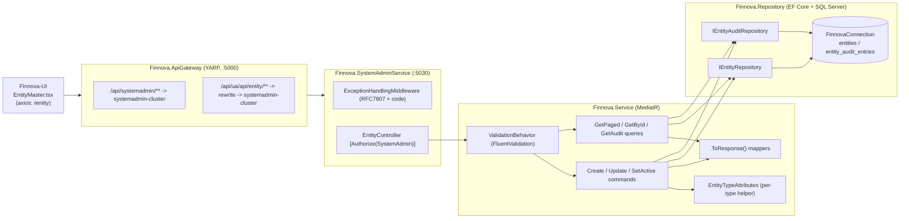

# Design Document — Entity Master Management

**JIRA:** FINNOVA-11 · **Module:** SystemAdmin · **Master:** Entity
**Related features:** Nationality Master (FINNOVA-9), Document Number Control Master (FINNOVA-7), and Court Master (FINNOVA-13) — this design mirrors their layered CQRS conventions. Entity Master is a **typed multi-category** master: one flat table spans five Entity Types (Dealer, DebtCollector, Insurer, Supplier, Employer), each carrying common contact/registration attributes plus a small per-type attribute bag, with uniqueness scoped per type and an immutable audit trail.

## Overview

Entity Master is a master-data capability that lets a System Administrator maintain a catalog of external and internal parties used across the platform — Dealers, Debt Collectors, Insurers, Suppliers, and Employers. An entity carries a code, an English name, an Entity Type, an optional registration identifier, common contact attributes (contact person, email, phone, address line), a small per-type attribute bag, and an active flag. A System Administrator can create an entity of a given type, modify its editable attributes, search entities by code/name/registration identifier with pagination and an optional Entity Type filter, read a single entity, and deactivate/reactivate an entity. Every configuration change is captured in an immutable, entity-scoped audit trail. All operations — including reads — are SystemAdmin-only.

The feature is delivered as an API-only slice inside the **existing** `Finnova.SystemAdminService` host, reached through the **existing** `Finnova.ApiGateway`. The screen lives in `Finnova-UI`.

### What already exists and is reused (NOT re-established here)

| Concern | Existing asset | Reuse |
| --- | --- | --- |
| Host | `Finnova.SystemAdminService` (:5030), `public partial class Program {}` shim | Add `EntityController`; no new host |
| AuthN | JWT Bearer (`RoleClaimType = ClaimTypes.Role`) | Reused as-is |
| AuthZ | `SystemAdmin` policy = `RequireRole("SystemAdmin")` | Applied to every Entity endpoint |
| Mediation | MediatR + `Finnova.Service.Behaviors.ValidationBehavior<,>` | New commands/queries flow through it |
| Errors | `ExceptionHandlingMiddleware` → RFC 7807 `ProblemDetails` + `code` extension | **Extended** with an Entity branch |
| Persistence | `AddFinnovaRepository` → EF Core + SQL Server, `FinnovaConnection` | Two new repositories + DbSets registered here |
| Gateway | `systemadmin-route` + UI-alias routes for lookup/nationality/orghierarchy/dcn/court | **Add** an `entity` UI-alias route |
| JSON | Host registers `JsonStringEnumConverter` (added in FINNOVA-7) | Entity Type enum serializes/binds as its string name |
| Contracts | `Finnova.Models`, `IRepository<T>`/`RepositoryBase<T>`, `PaginatedResponse<T>`, `.ToResponse()` | Followed exactly |
| Tests | xUnit + FsCheck.Xunit v2 + `WebApplicationFactory<Program>` in `Finnova.Tests` | Extended with Entity suites |

### What is new (designed here)

- An `EntityMaster` entity (class name `EntityMaster`, table `entities`) and an `EntityAuditEntry` entity + repositories + tables.
- Enums `EntityType { Dealer, DebtCollector, Insurer, Supplier, Employer }` and `EntityAuditAction { Create, Update }`.
- A pure domain helper `EntityTypeAttributes` that resolves and validates the per-type attribute keys applicable to each Entity Type.
- New domain exceptions (`EntityNotFoundException`, `EntityDuplicateCodeException`, `EntityInvalidAttributesException`) plus an extension to `ExceptionHandlingMiddleware` mapping them to `ERR-ENT-xxx` codes.
- `EntityController` with paged search (with Entity Type filter), single read, create, update, activate, deactivate, and audit-trail read.
- The `Finnova-UI` Entity Master screen (React + MUI), mirroring `NationalityMaster`/`CourtMaster` with an added Entity Type filter and dynamic per-type attribute fields.

### Localization

India-only, English-only. One English `Name`; single plain display/contact fields. Per-type attributes and the registration identifier use India-relevant identifiers (GSTIN, IRDAI registration, PAN-style). No bilingual fields, no Arabic content, no RTL.

## Requirements Coverage Map

| Requirement | Covered by |
| --- | --- |
| R1 Create entity (defaults, validation, type, per-type attributes) | `CreateEntityCommand` (+validator, handler), `EntityController.Create`, `EntityMaster` entity, `EntityTypeAttributes` per-type validation, audit-on-create |
| R2 Duplicate code per type + immutability + validation-before-duplicate | `ExistsByCodeAsync(code, type, excludeId)` + composite unique index `(EntityType, Code)`; `EntityDuplicateCodeException` ("Entity code must be unique per entity type"); Code + EntityType not in update contract; validator runs before handler duplicate check |
| R3 Query/search/read (+ Entity Type filter) | `GetEntitiesPagedQuery`, `GetEntityByIdQuery` (+validators, handlers), `GetPagedAsync(searchTerm, entityType?, page, pageSize)`, `PaginatedResponse<EntityResponse>` |
| R4 Modify entity (editable-only, per-type attribute validation, no-op) | `UpdateEntityCommand` (+validator, handler), `EntityTypeAttributes` validation, no-op detection, audit-on-update |
| R5 Audit trail (create/update, immutable, ordering, rollback) | `EntityAuditEntry` entity/repo, `GetEntityAuditTrailQuery`, audit in same unit of work (R5.8 rollback) |
| R6 Deactivate/reactivate (soft) | `SetEntityActiveCommand` (+handler), audit-on-toggle |
| R7 AuthN/AuthZ | `[Authorize(Policy="SystemAdmin")]` on all endpoints; 401-before-403 via middleware order |

## Architecture

Vertical slice through the platform's four layers. Requests enter through the gateway, are authenticated/authorized at the host, dispatched via MediatR (with the validation pipeline), and executed by handlers over the repository layer.



### Request lifecycle (cross-cutting)

`ExceptionHandlingMiddleware` runs first (outermost), then `UseAuthentication` → `UseAuthorization` → controller. This ordering guarantees a request that is both unauthenticated and lacking the role is rejected with **401** before authorization evaluates to 403 (R7.4). MediatR's `ValidationBehavior` runs FluentValidation before each handler; a failure throws a validation exception mapped to 400. Per-type attribute applicability, duplicate-code (per type), and not-found are enforced in the handler and raised as typed exceptions.

## Data Models

Two new entities in `Finnova.Models/Domain/Entities`; two enums in `Finnova.Models/Domain/Enums`. `nvarchar` columns, consistent with the platform.

### `EntityMaster` entity

The class is named **`EntityMaster`** (not `Entity`) to avoid collisions with `System.Object`-adjacent names, EF conventions, and the `Finnova.Service/Entity` service namespace. It maps to the **`entities`** table via `ToTable("entities")`.

```csharp
using Finnova.Models.Domain.Enums;

namespace Finnova.Models.Domain.Entities;

public class EntityMaster
{
    public Guid Id { get; set; } = Guid.NewGuid();
    public string Code { get; set; } = string.Empty;             // max 20, unique per EntityType (CI, trimmed)
    public string Name { get; set; } = string.Empty;             // max 200, English
    public EntityType EntityType { get; set; }                   // Dealer/DebtCollector/Insurer/Supplier/Employer
    public string? RegistrationIdentifier { get; set; }          // max 50, optional (GST/PAN-style)
    public string? ContactPerson { get; set; }                   // max 100, optional
    public string? Email { get; set; }                           // max 100, optional
    public string? Phone { get; set; }                           // max 20, optional
    public string? AddressLine { get; set; }                     // max 200, optional
    public string? Attributes { get; set; }                      // max 2000, JSON bag of per-type attributes
    public bool IsActive { get; set; } = true;                   // default true
    public DateTime CreatedAt { get; set; } = DateTime.UtcNow;
    public DateTime UpdatedAt { get; set; } = DateTime.UtcNow;
}
```

Per-type attributes are stored as a single nullable JSON document in the `Attributes` column (a small `{ "key": "value" }` bag), not as per-type columns or per-type child tables. This keeps one flat table across the five categories. The applicable keys for each Entity Type are resolved and validated by the `EntityTypeAttributes` domain helper (see Components and Interfaces), which rejects any attribute key that is not applicable to the submitted Entity Type (R1.6, R4.3).

### `EntityAuditEntry` entity

Multi-field editable surface, so before/after is captured as a compact JSON snapshot plus a human-readable summary (same shape as Court/DCN audit).

```csharp
using Finnova.Models.Domain.Enums;

namespace Finnova.Models.Domain.Entities;

public class EntityAuditEntry
{
    public Guid Id { get; set; } = Guid.NewGuid();
    public Guid EntityId { get; set; }
    public EntityAuditAction Action { get; set; }                // Create | Update
    public string? OldValues { get; set; }                       // JSON snapshot (null on Create)
    public string NewValues { get; set; } = string.Empty;        // JSON snapshot of resulting fields
    public string Summary { get; set; } = string.Empty;          // e.g. "Renamed; IsActive true->false"
    public string ChangedBy { get; set; } = string.Empty;
    public DateTime ChangedAtUtc { get; set; } = DateTime.UtcNow;
}
```

### Enums

```csharp
namespace Finnova.Models.Domain.Enums;

public enum EntityType { Dealer = 0, DebtCollector = 1, Insurer = 2, Supplier = 3, Employer = 4 }

public enum EntityAuditAction { Create = 0, Update = 1 }
```

### EF Core configuration

Two `IEntityTypeConfiguration<T>` classes in `Finnova.Repository/Configuration`, auto-discovered by the existing `ApplyConfigurationsFromAssembly` call.

- `entities`: PK `Id`; `Code` required max 20; `Name` required max 200; `EntityType` required (int); `RegistrationIdentifier` nullable max 50; `ContactPerson`/`Email` nullable max 100; `Phone` nullable max 20; `AddressLine` nullable max 200; `Attributes` nullable max 2000; `IsActive` required; **composite unique index `(EntityType, Code)`** (CI collation backs case-insensitivity; handler trims) so a code is unique within a type but may recur across types (R2.1); index on `Name`. `ToTable("entities")`.
- `entity_audit_entries`: PK `Id`; `EntityId` required; `Action` required (int); `OldValues` nullable; `NewValues` required; `Summary` required max 400; `ChangedBy` required max 200; `ChangedAtUtc` required; composite index `(EntityId, ChangedAtUtc)`. No FK to `entities` (audit outlives edits; missing-id read returns empty). Immutability by omission (no update/delete path).

DbSets added to `FinnovaDbContext`:

```csharp
public DbSet<EntityMaster> Entities => Set<EntityMaster>();
public DbSet<EntityAuditEntry> EntityAuditEntries => Set<EntityAuditEntry>();
```

### Migration

```
dotnet ef migrations add AddEntityAndAudit --project Finnova.Repository --startup-project Finnova.SystemAdminService
```

## Contracts

Records under `Finnova.Models/Contracts/Entities`. Per-type attributes travel as a string→string dictionary; `Code` and `EntityType` are absent from the update contract (immutable, R2.3).

```csharp
public record CreateEntityRequest(
    string Code,
    string Name,
    EntityType EntityType,
    string? RegistrationIdentifier,
    string? ContactPerson,
    string? Email,
    string? Phone,
    string? AddressLine,
    IReadOnlyDictionary<string, string>? Attributes,
    bool? IsActive);

public record UpdateEntityRequest(
    string Name,
    string? RegistrationIdentifier,
    string? ContactPerson,
    string? Email,
    string? Phone,
    string? AddressLine,
    IReadOnlyDictionary<string, string>? Attributes,
    bool IsActive); // Code and EntityType immutable

public record EntityResponse(
    Guid Id,
    string Code,
    string Name,
    EntityType EntityType,
    string? RegistrationIdentifier,
    string? ContactPerson,
    string? Email,
    string? Phone,
    string? AddressLine,
    IReadOnlyDictionary<string, string> Attributes,
    bool IsActive,
    DateTime CreatedAt,
    DateTime UpdatedAt);

public record EntityAuditEntryResponse(
    Guid Id,
    Guid EntityId,
    string Action,
    string? OldValues,
    string NewValues,
    string Summary,
    string ChangedBy,
    DateTime ChangedAtUtc);
```

Paged search reuses `PaginatedResponse<EntityResponse>` (from `Finnova.Models.Contracts.Common`).

## Components and Interfaces

### Repository layer (`Finnova.Repository`)

```csharp
public interface IEntityRepository : IRepository<EntityMaster>
{
    // Search over Code/Name/RegistrationIdentifier (substring, CI; blank = no term). Optional EntityType filter.
    // Ordered Name asc, Code asc (R3.10).
    Task<(List<EntityMaster> Items, int Total)> GetPagedAsync(
        string? searchTerm, EntityType? entityType, int page, int pageSize, CancellationToken ct = default);

    // Case-insensitive, trimmed uniqueness check on Code WITHIN an EntityType (R2). excludeId supports future edits.
    Task<bool> ExistsByCodeAsync(string code, EntityType entityType, Guid? excludeId = null, CancellationToken ct = default);
}

public interface IEntityAuditRepository : IRepository<EntityAuditEntry>
{
    // Entries for an entity ordered ChangedAtUtc desc then Id desc (R5.5). Missing id -> empty (R5.6).
    Task<List<EntityAuditEntry>> GetByEntityIdAsync(Guid entityId, CancellationToken ct = default);
}
```

Implementations mirror `CourtRepository`/`NationalityRepository`: `GetPagedAsync` filters with `Contains` (CI collation) over Code/Name/RegistrationIdentifier, applies the optional `EntityType` equality filter, and orders `Name` then `Code`; `ExistsByCodeAsync` trims + `AnyAsync` scoped to the `EntityType`; audit `GetByEntityIdAsync` orders desc/desc. Registered in `AddFinnovaRepository`.

### Service layer (`Finnova.Service/Entity`)

CQRS slice mirroring `Finnova.Service/Court`. ActingAdmin resolved in the controller from the JWT and passed into commands. Two small helpers live in this slice:

- `EntityAuditSnapshot` — serializes the editable fields (including the per-type attribute bag) to JSON for the audit and builds the human-readable summary (mirrors `CourtAuditSnapshot`).
- `EntityTypeAttributes` — a **pure domain helper** that, given an `EntityType`, returns the set of applicable attribute keys and validates a submitted attribute bag against it, returning the inapplicable keys (if any). Modest per-type key lists (flagged as confirmation-needed assumptions):

  | Entity Type | Applicable attribute key(s) |
  | --- | --- |
  | Dealer | `dealerLicenseNo` |
  | DebtCollector | `agencyLicenseNo` |
  | Insurer | `irdaiRegistrationNo` |
  | Supplier | `gstin` |
  | Employer | `employerRegistrationNo` |

  Any submitted key outside the applicable set for the resolved Entity Type causes the command handler to raise `EntityInvalidAttributesException` (validation family, R1.6 / R4.3). India-only, English identifiers; no Arabic.

**Commands**
- `CreateEntityCommand(...) : IRequest<EntityResponse>` — validator: required Code/Name/EntityType + lengths (R1.3, R1.4), `EntityType` `IsInEnum` (R1.5). Handler: trim Code/Name; `EntityTypeAttributes` applicability check → `EntityInvalidAttributesException` (R1.6); `ExistsByCodeAsync(code, entityType)` → `EntityDuplicateCodeException` (R2.2); default `IsActive ?? true` (R1.2); persist entity + Create audit in one unit of work (R5.1, R5.8).
- `UpdateEntityCommand(...) : IRequest<EntityResponse>` — validator: required Name + lengths (Name 200, RegistrationIdentifier 50, contact 100) (R4.3). Handler: load-or-404 (R4.4); `EntityTypeAttributes` applicability check against the record's Entity Type (R4.3); no-op detection over editable fields after trimming (R4.5); else apply, refresh `UpdatedAt`, persist + Update audit with old/new JSON + summary in one unit of work (R4.1, R5.2, R5.8).
- `SetEntityActiveCommand(Guid Id, bool IsActive, string ActingAdmin) : IRequest<EntityResponse>` — load-or-404 (R6.4); no-op if already in target state (no audit, no timestamp refresh) (R6.3); else toggle, refresh `UpdatedAt`, audit as Update with IsActive old→new (R6.1/6.2, R5.3).

**Queries**
- `GetEntitiesPagedQuery(string? SearchTerm, EntityType? EntityType, int Page = 1, int PageSize = 20)` — validator: Page ≥ 1, PageSize ∈ [1,100] (R3.8), SearchTerm ≤ 200 after trim (R3.5), `EntityType` `IsInEnum` when supplied (R3.3). Handler → `GetPagedAsync`, `PaginatedResponse<EntityResponse>`.
- `GetEntityByIdQuery(Guid Id)` — load-or-404 (R3.12).
- `GetEntityAuditTrailQuery(Guid EntityId)` — `GetByEntityIdAsync`, missing id → `[]` (R5.6).

**Mapper** (`Finnova.Service/Mappers/EntityMapper.cs`) — static `.ToResponse()` for both entities. Deserializes the `Attributes` JSON column into the response dictionary (empty dictionary when null); projects `Action` to its enum name.

### API layer (`Finnova.SystemAdminService/Controllers/EntityController.cs`)

`[ApiController]`, `[Route("api/entity")]`, every action `[Authorize(Policy = "SystemAdmin")]`. ActingAdmin from `User` claims (`NameIdentifier`/`sub` → `Name`).

| Method | Route | Body / Query | Success | Reqs |
| --- | --- | --- | --- | --- |
| GET | `api/entity` | `?search=&entityType=&page=1&pageSize=20` | 200 `PaginatedResponse<EntityResponse>` | R3.1–R3.11 |
| GET | `api/entity/{id:guid}` | — | 200 `EntityResponse` | R3.12 |
| POST | `api/entity` | `CreateEntityRequest` | 201 `EntityResponse` | R1, R2 |
| PUT | `api/entity/{id:guid}` | `UpdateEntityRequest` | 200 `EntityResponse` | R4 |
| POST | `api/entity/{id:guid}/activate` | — | 200 `EntityResponse` | R6.2 |
| POST | `api/entity/{id:guid}/deactivate` | — | 200 `EntityResponse` | R6.1 |
| GET | `api/entity/{id:guid}/audit` | — | 200 `List<EntityAuditEntryResponse>` | R5.5/5.6 |

`Create` returns `CreatedAtAction(nameof(GetById), new { id = result.Id }, result)`.

## Error Handling

Extend the existing `ExceptionHandlingMiddleware` with an **Entity branch** (typed) and add the Entity path to the path-scoped validation/fallback code family:

```csharp
var isEntity = ctx.Request.Path.StartsWithSegments("/api/entity", StringComparison.OrdinalIgnoreCase);
// validationCode/fallbackCode: ERR-ENT-400 / ERR-ENT-500 when isEntity (extend the existing chain).

EntityNotFoundException => (404, "ERR-ENT-404", ex.Message),
EntityDuplicateCodeException => (409, "ERR-ENT-409", ex.Message),
// EntityInvalidAttributesException flows through the validation family -> 400 ERR-ENT-400.
```

| Condition | HTTP | code | Reqs |
| --- | --- | --- | --- |
| Entity not found (update/read/audit/toggle) | 404 | ERR-ENT-404 | R3.12, R4.4, R6.4 |
| Duplicate code within type | 409 | ERR-ENT-409 | R2.2 |
| Required/length/enum, inapplicable per-type attributes, bad page range, bad type filter | 400 | ERR-ENT-400 | R1.3–R1.6, R4.3, R3.3, R3.5, R3.8 |
| Missing/expired/invalid token | 401 | (auth) | R7.1 |
| Authenticated non-admin | 403 | (auth) | R7.2 |

Rejected create/update writes no record and no audit (R5.4). No-op update/toggle writes no audit (R4.5, R6.3). Audit read for a missing id returns 200 `[]` (R5.6). If audit persistence fails after the entity change would otherwise commit, the shared unit of work rolls back so neither the entity change nor the audit is persisted, and the request returns 500 `ERR-ENT-500` (R5.8).

## Security & Authentication Flow

No new auth infrastructure. All seven endpoints carry `[Authorize(Policy = "SystemAdmin")]`. Middleware order enforces 401-before-403 (R7.4), treating a token as expired at or after its exact expiry instant with no clock-skew tolerance. `ChangedBy` derives from the validated principal, not request input. No entity reference data is disclosed on a 401/403 response (R7.1/R7.2).

## Design Decisions & Tradeoffs

1. **Reuse the SystemAdmin host.** Entity is a SystemAdmin master; adding a controller keeps host separation and reuses auth/validation/ProblemDetails wiring.
2. **Class named `EntityMaster`, table `entities`.** The domain word "Entity" collides with EF/framework conventions and the `Finnova.Service/Entity` service namespace; the class is `EntityMaster` mapped `ToTable("entities")` so the storage name stays natural while the type name stays unambiguous.
3. **Per-type attributes as a single JSON column, validated by a domain helper.** Rather than per-type columns or per-type child tables, all five categories share one flat `entities` table; the small per-type attribute bag lives in a nullable `Attributes` JSON document. `EntityTypeAttributes` (pure) resolves which keys are applicable to each Entity Type and rejects inapplicable keys (R1.6, R4.3). This keeps the schema and the CRUD surface uniform across categories while still enforcing type-specific applicability. Tradeoff: attribute values are not individually column-indexed; acceptable for a modest admin catalog.
4. **Uniqueness scoped per Entity Type.** The unique index is composite `(EntityType, Code)`, and `ExistsByCodeAsync` takes the `EntityType`, so the same code may recur across types but is unique within a type (R2.1). Duplicate message: "Entity code must be unique per entity type".
5. **Code and Entity Type immutable after create; only Name/RegistrationIdentifier/contact/per-type attributes/IsActive editable** (R4.2). `ExistsByCodeAsync` keeps an `excludeId` for a future rename-code path.
6. **Config audit as JSON snapshot + summary**, not per-field columns — the editable surface (including the per-type bag) is multi-field; matches the Court/DCN audit approach. Entity change and audit share one unit of work so a failed audit rolls back the change (R5.8). Immutability by omission.
7. **Soft retire (deactivate), no hard delete** — the ticket lists Create/Modify/Query only; deactivation preserves history; inactive entities remain queryable, distinguished by the flag (R6.5) (flagged for confirmation).
8. **Typed exceptions over message-sniffing** — `EntityNotFoundException` → 404, `EntityDuplicateCodeException` → 409, `EntityInvalidAttributesException` → validation 400; validation is path-scoped to `ERR-ENT-400`.
9. **Entity Type as an enum** serialized by name via the host's `JsonStringEnumConverter` (already registered), used both as a create field and as an optional query filter. New categories require a code change (flagged: could later be an admin-maintainable lookup).
10. **Gateway UI-alias** `/api/ua/api/entity/**` mirrors the existing aliases so the UI keeps one axios base URL.
11. **English-only single `Name`** and India-relevant identifiers (GSTIN/IRDAI/PAN-style) per product-context.

### Confirmation-flagged assumptions
- Length bounds (Code 20, Name 200, RegistrationIdentifier 50, contact fields 100, Phone 20, Attributes JSON 2000, search term 200).
- Per-type attribute key lists (Dealer `dealerLicenseNo`; DebtCollector `agencyLicenseNo`; Insurer `irdaiRegistrationNo`; Supplier `gstin`; Employer `employerRegistrationNo`) — modest starting set, to be confirmed.
- Uniqueness scoped per Entity Type (not global).
- Entity Type is a fixed enum (not an admin-maintainable lookup).
- Registration Identifier is single optional free-text (no external registry validation).
- Create and toggle are audited in addition to updates.
- Soft-retire only (no hard delete).

## Correctness Properties

*A property is a characteristic or behavior that should hold true across all valid executions of a system — essentially, a formal statement about what the system should do. Properties serve as the bridge between human-readable specifications and machine-verifiable correctness guarantees.*

These properties target the pure/domain logic of the Entity slice (per-type attribute applicability, per-type uniqueness, search/ordering, no-op detection, audit recording) exercised over an in-memory repository. Infrastructure concerns (concurrency uniqueness R2.6, transactional rollback R5.8, and all of R7 authentication/authorization) are verified by integration/smoke tests instead (see Testing Strategy), not by property tests.

### Property 1: Create round-trip with IsActive default

*For any* valid create request, after creation the query results contain exactly one additional entity whose stored Code and Name equal the trimmed inputs and whose Entity Type equals the request; and when the request omits Is Active, the stored Is Active is true.

**Validates: Requirements 1.1, 1.2, 1.7, 3.12**

### Property 2: Per-type attribute applicability

*For any* Entity Type and any attribute bag, a create or update is accepted (with respect to attributes) if and only if every key in the bag belongs to that Entity Type's applicable key set; a bag containing any inapplicable key is rejected with a validation error naming the inapplicable keys and persists nothing.

**Validates: Requirements 1.6, 4.3**

### Property 3: Per-type code uniqueness

*For any* Entity Code and any two distinct Entity Types, the same code may be persisted once under each type; and *for any* existing entity, a create whose code equals that entity's code after trimming and case-insensitive comparison within the same Entity Type is rejected with the message "Entity code must be unique per entity type", creates no record, and leaves the existing record unchanged.

**Validates: Requirements 2.1, 2.2**

### Property 4: Invalid input is rejected leaving store and audit unchanged

*For any* create or update request that is invalid (missing/whitespace required field, an over-length field, or — for create — an out-of-enum Entity Type), the request is rejected with a validation error identifying the offending field(s), the set of persisted entities is unchanged, and the count of persisted audit entries is unchanged; and when a request is both invalid and duplicate, the reported error is the validation error rather than the duplicate conflict.

**Validates: Requirements 1.3, 1.4, 2.4, 2.5, 5.4**

### Property 5: Search matches substring across fields within the type filter

*For any* store, search term, and optional Entity Type filter, every returned entity contains the trimmed term as a case-insensitive substring of its Code, Name, or Registration Identifier and matches the applied Entity Type filter; and a whitespace-only or empty term yields the same result set as no term for the same filter and paging.

**Validates: Requirements 3.1, 3.2, 3.4**

### Property 6: Results are ordered by Name then Code ascending

*For any* store, query, and filter, the returned page items are ordered non-decreasing by Name ascending and, for equal Names, by Code ascending.

**Validates: Requirements 3.10**

### Property 7: Pagination beyond the last page yields empty items with correct total

*For any* store and any page number beyond the last available page, the response contains an empty item collection while reporting the correct total count and echoing the requested page number and applied page size.

**Validates: Requirements 3.9**

### Property 8: Inactive entities remain queryable

*For any* store containing inactive entities, an unfiltered query returns those inactive entities, distinguished by their Is Active flag.

**Validates: Requirements 6.5**

### Property 9: Update no-op is idempotent

*For any* existing entity, submitting an update whose editable values equal the record's current values (after trimming Name and Registration Identifier) leaves the record unchanged, refreshes no timestamp, and records no audit entry.

**Validates: Requirements 4.5**

### Property 10: A real update persists changes and records exactly one Update audit

*For any* existing entity and any valid update that changes at least one editable value, the changes are persisted, UpdatedAt advances to the current UTC instant, exactly one Update audit entry is recorded capturing the before/after values of the changed fields, and the updated entity is returned.

**Validates: Requirements 4.1, 5.2**

### Property 11: Toggling active state records an Update audit

*For any* existing entity whose Is Active differs from the requested value, applying the toggle sets Is Active to the requested value, refreshes UpdatedAt, and records exactly one Update audit entry capturing the prior and new Is Active values.

**Validates: Requirements 6.1, 6.2, 5.3**

### Property 12: Toggling to the current state is idempotent

*For any* existing entity, setting Is Active to its current value is a successful no-op that leaves the record unchanged, refreshes no timestamp, and records no audit entry.

**Validates: Requirements 6.3**

### Property 13: Operations on a missing entity return not-found without side effects

*For any* identifier not present in the store, an update, activate/deactivate, or single read returns a not-found error and makes no change to the store or the audit trail.

**Validates: Requirements 3.12, 4.4, 6.4**

### Property 14: Create records exactly one Create audit

*For any* valid create, exactly one audit entry with the Create action is recorded, its New Values snapshot reflects the resulting configuration, and its change timestamp is expressed in UTC.

**Validates: Requirements 5.1**

### Property 15: Audit trail is ordered newest-first deterministically

*For any* entity's audit entries, the returned trail is ordered by change timestamp descending and, for entries sharing an identical timestamp, by audit entry identifier descending, with all timestamps expressed in UTC.

**Validates: Requirements 5.5**

## Testing Strategy

**Dual approach.** Property-based tests (FsCheck.Xunit, ≥100 iterations each) verify the universal properties above over an in-memory `IEntityRepository`/`IEntityAuditRepository`; example-based xUnit facts/theories verify specific shapes and boundaries; `WebApplicationFactory<Program>` integration tests verify host wiring, authorization, transactional rollback, and end-to-end flows. Tests live in `Finnova.Tests`, run with `dotnet test`.

**Property tests (backend).** One property-based test per property in the Correctness Properties section, each tagged:

```
// Feature: entity-master-management, Property {number}: {property_text}
```

Use FsCheck generators for entities, per-type attribute bags (both applicable and inapplicable keys), whitespace/over-length strings, out-of-enum Entity Type ints, and search terms. Do not implement property-based testing from scratch — use FsCheck.Xunit.

**Example / edge-case tests (backend).**
- Out-of-enum Entity Type on create and on the query filter → 400 (R1.5, R3.3).
- Search term > 200 after trim → 400 (R3.5).
- Page < 1, pageSize < 1, pageSize > 100 → 400 (R3.8).
- Default page 1 / pageSize 20 when omitted (R3.7).
- No-match search → empty items, total 0, totalPages 0, echoed page/pageSize (R3.11).
- Malformed id route → validation error (R3.13).
- Paginated response carries items/total/page/pageSize/totalPages (R3.6).
- Audit read for a missing id → 200 `[]` (R5.6).
- Audit entries expose no update/delete path — structural immutability (R5.7).
- Update contract omits Code and EntityType — structural immutability (R2.3, R4.2).

**Integration / smoke tests (backend).**
- Concurrency: parallel creates of the same code+type → exactly one persists, others get `ERR-ENT-409` (R2.6).
- Rollback: injected audit-write failure after an entity change → neither the change nor the audit persists; 500 `ERR-ENT-500` (R5.8).
- AuthN/AuthZ via `WebApplicationFactory<Program>`: no/expired/malformed token → 401; non-admin token → 403; valid SystemAdmin token → 2xx; both-failing request → 401 not 403; token at exact expiry → 401 (R7.1–R7.4).
- Smoke: host boots with the shared FINNOVA-8 JWT scheme and `SystemAdmin` policy (R7.5).

**Frontend tests (Finnova-UI).** Vitest + React Testing Library (jsdom): `entity.mock.test.ts` (per-type validation, per-type unique code, `ERR-ENT-4xx` errors, ordering, pagination, audit append on create/update/toggle but not no-op, India-only English seeds across all five types), `entity.real.test.ts` (axios path composition against a mocked `api`), and `EntityMaster.test.tsx` (rendering, search + Entity Type filter, Add/Edit/Audit dialogs including dynamic per-type attribute fields, activate/deactivate, success/error paths). No RxJS marble tests, no Redux store tests.

## Frontend Design (Finnova-UI)

React 18 + TS + MUI + Vite; hooks + Context; **no Redux/RxJS**; Vitest + RTL. Mirrors the **Nationality/Court masters**, adding an Entity Type filter and dynamic per-type attribute fields. Namespace **`entity` / `Entity`**, route **`/entities`**, service `basePath = '/entity'`. No new npm dependency (`@mui/x-data-grid` already installed). Entity Type renders as an MUI `Select` of the fixed string union; per-type attribute inputs are driven by the selected type.

- **Model** (`src/models/entity.model.ts`): `EntityType` string union (`'Dealer' | 'DebtCollector' | 'Insurer' | 'Supplier' | 'Employer'`); `Entity`, `EntityFormData`, `EntityUpdateData`, `EntityAuditEntry` interfaces; per-type attributes typed as `Record<string, string>`. A small map of applicable attribute keys per type drives the dynamic fields.
- **Service interface** (`src/services/interfaces/entity.interface.ts`): `IEntityService` (`getPaged`, `getById`, `create`, `update`, `setActive`, `getAuditTrail`) + `EntityQueryParams` (search, `entityType?`, page, pageSize).
- **Real service** (`src/services/real/entity.real.ts`): shared `api`, `basePath='/entity'`; paths `GET /entity` (with `entityType` query), `GET /entity/{id}`, `POST /entity`, `PUT /entity/{id}`, `POST /entity/{id}/activate|deactivate`, `GET /entity/{id}/audit`.
- **Mock service** (`src/services/mock/entity.mock.ts`): backend-shaped `ERR-ENT-4xx/409` errors; per-type code uniqueness (CI), per-type attribute applicability validation, enum/required/length validation, defaults, substring search over Code/Name/RegistrationIdentifier, Entity Type filter, `Name asc → Code asc` ordering, pagination, audit append on create/update/toggle (not on no-op); India-only English seeds for all five types (Dealer/DebtCollector/Insurer/Supplier/Employer with GSTIN/IRDAI/PAN-style values); `resetToSeed()`.
- **Toggle** (`src/services/entity.service.ts`) selecting mock vs real via `VITE_USE_MOCK_API` + barrels (`models/index.ts`, `services/interfaces/index.ts`, `services/index.ts`).
- **Page** (`src/pages/EntityMaster.tsx`): debounced search, Entity Type filter dropdown, grid, Add/Edit/Audit dialogs, activate/deactivate row action.
- **Components** (`src/components/entity/`): `EntityGrid.tsx`; `EntityAddDialog.tsx` (Entity Type `Select` + dynamic per-type attribute fields); `EntityEditDialog.tsx` (Code and Entity Type read-only); `EntityAuditDialog.tsx`.
- **Wiring**: route `/entities` in `App.tsx`; nav item "Entity Master" (e.g. `BusinessIcon`) in `Layout.tsx` Administration group.
- **Tests**: `entity.mock.test.ts`, `entity.real.test.ts`, `EntityMaster.test.tsx`.

## Implementation-Ordered Task List

Apply the tasks in `tasks.md` in this dependency order:

1. **Backend domain** — `EntityType` + `EntityAuditAction` enums; `EntityMaster` (`ToTable("entities")`) + `EntityAuditEntry` entities.
2. **Backend exceptions** — `EntityNotFoundException`, `EntityDuplicateCodeException`, `EntityInvalidAttributesException`.
3. **Backend contracts** — `CreateEntityRequest`, `UpdateEntityRequest`, `EntityResponse`, `EntityAuditEntryResponse`.
4. **Backend EF config + DbContext + migration** — `EntityConfiguration` (composite unique `(EntityType, Code)`), `EntityAuditEntryConfiguration`, DbSets, `AddEntityAndAudit` migration.
5. **Backend repositories + DI** — `IEntityRepository`/`EntityRepository` (with `EntityType` filter + per-type `ExistsByCodeAsync`), `IEntityAuditRepository`/`EntityAuditRepository`, DI registration.
6. **Backend domain helpers** — `EntityTypeAttributes` (per-type applicable-key resolution + validation); `EntityAuditSnapshot`.
7. **Backend service slice** — Create/Update/SetEntityActive commands (+validators, handlers); GetEntitiesPaged/GetById/GetAudit queries (+validators, handlers); `EntityMapper`.
8. **Backend controller + middleware + gateway** — `EntityController`; `ExceptionHandlingMiddleware` Entity branch + path-scoped code; gateway `entity` alias routes (`ua-entity-alias-route` + `ua-entity-alias-root`).
9. **Backend tests** — property tests (Properties 1–15 over in-memory repos), example/edge tests, integration tests (authorization, concurrency, rollback, E2E create/update/toggle/audit).
10. **Frontend model + services** — `entity.model.ts`; `entity.interface.ts`; `entity.real.ts`; `entity.mock.ts`; `entity.service.ts`; barrels.
11. **Frontend page + components + wiring + tests** — `EntityMaster.tsx`; `EntityGrid/EntityAddDialog/EntityEditDialog/EntityAuditDialog`; route in `App.tsx`; nav in `Layout.tsx`; `entity.mock.test.ts`, `entity.real.test.ts`, `EntityMaster.test.tsx`.
