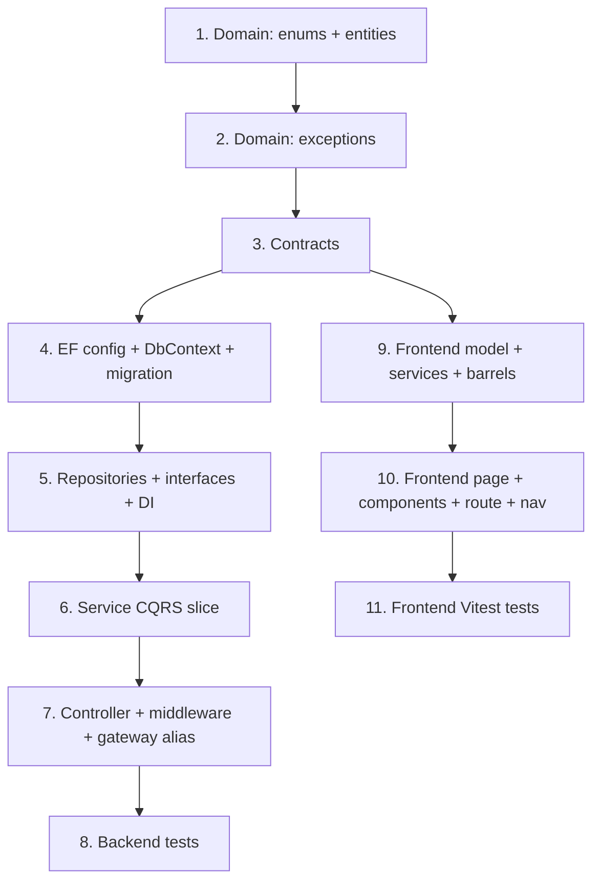

# Implementation Plan

## Overview

This plan implements Entity Master Management (FINNOVA-11) across the `Finnova.SystemAdminService`
backend (.NET) and the Finnova-UI frontend (React + TypeScript). It is a copy-paste plan: each task
is one step, presented in dependency order (backend domain → contracts → persistence → service →
API → tests, then the frontend model/services → page/components → tests). Copy-paste each task in
order. **CREATE** = new file (paste the whole block). **MODIFY** = edit an existing file (apply the
shown snippet at the indicated place). Backend root: `e:\Finnova\Finnova-API`. Frontend root:
`E:\Finnova\Finnova-UI\Finnova-UI`.

## Tasks

- [ ] 1. Backend domain: enums + entities
  - _Requirements: R1_

- [ ] 1.1 CREATE `Finnova.Models/Domain/Enums/EntityType.cs`

```csharp
namespace Finnova.Models.Domain.Enums;

/// <summary>The category of party an entity record represents (FINNOVA-11 R1.5).</summary>
public enum EntityType
{
    Dealer = 0,
    DebtCollector = 1,
    Insurer = 2,
    Supplier = 3,
    Employer = 4
}
```

- [ ] 1.2 CREATE `Finnova.Models/Domain/Enums/EntityAuditAction.cs`

```csharp
namespace Finnova.Models.Domain.Enums;

/// <summary>Discriminates the configuration mutation an audit entry records (FINNOVA-11 R5).</summary>
public enum EntityAuditAction
{
    Create = 0,
    Update = 1
}
```

- [ ] 1.3 CREATE `Finnova.Models/Domain/Entities/EntityMaster.cs`

```csharp
using Finnova.Models.Domain.Enums;

namespace Finnova.Models.Domain.Entities;

/// <summary>
/// A party in the Entity Master (FINNOVA-11) — Dealer / DebtCollector / Insurer / Supplier /
/// Employer. Flat, typed master: one table spans all five Entity Types, with a small per-type
/// attribute bag stored as JSON in <see cref="Attributes"/>. The class is named EntityMaster (not
/// Entity) to avoid clashing with EF conventions and the Finnova.Service/Entity namespace; it maps
/// to the "entities" table. India-only platform: one English Name and plain contact fields.
/// </summary>
public class EntityMaster
{
    public Guid Id { get; set; } = Guid.NewGuid();

    public string Code { get; set; } = string.Empty;             // max 20, unique per EntityType (CI, trimmed)
    public string Name { get; set; } = string.Empty;             // max 200, English
    public EntityType EntityType { get; set; }                   // Dealer/DebtCollector/Insurer/Supplier/Employer

    public string? RegistrationIdentifier { get; set; }          // max 50, optional (GST/PAN-style)
    public string? ContactPerson { get; set; }                   // max 100, optional
    public string? Email { get; set; }                           // max 100, optional
    public string? Phone { get; set; }                           // max 20, optional
    public string? AddressLine { get; set; }                     // max 200, optional
    public string? Attributes { get; set; }                      // max 2000, JSON bag of per-type attributes

    public bool IsActive { get; set; } = true;                   // default true (R1.2)

    public DateTime CreatedAt { get; set; } = DateTime.UtcNow;
    public DateTime UpdatedAt { get; set; } = DateTime.UtcNow;
}
```

- [ ] 1.4 CREATE `Finnova.Models/Domain/Entities/EntityAuditEntry.cs`

```csharp
using Finnova.Models.Domain.Enums;

namespace Finnova.Models.Domain.Entities;

/// <summary>
/// Immutable audit record capturing one configuration change to an entity (FINNOVA-11 R5). Written
/// on create and update (including activate/deactivate) within the same unit of work. Never updated
/// or deleted. The editable surface is multi-field (including the per-type attribute bag), so
/// before/after is captured as a compact JSON snapshot plus a human-readable summary.
/// </summary>
public class EntityAuditEntry
{
    public Guid Id { get; set; } = Guid.NewGuid();

    public Guid EntityId { get; set; }
    public EntityAuditAction Action { get; set; }                // Create | Update

    public string? OldValues { get; set; }                       // JSON snapshot of changed fields (null on Create)
    public string NewValues { get; set; } = string.Empty;        // JSON snapshot of resulting fields
    public string Summary { get; set; } = string.Empty;          // human-readable change summary

    public string ChangedBy { get; set; } = string.Empty;        // acting admin id from JWT
    public DateTime ChangedAtUtc { get; set; } = DateTime.UtcNow;
}
```

---

- [ ] 2. Backend domain: exceptions
  - _Requirements: R2, R4_

- [ ] 2.1 CREATE `Finnova.Models/Domain/Exceptions/EntityNotFoundException.cs`

```csharp
namespace Finnova.Models.Domain.Exceptions;

/// <summary>Thrown when an operation targets an entity that does not exist. Maps to ERR-ENT-404.</summary>
public class EntityNotFoundException : Exception
{
    public EntityNotFoundException(Guid id)
        : base($"Entity '{id}' was not found.")
    {
    }
}
```

- [ ] 2.2 CREATE `Finnova.Models/Domain/Exceptions/EntityDuplicateCodeException.cs`

```csharp
namespace Finnova.Models.Domain.Exceptions;

/// <summary>
/// Thrown when an entity create is attempted with a code that already exists within the same
/// Entity Type. Maps to ERR-ENT-409.
/// </summary>
public class EntityDuplicateCodeException : Exception
{
    public const string ErrorCode = "ERR-ENT-409";

    public EntityDuplicateCodeException()
        : base("Entity code must be unique per entity type")
    {
    }
}
```

- [ ] 2.3 CREATE `Finnova.Models/Domain/Exceptions/EntityInvalidAttributesException.cs`

```csharp
namespace Finnova.Models.Domain.Exceptions;

/// <summary>
/// Thrown when a create/update supplies per-type attribute keys that are not applicable to the
/// entity's Entity Type (R1.6, R4.3). Flows through the validation family -> 400 ERR-ENT-400.
/// </summary>
public class EntityInvalidAttributesException : Exception
{
    public EntityInvalidAttributesException(IEnumerable<string> inapplicableKeys)
        : base($"The following attributes are not applicable to this entity type: {string.Join(", ", inapplicableKeys)}")
    {
    }
}
```

---

- [ ] 3. Backend contracts (request/response records)
  - _Requirements: R1, R3, R4, R5_

- [ ] 3.1 CREATE `Finnova.Models/Contracts/Entities/CreateEntityRequest.cs`

```csharp
using Finnova.Models.Domain.Enums;

namespace Finnova.Models.Contracts.Entities;

/// <summary>Request to create an entity. IsActive is nullable so the service defaults it to true (R1.2).</summary>
public record CreateEntityRequest(
    string Code,
    string Name,
    EntityType EntityType,
    string? RegistrationIdentifier,
    string? ContactPerson,
    string? Email,
    string? Phone,
    string? AddressLine,
    IReadOnlyDictionary<string, string>? Attributes,
    bool? IsActive);
```

- [ ] 3.2 CREATE `Finnova.Models/Contracts/Entities/UpdateEntityRequest.cs`

```csharp
namespace Finnova.Models.Contracts.Entities;

/// <summary>
/// Request to update an entity's editable fields. Code and EntityType are immutable after creation
/// (R2.3, R4.2) and are therefore absent from this contract.
/// </summary>
public record UpdateEntityRequest(
    string Name,
    string? RegistrationIdentifier,
    string? ContactPerson,
    string? Email,
    string? Phone,
    string? AddressLine,
    IReadOnlyDictionary<string, string>? Attributes,
    bool IsActive);
```

- [ ] 3.3 CREATE `Finnova.Models/Contracts/Entities/EntityResponse.cs`

```csharp
using Finnova.Models.Domain.Enums;

namespace Finnova.Models.Contracts.Entities;

public record EntityResponse(
    Guid Id,
    string Code,
    string Name,
    EntityType EntityType,
    string? RegistrationIdentifier,
    string? ContactPerson,
    string? Email,
    string? Phone,
    string? AddressLine,
    IReadOnlyDictionary<string, string> Attributes,
    bool IsActive,
    DateTime CreatedAt,
    DateTime UpdatedAt);
```

- [ ] 3.4 CREATE `Finnova.Models/Contracts/Entities/EntityAuditEntryResponse.cs`

```csharp
namespace Finnova.Models.Contracts.Entities;

public record EntityAuditEntryResponse(
    Guid Id,
    Guid EntityId,
    string Action,          // "Create" | "Update"
    string? OldValues,
    string NewValues,
    string Summary,
    string ChangedBy,
    DateTime ChangedAtUtc);
```

---

- [ ] 4. Backend EF configuration + DbContext + migration
  - _Requirements: R2, R3, R5_

- [ ] 4.1 CREATE `Finnova.Repository/Configuration/EntityConfiguration.cs`

```csharp
using Microsoft.EntityFrameworkCore;
using Microsoft.EntityFrameworkCore.Metadata.Builders;
using Finnova.Models.Domain.Entities;

namespace Finnova.Repository.Configuration;

public class EntityConfiguration : IEntityTypeConfiguration<EntityMaster>
{
    public void Configure(EntityTypeBuilder<EntityMaster> builder)
    {
        builder.ToTable("entities");
        builder.HasKey(x => x.Id);
        builder.Property(x => x.Code).IsRequired().HasMaxLength(20);
        builder.Property(x => x.Name).IsRequired().HasMaxLength(200);
        builder.Property(x => x.EntityType).IsRequired();               // stored as int
        builder.Property(x => x.RegistrationIdentifier).HasMaxLength(50);
        builder.Property(x => x.ContactPerson).HasMaxLength(100);
        builder.Property(x => x.Email).HasMaxLength(100);
        builder.Property(x => x.Phone).HasMaxLength(20);
        builder.Property(x => x.AddressLine).HasMaxLength(200);
        builder.Property(x => x.Attributes).HasMaxLength(2000);        // nullable JSON bag
        builder.Property(x => x.IsActive).IsRequired();

        // Code uniqueness scoped per Entity Type (R2.1/2.2): the same code may recur across types
        // but is unique within a type. Default CI collation backs the case-insensitive rule; codes
        // are trimmed by the handler so stored values are canonical.
        builder.HasIndex(x => new { x.EntityType, x.Code }).IsUnique();
        // Query/order by Name (R3.10).
        builder.HasIndex(x => x.Name);
    }
}
```

- [ ] 4.2 CREATE `Finnova.Repository/Configuration/EntityAuditEntryConfiguration.cs`

```csharp
using Microsoft.EntityFrameworkCore;
using Microsoft.EntityFrameworkCore.Metadata.Builders;
using Finnova.Models.Domain.Entities;

namespace Finnova.Repository.Configuration;

public class EntityAuditEntryConfiguration : IEntityTypeConfiguration<EntityAuditEntry>
{
    public void Configure(EntityTypeBuilder<EntityAuditEntry> builder)
    {
        builder.ToTable("entity_audit_entries");
        builder.HasKey(x => x.Id);
        builder.Property(x => x.EntityId).IsRequired();
        builder.Property(x => x.Action).IsRequired();          // stored as int
        builder.Property(x => x.OldValues);                    // nullable JSON text
        builder.Property(x => x.NewValues).IsRequired();
        builder.Property(x => x.Summary).IsRequired().HasMaxLength(400);
        builder.Property(x => x.ChangedBy).IsRequired().HasMaxLength(200);
        builder.Property(x => x.ChangedAtUtc).IsRequired();
        // Read path: entries for an entity ordered by time desc then id desc (R5.5). No FK to
        // entities (audit outlives edits; missing-id read returns empty).
        builder.HasIndex(x => new { x.EntityId, x.ChangedAtUtc });
    }
}
```

- [ ] 4.3 MODIFY `Finnova.Repository/Context/FinnovaDbContext.cs`

Add these two DbSets alongside the existing ones (e.g. after the `Court` DbSets):

```csharp
public DbSet<EntityMaster> Entities => Set<EntityMaster>();
public DbSet<EntityAuditEntry> EntityAuditEntries => Set<EntityAuditEntry>();
```

- [ ] 4.4 Migration command (run from `e:\Finnova\Finnova-API`)

```
dotnet ef migrations add AddEntityAndAudit --project Finnova.Repository --startup-project Finnova.SystemAdminService
```

---

- [ ] 5. Backend repositories + interfaces + DI registration
  - _Requirements: R2, R3, R5_

- [ ] 5.1 CREATE `Finnova.Repository/Interfaces/IEntityRepository.cs`

```csharp
using Finnova.Models.Domain.Entities;
using Finnova.Models.Domain.Enums;

namespace Finnova.Repository.Interfaces;

public interface IEntityRepository : IRepository<EntityMaster>
{
    /// <summary>
    /// Paged search over Code / Name / RegistrationIdentifier (substring, case-insensitive; blank
    /// term = no filter), with an optional EntityType equality filter. Ordered by Name asc, then
    /// Code asc (R3.10). Returns the page and the total count.
    /// </summary>
    Task<(List<EntityMaster> Items, int Total)> GetPagedAsync(
        string? searchTerm, EntityType? entityType, int page, int pageSize, CancellationToken ct = default);

    /// <summary>
    /// Case-insensitive, trimmed uniqueness check on Code WITHIN an EntityType (R2.1/2.2).
    /// excludeId supports a future rename-code path.
    /// </summary>
    Task<bool> ExistsByCodeAsync(string code, EntityType entityType, Guid? excludeId = null, CancellationToken ct = default);
}
```

- [ ] 5.2 CREATE `Finnova.Repository/Interfaces/IEntityAuditRepository.cs`

```csharp
using Finnova.Models.Domain.Entities;

namespace Finnova.Repository.Interfaces;

public interface IEntityAuditRepository : IRepository<EntityAuditEntry>
{
    /// <summary>
    /// Audit entries for an entity, ordered ChangedAtUtc desc then Id desc (R5.5). Missing id
    /// yields an empty list (R5.6).
    /// </summary>
    Task<List<EntityAuditEntry>> GetByEntityIdAsync(Guid entityId, CancellationToken ct = default);
}
```

- [ ] 5.3 CREATE `Finnova.Repository/Repositories/EntityRepository.cs`

```csharp
using Finnova.Models.Domain.Entities;
using Finnova.Models.Domain.Enums;
using Finnova.Repository.Context;
using Finnova.Repository.Interfaces;
using Microsoft.EntityFrameworkCore;

namespace Finnova.Repository.Repositories;

public class EntityRepository(FinnovaDbContext finnovaDbContext)
    : RepositoryBase<EntityMaster>(finnovaDbContext), IEntityRepository
{
    public async Task<(List<EntityMaster> Items, int Total)> GetPagedAsync(
        string? searchTerm, EntityType? entityType, int page, int pageSize, CancellationToken ct = default)
    {
        var query = DbSet.AsNoTracking().AsQueryable();

        if (entityType is not null)
            query = query.Where(x => x.EntityType == entityType);

        if (!string.IsNullOrWhiteSpace(searchTerm))
        {
            var term = searchTerm.Trim();
            query = query.Where(x =>
                x.Code.Contains(term)
                || x.Name.Contains(term)
                || (x.RegistrationIdentifier != null && x.RegistrationIdentifier.Contains(term)));
        }

        var total = await query.CountAsync(ct);
        var items = await query
            .OrderBy(x => x.Name).ThenBy(x => x.Code)   // R3.10
            .Skip((page - 1) * pageSize).Take(pageSize)
            .ToListAsync(ct);
        return (items, total);
    }

    public async Task<bool> ExistsByCodeAsync(
        string code, EntityType entityType, Guid? excludeId = null, CancellationToken ct = default)
    {
        var c = code.Trim();
        return await DbSet.AsNoTracking().AnyAsync(
            x => x.EntityType == entityType && x.Code == c && (excludeId == null || x.Id != excludeId), ct);
    }
}
```

- [ ] 5.4 CREATE `Finnova.Repository/Repositories/EntityAuditRepository.cs`

```csharp
using Finnova.Models.Domain.Entities;
using Finnova.Repository.Context;
using Finnova.Repository.Interfaces;
using Microsoft.EntityFrameworkCore;

namespace Finnova.Repository.Repositories;

public class EntityAuditRepository(FinnovaDbContext finnovaDbContext)
    : RepositoryBase<EntityAuditEntry>(finnovaDbContext), IEntityAuditRepository
{
    public async Task<List<EntityAuditEntry>> GetByEntityIdAsync(Guid entityId, CancellationToken ct = default)
    {
        return await DbSet.AsNoTracking()
            .Where(x => x.EntityId == entityId)
            .OrderByDescending(x => x.ChangedAtUtc).ThenByDescending(x => x.Id)   // R5.5
            .ToListAsync(ct);   // empty when none (R5.6)
    }
}
```

- [ ] 5.5 MODIFY `Finnova.Repository/DependencyInjection.cs`

Add these registrations next to the other `AddScoped` repository lines (before `return services;`):

```csharp
services.AddScoped<IEntityRepository, EntityRepository>();
services.AddScoped<IEntityAuditRepository, EntityAuditRepository>();
```

---

- [ ] 6. Backend service CQRS slice (commands, queries, validators, mappers)
  - _Requirements: R1, R2, R3, R4, R5, R6_

- [ ] 6.1 CREATE `Finnova.Service/Entity/Internal/EntityTypeAttributes.cs`

```csharp
using System.Text.Json;
using Finnova.Models.Domain.Enums;

namespace Finnova.Service.Entity.Internal;

/// <summary>
/// Pure domain helper (FINNOVA-11 R1.6 / R4.3): resolves the per-type attribute keys applicable to
/// each Entity Type and validates a submitted attribute bag against them. India-only, English
/// identifiers (GSTIN / IRDAI / PAN-style); no external registry validation.
/// </summary>
public static class EntityTypeAttributes
{
    /// <summary>Applicable attribute keys per Entity Type (modest starting set; confirmation-flagged).</summary>
    public static readonly IReadOnlyDictionary<EntityType, IReadOnlySet<string>> Applicable =
        new Dictionary<EntityType, IReadOnlySet<string>>
        {
            [EntityType.Dealer] = new HashSet<string>(StringComparer.Ordinal) { "dealerLicenseNo" },
            [EntityType.DebtCollector] = new HashSet<string>(StringComparer.Ordinal) { "agencyLicenseNo" },
            [EntityType.Insurer] = new HashSet<string>(StringComparer.Ordinal) { "irdaiRegistrationNo" },
            [EntityType.Supplier] = new HashSet<string>(StringComparer.Ordinal) { "gstin" },
            [EntityType.Employer] = new HashSet<string>(StringComparer.Ordinal) { "employerRegistrationNo" },
        };

    private static readonly JsonSerializerOptions Options = new() { WriteIndented = false };

    /// <summary>
    /// Returns the keys in <paramref name="attributes"/> that are NOT applicable to
    /// <paramref name="type"/>. An empty result means every submitted key is applicable (or the bag
    /// is null/empty).
    /// </summary>
    public static IReadOnlyList<string> Validate(
        EntityType type, IReadOnlyDictionary<string, string>? attributes)
    {
        if (attributes is null || attributes.Count == 0)
            return Array.Empty<string>();

        var allowed = Applicable.TryGetValue(type, out var set) ? set : new HashSet<string>();
        return attributes.Keys.Where(k => !allowed.Contains(k)).ToList();
    }

    /// <summary>
    /// Normalizes a submitted attribute bag to compact JSON for storage, or null when empty.
    /// Keys/values are stored as supplied (values trimmed).
    /// </summary>
    public static string? Serialize(IReadOnlyDictionary<string, string>? attributes)
    {
        if (attributes is null || attributes.Count == 0)
            return null;

        var normalized = attributes.ToDictionary(kv => kv.Key, kv => kv.Value?.Trim() ?? string.Empty);
        return JsonSerializer.Serialize(normalized, Options);
    }

    /// <summary>Deserializes a stored JSON attribute bag into a dictionary (empty when null/blank).</summary>
    public static IReadOnlyDictionary<string, string> Deserialize(string? json)
    {
        if (string.IsNullOrWhiteSpace(json))
            return new Dictionary<string, string>();

        return JsonSerializer.Deserialize<Dictionary<string, string>>(json, Options)
               ?? new Dictionary<string, string>();
    }
}
```

- [ ] 6.2 CREATE `Finnova.Service/Entity/Internal/EntityAuditSnapshot.cs`

```csharp
using System.Text.Json;
using Finnova.Models.Domain.Entities;

namespace Finnova.Service.Entity.Internal;

/// <summary>Builds compact JSON snapshots of an entity's editable fields for audit entries (R5).</summary>
public static class EntityAuditSnapshot
{
    private static readonly JsonSerializerOptions Options = new() { WriteIndented = false };

    public static string Editable(EntityMaster e) => JsonSerializer.Serialize(new
    {
        e.Name,
        e.RegistrationIdentifier,
        e.ContactPerson,
        e.Email,
        e.Phone,
        e.AddressLine,
        Attributes = e.Attributes,   // stored JSON bag (or null)
        e.IsActive,
    }, Options);
}
```

- [ ] 6.3 CREATE `Finnova.Service/Entity/Commands/CreateEntity/CreateEntityCommand.cs`

```csharp
using Finnova.Models.Contracts.Entities;
using Finnova.Models.Domain.Enums;
using MediatR;

namespace Finnova.Service.Entity.Commands.CreateEntity;

public record CreateEntityCommand(
    string Code,
    string Name,
    EntityType EntityType,
    string? RegistrationIdentifier,
    string? ContactPerson,
    string? Email,
    string? Phone,
    string? AddressLine,
    IReadOnlyDictionary<string, string>? Attributes,
    bool? IsActive,
    string ActingAdmin) : IRequest<EntityResponse>;
```

- [ ] 6.4 CREATE `Finnova.Service/Entity/Commands/CreateEntity/CreateEntityCommandValidator.cs`

```csharp
using FluentValidation;

namespace Finnova.Service.Entity.Commands.CreateEntity;

public class CreateEntityCommandValidator : AbstractValidator<CreateEntityCommand>
{
    public CreateEntityCommandValidator()
    {
        RuleFor(x => x.Code)
            .NotEmpty().WithMessage("Entity code is required.")
            .MaximumLength(20).WithMessage("Entity code must not exceed 20 characters.");

        RuleFor(x => x.Name)
            .NotEmpty().WithMessage("Name is required.")
            .MaximumLength(200).WithMessage("Name must not exceed 200 characters.");

        RuleFor(x => x.EntityType).IsInEnum().WithMessage("Entity type is invalid.");

        RuleFor(x => x.RegistrationIdentifier)
            .MaximumLength(50).WithMessage("Registration identifier must not exceed 50 characters.");

        RuleFor(x => x.ContactPerson)
            .MaximumLength(100).WithMessage("Contact person must not exceed 100 characters.");

        RuleFor(x => x.Email)
            .MaximumLength(100).WithMessage("Email must not exceed 100 characters.");

        RuleFor(x => x.Phone)
            .MaximumLength(20).WithMessage("Phone must not exceed 20 characters.");

        RuleFor(x => x.AddressLine)
            .MaximumLength(200).WithMessage("Address line must not exceed 200 characters.");
    }
}
```

- [ ] 6.5 CREATE `Finnova.Service/Entity/Commands/CreateEntity/CreateEntityCommandHandler.cs`

```csharp
using Finnova.Models.Contracts.Entities;
using Finnova.Models.Domain.Entities;
using Finnova.Models.Domain.Enums;
using Finnova.Models.Domain.Exceptions;
using Finnova.Repository.Interfaces;
using Finnova.Service.Entity.Internal;
using Finnova.Service.Mappers;
using MediatR;

namespace Finnova.Service.Entity.Commands.CreateEntity;

public class CreateEntityCommandHandler : IRequestHandler<CreateEntityCommand, EntityResponse>
{
    private readonly IEntityRepository _repository;
    private readonly IEntityAuditRepository _auditRepository;

    public CreateEntityCommandHandler(IEntityRepository repository, IEntityAuditRepository auditRepository)
    {
        _repository = repository;
        _auditRepository = auditRepository;
    }

    public async Task<EntityResponse> Handle(CreateEntityCommand request, CancellationToken cancellationToken)
    {
        var code = request.Code.Trim();

        // Per-type attribute applicability (R1.6). Runs after FluentValidation, before duplicate check.
        var inapplicable = EntityTypeAttributes.Validate(request.EntityType, request.Attributes);
        if (inapplicable.Count > 0)
            throw new EntityInvalidAttributesException(inapplicable);

        if (await _repository.ExistsByCodeAsync(code, request.EntityType, null, cancellationToken))
            throw new EntityDuplicateCodeException();   // R2.2

        // Reference the entity by its full name to avoid clashing with the Finnova.Service.Entity namespace.
        var entity = new Finnova.Models.Domain.Entities.EntityMaster
        {
            Code = code,
            Name = request.Name.Trim(),
            EntityType = request.EntityType,
            RegistrationIdentifier = request.RegistrationIdentifier?.Trim(),
            ContactPerson = request.ContactPerson?.Trim(),
            Email = request.Email?.Trim(),
            Phone = request.Phone?.Trim(),
            AddressLine = request.AddressLine?.Trim(),
            Attributes = EntityTypeAttributes.Serialize(request.Attributes),
            IsActive = request.IsActive ?? true,   // R1.2
        };

        await _repository.AddAsync(entity, cancellationToken);

        await _auditRepository.AddAsync(new EntityAuditEntry
        {
            EntityId = entity.Id,
            Action = EntityAuditAction.Create,
            OldValues = null,
            NewValues = EntityAuditSnapshot.Editable(entity),
            Summary = $"Created {entity.EntityType} entity '{entity.Code}'.",
            ChangedBy = request.ActingAdmin,
            ChangedAtUtc = DateTime.UtcNow,
        }, cancellationToken);

        return entity.ToResponse();
    }
}
```

- [ ] 6.6 CREATE `Finnova.Service/Entity/Commands/UpdateEntity/UpdateEntityCommand.cs`

```csharp
using Finnova.Models.Contracts.Entities;
using MediatR;

namespace Finnova.Service.Entity.Commands.UpdateEntity;

public record UpdateEntityCommand(
    Guid Id,
    string Name,
    string? RegistrationIdentifier,
    string? ContactPerson,
    string? Email,
    string? Phone,
    string? AddressLine,
    IReadOnlyDictionary<string, string>? Attributes,
    bool IsActive,
    string ActingAdmin) : IRequest<EntityResponse>;
```

- [ ] 6.7 CREATE `Finnova.Service/Entity/Commands/UpdateEntity/UpdateEntityCommandValidator.cs`

```csharp
using FluentValidation;

namespace Finnova.Service.Entity.Commands.UpdateEntity;

public class UpdateEntityCommandValidator : AbstractValidator<UpdateEntityCommand>
{
    public UpdateEntityCommandValidator()
    {
        RuleFor(x => x.Id).NotEmpty().WithMessage("Id is required.");

        RuleFor(x => x.Name)
            .NotEmpty().WithMessage("Name is required.")
            .MaximumLength(200).WithMessage("Name must not exceed 200 characters.");

        RuleFor(x => x.RegistrationIdentifier)
            .MaximumLength(50).WithMessage("Registration identifier must not exceed 50 characters.");

        RuleFor(x => x.ContactPerson)
            .MaximumLength(100).WithMessage("Contact person must not exceed 100 characters.");

        RuleFor(x => x.Email)
            .MaximumLength(100).WithMessage("Email must not exceed 100 characters.");

        RuleFor(x => x.Phone)
            .MaximumLength(20).WithMessage("Phone must not exceed 20 characters.");

        RuleFor(x => x.AddressLine)
            .MaximumLength(200).WithMessage("Address line must not exceed 200 characters.");
    }
}
```

- [ ] 6.8 CREATE `Finnova.Service/Entity/Commands/UpdateEntity/UpdateEntityCommandHandler.cs`

```csharp
using Finnova.Models.Contracts.Entities;
using Finnova.Models.Domain.Entities;
using Finnova.Models.Domain.Enums;
using Finnova.Models.Domain.Exceptions;
using Finnova.Repository.Interfaces;
using Finnova.Service.Entity.Internal;
using Finnova.Service.Mappers;
using MediatR;

namespace Finnova.Service.Entity.Commands.UpdateEntity;

public class UpdateEntityCommandHandler : IRequestHandler<UpdateEntityCommand, EntityResponse>
{
    private readonly IEntityRepository _repository;
    private readonly IEntityAuditRepository _auditRepository;

    public UpdateEntityCommandHandler(IEntityRepository repository, IEntityAuditRepository auditRepository)
    {
        _repository = repository;
        _auditRepository = auditRepository;
    }

    public async Task<EntityResponse> Handle(UpdateEntityCommand request, CancellationToken cancellationToken)
    {
        var entity = await _repository.GetByIdAsync(request.Id, cancellationToken)
            ?? throw new EntityNotFoundException(request.Id);   // R4.4

        // Per-type attribute applicability against the record's (immutable) Entity Type (R4.3).
        var inapplicable = EntityTypeAttributes.Validate(entity.EntityType, request.Attributes);
        if (inapplicable.Count > 0)
            throw new EntityInvalidAttributesException(inapplicable);

        var newName = request.Name.Trim();
        var newRegistration = request.RegistrationIdentifier?.Trim();
        var newContactPerson = request.ContactPerson?.Trim();
        var newEmail = request.Email?.Trim();
        var newPhone = request.Phone?.Trim();
        var newAddressLine = request.AddressLine?.Trim();
        var newAttributes = EntityTypeAttributes.Serialize(request.Attributes);

        // No-op detection: all editable fields equal current (R4.5).
        var unchanged =
            entity.Name == newName &&
            entity.RegistrationIdentifier == newRegistration &&
            entity.ContactPerson == newContactPerson &&
            entity.Email == newEmail &&
            entity.Phone == newPhone &&
            entity.AddressLine == newAddressLine &&
            entity.Attributes == newAttributes &&
            entity.IsActive == request.IsActive;
        if (unchanged)
            return entity.ToResponse();

        var before = EntityAuditSnapshot.Editable(entity);
        var changes = new List<string>();
        if (entity.Name != newName) changes.Add("Name");
        if (entity.RegistrationIdentifier != newRegistration) changes.Add("RegistrationIdentifier");
        if (entity.ContactPerson != newContactPerson) changes.Add("ContactPerson");
        if (entity.Email != newEmail) changes.Add("Email");
        if (entity.Phone != newPhone) changes.Add("Phone");
        if (entity.AddressLine != newAddressLine) changes.Add("AddressLine");
        if (entity.Attributes != newAttributes) changes.Add("Attributes");
        if (entity.IsActive != request.IsActive) changes.Add($"IsActive {entity.IsActive}->{request.IsActive}");

        entity.Name = newName;
        entity.RegistrationIdentifier = newRegistration;
        entity.ContactPerson = newContactPerson;
        entity.Email = newEmail;
        entity.Phone = newPhone;
        entity.AddressLine = newAddressLine;
        entity.Attributes = newAttributes;
        entity.IsActive = request.IsActive;
        entity.UpdatedAt = DateTime.UtcNow;

        await _repository.UpdateAsync(entity, cancellationToken);

        await _auditRepository.AddAsync(new EntityAuditEntry
        {
            EntityId = entity.Id,
            Action = EntityAuditAction.Update,
            OldValues = before,
            NewValues = EntityAuditSnapshot.Editable(entity),
            Summary = "Updated: " + string.Join(", ", changes),
            ChangedBy = request.ActingAdmin,
            ChangedAtUtc = DateTime.UtcNow,
        }, cancellationToken);

        return entity.ToResponse();
    }
}
```

- [ ] 6.9 CREATE `Finnova.Service/Entity/Commands/SetEntityActive/SetEntityActiveCommand.cs`

```csharp
using Finnova.Models.Contracts.Entities;
using MediatR;

namespace Finnova.Service.Entity.Commands.SetEntityActive;

/// <summary>Activates or deactivates an entity (soft retire) (R6).</summary>
public record SetEntityActiveCommand(Guid Id, bool IsActive, string ActingAdmin) : IRequest<EntityResponse>;
```

- [ ] 6.10 CREATE `Finnova.Service/Entity/Commands/SetEntityActive/SetEntityActiveCommandHandler.cs`

```csharp
using Finnova.Models.Contracts.Entities;
using Finnova.Models.Domain.Entities;
using Finnova.Models.Domain.Enums;
using Finnova.Models.Domain.Exceptions;
using Finnova.Repository.Interfaces;
using Finnova.Service.Entity.Internal;
using Finnova.Service.Mappers;
using MediatR;

namespace Finnova.Service.Entity.Commands.SetEntityActive;

public class SetEntityActiveCommandHandler : IRequestHandler<SetEntityActiveCommand, EntityResponse>
{
    private readonly IEntityRepository _repository;
    private readonly IEntityAuditRepository _auditRepository;

    public SetEntityActiveCommandHandler(IEntityRepository repository, IEntityAuditRepository auditRepository)
    {
        _repository = repository;
        _auditRepository = auditRepository;
    }

    public async Task<EntityResponse> Handle(SetEntityActiveCommand request, CancellationToken cancellationToken)
    {
        var entity = await _repository.GetByIdAsync(request.Id, cancellationToken)
            ?? throw new EntityNotFoundException(request.Id);   // R6.4

        if (entity.IsActive == request.IsActive)
            return entity.ToResponse();   // no-op, no audit (R6.3)

        var before = EntityAuditSnapshot.Editable(entity);
        var oldActive = entity.IsActive;
        entity.IsActive = request.IsActive;
        entity.UpdatedAt = DateTime.UtcNow;

        await _repository.UpdateAsync(entity, cancellationToken);

        await _auditRepository.AddAsync(new EntityAuditEntry
        {
            EntityId = entity.Id,
            Action = EntityAuditAction.Update,
            OldValues = before,
            NewValues = EntityAuditSnapshot.Editable(entity),
            Summary = $"IsActive {oldActive}->{request.IsActive}",
            ChangedBy = request.ActingAdmin,
            ChangedAtUtc = DateTime.UtcNow,
        }, cancellationToken);

        return entity.ToResponse();
    }
}
```

- [ ] 6.11 CREATE `Finnova.Service/Entity/Queries/GetEntitiesPaged/GetEntitiesPagedQuery.cs`

```csharp
using Finnova.Models.Contracts.Common;
using Finnova.Models.Contracts.Entities;
using Finnova.Models.Domain.Enums;
using MediatR;

namespace Finnova.Service.Entity.Queries.GetEntitiesPaged;

public record GetEntitiesPagedQuery(
    string? SearchTerm,
    EntityType? EntityType,
    int Page = 1,
    int PageSize = 20) : IRequest<PaginatedResponse<EntityResponse>>;
```

- [ ] 6.12 CREATE `Finnova.Service/Entity/Queries/GetEntitiesPaged/GetEntitiesPagedQueryValidator.cs`

```csharp
using FluentValidation;

namespace Finnova.Service.Entity.Queries.GetEntitiesPaged;

public class GetEntitiesPagedQueryValidator : AbstractValidator<GetEntitiesPagedQuery>
{
    public GetEntitiesPagedQueryValidator()
    {
        RuleFor(x => x.Page).GreaterThanOrEqualTo(1);           // R3.8
        RuleFor(x => x.PageSize).InclusiveBetween(1, 100);      // R3.8

        RuleFor(x => x.SearchTerm)
            .Must(t => t == null || t.Trim().Length <= 200)
            .WithMessage("Search term must not exceed 200 characters.");   // R3.5

        // Only validate the filter when supplied; null means "no filter" (R3.2).
        RuleFor(x => x.EntityType!.Value)
            .IsInEnum().WithMessage("Entity type filter is invalid.")      // R3.3
            .When(x => x.EntityType.HasValue);
    }
}
```

- [ ] 6.13 CREATE `Finnova.Service/Entity/Queries/GetEntitiesPaged/GetEntitiesPagedQueryHandler.cs`

```csharp
using Finnova.Models.Contracts.Common;
using Finnova.Models.Contracts.Entities;
using Finnova.Repository.Interfaces;
using Finnova.Service.Mappers;
using MediatR;

namespace Finnova.Service.Entity.Queries.GetEntitiesPaged;

public class GetEntitiesPagedQueryHandler
    : IRequestHandler<GetEntitiesPagedQuery, PaginatedResponse<EntityResponse>>
{
    private readonly IEntityRepository _repository;

    public GetEntitiesPagedQueryHandler(IEntityRepository repository) => _repository = repository;

    public async Task<PaginatedResponse<EntityResponse>> Handle(
        GetEntitiesPagedQuery request, CancellationToken cancellationToken)
    {
        var (items, total) = await _repository.GetPagedAsync(
            request.SearchTerm, request.EntityType, request.Page, request.PageSize, cancellationToken);

        var totalPages = (int)Math.Ceiling(total / (double)request.PageSize);

        return new PaginatedResponse<EntityResponse>(
            items.ToResponseList(), total, request.Page, request.PageSize, totalPages);
    }
}
```

- [ ] 6.14 CREATE `Finnova.Service/Entity/Queries/GetEntityById/GetEntityByIdQuery.cs`

```csharp
using Finnova.Models.Contracts.Entities;
using MediatR;

namespace Finnova.Service.Entity.Queries.GetEntityById;

public record GetEntityByIdQuery(Guid Id) : IRequest<EntityResponse>;
```

- [ ] 6.15 CREATE `Finnova.Service/Entity/Queries/GetEntityById/GetEntityByIdQueryHandler.cs`

```csharp
using Finnova.Models.Contracts.Entities;
using Finnova.Models.Domain.Exceptions;
using Finnova.Repository.Interfaces;
using Finnova.Service.Mappers;
using MediatR;

namespace Finnova.Service.Entity.Queries.GetEntityById;

public class GetEntityByIdQueryHandler : IRequestHandler<GetEntityByIdQuery, EntityResponse>
{
    private readonly IEntityRepository _repository;

    public GetEntityByIdQueryHandler(IEntityRepository repository) => _repository = repository;

    public async Task<EntityResponse> Handle(GetEntityByIdQuery request, CancellationToken cancellationToken)
    {
        var entity = await _repository.GetByIdAsync(request.Id, cancellationToken)
            ?? throw new EntityNotFoundException(request.Id);   // R3.12
        return entity.ToResponse();
    }
}
```

- [ ] 6.16 CREATE `Finnova.Service/Entity/Queries/GetEntityAuditTrail/GetEntityAuditTrailQuery.cs`

```csharp
using Finnova.Models.Contracts.Entities;
using MediatR;

namespace Finnova.Service.Entity.Queries.GetEntityAuditTrail;

public record GetEntityAuditTrailQuery(Guid EntityId) : IRequest<List<EntityAuditEntryResponse>>;
```

- [ ] 6.17 CREATE `Finnova.Service/Entity/Queries/GetEntityAuditTrail/GetEntityAuditTrailQueryHandler.cs`

```csharp
using Finnova.Models.Contracts.Entities;
using Finnova.Repository.Interfaces;
using Finnova.Service.Mappers;
using MediatR;

namespace Finnova.Service.Entity.Queries.GetEntityAuditTrail;

public class GetEntityAuditTrailQueryHandler
    : IRequestHandler<GetEntityAuditTrailQuery, List<EntityAuditEntryResponse>>
{
    private readonly IEntityAuditRepository _auditRepository;

    public GetEntityAuditTrailQueryHandler(IEntityAuditRepository auditRepository)
        => _auditRepository = auditRepository;

    public async Task<List<EntityAuditEntryResponse>> Handle(
        GetEntityAuditTrailQuery request, CancellationToken cancellationToken)
    {
        var entries = await _auditRepository.GetByEntityIdAsync(request.EntityId, cancellationToken);
        return entries.Select(e => e.ToResponse()).ToList();   // R5.5, R5.6
    }
}
```

- [ ] 6.18 CREATE `Finnova.Service/Mappers/EntityMapper.cs`

```csharp
using Finnova.Models.Contracts.Entities;
using Finnova.Models.Domain.Entities;
using Finnova.Service.Entity.Internal;

namespace Finnova.Service.Mappers;

public static class EntityMapper
{
    public static EntityResponse ToResponse(this EntityMaster x) => new(
        x.Id,
        x.Code,
        x.Name,
        x.EntityType,
        x.RegistrationIdentifier,
        x.ContactPerson,
        x.Email,
        x.Phone,
        x.AddressLine,
        EntityTypeAttributes.Deserialize(x.Attributes),   // empty dictionary when null
        x.IsActive,
        x.CreatedAt,
        x.UpdatedAt);

    public static List<EntityResponse> ToResponseList(this IEnumerable<EntityMaster> items)
        => items.Select(i => i.ToResponse()).ToList();

    public static EntityAuditEntryResponse ToResponse(this EntityAuditEntry a) => new(
        a.Id, a.EntityId, a.Action.ToString(), a.OldValues, a.NewValues, a.Summary, a.ChangedBy, a.ChangedAtUtc);
}
```

> **Note on the `Entity` name collision:** the service namespace `Finnova.Service.Entity` shares the
> simple name `Entity` with framework/EF conventions. The domain class is deliberately named
> `EntityMaster` (mapped `ToTable("entities")`), so most handlers use `EntityMaster` directly. The
> create handler additionally references the entity by its fully-qualified name
> (`Finnova.Models.Domain.Entities.EntityMaster`) so the `new` expression is unambiguous inside the
> `Finnova.Service.Entity.Commands.CreateEntity` namespace. The other handlers use `GetByIdAsync`
> results (already typed) so they do not need the FQN.

---

- [ ] 7. Backend controller + middleware branch + gateway alias
  - _Requirements: R3, R4, R5, R6, R7_

- [ ] 7.1 CREATE `Finnova.SystemAdminService/Controllers/EntityController.cs`

```csharp
using System.Security.Claims;
using Finnova.Models.Contracts.Common;
using Finnova.Models.Contracts.Entities;
using Finnova.Models.Domain.Enums;
using Finnova.Service.Entity.Commands.CreateEntity;
using Finnova.Service.Entity.Commands.SetEntityActive;
using Finnova.Service.Entity.Commands.UpdateEntity;
using Finnova.Service.Entity.Queries.GetEntitiesPaged;
using Finnova.Service.Entity.Queries.GetEntityAuditTrail;
using Finnova.Service.Entity.Queries.GetEntityById;
using MediatR;
using Microsoft.AspNetCore.Authorization;
using Microsoft.AspNetCore.Mvc;

namespace Finnova.SystemAdminService.Controllers;

/// <summary>
/// Entity Master endpoints (FINNOVA-11). Every action is SystemAdmin-only (R7). All work flows
/// through MediatR so the ValidationBehavior pipeline runs before each handler.
/// </summary>
[ApiController]
[Route("api/entity")]
public class EntityController : ControllerBase
{
    private readonly IMediator _mediator;
    public EntityController(IMediator mediator) => _mediator = mediator;

    /// <summary>Paged, filtered entity list with optional Entity Type filter (R3).</summary>
    [HttpGet]
    [Authorize(Policy = "SystemAdmin")]
    [ProducesResponseType(typeof(PaginatedResponse<EntityResponse>), StatusCodes.Status200OK)]
    public async Task<ActionResult<PaginatedResponse<EntityResponse>>> GetPaged(
        [FromQuery] string? search,
        [FromQuery] EntityType? entityType,
        [FromQuery] int page = 1,
        [FromQuery] int pageSize = 20)
        => Ok(await _mediator.Send(new GetEntitiesPagedQuery(search, entityType, page, pageSize)));

    /// <summary>Single entity read (R3.12). 404 when missing.</summary>
    [HttpGet("{id:guid}")]
    [Authorize(Policy = "SystemAdmin")]
    [ProducesResponseType(typeof(EntityResponse), StatusCodes.Status200OK)]
    [ProducesResponseType(StatusCodes.Status404NotFound)]
    public async Task<ActionResult<EntityResponse>> GetById(Guid id)
        => Ok(await _mediator.Send(new GetEntityByIdQuery(id)));

    /// <summary>Create an entity (R1, R2). 409 on duplicate code within the type.</summary>
    [HttpPost]
    [Authorize(Policy = "SystemAdmin")]
    [ProducesResponseType(typeof(EntityResponse), StatusCodes.Status201Created)]
    [ProducesResponseType(StatusCodes.Status400BadRequest)]
    [ProducesResponseType(StatusCodes.Status409Conflict)]
    public async Task<ActionResult<EntityResponse>> Create([FromBody] CreateEntityRequest r)
    {
        var result = await _mediator.Send(new CreateEntityCommand(
            r.Code, r.Name, r.EntityType, r.RegistrationIdentifier, r.ContactPerson, r.Email,
            r.Phone, r.AddressLine, r.Attributes, r.IsActive, GetActingAdmin()));
        return CreatedAtAction(nameof(GetById), new { id = result.Id }, result);
    }

    /// <summary>Update an entity's editable fields (R4). 404 when missing.</summary>
    [HttpPut("{id:guid}")]
    [Authorize(Policy = "SystemAdmin")]
    [ProducesResponseType(typeof(EntityResponse), StatusCodes.Status200OK)]
    [ProducesResponseType(StatusCodes.Status400BadRequest)]
    [ProducesResponseType(StatusCodes.Status404NotFound)]
    public async Task<ActionResult<EntityResponse>> Update(Guid id, [FromBody] UpdateEntityRequest r)
        => Ok(await _mediator.Send(new UpdateEntityCommand(
            id, r.Name, r.RegistrationIdentifier, r.ContactPerson, r.Email, r.Phone,
            r.AddressLine, r.Attributes, r.IsActive, GetActingAdmin())));

    /// <summary>Reactivate an entity (R6.2). 404 when missing.</summary>
    [HttpPost("{id:guid}/activate")]
    [Authorize(Policy = "SystemAdmin")]
    [ProducesResponseType(typeof(EntityResponse), StatusCodes.Status200OK)]
    [ProducesResponseType(StatusCodes.Status404NotFound)]
    public async Task<ActionResult<EntityResponse>> Activate(Guid id)
        => Ok(await _mediator.Send(new SetEntityActiveCommand(id, true, GetActingAdmin())));

    /// <summary>Deactivate an entity (soft retire) (R6.1). 404 when missing.</summary>
    [HttpPost("{id:guid}/deactivate")]
    [Authorize(Policy = "SystemAdmin")]
    [ProducesResponseType(typeof(EntityResponse), StatusCodes.Status200OK)]
    [ProducesResponseType(StatusCodes.Status404NotFound)]
    public async Task<ActionResult<EntityResponse>> Deactivate(Guid id)
        => Ok(await _mediator.Send(new SetEntityActiveCommand(id, false, GetActingAdmin())));

    /// <summary>Audit trail for an entity, newest-first (R5.5). Missing id yields [] (R5.6).</summary>
    [HttpGet("{id:guid}/audit")]
    [Authorize(Policy = "SystemAdmin")]
    [ProducesResponseType(typeof(List<EntityAuditEntryResponse>), StatusCodes.Status200OK)]
    public async Task<ActionResult<List<EntityAuditEntryResponse>>> GetAuditTrail(Guid id)
        => Ok(await _mediator.Send(new GetEntityAuditTrailQuery(id)));

    /// <summary>
    /// Resolves the acting administrator id from the validated JWT principal so the audit actor
    /// cannot be spoofed by the request body. Prefers NameIdentifier (sub), falling back to Name.
    /// </summary>
    private string GetActingAdmin()
        => User.FindFirstValue(ClaimTypes.NameIdentifier)
           ?? User.FindFirstValue("sub")
           ?? User.FindFirstValue(ClaimTypes.Name)
           ?? User.Identity?.Name
           ?? string.Empty;
}
```

- [ ] 7.2 MODIFY `Finnova.SystemAdminService/Middleware/ExceptionHandlingMiddleware.cs`

**(a)** Extend the path-scoped code family. Find the block that computes `validationCode`/`fallbackCode`
(currently handling `isCourt`/`isDcn`/`isNationality`) and add an `isEntity` case:

```csharp
var isEntity = ctx.Request.Path.StartsWithSegments("/api/entity",
    StringComparison.OrdinalIgnoreCase);
var validationCode = isEntity ? "ERR-ENT-400" : isCourt ? "ERR-CRT-400" : isDcn ? "ERR-DCN-400" : isNationality ? "ERR-NAT-400" : "ERR-LKP-400";
var fallbackCode = isEntity ? "ERR-ENT-500" : isCourt ? "ERR-CRT-500" : isDcn ? "ERR-DCN-500" : isNationality ? "ERR-NAT-500" : "ERR-LKP-500";
```

**(b)** Add the typed Entity branch to the `ex switch` (next to the Court branch), before the shared
`FluentValidation.ValidationException` case. `EntityInvalidAttributesException` is intentionally NOT
listed here — it flows through the validation family to 400 `ERR-ENT-400`:

```csharp
// ---- new Entity branch (typed, no message sniffing) ----
EntityNotFoundException => (404, "ERR-ENT-404", ex.Message),
EntityDuplicateCodeException => (409, "ERR-ENT-409", ex.Message),
```

> If `EntityInvalidAttributesException` does not already derive from a type the shared validation
> branch catches, add it explicitly to the validation family so it maps to 400 `ERR-ENT-400`:
> `EntityInvalidAttributesException => (400, validationCode, ex.Message),` (place it directly above
> the `FluentValidation.ValidationException` case).

- [ ] 7.3 MODIFY `Finnova.ApiGateway/appsettings.json`

Add two alias routes under `ReverseProxy.Routes` (next to the existing `ua-court-alias-*` routes),
so the UI's `/api/ua/api/entity/**` reaches the SystemAdmin cluster:

```json
"ua-entity-alias-route": {
  "ClusterId": "systemadmin-cluster",
  "Match": {
    "Path": "/api/ua/api/entity/{**catch-all}"
  },
  "Transforms": [
    { "PathRemovePrefix": "/api/ua/api" },
    { "PathPrefix": "/api" }
  ]
},
"ua-entity-alias-root": {
  "ClusterId": "systemadmin-cluster",
  "Match": {
    "Path": "/api/ua/api/entity"
  },
  "Transforms": [
    { "PathRemovePrefix": "/api/ua/api" },
    { "PathPrefix": "/api" }
  ]
},
```

> After tasks 1–7: run the migration command (task 4), then `dotnet build Finnova.Backend.slnx -c Debug`.

---

- [ ] 8. Backend tests (unit / property / integration)
  - _Requirements: R1, R2, R3, R4, R5, R6, R7_

- [ ]* 8.1 CREATE `Finnova.Tests/Infrastructure/InMemoryEntityRepository.cs`

```csharp
using System.Linq.Expressions;
using Finnova.Models.Domain.Entities;
using Finnova.Models.Domain.Enums;
using Finnova.Repository.Interfaces;

namespace Finnova.Tests.Infrastructure;

/// <summary>Hand-written in-memory IEntityRepository mirroring the EF repo semantics.</summary>
public sealed class InMemoryEntityRepository : IEntityRepository
{
    private readonly List<EntityMaster> _store = new();

    public InMemoryEntityRepository() { }
    public InMemoryEntityRepository(IEnumerable<EntityMaster> seed) { foreach (var e in seed) _store.Add(Clone(e)); }

    public IReadOnlyList<EntityMaster> Snapshot() => _store.Select(Clone).ToList();
    public int Count => _store.Count;

    private static EntityMaster Clone(EntityMaster x) => new()
    {
        Id = x.Id, Code = x.Code, Name = x.Name, EntityType = x.EntityType,
        RegistrationIdentifier = x.RegistrationIdentifier, ContactPerson = x.ContactPerson,
        Email = x.Email, Phone = x.Phone, AddressLine = x.AddressLine, Attributes = x.Attributes,
        IsActive = x.IsActive, CreatedAt = x.CreatedAt, UpdatedAt = x.UpdatedAt,
    };

    public Task<EntityMaster?> GetByIdAsync(Guid id, CancellationToken ct = default)
    {
        var f = _store.FirstOrDefault(x => x.Id == id);
        return Task.FromResult(f is null ? null : Clone(f));
    }

    public Task<List<EntityMaster>> GetAllAsync(CancellationToken ct = default)
        => Task.FromResult(_store.Select(Clone).ToList());

    public Task<List<EntityMaster>> FindAsync(Expression<Func<EntityMaster, bool>> predicate, CancellationToken ct = default)
        => Task.FromResult(_store.Where(predicate.Compile()).Select(Clone).ToList());

    public Task AddAsync(EntityMaster entity, CancellationToken ct = default) { _store.Add(Clone(entity)); return Task.CompletedTask; }

    public Task UpdateAsync(EntityMaster entity, CancellationToken ct = default)
    {
        var i = _store.FindIndex(x => x.Id == entity.Id);
        if (i >= 0) _store[i] = Clone(entity);
        return Task.CompletedTask;
    }

    public Task DeleteAsync(EntityMaster entity, CancellationToken ct = default) { _store.RemoveAll(x => x.Id == entity.Id); return Task.CompletedTask; }

    public Task<int> CountAsync(Expression<Func<EntityMaster, bool>>? predicate = null, CancellationToken ct = default)
        => Task.FromResult(predicate is null ? _store.Count : _store.Count(predicate.Compile()));

    public Task<(List<EntityMaster> Items, int Total)> GetPagedAsync(
        string? searchTerm, EntityType? entityType, int page, int pageSize, CancellationToken ct = default)
    {
        IEnumerable<EntityMaster> q = _store;

        if (entityType is not null)
            q = q.Where(x => x.EntityType == entityType);

        if (!string.IsNullOrWhiteSpace(searchTerm))
        {
            var t = searchTerm.Trim();
            q = q.Where(x => x.Code.Contains(t, StringComparison.OrdinalIgnoreCase)
                || x.Name.Contains(t, StringComparison.OrdinalIgnoreCase)
                || (x.RegistrationIdentifier != null && x.RegistrationIdentifier.Contains(t, StringComparison.OrdinalIgnoreCase)));
        }

        var all = q.ToList();
        var items = all
            .OrderBy(x => x.Name, StringComparer.Ordinal).ThenBy(x => x.Code, StringComparer.Ordinal)
            .Skip((page - 1) * pageSize).Take(pageSize).Select(Clone).ToList();
        return Task.FromResult((items, all.Count));
    }

    public Task<bool> ExistsByCodeAsync(string code, EntityType entityType, Guid? excludeId = null, CancellationToken ct = default)
    {
        var c = code.Trim();
        return Task.FromResult(_store.Any(x =>
            x.EntityType == entityType
            && string.Equals(x.Code, c, StringComparison.OrdinalIgnoreCase)
            && (excludeId == null || x.Id != excludeId)));
    }
}
```

- [ ]* 8.2 CREATE `Finnova.Tests/Infrastructure/InMemoryEntityAuditRepository.cs`

```csharp
using System.Linq.Expressions;
using Finnova.Models.Domain.Entities;
using Finnova.Repository.Interfaces;

namespace Finnova.Tests.Infrastructure;

public sealed class InMemoryEntityAuditRepository : IEntityAuditRepository
{
    private readonly List<EntityAuditEntry> _store = new();

    public IReadOnlyList<EntityAuditEntry> Snapshot() => _store.Select(Clone).ToList();
    public int Count => _store.Count;

    private static EntityAuditEntry Clone(EntityAuditEntry x) => new()
    {
        Id = x.Id, EntityId = x.EntityId, Action = x.Action, OldValues = x.OldValues,
        NewValues = x.NewValues, Summary = x.Summary, ChangedBy = x.ChangedBy, ChangedAtUtc = x.ChangedAtUtc,
    };

    public Task<EntityAuditEntry?> GetByIdAsync(Guid id, CancellationToken ct = default)
    {
        var f = _store.FirstOrDefault(x => x.Id == id);
        return Task.FromResult(f is null ? null : Clone(f));
    }

    public Task<List<EntityAuditEntry>> GetAllAsync(CancellationToken ct = default)
        => Task.FromResult(_store.Select(Clone).ToList());

    public Task<List<EntityAuditEntry>> FindAsync(Expression<Func<EntityAuditEntry, bool>> predicate, CancellationToken ct = default)
        => Task.FromResult(_store.Where(predicate.Compile()).Select(Clone).ToList());

    public Task AddAsync(EntityAuditEntry entity, CancellationToken ct = default) { _store.Add(Clone(entity)); return Task.CompletedTask; }
    public Task UpdateAsync(EntityAuditEntry entity, CancellationToken ct = default) => throw new NotSupportedException("Audit entries are immutable.");
    public Task DeleteAsync(EntityAuditEntry entity, CancellationToken ct = default) => throw new NotSupportedException("Audit entries are immutable.");

    public Task<int> CountAsync(Expression<Func<EntityAuditEntry, bool>>? predicate = null, CancellationToken ct = default)
        => Task.FromResult(predicate is null ? _store.Count : _store.Count(predicate.Compile()));

    public Task<List<EntityAuditEntry>> GetByEntityIdAsync(Guid entityId, CancellationToken ct = default)
    {
        var items = _store.Where(x => x.EntityId == entityId)
            .OrderByDescending(x => x.ChangedAtUtc).ThenByDescending(x => x.Id).Select(Clone).ToList();
        return Task.FromResult(items);
    }
}
```

- [ ]* 8.3 CREATE `Finnova.Tests/Unit/EntityHandlerTests.cs`

```csharp
using Finnova.Models.Domain.Enums;
using Finnova.Models.Domain.Exceptions;
using Finnova.Service.Entity.Commands.CreateEntity;
using Finnova.Service.Entity.Commands.SetEntityActive;
using Finnova.Service.Entity.Commands.UpdateEntity;
using Finnova.Service.Entity.Queries.GetEntityById;
using Finnova.Service.Entity.Queries.GetEntityAuditTrail;
using Finnova.Tests.Infrastructure;
using Xunit;

namespace Finnova.Tests.Unit;

public class EntityHandlerTests
{
    private const string Admin = "admin-1";

    private static (InMemoryEntityRepository repo, InMemoryEntityAuditRepository audit) NewStores()
        => (new InMemoryEntityRepository(), new InMemoryEntityAuditRepository());

    private static CreateEntityCommand ValidCreate(
        string code = "DLR001", string name = "Acme Motors", EntityType type = EntityType.Dealer,
        IReadOnlyDictionary<string, string>? attributes = null, bool? active = null)
        => new(code, name, type, "22AAAAA0000A1Z5", "Priya Sharma", "priya@acme.example",
            "9876543210", "12 MG Road, Bengaluru", attributes, active, Admin);

    [Fact]
    public async Task Create_PersistsWithDefaultActiveAndWritesCreateAudit()
    {
        var (repo, audit) = NewStores();
        var handler = new CreateEntityCommandHandler(repo, audit);

        var result = await handler.Handle(ValidCreate(), CancellationToken.None);

        Assert.NotEqual(Guid.Empty, result.Id);
        Assert.Equal("DLR001", result.Code);
        Assert.True(result.IsActive);
        Assert.Equal(EntityType.Dealer, result.EntityType);
        var entry = Assert.Single(audit.Snapshot());
        Assert.Equal("Create", entry.Action.ToString());
    }

    [Fact]
    public async Task Create_InapplicableAttribute_Throws_AndWritesNoRecord()
    {
        var (repo, audit) = NewStores();
        var handler = new CreateEntityCommandHandler(repo, audit);

        // gstin is a Supplier key, not applicable to a Dealer.
        var attrs = new Dictionary<string, string> { ["gstin"] = "22AAAAA0000A1Z5" };
        await Assert.ThrowsAsync<EntityInvalidAttributesException>(() =>
            handler.Handle(ValidCreate(type: EntityType.Dealer, attributes: attrs), CancellationToken.None));

        Assert.Empty(repo.Snapshot());
        Assert.Empty(audit.Snapshot());
    }

    [Fact]
    public async Task Create_ApplicableAttribute_Persisted()
    {
        var (repo, audit) = NewStores();
        var handler = new CreateEntityCommandHandler(repo, audit);

        var attrs = new Dictionary<string, string> { ["gstin"] = "27AAAAA0000A1Z5" };
        var result = await handler.Handle(
            ValidCreate(code: "SUP001", name: "Global Supply", type: EntityType.Supplier, attributes: attrs),
            CancellationToken.None);

        Assert.Equal("27AAAAA0000A1Z5", result.Attributes["gstin"]);
    }

    [Fact]
    public async Task Create_DuplicateCode_SameType_Throws_AndWritesNoAudit()
    {
        var (repo, audit) = NewStores();
        var handler = new CreateEntityCommandHandler(repo, audit);
        await handler.Handle(ValidCreate(code: "DLR001"), CancellationToken.None);

        await Assert.ThrowsAsync<EntityDuplicateCodeException>(() =>
            handler.Handle(ValidCreate(code: "dlr001", name: "Dup"), CancellationToken.None));
        Assert.Single(audit.Snapshot());
    }

    [Fact]
    public async Task Create_SameCode_DifferentTypes_BothPersist()
    {
        var (repo, audit) = NewStores();
        var handler = new CreateEntityCommandHandler(repo, audit);

        await handler.Handle(ValidCreate(code: "X01", type: EntityType.Dealer), CancellationToken.None);
        await handler.Handle(ValidCreate(code: "X01", name: "Supplier X", type: EntityType.Supplier), CancellationToken.None);

        Assert.Equal(2, repo.Count);
    }

    [Fact]
    public async Task Update_NoOp_ReturnsUnchangedAndWritesNoAudit()
    {
        var (repo, audit) = NewStores();
        var created = await new CreateEntityCommandHandler(repo, audit).Handle(ValidCreate(), CancellationToken.None);
        var countAfterCreate = audit.Count;

        var update = new UpdateEntityCommandHandler(repo, audit);
        await update.Handle(new UpdateEntityCommand(
            created.Id, created.Name, created.RegistrationIdentifier, created.ContactPerson, created.Email,
            created.Phone, created.AddressLine, created.Attributes, created.IsActive, Admin),
            CancellationToken.None);

        Assert.Equal(countAfterCreate, audit.Count);
    }

    [Fact]
    public async Task Update_Changes_PersistsAndWritesUpdateAudit()
    {
        var (repo, audit) = NewStores();
        var created = await new CreateEntityCommandHandler(repo, audit).Handle(ValidCreate(), CancellationToken.None);

        var update = new UpdateEntityCommandHandler(repo, audit);
        var result = await update.Handle(new UpdateEntityCommand(
            created.Id, "Acme Motors Pvt Ltd", created.RegistrationIdentifier, "Ravi Kumar", created.Email,
            created.Phone, created.AddressLine, null, true, Admin), CancellationToken.None);

        Assert.Equal("Acme Motors Pvt Ltd", result.Name);
        Assert.Equal(2, audit.Count);
        Assert.Contains(audit.Snapshot(), a => a.Action.ToString() == "Update");
    }

    [Fact]
    public async Task Update_UnknownId_Throws()
    {
        var (repo, audit) = NewStores();
        var update = new UpdateEntityCommandHandler(repo, audit);
        await Assert.ThrowsAsync<EntityNotFoundException>(() => update.Handle(
            new UpdateEntityCommand(Guid.NewGuid(), "X", null, null, null, null, null, null, true, Admin),
            CancellationToken.None));
    }

    [Fact]
    public async Task Deactivate_TogglesAndAudits()
    {
        var (repo, audit) = NewStores();
        var created = await new CreateEntityCommandHandler(repo, audit).Handle(ValidCreate(), CancellationToken.None);

        var setActive = new SetEntityActiveCommandHandler(repo, audit);
        var deactivated = await setActive.Handle(new SetEntityActiveCommand(created.Id, false, Admin), CancellationToken.None);

        Assert.False(deactivated.IsActive);
        Assert.Equal(2, audit.Count);
    }

    [Fact]
    public async Task SetActive_NoOp_WritesNoAudit()
    {
        var (repo, audit) = NewStores();
        var created = await new CreateEntityCommandHandler(repo, audit).Handle(ValidCreate(), CancellationToken.None);

        var setActive = new SetEntityActiveCommandHandler(repo, audit);
        await setActive.Handle(new SetEntityActiveCommand(created.Id, true, Admin), CancellationToken.None); // already active
        Assert.Equal(1, audit.Count);
    }

    [Fact]
    public async Task GetById_UnknownId_Throws()
    {
        var (repo, _) = NewStores();
        var query = new GetEntityByIdQueryHandler(repo);
        await Assert.ThrowsAsync<EntityNotFoundException>(() =>
            query.Handle(new GetEntityByIdQuery(Guid.NewGuid()), CancellationToken.None));
    }

    [Fact]
    public async Task GetAuditTrail_UnknownId_ReturnsEmpty()
    {
        var (_, audit) = NewStores();
        var query = new GetEntityAuditTrailQueryHandler(audit);
        var result = await query.Handle(new GetEntityAuditTrailQuery(Guid.NewGuid()), CancellationToken.None);
        Assert.Empty(result);
    }
}
```

- [ ]* 8.4 CREATE `Finnova.Tests/Unit/EntityPropertyTests.cs`

```csharp
using Finnova.Models.Domain.Enums;
using Finnova.Models.Domain.Exceptions;
using Finnova.Service.Entity.Commands.CreateEntity;
using Finnova.Service.Entity.Internal;
using Finnova.Tests.Infrastructure;
using FsCheck;
using FsCheck.Xunit;
using Xunit;

namespace Finnova.Tests.Unit;

/// <summary>
/// Property-based tests (FsCheck.Xunit, >=100 iterations) over the pure Entity slice logic
/// (per-type applicability, per-type uniqueness, search substring/ordering). Infrastructure
/// concerns (concurrency, rollback, auth) are covered by integration tests instead.
/// </summary>
public class EntityPropertyTests
{
    private const string Admin = "prop-admin";
    private static readonly EntityType[] Types =
        { EntityType.Dealer, EntityType.DebtCollector, EntityType.Insurer, EntityType.Supplier, EntityType.Employer };

    private static string SafeCode(int seed) => "C" + (Math.Abs(seed) % 100000).ToString();

    // Feature: entity-master-management, Property 2: Per-type attribute applicability.
    [Property(MaxTest = 100)]
    public Property InapplicableKeyIsRejected_ApplicableKeyIsAccepted(int typeSeed, bool useApplicable)
    {
        var type = Types[Math.Abs(typeSeed) % Types.Length];
        var applicableKey = EntityTypeAttributes.Applicable[type].First();
        var inapplicableKey = EntityTypeAttributes.Applicable
            .First(kv => kv.Key != type).Value.First();

        var bag = new Dictionary<string, string>
        {
            [useApplicable ? applicableKey : inapplicableKey] = "val",
        };

        var inapplicable = EntityTypeAttributes.Validate(type, bag);
        // Applicable => empty; inapplicable => non-empty naming the offending key.
        var ok = useApplicable ? inapplicable.Count == 0 : inapplicable.Contains(inapplicableKey);
        return ok.ToProperty();
    }

    // Feature: entity-master-management, Property 3: Per-type code uniqueness.
    [Property(MaxTest = 100)]
    public Property SameCodeAcrossTwoTypes_BothPersist_SameTypeDuplicateRejected(int codeSeed, int typeSeed)
    {
        return Prop.ForAll(Arb.From<bool>(), async _ =>
        {
            var repo = new InMemoryEntityRepository();
            var audit = new InMemoryEntityAuditRepository();
            var handler = new CreateEntityCommandHandler(repo, audit);
            var code = SafeCode(codeSeed);
            var typeA = Types[Math.Abs(typeSeed) % Types.Length];
            var typeB = Types[(Math.Abs(typeSeed) + 1) % Types.Length];

            await handler.Handle(new CreateEntityCommand(
                code, "A", typeA, null, null, null, null, null, null, null, Admin), CancellationToken.None);
            await handler.Handle(new CreateEntityCommand(
                code, "B", typeB, null, null, null, null, null, null, null, Admin), CancellationToken.None);

            var bothPersist = repo.Count == 2;

            var duplicateRejected = false;
            try
            {
                await handler.Handle(new CreateEntityCommand(
                    code.ToLowerInvariant(), "C", typeA, null, null, null, null, null, null, null, Admin),
                    CancellationToken.None);
            }
            catch (EntityDuplicateCodeException)
            {
                duplicateRejected = true;
            }

            return bothPersist && duplicateRejected && repo.Count == 2;
        }.Result);
    }

    // Feature: entity-master-management, Property 5/6: Search substring within filter, ordered Name then Code.
    [Property(MaxTest = 100)]
    public Property SearchReturnsSubstringMatches_OrderedByNameThenCode(int typeSeed)
    {
        return Prop.ForAll(Arb.From<bool>(), async _ =>
        {
            var repo = new InMemoryEntityRepository();
            var audit = new InMemoryEntityAuditRepository();
            var handler = new CreateEntityCommandHandler(repo, audit);
            var type = Types[Math.Abs(typeSeed) % Types.Length];

            await handler.Handle(new CreateEntityCommand("ALPHA1", "Zeta Traders", type, null, null, null, null, null, null, null, Admin), CancellationToken.None);
            await handler.Handle(new CreateEntityCommand("ALPHA2", "Alpha Traders", type, null, null, null, null, null, null, null, Admin), CancellationToken.None);
            await handler.Handle(new CreateEntityCommand("BETA1", "Alpha Traders", type, null, null, null, null, null, null, null, Admin), CancellationToken.None);

            var (items, _) = await repo.GetPagedAsync("alpha", type, 1, 100, CancellationToken.None);

            var allMatch = items.All(i =>
                i.Code.Contains("alpha", StringComparison.OrdinalIgnoreCase)
                || i.Name.Contains("alpha", StringComparison.OrdinalIgnoreCase)
                || (i.RegistrationIdentifier ?? "").Contains("alpha", StringComparison.OrdinalIgnoreCase));

            var ordered = items
                .Zip(items.Skip(1), (a, b) =>
                    string.CompareOrdinal(a.Name, b.Name) < 0
                    || (a.Name == b.Name && string.CompareOrdinal(a.Code, b.Code) <= 0))
                .All(x => x);

            return allMatch && ordered;
        }.Result);
    }
}
```

- [ ]* 8.5 CREATE `Finnova.Tests/Integration/EntityAuthorizationTests.cs`

```csharp
using System.Net;
using System.Net.Http.Headers;
using System.Net.Http.Json;
using Xunit;

namespace Finnova.Tests.Integration;

/// <summary>Authorization integration tests for the Entity endpoints (FINNOVA-11 R7).</summary>
public class EntityAuthorizationTests : IClassFixture<SystemAdminAppFactory>
{
    private readonly SystemAdminAppFactory _factory;
    public EntityAuthorizationTests(SystemAdminAppFactory factory) => _factory = factory;

    private HttpClient Client() => _factory.CreateClient();
    private static void SetBearer(HttpClient c, string t) =>
        c.DefaultRequestHeaders.Authorization = new AuthenticationHeaderValue("Bearer", t);

    private static readonly Guid SampleId = Guid.NewGuid();

    public static IEnumerable<object[]> Endpoints()
    {
        yield return new object[] { "GET list", (Func<HttpRequestMessage>)(() =>
            new HttpRequestMessage(HttpMethod.Get, "/api/entity")) };
        yield return new object[] { "GET by id", (Func<HttpRequestMessage>)(() =>
            new HttpRequestMessage(HttpMethod.Get, $"/api/entity/{SampleId}")) };
        yield return new object[] { "POST create", (Func<HttpRequestMessage>)(() =>
            new HttpRequestMessage(HttpMethod.Post, "/api/entity")
            { Content = JsonContent.Create(new { Code = "DLR001", Name = "Acme Motors", EntityType = "Dealer" }) }) };
        yield return new object[] { "PUT update", (Func<HttpRequestMessage>)(() =>
            new HttpRequestMessage(HttpMethod.Put, $"/api/entity/{SampleId}")
            { Content = JsonContent.Create(new { Name = "X", IsActive = true }) }) };
        yield return new object[] { "POST activate", (Func<HttpRequestMessage>)(() =>
            new HttpRequestMessage(HttpMethod.Post, $"/api/entity/{SampleId}/activate")) };
        yield return new object[] { "POST deactivate", (Func<HttpRequestMessage>)(() =>
            new HttpRequestMessage(HttpMethod.Post, $"/api/entity/{SampleId}/deactivate")) };
        yield return new object[] { "GET audit", (Func<HttpRequestMessage>)(() =>
            new HttpRequestMessage(HttpMethod.Get, $"/api/entity/{SampleId}/audit")) };
    }

    [Theory]
    [MemberData(nameof(Endpoints))]
    public async Task Endpoint_WithoutToken_Returns401(string name, Func<HttpRequestMessage> request)
    { _ = name; Assert.Equal(HttpStatusCode.Unauthorized, (await Client().SendAsync(request())).StatusCode); }

    [Theory]
    [MemberData(nameof(Endpoints))]
    public async Task Endpoint_WithExpiredToken_Returns401(string name, Func<HttpRequestMessage> request)
    { _ = name; var c = Client(); SetBearer(c, DevJwt.Expired()); Assert.Equal(HttpStatusCode.Unauthorized, (await c.SendAsync(request())).StatusCode); }

    [Theory]
    [MemberData(nameof(Endpoints))]
    public async Task Endpoint_WithTamperedToken_Returns401(string name, Func<HttpRequestMessage> request)
    { _ = name; var c = Client(); SetBearer(c, DevJwt.Tampered()); Assert.Equal(HttpStatusCode.Unauthorized, (await c.SendAsync(request())).StatusCode); }

    [Theory]
    [MemberData(nameof(Endpoints))]
    public async Task Endpoint_WithNonAdminToken_Returns403(string name, Func<HttpRequestMessage> request)
    { _ = name; var c = Client(); SetBearer(c, DevJwt.NoRole()); Assert.Equal(HttpStatusCode.Forbidden, (await c.SendAsync(request())).StatusCode); }

    [Theory]
    [MemberData(nameof(Endpoints))]
    public async Task Endpoint_WithInvalidAndRolelessToken_Returns401Not403(string name, Func<HttpRequestMessage> request)
    {
        _ = name; var c = Client(); SetBearer(c, DevJwt.Tampered());
        var r = await c.SendAsync(request());
        Assert.Equal(HttpStatusCode.Unauthorized, r.StatusCode);
        Assert.NotEqual(HttpStatusCode.Forbidden, r.StatusCode);
    }
}
```

- [ ]* 8.6 CREATE `Finnova.Tests/Integration/EntityEndToEndTests.cs`

```csharp
using System.Net;
using System.Net.Http.Headers;
using System.Net.Http.Json;
using Xunit;

namespace Finnova.Tests.Integration;

/// <summary>E2E integration tests for the Entity host against the in-memory provider.</summary>
public class EntityEndToEndTests : IClassFixture<SystemAdminAppFactory>
{
    private readonly SystemAdminAppFactory _factory;
    public EntityEndToEndTests(SystemAdminAppFactory factory) => _factory = factory;

    private HttpClient AdminClient()
    {
        var c = _factory.CreateClient();
        c.DefaultRequestHeaders.Authorization = new AuthenticationHeaderValue("Bearer", DevJwt.SystemAdmin());
        return c;
    }

    private static string Unique(string p) => p + Guid.NewGuid().ToString("N")[..6];

    private async Task<EntityDto> CreateAsync(HttpClient c, string code, string name, string type = "Dealer")
    {
        var res = await c.PostAsJsonAsync("/api/entity", new
        {
            Code = code, Name = name, EntityType = type,
            RegistrationIdentifier = "22AAAAA0000A1Z5", ContactPerson = "Priya Sharma",
        });
        Assert.Equal(HttpStatusCode.Created, res.StatusCode);
        var dto = await res.Content.ReadFromJsonAsync<EntityDto>();
        Assert.NotNull(dto);
        return dto!;
    }

    [Fact]
    public async Task FullLifecycle_CreateUpdateDeactivateReactivateAudit()
    {
        var client = AdminClient();
        var created = await CreateAsync(client, Unique("DLR"), "Acme Motors");
        Assert.True(created.IsActive);

        var upd = await client.PutAsJsonAsync($"/api/entity/{created.Id}", new
        {
            Name = "Acme Motors Pvt Ltd", RegistrationIdentifier = "22AAAAA0000A1Z5",
            ContactPerson = "Ravi Kumar", IsActive = true,
        });
        Assert.Equal(HttpStatusCode.OK, upd.StatusCode);

        var deact = await client.PostAsync($"/api/entity/{created.Id}/deactivate", null);
        Assert.Equal(HttpStatusCode.OK, deact.StatusCode);
        var react = await client.PostAsync($"/api/entity/{created.Id}/activate", null);
        Assert.Equal(HttpStatusCode.OK, react.StatusCode);

        var audit = await client.GetFromJsonAsync<List<AuditDto>>($"/api/entity/{created.Id}/audit");
        Assert.NotNull(audit);
        Assert.Equal(4, audit!.Count);   // Create, Update, deactivate, reactivate
        Assert.Equal("Update", audit[0].Action);
        Assert.Equal("Create", audit[^1].Action);
    }

    [Fact]
    public async Task DuplicateCode_SameType_Rejected_With409()
    {
        var client = AdminClient();
        var code = Unique("DUP");
        await CreateAsync(client, code, "First", "Dealer");
        var dup = await client.PostAsJsonAsync("/api/entity", new
        {
            Code = code, Name = "Second", EntityType = "Dealer",
        });
        Assert.Equal(HttpStatusCode.Conflict, dup.StatusCode);
        Assert.Equal("ERR-ENT-409", (await dup.Content.ReadFromJsonAsync<ProblemDto>())!.Code);
    }

    [Fact]
    public async Task SameCode_DifferentType_Allowed()
    {
        var client = AdminClient();
        var code = Unique("SHARED");
        await CreateAsync(client, code, "Dealer X", "Dealer");
        var other = await client.PostAsJsonAsync("/api/entity", new
        {
            Code = code, Name = "Supplier X", EntityType = "Supplier",
        });
        Assert.Equal(HttpStatusCode.Created, other.StatusCode);
    }

    [Fact]
    public async Task MissingRequiredField_Rejected_With400()
    {
        var client = AdminClient();
        var res = await client.PostAsJsonAsync("/api/entity", new
        {
            Code = Unique("BAD"), Name = "", EntityType = "Dealer",
        });
        Assert.Equal(HttpStatusCode.BadRequest, res.StatusCode);
        Assert.Equal("ERR-ENT-400", (await res.Content.ReadFromJsonAsync<ProblemDto>())!.Code);
    }

    [Fact]
    public async Task InapplicableAttribute_Rejected_With400()
    {
        var client = AdminClient();
        var res = await client.PostAsJsonAsync("/api/entity", new
        {
            Code = Unique("DLR"), Name = "Acme Motors", EntityType = "Dealer",
            Attributes = new Dictionary<string, string> { ["gstin"] = "22AAAAA0000A1Z5" }, // Supplier key
        });
        Assert.Equal(HttpStatusCode.BadRequest, res.StatusCode);
        Assert.Equal("ERR-ENT-400", (await res.Content.ReadFromJsonAsync<ProblemDto>())!.Code);
    }

    [Fact]
    public async Task GetById_UnknownId_Returns404()
    {
        var client = AdminClient();
        var res = await client.GetAsync($"/api/entity/{Guid.NewGuid()}");
        Assert.Equal(HttpStatusCode.NotFound, res.StatusCode);
    }

    private sealed record EntityDto(Guid Id, string Code, string Name, string EntityType, string? RegistrationIdentifier, bool IsActive);
    private sealed record AuditDto(Guid Id, Guid EntityId, string Action, string? OldValues, string NewValues, string Summary, string ChangedBy, DateTime ChangedAtUtc);
    private sealed record ProblemDto(int? Status, string? Title, string? Detail, string? Code);
}
```

> After all backend tasks: `dotnet test Finnova.Tests\Finnova.Tests.csproj -c Debug`.

---

- [ ] 9. Frontend model + services + barrels
  - _Requirements: R1, R2, R3, R4, R5, R6_

- [ ] 9.1 CREATE `src/models/entity.model.ts`

```typescript
/**
 * Entity Master models (FINNOVA-11). India-only platform: one English `name` and plain contact
 * fields. Mirrors the backend contracts under Finnova.Models.Contracts.Entities. Enums serialize as
 * strings (the SystemAdmin host uses JsonStringEnumConverter), so EntityType is a string union.
 */

export type EntityType = 'Dealer' | 'DebtCollector' | 'Insurer' | 'Supplier' | 'Employer';

/** Applicable per-type attribute keys, mirroring the backend EntityTypeAttributes helper. */
export const ENTITY_TYPE_ATTRIBUTE_KEYS: Record<EntityType, string[]> = {
  Dealer: ['dealerLicenseNo'],
  DebtCollector: ['agencyLicenseNo'],
  Insurer: ['irdaiRegistrationNo'],
  Supplier: ['gstin'],
  Employer: ['employerRegistrationNo'],
};

export const ENTITY_TYPES: EntityType[] = ['Dealer', 'DebtCollector', 'Insurer', 'Supplier', 'Employer'];

export interface Entity {
  id: string;
  code: string;
  name: string;
  entityType: EntityType;
  registrationIdentifier: string | null;
  contactPerson: string | null;
  email: string | null;
  phone: string | null;
  addressLine: string | null;
  attributes: Record<string, string>;
  isActive: boolean;
  createdAt: string;
  updatedAt: string;
}

/** Payload for creating an entity (Add dialog). */
export interface EntityFormData {
  code: string;
  name: string;
  entityType: EntityType;
  registrationIdentifier: string | null;
  contactPerson: string | null;
  email: string | null;
  phone: string | null;
  addressLine: string | null;
  attributes: Record<string, string>;
  isActive: boolean;
}

/** Payload for updating an entity (Edit dialog). Code and EntityType are immutable. */
export interface EntityUpdateData {
  name: string;
  registrationIdentifier: string | null;
  contactPerson: string | null;
  email: string | null;
  phone: string | null;
  addressLine: string | null;
  attributes: Record<string, string>;
  isActive: boolean;
}

/** One immutable audit row (config change). */
export interface EntityAuditEntry {
  id: string;
  entityId: string;
  action: 'Create' | 'Update';
  oldValues: string | null;
  newValues: string;
  summary: string;
  changedBy: string;
  changedAtUtc: string;
}
```

- [ ] 9.2 MODIFY `src/models/index.ts`

Append:

```typescript
export * from './entity.model';
```

- [ ] 9.3 CREATE `src/services/interfaces/entity.interface.ts`

```typescript
import type {
  Entity,
  EntityFormData,
  EntityUpdateData,
  EntityAuditEntry,
  EntityType,
  PaginatedResponse,
} from '../../models';

export interface EntityQueryParams {
  search?: string;
  entityType?: EntityType;
  page?: number;
  pageSize?: number;
}

export interface IEntityService {
  getPaged(params: EntityQueryParams): Promise<PaginatedResponse<Entity>>;
  getById(id: string): Promise<Entity>;
  create(data: EntityFormData): Promise<Entity>;
  update(id: string, data: EntityUpdateData): Promise<Entity>;
  setActive(id: string, isActive: boolean): Promise<Entity>;
  getAuditTrail(id: string): Promise<EntityAuditEntry[]>;
}
```

- [ ] 9.4 MODIFY `src/services/interfaces/index.ts`

Append:

```typescript
export type { IEntityService, EntityQueryParams } from './entity.interface';
```

- [ ] 9.5 CREATE `src/services/real/entity.real.ts`

```typescript
import api from '../api';
import type {
  Entity,
  EntityFormData,
  EntityUpdateData,
  EntityAuditEntry,
  PaginatedResponse,
} from '../../models';
import type { IEntityService, EntityQueryParams } from '../interfaces';

/**
 * Real API implementation - calls the SystemAdminService via the API Gateway. The gateway aliases
 * /api/ua/api/entity/** to the SystemAdmin cluster, so the service-relative path is '/entity'. The
 * shared `api` instance injects the Bearer token and surfaces error.response.data.message via toast.
 */
class EntityRealService implements IEntityService {
  private readonly basePath = '/entity';

  async getPaged(params: EntityQueryParams): Promise<PaginatedResponse<Entity>> {
    const res = await api.get<PaginatedResponse<Entity>>(this.basePath, {
      params: {
        search: params.search,
        entityType: params.entityType,
        page: params.page,
        pageSize: params.pageSize,
      },
    });
    return res.data;
  }

  async getById(id: string): Promise<Entity> {
    const res = await api.get<Entity>(`${this.basePath}/${id}`);
    return res.data;
  }

  async create(data: EntityFormData): Promise<Entity> {
    const res = await api.post<Entity>(this.basePath, {
      code: data.code,
      name: data.name,
      entityType: data.entityType,
      registrationIdentifier: data.registrationIdentifier,
      contactPerson: data.contactPerson,
      email: data.email,
      phone: data.phone,
      addressLine: data.addressLine,
      attributes: data.attributes,
      isActive: data.isActive,
    });
    return res.data;
  }

  async update(id: string, data: EntityUpdateData): Promise<Entity> {
    const res = await api.put<Entity>(`${this.basePath}/${id}`, {
      name: data.name,
      registrationIdentifier: data.registrationIdentifier,
      contactPerson: data.contactPerson,
      email: data.email,
      phone: data.phone,
      addressLine: data.addressLine,
      attributes: data.attributes,
      isActive: data.isActive,
    });
    return res.data;
  }

  async setActive(id: string, isActive: boolean): Promise<Entity> {
    const action = isActive ? 'activate' : 'deactivate';
    const res = await api.post<Entity>(`${this.basePath}/${id}/${action}`);
    return res.data;
  }

  async getAuditTrail(id: string): Promise<EntityAuditEntry[]> {
    const res = await api.get<EntityAuditEntry[]>(`${this.basePath}/${id}/audit`);
    return res.data;
  }
}

export const entityRealService = new EntityRealService();
```

- [ ] 9.6 CREATE `src/services/mock/entity.mock.ts`

```typescript
import type {
  Entity,
  EntityFormData,
  EntityUpdateData,
  EntityAuditEntry,
  EntityType,
  PaginatedResponse,
} from '../../models';
import { ENTITY_TYPE_ATTRIBUTE_KEYS } from '../../models';
import type { IEntityService, EntityQueryParams } from '../interfaces';

export const ERR_ENT_409_CODE = 'ERR-ENT-409';
export const ERR_ENT_400_CODE = 'ERR-ENT-400';
export const ERR_ENT_404_CODE = 'ERR-ENT-404';

function apiError(status: number, code: string, message: string): Error {
  const err = new Error(message) as Error & {
    response: { status: number; data: { code: string; message: string } };
  };
  err.response = { status, data: { code, message } };
  return err;
}

/** Returns the attribute keys that are not applicable to the given Entity Type (R1.6/R4.3). */
function inapplicableKeys(type: EntityType, attributes: Record<string, string>): string[] {
  const allowed = ENTITY_TYPE_ATTRIBUTE_KEYS[type] ?? [];
  return Object.keys(attributes).filter((k) => !allowed.includes(k));
}

const SEED_DATE = '2024-01-01T00:00:00Z';

const seedEntities = (): Entity[] => [
  { id: 'ent-dlr', code: 'DLR001', name: 'Acme Motors', entityType: 'Dealer', registrationIdentifier: '29AAAAA0000A1Z5', contactPerson: 'Priya Sharma', email: 'priya@acme.example', phone: '9876543210', addressLine: '12 MG Road, Bengaluru', attributes: { dealerLicenseNo: 'KA-DL-2201' }, isActive: true, createdAt: SEED_DATE, updatedAt: SEED_DATE },
  { id: 'ent-dc', code: 'DC001', name: 'Reliable Recovery Agency', entityType: 'DebtCollector', registrationIdentifier: '27BBBBB0000B1Z4', contactPerson: 'Arun Nair', email: 'arun@reliable.example', phone: '9812345678', addressLine: '45 Link Road, Mumbai', attributes: { agencyLicenseNo: 'MH-AG-1180' }, isActive: true, createdAt: SEED_DATE, updatedAt: SEED_DATE },
  { id: 'ent-ins', code: 'INS001', name: 'Bharat Life Insurance', entityType: 'Insurer', registrationIdentifier: '07CCCCC0000C1Z3', contactPerson: 'Meera Iyer', email: 'meera@bharatlife.example', phone: '9900112233', addressLine: '9 Connaught Place, New Delhi', attributes: { irdaiRegistrationNo: 'IRDAI-512' }, isActive: true, createdAt: SEED_DATE, updatedAt: SEED_DATE },
  { id: 'ent-sup', code: 'SUP001', name: 'Global Office Supplies', entityType: 'Supplier', registrationIdentifier: '33DDDDD0000D1Z2', contactPerson: 'Vikram Rao', email: 'vikram@globalsupply.example', phone: '9445566778', addressLine: '77 Anna Salai, Chennai', attributes: { gstin: '33DDDDD0000D1Z2' }, isActive: true, createdAt: SEED_DATE, updatedAt: SEED_DATE },
  { id: 'ent-emp', code: 'EMP001', name: 'Sunrise Textiles', entityType: 'Employer', registrationIdentifier: '19EEEEE0000E1Z1', contactPerson: 'Anjali Das', email: 'anjali@sunrise.example', phone: '9330011223', addressLine: '3 Park Street, Kolkata', attributes: { employerRegistrationNo: 'WB-ER-4402' }, isActive: false, createdAt: SEED_DATE, updatedAt: SEED_DATE },
];

const editableSnapshot = (e: Entity): string =>
  JSON.stringify({
    name: e.name,
    registrationIdentifier: e.registrationIdentifier,
    contactPerson: e.contactPerson,
    email: e.email,
    phone: e.phone,
    addressLine: e.addressLine,
    attributes: e.attributes,
    isActive: e.isActive,
  });

const trimOrNull = (v: string | null): string | null => {
  if (v === null) return null;
  const t = v.trim();
  return t === '' ? null : t;
};

const sameAttributes = (a: Record<string, string>, b: Record<string, string>): boolean =>
  JSON.stringify(a) === JSON.stringify(b);

const delay = (ms = 250) => new Promise((r) => setTimeout(r, ms));

class EntityMockService implements IEntityService {
  private entities: Entity[] = seedEntities();
  private audit: EntityAuditEntry[] = [];
  private seq = 1;

  resetToSeed(): void {
    this.entities = seedEntities();
    this.audit = [];
    this.seq = 1;
  }

  async getPaged(params: EntityQueryParams): Promise<PaginatedResponse<Entity>> {
    await delay();
    const term = (params.search ?? '').trim().toLowerCase();
    const page = params.page ?? 1;
    const pageSize = params.pageSize ?? 20;
    const filtered = this.entities
      .filter((e) => !params.entityType || e.entityType === params.entityType)
      .filter((e) => !term
        || e.code.toLowerCase().includes(term)
        || e.name.toLowerCase().includes(term)
        || (e.registrationIdentifier ?? '').toLowerCase().includes(term))
      .sort((a, b) => a.name.localeCompare(b.name) || a.code.localeCompare(b.code));
    const total = filtered.length;
    const start = (page - 1) * pageSize;
    return {
      data: filtered.slice(start, start + pageSize).map((e) => ({ ...e, attributes: { ...e.attributes } })),
      total, page, pageSize, totalPages: Math.max(1, Math.ceil(total / pageSize)),
    };
  }

  async getById(id: string): Promise<Entity> {
    await delay(150);
    const e = this.entities.find((x) => x.id === id);
    if (!e) throw apiError(404, ERR_ENT_404_CODE, `Entity '${id}' was not found.`);
    return { ...e, attributes: { ...e.attributes } };
  }

  async create(data: EntityFormData): Promise<Entity> {
    await delay();
    const code = data.code.trim();
    const attributes = data.attributes ?? {};

    const bad = inapplicableKeys(data.entityType, attributes);
    if (bad.length > 0)
      throw apiError(400, ERR_ENT_400_CODE, `The following attributes are not applicable to this entity type: ${bad.join(', ')}`);

    // Unique per Entity Type, case-insensitive (R2.1/2.2).
    if (this.entities.some((e) => e.entityType === data.entityType && e.code.toLowerCase() === code.toLowerCase()))
      throw apiError(409, ERR_ENT_409_CODE, 'Entity code must be unique per entity type');

    const now = new Date().toISOString();
    const entity: Entity = {
      id: `ent-${(this.seq++).toString(36)}-${Math.random().toString(36).slice(2, 8)}`,
      code,
      name: data.name.trim(),
      entityType: data.entityType,
      registrationIdentifier: trimOrNull(data.registrationIdentifier),
      contactPerson: trimOrNull(data.contactPerson),
      email: trimOrNull(data.email),
      phone: trimOrNull(data.phone),
      addressLine: trimOrNull(data.addressLine),
      attributes: { ...attributes },
      isActive: data.isActive,
      createdAt: now,
      updatedAt: now,
    };
    this.entities.push(entity);
    this.audit.unshift({
      id: `aud-${entity.id}-c`, entityId: entity.id, action: 'Create',
      oldValues: null, newValues: editableSnapshot(entity),
      summary: `Created ${entity.entityType} entity '${entity.code}'.`,
      changedBy: 'mock-admin', changedAtUtc: now,
    });
    return { ...entity, attributes: { ...entity.attributes } };
  }

  async update(id: string, data: EntityUpdateData): Promise<Entity> {
    await delay();
    const e = this.entities.find((x) => x.id === id);
    if (!e) throw apiError(404, ERR_ENT_404_CODE, `Entity '${id}' was not found.`);

    const attributes = data.attributes ?? {};
    const bad = inapplicableKeys(e.entityType, attributes);
    if (bad.length > 0)
      throw apiError(400, ERR_ENT_400_CODE, `The following attributes are not applicable to this entity type: ${bad.join(', ')}`);

    const newName = data.name.trim();
    const newReg = trimOrNull(data.registrationIdentifier);
    const newContact = trimOrNull(data.contactPerson);
    const newEmail = trimOrNull(data.email);
    const newPhone = trimOrNull(data.phone);
    const newAddress = trimOrNull(data.addressLine);

    const unchanged =
      e.name === newName && e.registrationIdentifier === newReg && e.contactPerson === newContact &&
      e.email === newEmail && e.phone === newPhone && e.addressLine === newAddress &&
      sameAttributes(e.attributes, attributes) && e.isActive === data.isActive;
    if (unchanged) return { ...e, attributes: { ...e.attributes } };

    const before = editableSnapshot(e);
    const now = new Date().toISOString();
    e.name = newName;
    e.registrationIdentifier = newReg;
    e.contactPerson = newContact;
    e.email = newEmail;
    e.phone = newPhone;
    e.addressLine = newAddress;
    e.attributes = { ...attributes };
    e.isActive = data.isActive;
    e.updatedAt = now;

    this.audit.unshift({
      id: `aud-${id}-u-${this.audit.length}`, entityId: id, action: 'Update',
      oldValues: before, newValues: editableSnapshot(e), summary: 'Updated entity configuration.',
      changedBy: 'mock-admin', changedAtUtc: now,
    });
    return { ...e, attributes: { ...e.attributes } };
  }

  async setActive(id: string, isActive: boolean): Promise<Entity> {
    await delay();
    const e = this.entities.find((x) => x.id === id);
    if (!e) throw apiError(404, ERR_ENT_404_CODE, `Entity '${id}' was not found.`);
    if (e.isActive === isActive) return { ...e, attributes: { ...e.attributes } };

    const before = editableSnapshot(e);
    const now = new Date().toISOString();
    const old = e.isActive;
    e.isActive = isActive;
    e.updatedAt = now;
    this.audit.unshift({
      id: `aud-${id}-a-${this.audit.length}`, entityId: id, action: 'Update',
      oldValues: before, newValues: editableSnapshot(e), summary: `IsActive ${old}->${isActive}`,
      changedBy: 'mock-admin', changedAtUtc: now,
    });
    return { ...e, attributes: { ...e.attributes } };
  }

  async getAuditTrail(id: string): Promise<EntityAuditEntry[]> {
    await delay(150);
    return this.audit
      .filter((a) => a.entityId === id)
      .sort((a, b) => b.changedAtUtc.localeCompare(a.changedAtUtc) || b.id.localeCompare(a.id))
      .map((a) => ({ ...a }));
  }
}

export const entityMockService = new EntityMockService();
```

- [ ] 9.7 CREATE `src/services/entity.service.ts`

```typescript
import type { IEntityService } from './interfaces';
import { entityMockService } from './mock/entity.mock';
import { entityRealService } from './real/entity.real';

const useMock = import.meta.env.VITE_USE_MOCK_API === 'true';

export const entityService: IEntityService = useMock ? entityMockService : entityRealService;
```

- [ ] 9.8 MODIFY `src/services/index.ts`

Append:

```typescript
export { entityService } from './entity.service';
```

---

- [ ] 10. Frontend page + components + route + nav
  - _Requirements: R1, R2, R3, R4, R5, R6, R7_

- [ ] 10.1 CREATE `src/components/entity/EntityGrid.tsx`

```typescript
import { Box, Chip, IconButton, Tooltip, Typography } from '@mui/material';
import EditIcon from '@mui/icons-material/Edit';
import HistoryIcon from '@mui/icons-material/History';
import ToggleOnIcon from '@mui/icons-material/ToggleOn';
import ToggleOffIcon from '@mui/icons-material/ToggleOff';
import { DataGrid } from '@mui/x-data-grid';
import type { GridColDef, GridRenderCellParams } from '@mui/x-data-grid';
import type { Entity } from '../../models';

interface EntityGridProps {
  rows: Entity[];
  loading: boolean;
  onEdit: (row: Entity) => void;
  onToggleActive: (row: Entity) => void;
  onViewAudit: (row: Entity) => void;
}

function EmptyOverlay() {
  return (
    <Box sx={{ display: 'flex', alignItems: 'center', justifyContent: 'center', height: '100%', p: 4 }}>
      <Typography variant="body2" color="text.secondary">No entities found.</Typography>
    </Box>
  );
}

function formatUpdated(value?: string): string {
  if (!value) return '';
  const d = new Date(value);
  return Number.isNaN(d.getTime()) ? value : d.toLocaleString();
}

export default function EntityGrid({ rows, loading, onEdit, onToggleActive, onViewAudit }: EntityGridProps) {
  const columns: GridColDef<Entity>[] = [
    { field: 'code', headerName: 'Code', flex: 1, minWidth: 110 },
    { field: 'name', headerName: 'Name', flex: 1.5, minWidth: 180 },
    { field: 'entityType', headerName: 'Type', width: 140 },
    { field: 'registrationIdentifier', headerName: 'Registration', flex: 1, minWidth: 150 },
    { field: 'contactPerson', headerName: 'Contact', flex: 1, minWidth: 130 },
    {
      field: 'isActive',
      headerName: 'Active',
      width: 100,
      sortable: false,
      renderCell: (params: GridRenderCellParams<Entity, boolean>) => (
        <Chip size="small" label={params.value ? 'Active' : 'Inactive'}
          color={params.value ? 'success' : 'default'} variant={params.value ? 'filled' : 'outlined'} />
      ),
    },
    {
      field: 'updatedAt',
      headerName: 'Updated',
      flex: 1,
      minWidth: 160,
      renderCell: (params: GridRenderCellParams<Entity, string>) => (
        <Typography variant="body2" color="text.secondary">{formatUpdated(params.value)}</Typography>
      ),
    },
    {
      field: 'actions',
      headerName: 'Actions',
      width: 150,
      sortable: false,
      filterable: false,
      disableColumnMenu: true,
      renderCell: (params: GridRenderCellParams<Entity>) => (
        <Box>
          <Tooltip title="Edit">
            <span><IconButton size="small" onClick={() => onEdit(params.row)} aria-label="edit"><EditIcon fontSize="small" /></IconButton></span>
          </Tooltip>
          <Tooltip title={params.row.isActive ? 'Deactivate' : 'Activate'}>
            <span><IconButton size="small" onClick={() => onToggleActive(params.row)} aria-label="toggle active">
              {params.row.isActive ? <ToggleOnIcon fontSize="small" color="success" /> : <ToggleOffIcon fontSize="small" />}
            </IconButton></span>
          </Tooltip>
          <Tooltip title="View audit trail">
            <span><IconButton size="small" onClick={() => onViewAudit(params.row)} aria-label="view audit"><HistoryIcon fontSize="small" /></IconButton></span>
          </Tooltip>
        </Box>
      ),
    },
  ];

  return (
    <DataGrid
      rows={rows}
      columns={columns}
      loading={loading}
      getRowId={(row) => row.id}
      disableRowSelectionOnClick
      autoHeight
      initialState={{
        sorting: { sortModel: [{ field: 'name', sort: 'asc' }] },
        pagination: { paginationModel: { pageSize: 20, page: 0 } },
      }}
      pageSizeOptions={[10, 20, 50]}
      slots={{ noRowsOverlay: EmptyOverlay }}
      sx={{ border: 0, minHeight: 200 }}
    />
  );
}
```

- [ ] 10.2 CREATE `src/components/entity/EntityAddDialog.tsx`

```typescript
import { useEffect, useState } from 'react';
import {
  Dialog, DialogTitle, DialogContent, DialogActions, Button, TextField,
  FormControl, FormControlLabel, InputLabel, MenuItem, Select, Switch, Stack, CircularProgress,
} from '@mui/material';
import type { EntityFormData, EntityType } from '../../models';
import { ENTITY_TYPES, ENTITY_TYPE_ATTRIBUTE_KEYS } from '../../models';
import { entityService } from '../../services';

interface EntityAddDialogProps {
  open: boolean;
  onClose: () => void;
  onSuccess: () => void;
}

interface FieldErrors { code?: string; name?: string; }

const emptyForm = (): EntityFormData => ({
  code: '', name: '', entityType: 'Dealer',
  registrationIdentifier: '', contactPerson: '', email: '', phone: '', addressLine: '',
  attributes: {}, isActive: true,
});

export default function EntityAddDialog({ open, onClose, onSuccess }: EntityAddDialogProps) {
  const [form, setForm] = useState<EntityFormData>(emptyForm());
  const [errors, setErrors] = useState<FieldErrors>({});
  const [submitting, setSubmitting] = useState(false);

  useEffect(() => {
    if (open) { setForm(emptyForm()); setErrors({}); setSubmitting(false); }
  }, [open]);

  const set = <K extends keyof EntityFormData>(field: K, value: EntityFormData[K]) => {
    setForm((prev) => ({ ...prev, [field]: value }));
    if (field === 'code' || field === 'name') setErrors((prev) => ({ ...prev, [field]: undefined }));
  };

  // Changing the Entity Type resets the per-type attribute bag to that type's keys.
  const setEntityType = (type: EntityType) => {
    setForm((prev) => ({ ...prev, entityType: type, attributes: {} }));
  };

  const setAttribute = (key: string, value: string) => {
    setForm((prev) => ({ ...prev, attributes: { ...prev.attributes, [key]: value } }));
  };

  const validate = (): boolean => {
    const next: FieldErrors = {};
    if (form.code.trim() === '') next.code = 'Code is required.';
    else if (form.code.trim().length > 20) next.code = 'Code must be at most 20 characters.';
    if (form.name.trim() === '') next.name = 'Name is required.';
    else if (form.name.trim().length > 200) next.name = 'Name must be at most 200 characters.';
    setErrors(next);
    return Object.keys(next).length === 0;
  };

  const handleSubmit = async () => {
    if (!validate()) return;
    setSubmitting(true);
    try {
      // Only send non-empty attribute values.
      const attributes = Object.fromEntries(
        Object.entries(form.attributes).filter(([, v]) => v.trim() !== ''),
      );
      await entityService.create({
        ...form,
        code: form.code.trim(),
        name: form.name.trim(),
        attributes,
      });
      onSuccess();
      onClose();
    } catch {
      // Error toast handled by the shared axios interceptor / mock error; keep dialog open.
    } finally {
      setSubmitting(false);
    }
  };

  const attributeKeys = ENTITY_TYPE_ATTRIBUTE_KEYS[form.entityType] ?? [];

  return (
    <Dialog open={open} onClose={onClose} maxWidth="sm" fullWidth>
      <DialogTitle>Add Entity</DialogTitle>
      <DialogContent>
        <Stack spacing={2.5} sx={{ mt: 1 }}>
          <TextField label="Code" value={form.code} onChange={(e) => set('code', e.target.value)}
            fullWidth size="small" required error={!!errors.code} helperText={errors.code}
            placeholder="e.g. DLR001" inputProps={{ maxLength: 20 }} />
          <TextField label="Name" value={form.name} onChange={(e) => set('name', e.target.value)}
            fullWidth size="small" required error={!!errors.name} helperText={errors.name}
            placeholder="e.g. Acme Motors" inputProps={{ maxLength: 200 }} />
          <FormControl fullWidth size="small">
            <InputLabel id="add-entity-type-label">Entity Type</InputLabel>
            <Select labelId="add-entity-type-label" label="Entity Type" value={form.entityType}
              onChange={(e) => setEntityType(e.target.value as EntityType)}>
              {ENTITY_TYPES.map((t) => <MenuItem key={t} value={t}>{t}</MenuItem>)}
            </Select>
          </FormControl>
          <TextField label="Registration Identifier" value={form.registrationIdentifier ?? ''}
            onChange={(e) => set('registrationIdentifier', e.target.value)} fullWidth size="small"
            placeholder="e.g. GSTIN / PAN" inputProps={{ maxLength: 50 }} />
          <TextField label="Contact Person" value={form.contactPerson ?? ''}
            onChange={(e) => set('contactPerson', e.target.value)} fullWidth size="small" inputProps={{ maxLength: 100 }} />
          <TextField label="Email" value={form.email ?? ''}
            onChange={(e) => set('email', e.target.value)} fullWidth size="small" inputProps={{ maxLength: 100 }} />
          <TextField label="Phone" value={form.phone ?? ''}
            onChange={(e) => set('phone', e.target.value)} fullWidth size="small" inputProps={{ maxLength: 20 }} />
          <TextField label="Address Line" value={form.addressLine ?? ''}
            onChange={(e) => set('addressLine', e.target.value)} fullWidth size="small" inputProps={{ maxLength: 200 }} />

          {/* Dynamic per-type attribute fields driven by the selected Entity Type. */}
          {attributeKeys.map((key) => (
            <TextField key={key} label={key} value={form.attributes[key] ?? ''}
              onChange={(e) => setAttribute(key, e.target.value)} fullWidth size="small"
              inputProps={{ 'data-testid': `attr-${key}` }} />
          ))}

          <FormControlLabel
            control={<Switch checked={form.isActive} onChange={(e) => set('isActive', e.target.checked)} />}
            label="Active" />
        </Stack>
      </DialogContent>
      <DialogActions sx={{ px: 3, pb: 2 }}>
        <Button onClick={onClose} disabled={submitting}>Cancel</Button>
        <Button variant="contained" onClick={handleSubmit} disabled={submitting}
          startIcon={submitting ? <CircularProgress size={16} /> : undefined}>
          {submitting ? 'Saving...' : 'Save'}
        </Button>
      </DialogActions>
    </Dialog>
  );
}
```

- [ ] 10.3 CREATE `src/components/entity/EntityEditDialog.tsx`

```typescript
import { useEffect, useState } from 'react';
import {
  Dialog, DialogTitle, DialogContent, DialogActions, Button, TextField,
  FormControlLabel, Switch, Stack, CircularProgress,
} from '@mui/material';
import type { Entity, EntityUpdateData } from '../../models';
import { ENTITY_TYPE_ATTRIBUTE_KEYS } from '../../models';
import { entityService } from '../../services';

interface EntityEditDialogProps {
  open: boolean;
  onClose: () => void;
  onSuccess: () => void;
  entity: Entity | null;
}

interface FieldErrors { name?: string; }

const emptyUpdate = (): EntityUpdateData => ({
  name: '', registrationIdentifier: '', contactPerson: '', email: '', phone: '', addressLine: '',
  attributes: {}, isActive: true,
});

export default function EntityEditDialog({ open, onClose, onSuccess, entity }: EntityEditDialogProps) {
  const [form, setForm] = useState<EntityUpdateData>(emptyUpdate());
  const [errors, setErrors] = useState<FieldErrors>({});
  const [submitting, setSubmitting] = useState(false);

  useEffect(() => {
    if (open && entity) {
      setForm({
        name: entity.name,
        registrationIdentifier: entity.registrationIdentifier ?? '',
        contactPerson: entity.contactPerson ?? '',
        email: entity.email ?? '',
        phone: entity.phone ?? '',
        addressLine: entity.addressLine ?? '',
        attributes: { ...entity.attributes },
        isActive: entity.isActive,
      });
      setErrors({});
      setSubmitting(false);
    }
  }, [open, entity]);

  const set = <K extends keyof EntityUpdateData>(field: K, value: EntityUpdateData[K]) => {
    setForm((prev) => ({ ...prev, [field]: value }));
    if (field === 'name') setErrors((prev) => ({ ...prev, name: undefined }));
  };

  const setAttribute = (key: string, value: string) => {
    setForm((prev) => ({ ...prev, attributes: { ...prev.attributes, [key]: value } }));
  };

  const validate = (): boolean => {
    const next: FieldErrors = {};
    if (form.name.trim() === '') next.name = 'Name is required.';
    else if (form.name.trim().length > 200) next.name = 'Name must be at most 200 characters.';
    setErrors(next);
    return Object.keys(next).length === 0;
  };

  const handleSubmit = async () => {
    if (!entity) return;
    if (!validate()) return;
    setSubmitting(true);
    try {
      const attributes = Object.fromEntries(
        Object.entries(form.attributes).filter(([, v]) => v.trim() !== ''),
      );
      await entityService.update(entity.id, { ...form, name: form.name.trim(), attributes });
      onSuccess();
      onClose();
    } catch {
      // Keep dialog open; error toast handled by the shared axios interceptor.
    } finally {
      setSubmitting(false);
    }
  };

  // Entity Type is immutable, so the per-type attribute keys come from the record itself.
  const attributeKeys = entity ? (ENTITY_TYPE_ATTRIBUTE_KEYS[entity.entityType] ?? []) : [];

  return (
    <Dialog open={open} onClose={onClose} maxWidth="sm" fullWidth>
      <DialogTitle>Edit Entity</DialogTitle>
      <DialogContent>
        <Stack spacing={2.5} sx={{ mt: 1 }}>
          {/* Code and Entity Type are immutable after create - shown read-only. */}
          <TextField label="Code" value={entity?.code ?? ''} fullWidth size="small" disabled />
          <TextField label="Entity Type" value={entity?.entityType ?? ''} fullWidth size="small" disabled />
          <TextField label="Name" value={form.name} onChange={(e) => set('name', e.target.value)}
            fullWidth size="small" required error={!!errors.name} helperText={errors.name} inputProps={{ maxLength: 200 }} />
          <TextField label="Registration Identifier" value={form.registrationIdentifier ?? ''}
            onChange={(e) => set('registrationIdentifier', e.target.value)} fullWidth size="small" inputProps={{ maxLength: 50 }} />
          <TextField label="Contact Person" value={form.contactPerson ?? ''}
            onChange={(e) => set('contactPerson', e.target.value)} fullWidth size="small" inputProps={{ maxLength: 100 }} />
          <TextField label="Email" value={form.email ?? ''}
            onChange={(e) => set('email', e.target.value)} fullWidth size="small" inputProps={{ maxLength: 100 }} />
          <TextField label="Phone" value={form.phone ?? ''}
            onChange={(e) => set('phone', e.target.value)} fullWidth size="small" inputProps={{ maxLength: 20 }} />
          <TextField label="Address Line" value={form.addressLine ?? ''}
            onChange={(e) => set('addressLine', e.target.value)} fullWidth size="small" inputProps={{ maxLength: 200 }} />

          {attributeKeys.map((key) => (
            <TextField key={key} label={key} value={form.attributes[key] ?? ''}
              onChange={(e) => setAttribute(key, e.target.value)} fullWidth size="small"
              inputProps={{ 'data-testid': `attr-${key}` }} />
          ))}

          <FormControlLabel
            control={<Switch checked={form.isActive} onChange={(e) => set('isActive', e.target.checked)} />}
            label="Active" />
        </Stack>
      </DialogContent>
      <DialogActions sx={{ px: 3, pb: 2 }}>
        <Button onClick={onClose} disabled={submitting}>Cancel</Button>
        <Button variant="contained" onClick={handleSubmit} disabled={submitting}
          startIcon={submitting ? <CircularProgress size={16} /> : undefined}>
          {submitting ? 'Saving...' : 'Save'}
        </Button>
      </DialogActions>
    </Dialog>
  );
}
```

- [ ] 10.4 CREATE `src/components/entity/EntityAuditDialog.tsx`

```typescript
import { useEffect, useState } from 'react';
import {
  Dialog, DialogTitle, DialogContent, DialogActions, Button, Box, Chip, CircularProgress,
  Table, TableBody, TableCell, TableHead, TableRow, Typography,
} from '@mui/material';
import type { Entity, EntityAuditEntry } from '../../models';
import { entityService } from '../../services';

interface EntityAuditDialogProps {
  open: boolean;
  onClose: () => void;
  entity: Entity | null;
}

function formatTimestamp(value: string): string {
  const d = new Date(value);
  return Number.isNaN(d.getTime()) ? value : d.toLocaleString();
}

export default function EntityAuditDialog({ open, onClose, entity }: EntityAuditDialogProps) {
  const [entries, setEntries] = useState<EntityAuditEntry[]>([]);
  const [loading, setLoading] = useState(false);

  useEffect(() => {
    let cancelled = false;
    if (open && entity) {
      setLoading(true);
      setEntries([]);
      entityService.getAuditTrail(entity.id)
        .then((r) => { if (!cancelled) setEntries(r); })
        .catch(() => { /* interceptor toasts */ })
        .finally(() => { if (!cancelled) setLoading(false); });
    }
    return () => { cancelled = true; };
  }, [open, entity]);

  return (
    <Dialog open={open} onClose={onClose} maxWidth="md" fullWidth>
      <DialogTitle>Audit Trail{entity ? ` - ${entity.code}` : ''}</DialogTitle>
      <DialogContent dividers>
        {loading ? (
          <Box sx={{ display: 'flex', justifyContent: 'center', py: 4 }}><CircularProgress size={28} /></Box>
        ) : entries.length === 0 ? (
          <Box sx={{ display: 'flex', justifyContent: 'center', py: 4 }}>
            <Typography variant="body2" color="text.secondary">No audit entries found.</Typography>
          </Box>
        ) : (
          <Table size="small">
            <TableHead>
              <TableRow>
                <TableCell>Action</TableCell>
                <TableCell>Summary</TableCell>
                <TableCell>Changed By</TableCell>
                <TableCell>Changed At</TableCell>
              </TableRow>
            </TableHead>
            <TableBody>
              {entries.map((entry) => (
                <TableRow key={entry.id}>
                  <TableCell>
                    <Chip size="small" label={entry.action}
                      color={entry.action === 'Create' ? 'primary' : 'warning'} variant="outlined" />
                  </TableCell>
                  <TableCell>{entry.summary}</TableCell>
                  <TableCell>{entry.changedBy}</TableCell>
                  <TableCell>{formatTimestamp(entry.changedAtUtc)}</TableCell>
                </TableRow>
              ))}
            </TableBody>
          </Table>
        )}
      </DialogContent>
      <DialogActions sx={{ px: 3, pb: 2 }}>
        <Button onClick={onClose}>Close</Button>
      </DialogActions>
    </Dialog>
  );
}
```

- [ ] 10.5 CREATE `src/pages/EntityMaster.tsx`

```typescript
import { useCallback, useEffect, useState } from 'react';
import {
  Box, Button, Card, CardContent, FormControl, InputAdornment, InputLabel, MenuItem,
  Select, Stack, TextField, Typography,
} from '@mui/material';
import AddIcon from '@mui/icons-material/Add';
import BusinessIcon from '@mui/icons-material/Business';
import SearchIcon from '@mui/icons-material/Search';
import type { Entity, EntityType } from '../models';
import { ENTITY_TYPES } from '../models';
import { entityService } from '../services';
import EntityGrid from '../components/entity/EntityGrid';
import EntityAddDialog from '../components/entity/EntityAddDialog';
import EntityEditDialog from '../components/entity/EntityEditDialog';
import EntityAuditDialog from '../components/entity/EntityAuditDialog';

const DEFAULT_PAGE_SIZE = 20;
const SEARCH_DEBOUNCE_MS = 300;
const ALL_TYPES = 'ALL';

export default function EntityMaster() {
  const [rows, setRows] = useState<Entity[]>([]);
  const [loading, setLoading] = useState(false);
  const [searchTerm, setSearchTerm] = useState('');
  const [debouncedSearch, setDebouncedSearch] = useState('');
  const [typeFilter, setTypeFilter] = useState<EntityType | typeof ALL_TYPES>(ALL_TYPES);

  const [addOpen, setAddOpen] = useState(false);
  const [editTarget, setEditTarget] = useState<Entity | null>(null);
  const [auditTarget, setAuditTarget] = useState<Entity | null>(null);

  useEffect(() => {
    const handle = setTimeout(() => setDebouncedSearch(searchTerm), SEARCH_DEBOUNCE_MS);
    return () => clearTimeout(handle);
  }, [searchTerm]);

  const fetchEntities = useCallback(async () => {
    setLoading(true);
    try {
      const result = await entityService.getPaged({
        search: debouncedSearch.trim() || undefined,
        entityType: typeFilter === ALL_TYPES ? undefined : typeFilter,
        page: 1,
        pageSize: DEFAULT_PAGE_SIZE,
      });
      setRows(result.data);
    } catch {
      // Error toast surfaced by the shared axios interceptor; leave the grid unchanged.
    } finally {
      setLoading(false);
    }
  }, [debouncedSearch, typeFilter]);

  useEffect(() => { fetchEntities(); }, [fetchEntities]);

  const handleToggleActive = useCallback(async (row: Entity) => {
    try {
      await entityService.setActive(row.id, !row.isActive);
      fetchEntities();
    } catch {
      // Interceptor toasts; leave the grid unchanged.
    }
  }, [fetchEntities]);

  return (
    <Box>
      <Stack direction="row" justifyContent="space-between" alignItems="center" sx={{ mb: 3 }}>
        <Stack direction="row" spacing={1.5} alignItems="center">
          <BusinessIcon color="primary" fontSize="large" />
          <Box>
            <Typography variant="h5" fontWeight={700}>Entity Master</Typography>
            <Typography variant="body2" color="text.secondary">Manage dealers, collectors, insurers, suppliers and employers</Typography>
          </Box>
        </Stack>
        <Button variant="contained" startIcon={<AddIcon />} onClick={() => setAddOpen(true)}>Add</Button>
      </Stack>

      <Stack direction={{ xs: 'column', sm: 'row' }} spacing={2} sx={{ mb: 2 }}>
        <TextField
          placeholder="Search by code, name or registration..."
          value={searchTerm}
          onChange={(e) => setSearchTerm(e.target.value)}
          size="small"
          fullWidth
          InputProps={{ startAdornment: (<InputAdornment position="start"><SearchIcon color="action" /></InputAdornment>) }}
        />
        <FormControl size="small" sx={{ minWidth: 200 }}>
          <InputLabel id="entity-type-filter-label">Entity Type</InputLabel>
          <Select
            labelId="entity-type-filter-label"
            label="Entity Type"
            value={typeFilter}
            onChange={(e) => setTypeFilter(e.target.value as EntityType | typeof ALL_TYPES)}
          >
            <MenuItem value={ALL_TYPES}>All Types</MenuItem>
            {ENTITY_TYPES.map((t) => <MenuItem key={t} value={t}>{t}</MenuItem>)}
          </Select>
        </FormControl>
      </Stack>

      <Card>
        <CardContent sx={{ p: 0, '&:last-child': { pb: 0 } }}>
          <EntityGrid
            rows={rows}
            loading={loading}
            onEdit={(row) => setEditTarget(row)}
            onToggleActive={handleToggleActive}
            onViewAudit={(row) => setAuditTarget(row)}
          />
        </CardContent>
      </Card>

      <EntityAddDialog open={addOpen} onClose={() => setAddOpen(false)} onSuccess={fetchEntities} />
      <EntityEditDialog open={!!editTarget} onClose={() => setEditTarget(null)} onSuccess={fetchEntities} entity={editTarget} />
      <EntityAuditDialog open={!!auditTarget} onClose={() => setAuditTarget(null)} entity={auditTarget} />
    </Box>
  );
}
```

- [ ] 10.6 MODIFY `src/App.tsx`

Add the import near the other page imports:

```typescript
import EntityMaster from './pages/EntityMaster';
```

Add the route inside the `ProtectedRoute`/`Layout` group (next to the other master routes):

```tsx
<Route path="/entities" element={<EntityMaster />} />
```

- [ ] 10.7 MODIFY `src/components/Layout.tsx`

Add the icon import near the other `@mui/icons-material` imports:

```typescript
import BusinessIcon from '@mui/icons-material/Business';
```

Add the nav item to the **Administration** `menuGroups` entry (next to the other masters):

```tsx
{ text: 'Entity Master', icon: <BusinessIcon />, path: '/entities' },
```

---

- [ ] 11. Frontend Vitest tests
  - _Requirements: R1, R2, R3, R4, R5, R6_

- [ ]* 11.1 CREATE `src/services/mock/entity.mock.test.ts`

```typescript
import { describe, it, expect, beforeEach } from 'vitest';
import { entityMockService } from './entity.mock';

describe('entityMockService', () => {
  beforeEach(() => { entityMockService.resetToSeed(); });

  it('rejects duplicate code within the same type (case-insensitive) with ERR-ENT-409', async () => {
    await expect(
      entityMockService.create({
        code: 'dlr001', name: 'Dup', entityType: 'Dealer',
        registrationIdentifier: null, contactPerson: null, email: null, phone: null, addressLine: null,
        attributes: {}, isActive: true,
      }),
    ).rejects.toMatchObject({ response: { status: 409, data: { code: 'ERR-ENT-409', message: 'Entity code must be unique per entity type' } } });
  });

  it('allows the same code across two different types', async () => {
    const dealer = await entityMockService.create({
      code: 'X01', name: 'Dealer X', entityType: 'Dealer',
      registrationIdentifier: null, contactPerson: null, email: null, phone: null, addressLine: null,
      attributes: {}, isActive: true,
    });
    const supplier = await entityMockService.create({
      code: 'X01', name: 'Supplier X', entityType: 'Supplier',
      registrationIdentifier: null, contactPerson: null, email: null, phone: null, addressLine: null,
      attributes: {}, isActive: true,
    });
    expect(dealer.id).not.toBe(supplier.id);
  });

  it('rejects a per-type attribute that is not applicable with ERR-ENT-400', async () => {
    await expect(
      entityMockService.create({
        code: 'DLR900', name: 'Bad Attrs', entityType: 'Dealer',
        registrationIdentifier: null, contactPerson: null, email: null, phone: null, addressLine: null,
        attributes: { gstin: '22AAAAA0000A1Z5' }, // Supplier key
        isActive: true,
      }),
    ).rejects.toMatchObject({ response: { status: 400, data: { code: 'ERR-ENT-400' } } });
  });

  it('creates an entity that is then retrievable via getPaged', async () => {
    const created = await entityMockService.create({
      code: 'SUP900', name: 'New Supplier', entityType: 'Supplier',
      registrationIdentifier: '33ZZZZZ0000Z1Z0', contactPerson: null, email: null, phone: null, addressLine: null,
      attributes: { gstin: '33ZZZZZ0000Z1Z0' }, isActive: true,
    });
    expect(created.id).toBeTruthy();
    const page = await entityMockService.getPaged({ page: 1, pageSize: 100 });
    expect(page.data.some((e) => e.code === 'SUP900')).toBe(true);
  });

  it('filters by entity type', async () => {
    const result = await entityMockService.getPaged({ entityType: 'Insurer', page: 1, pageSize: 100 });
    expect(result.data.every((e) => e.entityType === 'Insurer')).toBe(true);
    expect(result.data.length).toBeGreaterThan(0);
  });

  it('filters by case-insensitive substring on code/name/registration', async () => {
    const result = await entityMockService.getPaged({ search: 'acme', page: 1, pageSize: 100 });
    expect(result.data.every((e) =>
      e.code.toLowerCase().includes('acme')
      || e.name.toLowerCase().includes('acme')
      || (e.registrationIdentifier ?? '').toLowerCase().includes('acme'))).toBe(true);
  });

  it('orders by name then code', async () => {
    const result = await entityMockService.getPaged({ page: 1, pageSize: 100 });
    const names = result.data.map((e) => e.name);
    expect(names).toEqual([...names].sort((a, b) => a.localeCompare(b)));
  });

  it('returns inactive entities in an unfiltered query, distinguished by isActive', async () => {
    const result = await entityMockService.getPaged({ page: 1, pageSize: 100 });
    expect(result.data.some((e) => e.isActive === false)).toBe(true);
  });

  it('update no-op writes no audit; a real change audits', async () => {
    const created = await entityMockService.create({
      code: 'DC900', name: 'Recovery Co', entityType: 'DebtCollector',
      registrationIdentifier: null, contactPerson: null, email: null, phone: null, addressLine: null,
      attributes: { agencyLicenseNo: 'MH-AG-1' }, isActive: true,
    });
    await entityMockService.update(created.id, {
      name: 'Recovery Co', registrationIdentifier: null, contactPerson: null, email: null, phone: null,
      addressLine: null, attributes: { agencyLicenseNo: 'MH-AG-1' }, isActive: true,
    });
    let trail = await entityMockService.getAuditTrail(created.id);
    expect(trail).toHaveLength(1); // only Create

    await entityMockService.update(created.id, {
      name: 'Recovery Company', registrationIdentifier: null, contactPerson: null, email: null, phone: null,
      addressLine: null, attributes: { agencyLicenseNo: 'MH-AG-1' }, isActive: true,
    });
    trail = await entityMockService.getAuditTrail(created.id);
    expect(trail).toHaveLength(2);
    expect(trail[0].action).toBe('Update');
  });

  it('deactivate/reactivate toggles and audits; unknown id -> 404', async () => {
    const created = await entityMockService.create({
      code: 'EMP900', name: 'New Employer', entityType: 'Employer',
      registrationIdentifier: null, contactPerson: null, email: null, phone: null, addressLine: null,
      attributes: {}, isActive: true,
    });
    const deactivated = await entityMockService.setActive(created.id, false);
    expect(deactivated.isActive).toBe(false);
    const trail = await entityMockService.getAuditTrail(created.id);
    expect(trail).toHaveLength(2);

    await expect(entityMockService.setActive('nope', false))
      .rejects.toMatchObject({ response: { status: 404, data: { code: 'ERR-ENT-404' } } });
  });

  it('getById unknown id -> 404', async () => {
    await expect(entityMockService.getById('nope'))
      .rejects.toMatchObject({ response: { status: 404, data: { code: 'ERR-ENT-404' } } });
  });
});
```

- [ ]* 11.2 CREATE `src/services/real/entity.real.test.ts`

```typescript
import { describe, it, expect, vi, beforeEach } from 'vitest';

const getMock = vi.fn();
const postMock = vi.fn();
const putMock = vi.fn();
vi.mock('../api', () => ({
  default: {
    get: (...a: unknown[]) => getMock(...a),
    post: (...a: unknown[]) => postMock(...a),
    put: (...a: unknown[]) => putMock(...a),
  },
}));

import { entityRealService } from './entity.real';

describe('entityRealService', () => {
  beforeEach(() => { getMock.mockReset(); postMock.mockReset(); putMock.mockReset(); });

  it('getPaged calls GET /entity with search/entityType/page/pageSize', async () => {
    getMock.mockResolvedValue({ data: { data: [], total: 0, page: 1, pageSize: 20, totalPages: 1 } });
    await entityRealService.getPaged({ search: 'acme', entityType: 'Dealer', page: 1, pageSize: 20 });
    expect(getMock).toHaveBeenCalledWith('/entity', {
      params: { search: 'acme', entityType: 'Dealer', page: 1, pageSize: 20 },
    });
  });

  it('getById calls GET /entity/{id}', async () => {
    getMock.mockResolvedValue({ data: {} });
    await entityRealService.getById('abc');
    expect(getMock).toHaveBeenCalledWith('/entity/abc');
  });

  it('create posts to /entity with the full payload', async () => {
    postMock.mockResolvedValue({ data: {} });
    await entityRealService.create({
      code: 'DLR001', name: 'Acme Motors', entityType: 'Dealer',
      registrationIdentifier: '29AAAAA0000A1Z5', contactPerson: 'Priya', email: null, phone: null,
      addressLine: null, attributes: { dealerLicenseNo: 'KA-DL-1' }, isActive: true,
    });
    expect(postMock).toHaveBeenCalledWith('/entity', expect.objectContaining({
      code: 'DLR001', entityType: 'Dealer', attributes: { dealerLicenseNo: 'KA-DL-1' },
    }));
  });

  it('update puts to /entity/{id}', async () => {
    putMock.mockResolvedValue({ data: {} });
    await entityRealService.update('9', {
      name: 'X', registrationIdentifier: null, contactPerson: null, email: null, phone: null,
      addressLine: null, attributes: {}, isActive: true,
    });
    expect(putMock).toHaveBeenCalledWith('/entity/9', expect.objectContaining({ name: 'X', isActive: true }));
  });

  it('setActive posts to activate/deactivate', async () => {
    postMock.mockResolvedValue({ data: {} });
    await entityRealService.setActive('9', true);
    expect(postMock).toHaveBeenCalledWith('/entity/9/activate');
    await entityRealService.setActive('9', false);
    expect(postMock).toHaveBeenCalledWith('/entity/9/deactivate');
  });

  it('getAuditTrail calls GET /entity/{id}/audit', async () => {
    getMock.mockResolvedValue({ data: [] });
    await entityRealService.getAuditTrail('9');
    expect(getMock).toHaveBeenCalledWith('/entity/9/audit');
  });
});
```

- [ ]* 11.3 CREATE `src/pages/EntityMaster.test.tsx`

```typescript
import { describe, it, expect, vi, beforeEach } from 'vitest';
import { render, screen, within, waitFor } from '@testing-library/react';
import userEvent from '@testing-library/user-event';
import EntityMaster from './EntityMaster';
import type { Entity, PaginatedResponse } from '../models';

const getPagedMock = vi.fn();
const getByIdMock = vi.fn();
const createMock = vi.fn();
const updateMock = vi.fn();
const setActiveMock = vi.fn();
const getAuditTrailMock = vi.fn();

vi.mock('../services', () => ({
  entityService: {
    getPaged: (...a: unknown[]) => getPagedMock(...a),
    getById: (...a: unknown[]) => getByIdMock(...a),
    create: (...a: unknown[]) => createMock(...a),
    update: (...a: unknown[]) => updateMock(...a),
    setActive: (...a: unknown[]) => setActiveMock(...a),
    getAuditTrail: (...a: unknown[]) => getAuditTrailMock(...a),
  },
}));

function makeEntity(overrides: Partial<Entity> = {}): Entity {
  return {
    id: 'e1', code: 'DLR001', name: 'Acme Motors', entityType: 'Dealer',
    registrationIdentifier: '29AAAAA0000A1Z5', contactPerson: 'Priya Sharma',
    email: 'priya@acme.example', phone: '9876543210', addressLine: '12 MG Road, Bengaluru',
    attributes: { dealerLicenseNo: 'KA-DL-1' }, isActive: true,
    createdAt: '2024-01-01T00:00:00Z', updatedAt: '2024-01-01T00:00:00Z', ...overrides,
  };
}

function paged(rows: Entity[]): PaginatedResponse<Entity> {
  return { data: rows, total: rows.length, page: 1, pageSize: 20, totalPages: 1 };
}

function apiError(status: number, code: string, message: string) {
  return { message, response: { status, data: { code, message } } };
}

describe('EntityMaster', () => {
  beforeEach(() => {
    getPagedMock.mockReset(); createMock.mockReset(); updateMock.mockReset();
    setActiveMock.mockReset(); getAuditTrailMock.mockReset();
  });

  it('loads and renders grid rows via getPaged on mount', async () => {
    getPagedMock.mockResolvedValue(paged([makeEntity()]));
    render(<EntityMaster />);
    expect(await screen.findByText('DLR001')).toBeInTheDocument();
    expect(await screen.findByText('Acme Motors')).toBeInTheDocument();
  });

  it('opens the Add dialog and submits a create with a per-type attribute field', async () => {
    getPagedMock.mockResolvedValue(paged([makeEntity()]));
    createMock.mockResolvedValue(makeEntity({ id: 'e2', code: 'DLR002', name: 'Bharat Autos' }));

    const user = userEvent.setup();
    render(<EntityMaster />);
    expect(await screen.findByText('DLR001')).toBeInTheDocument();

    await user.click(screen.getByRole('button', { name: /^add$/i }));
    const dialog = await screen.findByRole('dialog', { name: /add entity/i });
    await user.type(within(dialog).getByLabelText(/^code/i), 'DLR002');
    await user.type(within(dialog).getByLabelText(/^name/i), 'Bharat Autos');
    // Dealer is the default type; its per-type attribute field is dealerLicenseNo.
    await user.type(within(dialog).getByLabelText('dealerLicenseNo'), 'KA-DL-9');
    await user.click(within(dialog).getByRole('button', { name: /save/i }));

    await waitFor(() => expect(createMock).toHaveBeenCalledTimes(1));
    const arg = createMock.mock.calls[0][0];
    expect(arg.code).toBe('DLR002');
    expect(arg.entityType).toBe('Dealer');
    expect(arg.attributes).toMatchObject({ dealerLicenseNo: 'KA-DL-9' });
  });

  it('duplicate-code create keeps the dialog open; message readable from error.response.data.message', async () => {
    getPagedMock.mockResolvedValue(paged([makeEntity()]));
    const err = apiError(409, 'ERR-ENT-409', 'Entity code must be unique per entity type');
    createMock.mockRejectedValue(err);

    const user = userEvent.setup();
    render(<EntityMaster />);
    expect(await screen.findByText('DLR001')).toBeInTheDocument();

    await user.click(screen.getByRole('button', { name: /^add$/i }));
    const dialog = await screen.findByRole('dialog', { name: /add entity/i });
    await user.type(within(dialog).getByLabelText(/^code/i), 'DLR001');
    await user.type(within(dialog).getByLabelText(/^name/i), 'Dup');
    await user.click(within(dialog).getByRole('button', { name: /save/i }));

    await waitFor(() => expect(createMock).toHaveBeenCalledTimes(1));
    expect(err.response.data.message).toBe('Entity code must be unique per entity type');
    expect(screen.getByRole('dialog', { name: /add entity/i })).toBeInTheDocument();
  });

  it('opens the Edit dialog (code and type read-only) and submits a rename', async () => {
    getPagedMock.mockResolvedValue(paged([makeEntity()]));
    updateMock.mockResolvedValue(makeEntity({ name: 'Acme Motors Pvt Ltd' }));

    const user = userEvent.setup();
    render(<EntityMaster />);
    const codeCell = await screen.findByText('DLR001');
    const rowEl = codeCell.closest('[role="row"]') as HTMLElement;
    await user.click(within(rowEl).getByLabelText('edit'));

    const dialog = await screen.findByRole('dialog', { name: /edit entity/i });
    expect(within(dialog).getByLabelText(/^code/i)).toBeDisabled();
    expect(within(dialog).getByLabelText(/entity type/i)).toBeDisabled();
    const nameInput = within(dialog).getByLabelText(/^name/i);
    await user.clear(nameInput);
    await user.type(nameInput, 'Acme Motors Pvt Ltd');
    await user.click(within(dialog).getByRole('button', { name: /save/i }));

    await waitFor(() => expect(updateMock).toHaveBeenCalledWith('e1', expect.objectContaining({ name: 'Acme Motors Pvt Ltd' })));
  });

  it('toggles active state via the row action', async () => {
    getPagedMock.mockResolvedValue(paged([makeEntity({ isActive: true })]));
    setActiveMock.mockResolvedValue(makeEntity({ isActive: false }));

    const user = userEvent.setup();
    render(<EntityMaster />);
    const codeCell = await screen.findByText('DLR001');
    const rowEl = codeCell.closest('[role="row"]') as HTMLElement;
    await user.click(within(rowEl).getByLabelText('toggle active'));

    await waitFor(() => expect(setActiveMock).toHaveBeenCalledWith('e1', false));
  });

  it('opens the Audit dialog and lists entries', async () => {
    getPagedMock.mockResolvedValue(paged([makeEntity()]));
    getAuditTrailMock.mockResolvedValue([
      { id: 'a1', entityId: 'e1', action: 'Create', oldValues: null, newValues: '{}', summary: 'Created Dealer entity', changedBy: 'admin', changedAtUtc: '2024-01-01T00:00:00Z' },
    ]);

    const user = userEvent.setup();
    render(<EntityMaster />);
    const codeCell = await screen.findByText('DLR001');
    const rowEl = codeCell.closest('[role="row"]') as HTMLElement;
    await user.click(within(rowEl).getByLabelText('view audit'));

    await waitFor(() => expect(getAuditTrailMock).toHaveBeenCalledWith('e1'));
    const dialog = await screen.findByRole('dialog', { name: /audit trail/i });
    expect(within(dialog).getByText('Created Dealer entity')).toBeInTheDocument();
  });

  it('debounced search drives getPaged with the trimmed term', async () => {
    getPagedMock.mockResolvedValue(paged([makeEntity()]));
    const user = userEvent.setup();
    render(<EntityMaster />);
    expect(await screen.findByText('DLR001')).toBeInTheDocument();

    await user.type(screen.getByPlaceholderText(/search by code/i), 'acme');
    await waitFor(() => expect(getPagedMock).toHaveBeenCalledWith(
      expect.objectContaining({ search: 'acme', page: 1, pageSize: 20 })));
  });

  it('filtering by entity type drives getPaged with the selected type', async () => {
    getPagedMock.mockResolvedValue(paged([makeEntity()]));
    const user = userEvent.setup();
    render(<EntityMaster />);
    expect(await screen.findByText('DLR001')).toBeInTheDocument();

    await user.click(screen.getByLabelText(/entity type/i));
    await user.click(await screen.findByRole('option', { name: 'Supplier' }));
    await waitFor(() => expect(getPagedMock).toHaveBeenCalledWith(
      expect.objectContaining({ entityType: 'Supplier' })));
  });
});
```

> After frontend tasks: `npm run build` and `npm test` in `E:\Finnova\Finnova-UI\Finnova-UI`.

---

## Notes

- Tasks marked with `*` are optional (unit / property / integration test sub-tasks) and can be
  skipped for a faster MVP. Core implementation sub-tasks are never optional.
- Each task references specific requirements (R1..R7) for traceability.

### Run / build / test

- Backend build: `dotnet build Finnova.Backend.slnx -c Debug` (run after tasks 1–7).
- Migration (run from `e:\Finnova\Finnova-API`, part of task 4):
  `dotnet ef migrations add AddEntityAndAudit --project Finnova.Repository --startup-project Finnova.SystemAdminService`,
  then apply it against the database.
- Backend tests: `dotnet test Finnova.Tests\Finnova.Tests.csproj -c Debug` (after all backend tasks).
- Frontend build: `npm run build` in `E:\Finnova\Finnova-UI\Finnova-UI`.
- Frontend tests: `npm test` in `E:\Finnova\Finnova-UI\Finnova-UI`.
- Manual smoke (through the gateway `/api/ua/api/entity/**`): list, filter by type, create (with a
  per-type attribute), edit (code/type read-only), deactivate/reactivate, view audit.

### Platform reminders

- **India-only, English-only.** One English `Name` / plain contact fields — no bilingual columns,
  no RTL, no non-English seed data, validators, or tests.
- **`EntityMaster` name collision.** The domain class is deliberately named `EntityMaster` (mapped
  `ToTable("entities")`) to avoid clashing with EF conventions and the `Finnova.Service.Entity`
  namespace. The create handler references it by its fully-qualified name
  (`Finnova.Models.Domain.Entities.EntityMaster`) so the `new` expression is unambiguous; other
  handlers use `GetByIdAsync` results (already typed) and do not need the FQN.

## Task Dependency Graph

Implementation order follows the backend dependency chain (domain → exceptions → contracts →
EF/DbContext/migration → repositories/DI → service slice → controller/middleware/gateway → backend
tests), then the frontend chain (model/services → page/components/wiring → frontend tests). The
frontend depends on the backend contracts being defined (task 3).



```json
{
  "waves": [
    { "id": 0, "tasks": ["1.1", "1.2"] },
    { "id": 1, "tasks": ["1.3", "1.4"] },
    { "id": 2, "tasks": ["2.1", "2.2", "2.3"] },
    { "id": 3, "tasks": ["3.1", "3.2", "3.3", "3.4"] },
    { "id": 4, "tasks": ["4.1", "4.2", "9.1"] },
    { "id": 5, "tasks": ["4.3", "9.2", "9.3"] },
    { "id": 6, "tasks": ["4.4", "5.1", "5.2", "9.4"] },
    { "id": 7, "tasks": ["5.3", "5.4", "9.5", "9.6"] },
    { "id": 8, "tasks": ["5.5", "6.1", "6.2", "9.7"] },
    { "id": 9, "tasks": ["6.3", "6.4", "6.6", "6.7", "6.9", "6.11", "6.12", "6.14", "6.16", "9.8"] },
    { "id": 10, "tasks": ["6.5", "6.8", "6.10", "6.13", "6.15", "6.17", "6.18", "10.1", "10.2", "10.3", "10.4"] },
    { "id": 11, "tasks": ["7.1", "10.5"] },
    { "id": 12, "tasks": ["7.2", "7.3", "10.6", "10.7"] },
    { "id": 13, "tasks": ["8.1", "8.2", "11.1", "11.2"] },
    { "id": 14, "tasks": ["8.3", "8.4", "8.5", "8.6", "11.3"] }
  ]
}
```
