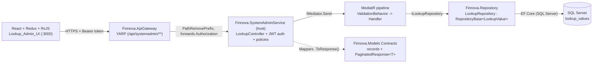
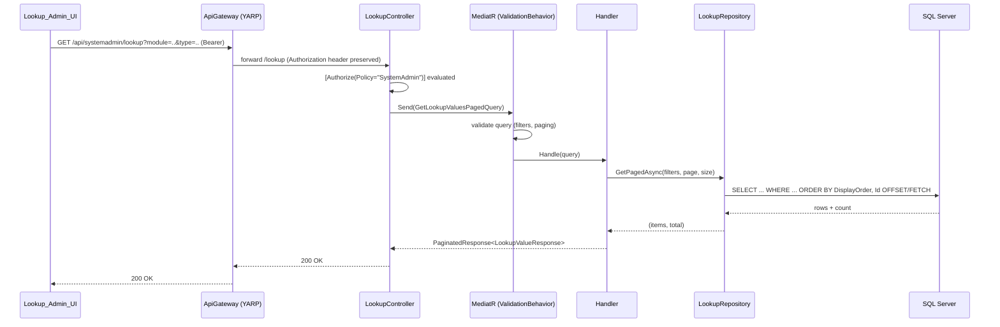
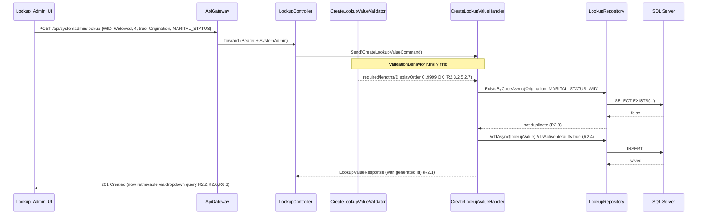
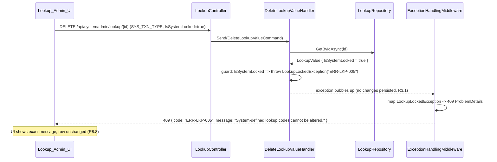
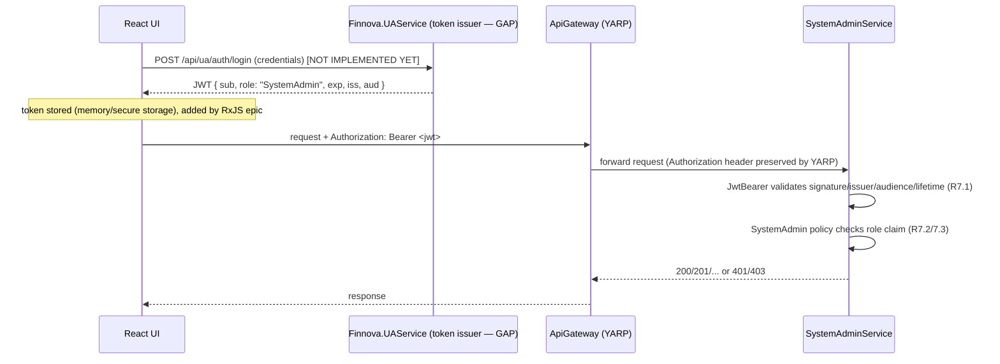

# Design Document: Lookup Master Management (FINNOVA-8)

## Overview

The Lookup Master Management feature adds a centralized, SystemAdmin-scoped catalog of
code-value entries ("lookups") that drive dropdowns and classification categories across
every Finnova business module. A System Administrator filters lookups by Module and Lookup
Type, views them in a paginated grid, and creates/updates/deletes lookup values. Each value
carries a code, a single English display value (Value), a display order, an active flag, and a
system-lock flag. Active values become immediately available to consuming-module dropdowns.

> Finnova is an India-only platform; all display values and labels are English-only. There are
> no bilingual fields, no Arabic content, and no right-to-left rendering.

This design follows the platform's layered CQRS conventions exactly:
`Finnova.Models` (entities + record contracts) -> `Finnova.Repository` (EF Core, generic
`IRepository<T>` + `RepositoryBase<T>`, per-entity repos, `IEntityTypeConfiguration<T>`) ->
`Finnova.Service` (MediatR Commands/Queries with FluentValidation validators and static
`.ToResponse()` mappers) -> a Host Web API (controllers injecting `IMediator`) -> the
`Finnova.ApiGateway` YARP reverse proxy -> the React + Redux + RxJS frontend.

### Requirements coverage map

| Requirement | Covered by |
|---|---|
| R1 Taxonomy + filtering | `LookupValue.Module`/`LookupType`, `GetLookupValuesPaged` query, repository filters, validators (R1.1-R1.7) |
| R2 Create (TC-LKP-01) | `CreateLookupValue` command + validator + uniqueness check + seed availability (R2.1-R2.9) |
| R3 System-lock protection (TC-LKP-02) | `IsSystemLocked` flag, `LookupLockedException` (`ERR-LKP-005`), update/delete guards (R3.1-R3.5) |
| R4 List + pagination | `GetLookupValuesPaged`, `PaginatedResponse<LookupValueResponse>`, deterministic ordering (R4.1-R4.6) |
| R5 Update/Delete + uniqueness | `UpdateLookupValue`/`DeleteLookupValue` commands, unique index, in-use guard (R5.1-R5.7) |
| R6 Dropdown consumption | `GetLookupDropdownItems` query, active-only, single Value label (R6.1-R6.6) |
| R7 AuthN/AuthZ | JWT Bearer scheme + `SystemAdmin` policy, `[Authorize]` on endpoints (R7.1-R7.6) |
| R8 Admin UI | React `LookupMasterPage`, Redux slice, RxJS epics, 10s timeout (R8.1-R8.11) |

### Three critical corrections (surfaced prominently)

These deviate from the requirements introduction and MUST be honored during implementation.

1. **Persistence provider is SQL Server, not PostgreSQL.** The requirements introduction
   says "EF Core + PostgreSQL", but the actual code in
   `Finnova.Repository/DependencyInjection.cs` uses `options.UseSqlServer(connectionString)`
   (`Microsoft.EntityFrameworkCore.SqlServer`). To stay consistent with the platform, this
   design targets **SQL Server**. All EF configuration, migrations, and connection strings
   assume SQL Server. Do not introduce Npgsql.

2. **No JWT authentication exists yet.** No host configures
   `AddAuthentication`/`AddJwtBearer`, and there are no `[Authorize]` attributes anywhere.
   Requirement 7 requires SystemAdmin authorization, so this design **establishes** the JWT
   Bearer scheme and a `"SystemAdmin"` authorization policy as a prerequisite (see Security &
   Authentication Flow). Token *issuance* (login) does not exist in `Finnova.UAService`
   today — this is flagged as an external dependency/decision.

3. **No SystemAdmin host exists.** Only `Finnova.AccountsService`, `Finnova.UAService`, and
   `Finnova.ApiGateway` exist. This design **recommends a new host
   `Finnova.SystemAdminService`** (mirroring the existing host pattern) plus a new YARP route
   `/api/systemadmin/{**catch-all}` -> `systemadmin-cluster`. Rationale and the alternative
   are in Design Decisions & Tradeoffs.

### Additional confirmed gap (validation + error transport)

Validators are registered via `AddValidatorsFromAssembly`, but there is **no MediatR
`IPipelineBehavior` validation behavior** and **no global exception handler** in the current
codebase (confirmed by search: no `IValidator`, `ValidateAsync`, `IPipelineBehavior`,
`UseExceptionHandler`, or `ProblemDetails` usages). Because the many "SHALL reject with a
validation error" acceptance criteria (R1.7, R2.3/5/7/8/9, R5.3/7) and the `ERR-LKP-005`
mapping (R3) depend on validation and domain errors reaching the client as proper HTTP status
codes, this design introduces a `ValidationBehavior<TRequest,TResponse>` pipeline and an
exception-handling middleware that returns RFC 7807 `ProblemDetails`. These are new
cross-cutting pieces the feature relies on.

---

## Architecture

### High-level layered CQRS view



Layer responsibilities:

- **Finnova.Models** — `LookupValue` entity, `LookupType`/`Module` value handling, request/response
  records, reuse of `PaginatedResponse<T>`, and the `LookupLockedException` domain error.
- **Finnova.Repository** — `ILookupRepository : IRepository<LookupValue>`, `LookupRepository`
  (EF Core), `LookupValueConfiguration` (table `lookup_values`), DbSet + DI registration.
- **Finnova.Service** — `Lookup/` feature slice with `Commands/` and `Queries/`, FluentValidation
  validators, `LookupMapper`, and the new `ValidationBehavior<,>`.
- **Finnova.SystemAdminService (new host)** — `LookupController`, JWT + `SystemAdmin` policy,
  exception middleware, Swagger.
- **Finnova.ApiGateway** — new `systemadmin-route`/`systemadmin-cluster`, Authorization
  passthrough, CORS for `http://localhost:3000`.
- **Frontend** — `LookupMasterPage` and children, `lookupsSlice`, RxJS epics.

### Request flow through gateway -> host -> MediatR -> repo -> db



### Create-lookup sequence (TC-LKP-01)



### System-lock rejection flow (TC-LKP-02, ERR-LKP-005)



---

## Data Models

### `LookupValue` entity

Lives in `Finnova.Models/Domain/Entities/LookupValue.cs`, mirroring the `Location` entity style.

```csharp
namespace Finnova.Models.Domain.Entities;

/// <summary>
/// A single lookup catalog entry (code-value) scoped to a Module and Lookup Type.
/// Populates dropdowns and classification categories across business modules.
/// </summary>
public class LookupValue
{
    public Guid Id { get; set; } = Guid.NewGuid();

    public string Module { get; set; } = string.Empty;      // max 50  (e.g. "Origination")
    public string LookupType { get; set; } = string.Empty;  // max 100 (e.g. "MARITAL_STATUS")
    public string Code { get; set; } = string.Empty;        // max 50  (e.g. "WID")
    public string Value { get; set; } = string.Empty;       // max 200 (e.g. "Widowed")

    public int DisplayOrder { get; set; }                   // 0..9999 inclusive
    public bool IsActive { get; set; } = true;              // default true (R2.4)
    public bool IsSystemLocked { get; set; }                // seeded/admin-set, read+enforced here (R3)

    public DateTime CreatedAt { get; set; } = DateTime.UtcNow;
    public DateTime UpdatedAt { get; set; } = DateTime.UtcNow;
}
```

### EF configuration (`LookupValueConfiguration`)

Lives in `Finnova.Repository/Configuration/LookupValueConfiguration.cs`, mirroring
`LocationConfiguration` (lowercase table name, `HasMaxLength`, unique `HasIndex`, `HasData`).

```csharp
using Microsoft.EntityFrameworkCore;
using Microsoft.EntityFrameworkCore.Metadata.Builders;
using Finnova.Models.Domain.Entities;

namespace Finnova.Repository.Configuration;

public class LookupValueConfiguration : IEntityTypeConfiguration<LookupValue>
{
    private static readonly DateTime SeedDate = new(2024, 1, 1, 0, 0, 0, DateTimeKind.Utc);
    private static Guid Id(int n) => new($"00000000-0000-0000-0001-{n:D12}");

    public void Configure(EntityTypeBuilder<LookupValue> builder)
    {
        builder.ToTable("lookup_values");
        builder.HasKey(x => x.Id);

        builder.Property(x => x.Module).IsRequired().HasMaxLength(50);
        builder.Property(x => x.LookupType).IsRequired().HasMaxLength(100);
        builder.Property(x => x.Code).IsRequired().HasMaxLength(50);
        builder.Property(x => x.Value).IsRequired().HasMaxLength(200);
        builder.Property(x => x.DisplayOrder).IsRequired();
        builder.Property(x => x.IsActive).IsRequired();
        builder.Property(x => x.IsSystemLocked).IsRequired();

        // Uniqueness of Code within Module + Lookup Type scope (R2.8, R5.3).
        builder.HasIndex(x => new { x.Module, x.LookupType, x.Code }).IsUnique();

        // Query path: filter by module/type/active then order by DisplayOrder (R4, R6).
        builder.HasIndex(x => new { x.Module, x.LookupType, x.IsActive, x.DisplayOrder });

        builder.HasData(SeedData());
    }

    private static IEnumerable<LookupValue> SeedData()
    {
        LookupValue V(int id, string module, string type, string code, string value,
            int order, bool active = true, bool locked = false) => new()
        {
            Id = Id(id),
            Module = module,
            LookupType = type,
            Code = code,
            Value = value,
            DisplayOrder = order,
            IsActive = active,
            IsSystemLocked = locked,
            CreatedAt = SeedDate,
            UpdatedAt = SeedDate,
        };

        return new[]
        {
            // A System-Locked row demonstrating R3 protection (TC-LKP-02).
            V(1, "SystemAdmin", "SYS_TXN_TYPE", "DEBIT", "Debit", 1, locked: true),
            V(2, "SystemAdmin", "SYS_TXN_TYPE", "CREDIT", "Credit", 2, locked: true),

            // MARITAL_STATUS set under Origination (TC-LKP-01 scope). "WID" is added by the test.
            V(3, "Origination", "MARITAL_STATUS", "SIN", "Single", 1),
            V(4, "Origination", "MARITAL_STATUS", "MAR", "Married", 2),
            V(5, "Origination", "MARITAL_STATUS", "DIV", "Divorced", 3),
        };
    }
}
```

Then register the DbSet in `FinnovaDbContext` (mirroring existing DbSet properties;
`ApplyConfigurationsFromAssembly` already picks up the new configuration):

```csharp
public DbSet<LookupValue> LookupValues => Set<LookupValue>();
```

**EF Core migration note (SQL Server):** after adding the entity, configuration, and DbSet,
generate the migration from the repository project against a host:

```
dotnet ef migrations add AddLookupValues \
  --project Finnova.Repository \
  --startup-project Finnova.SystemAdminService
dotnet ef database update --project Finnova.Repository --startup-project Finnova.SystemAdminService
```

The migration will create `lookup_values` with `nvarchar(50/100/200)` columns, the unique
index on `(Module, LookupType, Code)`, the composite query index, and the `HasData` seed rows.
SQL Server `nvarchar` is the EF default for `string`, so no special column configuration is
required.

---

## Contracts (records)

Live in `Finnova.Models/Contracts/Lookups/`, mirroring the `Locations` contracts style.

```csharp
namespace Finnova.Models.Contracts.Lookups;

// Create (R2). IsActive nullable so the service can default it to true (R2.4).
public record CreateLookupValueRequest(
    string Module,
    string LookupType,
    string Code,
    string Value,
    int DisplayOrder,
    bool? IsActive
);

// Update editable fields (R5.1). Code included to allow rename attempts, which are
// blocked for system-locked rows (R3.2). Module/LookupType/IsSystemLocked are not editable.
public record UpdateLookupValueRequest(
    string Code,
    string Value,
    int DisplayOrder,
    bool IsActive
);

// Full admin-facing response (R3.5 exposes IsSystemLocked so UI can disable controls).
public record LookupValueResponse(
    Guid Id,
    string Module,
    string LookupType,
    string Code,
    string Value,
    int DisplayOrder,
    bool IsActive,
    bool IsSystemLocked,
    DateTime CreatedAt,
    DateTime UpdatedAt
);

// Slim consuming-module projection for dropdowns (R6.4: single display label).
public record LookupDropdownItemResponse(
    string Code,
    string Label
);
```

Paginated listing reuses the platform contract directly:
`PaginatedResponse<LookupValueResponse>` (R4.1).

---

## Components and Interfaces

This feature is composed of three collaborating layers, each described in detail in the
subsections that follow. The **Repository Layer** exposes the `ILookupRepository` data-access
contract and its EF Core implementation; the **Service Layer** defines the CQRS commands,
queries, validators, and mappers that hold the business logic; and the **API Layer** exposes the
HTTP surface via `LookupController` and its supporting middleware. Together these components
realize the interfaces consumed by the gateway and the frontend.

### Repository Layer

#### `ILookupRepository`

Lives in `Finnova.Repository/Interfaces/ILookupRepository.cs`, extending the generic interface
just like `ILocationRepository`.

```csharp
using Finnova.Models.Domain.Entities;

namespace Finnova.Repository.Interfaces;

public interface ILookupRepository : IRepository<LookupValue>
{
    /// <summary>
    /// Filtered + paged query for the admin grid (R1, R4). Any filter may be null.
    /// Ordered by DisplayOrder asc, then Id asc as a deterministic tie-break (R4.6).
    /// Returns the page items and the total matching count.
    /// </summary>
    Task<(List<LookupValue> Items, int Total)> GetPagedAsync(
        string? module,
        string? lookupType,
        bool? isActive,
        int page,
        int pageSize,
        CancellationToken cancellationToken = default);

    /// <summary>
    /// Active values for a Module + Lookup Type, ordered by DisplayOrder asc then
    /// Value asc (R6.1, R6.2). Used by consuming-module dropdowns.
    /// </summary>
    Task<List<LookupValue>> GetActiveByModuleAndTypeAsync(
        string module, string lookupType, CancellationToken cancellationToken = default);

    /// <summary>
    /// Uniqueness check for Code within a Module + Lookup Type scope (R2.8, R5.3).
    /// excludeId lets update skip the row being edited.
    /// </summary>
    Task<bool> ExistsByCodeAsync(
        string module, string lookupType, string code,
        Guid? excludeId = null, CancellationToken cancellationToken = default);

    /// <summary>
    /// Whether the given Module + Lookup Type scope is defined in the system (R1.7, R6.5).
    /// </summary>
    Task<bool> ScopeExistsAsync(
        string module, string lookupType, CancellationToken cancellationToken = default);

    Task<LookupValue?> GetByModuleTypeCodeAsync(
        string module, string lookupType, string code, CancellationToken cancellationToken = default);
}
```

#### `LookupRepository`

Lives in `Finnova.Repository/Repositories/LookupRepository.cs`, extending `RepositoryBase<LookupValue>`.

```csharp
using Microsoft.EntityFrameworkCore;
using Finnova.Models.Domain.Entities;
using Finnova.Repository.Context;
using Finnova.Repository.Interfaces;

namespace Finnova.Repository.Repositories;

public class LookupRepository : RepositoryBase<LookupValue>, ILookupRepository
{
    public LookupRepository(FinnovaDbContext context) : base(context) { }

    public async Task<(List<LookupValue> Items, int Total)> GetPagedAsync(
        string? module, string? lookupType, bool? isActive,
        int page, int pageSize, CancellationToken cancellationToken = default)
    {
        var query = DbSet.AsNoTracking().AsQueryable();

        if (!string.IsNullOrWhiteSpace(module))
            query = query.Where(x => x.Module == module);        // case-sensitive scope (R1.2, R4.2)
        if (!string.IsNullOrWhiteSpace(lookupType))
            query = query.Where(x => x.LookupType == lookupType);
        if (isActive.HasValue)
            query = query.Where(x => x.IsActive == isActive.Value); // no filter => all (R4.3)

        var total = await query.CountAsync(cancellationToken);      // total before paging (R4.5)

        var items = await query
            .OrderBy(x => x.DisplayOrder)                            // primary order (R4.6)
            .ThenBy(x => x.Id)                                       // deterministic tie-break (R4.6)
            .Skip((page - 1) * pageSize)
            .Take(pageSize)
            .ToListAsync(cancellationToken);

        return (items, total);
    }

    public async Task<List<LookupValue>> GetActiveByModuleAndTypeAsync(
        string module, string lookupType, CancellationToken cancellationToken = default)
    {
        return await DbSet.AsNoTracking()
            .Where(x => x.Module == module && x.LookupType == lookupType && x.IsActive) // R6.1
            .OrderBy(x => x.DisplayOrder)                                                // R6.2
            .ThenBy(x => x.Value)                                                        // stable tie-break (R6.2)
            .ToListAsync(cancellationToken);
    }

    public async Task<bool> ExistsByCodeAsync(
        string module, string lookupType, string code,
        Guid? excludeId = null, CancellationToken cancellationToken = default)
    {
        return await DbSet.AsNoTracking().AnyAsync(x =>
            x.Module == module &&
            x.LookupType == lookupType &&
            x.Code == code &&
            (excludeId == null || x.Id != excludeId), cancellationToken);
    }

    public async Task<bool> ScopeExistsAsync(
        string module, string lookupType, CancellationToken cancellationToken = default)
    {
        return await DbSet.AsNoTracking()
            .AnyAsync(x => x.Module == module && x.LookupType == lookupType, cancellationToken);
    }

    public async Task<LookupValue?> GetByModuleTypeCodeAsync(
        string module, string lookupType, string code, CancellationToken cancellationToken = default)
    {
        return await DbSet.AsNoTracking().FirstOrDefaultAsync(x =>
            x.Module == module && x.LookupType == lookupType && x.Code == code, cancellationToken);
    }
}
```

> Note on scope validation (R1.7/R6.5): "defined Module/Lookup Type" is derived from existing
> rows via `ScopeExistsAsync`. See Design Decisions for the recommended reference-table
> alternative. The repository interface is unchanged if a `LookupTypeRegistry` is introduced later.

Register in `AddFinnovaRepository` (`Finnova.Repository/DependencyInjection.cs`):

```csharp
services.AddScoped<ILookupRepository, LookupRepository>();
```

---

### Service Layer (CQRS)

Feature slice `Finnova.Service/Lookup/` with `Commands/` and `Queries/`, mirroring the
`Locations` slice. Every request is a record implementing `IRequest<TResponse>`; handlers
implement `IRequestHandler<,>`; validators are `AbstractValidator<T>`.

#### Shared error model — `ERR-LKP-005`

Lives in `Finnova.Models/Domain/Exceptions/`. A single domain exception carries the code and
message so both the handler and the middleware use one source of truth.

```csharp
namespace Finnova.Models.Domain.Exceptions;

/// <summary>Thrown when a protected change is attempted on a system-locked lookup (R3).</summary>
public class LookupLockedException : Exception
{
    public const string ErrorCode = "ERR-LKP-005";
    public LookupLockedException()
        : base("System-defined lookup codes cannot be altered.") { }
}

/// <summary>Thrown when a targeted lookup does not exist (R5.4).</summary>
public class LookupNotFoundException : Exception
{
    public LookupNotFoundException(Guid id) : base($"Lookup value '{id}' was not found.") { }
}

/// <summary>Thrown when a lookup is referenced by other records and cannot be deleted (R5.6).</summary>
public class LookupInUseException : Exception
{
    public LookupInUseException() : base("Lookup value is in use and cannot be deleted.") { }
}
```

The `ValidationBehavior<,>` (see Security/host wiring) throws FluentValidation's
`ValidationException` for all "reject with a validation error" criteria; the middleware maps
each exception type to a status code (see API layer).

#### Command: `CreateLookupValue` (R2)

```csharp
// CreateLookupValueCommand.cs
public record CreateLookupValueCommand(
    string Module, string LookupType, string Code,
    string Value, int DisplayOrder, bool? IsActive
) : IRequest<LookupValueResponse>;
```

```csharp
// CreateLookupValueCommandHandler.cs
public class CreateLookupValueCommandHandler
    : IRequestHandler<CreateLookupValueCommand, LookupValueResponse>
{
    private readonly ILookupRepository _repository;
    public CreateLookupValueCommandHandler(ILookupRepository repository) => _repository = repository;

    public async Task<LookupValueResponse> Handle(CreateLookupValueCommand request, CancellationToken ct)
    {
        // R2.9 unknown reference: scope must be defined
        if (!await _repository.ScopeExistsAsync(request.Module, request.LookupType, ct))
            throw new ValidationException("Unknown Module or Lookup Type reference.");

        // R2.8 duplicate code within scope
        if (await _repository.ExistsByCodeAsync(request.Module, request.LookupType, request.Code, null, ct))
            throw new ValidationException("A lookup value with this Code already exists for the Module and Lookup Type.");

        var entity = new LookupValue
        {
            Module = request.Module,
            LookupType = request.LookupType,
            Code = request.Code,
            Value = request.Value,
            DisplayOrder = request.DisplayOrder,
            IsActive = request.IsActive ?? true,   // R2.4 default true
        };

        await _repository.AddAsync(entity, ct);     // R2.1 persisted, R2.6 immediately queryable
        return entity.ToResponse();
    }
}
```

```csharp
// CreateLookupValueCommandValidator.cs — maps R2.3, R2.5, R2.7
public class CreateLookupValueCommandValidator : AbstractValidator<CreateLookupValueCommand>
{
    public CreateLookupValueCommandValidator()
    {
        RuleFor(x => x.Module).NotEmpty().MaximumLength(50);
        RuleFor(x => x.LookupType).NotEmpty().MaximumLength(100);
        RuleFor(x => x.Code).NotEmpty().WithMessage("Lookup Code is required.")
            .MaximumLength(50).WithMessage("Lookup Code must not exceed 50 characters.");
        RuleFor(x => x.Value).NotEmpty().WithMessage("Value is required.")
            .MaximumLength(200);
        RuleFor(x => x.DisplayOrder).InclusiveBetween(0, 9999)
            .WithMessage("Display Order must be between 0 and 9999.");
    }
}
```

#### Command: `UpdateLookupValue` (R3, R5)

```csharp
public record UpdateLookupValueCommand(
    Guid Id, string Code, string Value, int DisplayOrder, bool IsActive
) : IRequest<LookupValueResponse>;
```

```csharp
public class UpdateLookupValueCommandHandler
    : IRequestHandler<UpdateLookupValueCommand, LookupValueResponse>
{
    private readonly ILookupRepository _repository;
    public UpdateLookupValueCommandHandler(ILookupRepository repository) => _repository = repository;

    public async Task<LookupValueResponse> Handle(UpdateLookupValueCommand request, CancellationToken ct)
    {
        var entity = await _repository.GetByIdAsync(request.Id, ct)
            ?? throw new LookupNotFoundException(request.Id);           // R5.4

        var isRename = !string.Equals(entity.Code, request.Code, StringComparison.Ordinal);

        // R3.2 + R3.4: system-locked rows reject rename (alone or combined with other changes).
        if (entity.IsSystemLocked && isRename)
            throw new LookupLockedException();                          // ERR-LKP-005, nothing persisted

        // R5.3: uniqueness within scope on rename (exclude self).
        if (isRename && await _repository.ExistsByCodeAsync(
                entity.Module, entity.LookupType, request.Code, entity.Id, ct))
            throw new ValidationException("Duplicate Lookup Code within Module and Lookup Type.");

        // R3.3 / R5.1: editable fields applied (locked rows still allow non-identity edits).
        entity.Code = request.Code;
        entity.Value = request.Value;
        entity.DisplayOrder = request.DisplayOrder;
        entity.IsActive = request.IsActive;
        entity.UpdatedAt = DateTime.UtcNow;

        await _repository.UpdateAsync(entity, ct);
        return entity.ToResponse();
    }
}
```

```csharp
// UpdateLookupValueCommandValidator.cs — R5.7
public class UpdateLookupValueCommandValidator : AbstractValidator<UpdateLookupValueCommand>
{
    public UpdateLookupValueCommandValidator()
    {
        RuleFor(x => x.Id).NotEmpty();
        RuleFor(x => x.Code).NotEmpty().MaximumLength(50);
        RuleFor(x => x.Value).NotEmpty().MaximumLength(200);
        RuleFor(x => x.DisplayOrder).InclusiveBetween(0, 9999);
    }
}
```

#### Command: `DeleteLookupValue` (R3.1, R5.2, R5.4, R5.6)

```csharp
public record DeleteLookupValueCommand(Guid Id) : IRequest<bool>;
```

```csharp
public class DeleteLookupValueCommandHandler : IRequestHandler<DeleteLookupValueCommand, bool>
{
    private readonly ILookupRepository _repository;
    public DeleteLookupValueCommandHandler(ILookupRepository repository) => _repository = repository;

    public async Task<bool> Handle(DeleteLookupValueCommand request, CancellationToken ct)
    {
        var entity = await _repository.GetByIdAsync(request.Id, ct)
            ?? throw new LookupNotFoundException(request.Id);      // R5.4

        if (entity.IsSystemLocked)
            throw new LookupLockedException();                     // R3.1 -> ERR-LKP-005

        // R5.6 in-use guard. "Referenced by other records" is checked against consuming
        // usage; see Design Decisions (reference model). Default assumption: no FK references
        // exist yet, so this guard is a hook for future consuming-module references.
        // if (await _referenceChecker.IsReferencedAsync(entity, ct)) throw new LookupInUseException();

        await _repository.DeleteAsync(entity, ct);                 // R5.2 hard delete
        return true;
    }
}
```

#### Query: `GetLookupValuesPaged` (R1, R4)

```csharp
public record GetLookupValuesPagedQuery(
    string? Module, string? LookupType, bool? IsActive, int Page = 1, int PageSize = 20
) : IRequest<PaginatedResponse<LookupValueResponse>>;
```

```csharp
public class GetLookupValuesPagedQueryHandler
    : IRequestHandler<GetLookupValuesPagedQuery, PaginatedResponse<LookupValueResponse>>
{
    private readonly ILookupRepository _repository;
    public GetLookupValuesPagedQueryHandler(ILookupRepository repository) => _repository = repository;

    public async Task<PaginatedResponse<LookupValueResponse>> Handle(
        GetLookupValuesPagedQuery request, CancellationToken ct)
    {
        var (items, total) = await _repository.GetPagedAsync(
            request.Module, request.LookupType, request.IsActive, request.Page, request.PageSize, ct);

        var totalPages = (int)Math.Ceiling(total / (double)request.PageSize);
        return new PaginatedResponse<LookupValueResponse>(
            items.ToResponseList(), total, request.Page, request.PageSize, totalPages); // R4.1
    }
}
```

```csharp
// GetLookupValuesPagedQueryValidator.cs — R1.7 malformed filters, paging bounds
public class GetLookupValuesPagedQueryValidator : AbstractValidator<GetLookupValuesPagedQuery>
{
    public GetLookupValuesPagedQueryValidator()
    {
        RuleFor(x => x.Page).GreaterThanOrEqualTo(1);
        RuleFor(x => x.PageSize).InclusiveBetween(1, 200);
        RuleFor(x => x.Module).MaximumLength(50).When(x => x.Module is not null);
        RuleFor(x => x.LookupType).MaximumLength(100).When(x => x.LookupType is not null);
    }
}
```

#### Query: `GetLookupDropdownItems` (R6)

```csharp
public record GetLookupDropdownItemsQuery(string Module, string LookupType)
    : IRequest<List<LookupDropdownItemResponse>>;
```

```csharp
public class GetLookupDropdownItemsQueryHandler
    : IRequestHandler<GetLookupDropdownItemsQuery, List<LookupDropdownItemResponse>>
{
    private readonly ILookupRepository _repository;
    public GetLookupDropdownItemsQueryHandler(ILookupRepository repository) => _repository = repository;

    public async Task<List<LookupDropdownItemResponse>> Handle(
        GetLookupDropdownItemsQuery request, CancellationToken ct)
    {
        // R6.5: unknown scope is an error, distinct from "defined but empty" (R6.6).
        if (!await _repository.ScopeExistsAsync(request.Module, request.LookupType, ct))
            throw new ValidationException("Unknown Module or Lookup Type.");

        var values = await _repository.GetActiveByModuleAndTypeAsync(request.Module, request.LookupType, ct);
        return values.Select(v => v.ToDropdownItem()).ToList(); // empty list allowed (R6.6)
    }
}
```

#### `LookupMapper`

Lives in `Finnova.Service/Mappers/LookupMapper.cs`, mirroring `LocationMapper`.

```csharp
using Finnova.Models.Contracts.Lookups;
using Finnova.Models.Domain.Entities;

namespace Finnova.Service.Mappers;

public static class LookupMapper
{
    public static LookupValueResponse ToResponse(this LookupValue x) => new(
        x.Id, x.Module, x.LookupType, x.Code, x.Value,
        x.DisplayOrder, x.IsActive, x.IsSystemLocked, x.CreatedAt, x.UpdatedAt);

    public static List<LookupValueResponse> ToResponseList(this IEnumerable<LookupValue> items)
        => items.Select(i => i.ToResponse()).ToList();

    public static LookupDropdownItemResponse ToDropdownItem(this LookupValue x) => new(
        x.Code, x.Value);   // R6.4 single display label (Label = Value)
}
```

---

### API Layer

#### `LookupController`

Lives in the recommended new host `Finnova.SystemAdminService/Controllers/LookupController.cs`,
mirroring `LocationsController` (attribute routing, `IMediator`, `ActionResult<T>`), with the
new authorization policies and `CreatedAtAction` for POST.

```csharp
using MediatR;
using Microsoft.AspNetCore.Authorization;
using Microsoft.AspNetCore.Mvc;
using Finnova.Models.Contracts.Common;
using Finnova.Models.Contracts.Lookups;
using Finnova.Service.Lookup.Commands.CreateLookupValue;
using Finnova.Service.Lookup.Commands.UpdateLookupValue;
using Finnova.Service.Lookup.Commands.DeleteLookupValue;
using Finnova.Service.Lookup.Queries.GetLookupValuesPaged;
using Finnova.Service.Lookup.Queries.GetLookupDropdownItems;

namespace Finnova.SystemAdminService.Controllers;

[ApiController]
[Route("api/[controller]")]
public class LookupController : ControllerBase
{
    private readonly IMediator _mediator;
    public LookupController(IMediator mediator) => _mediator = mediator;

    /// <summary>Paged, filtered admin list. SystemAdmin only (R4, R7.2/7.3).</summary>
    [HttpGet]
    [Authorize(Policy = "SystemAdmin")]
    [ProducesResponseType(typeof(PaginatedResponse<LookupValueResponse>), StatusCodes.Status200OK)]
    public async Task<ActionResult<PaginatedResponse<LookupValueResponse>>> GetPaged(
        [FromQuery] string? module, [FromQuery] string? type, [FromQuery] bool? isActive,
        [FromQuery] int page = 1, [FromQuery] int pageSize = 20)
        => Ok(await _mediator.Send(new GetLookupValuesPagedQuery(module, type, isActive, page, pageSize)));

    /// <summary>Active dropdown items for a Module + Type. Any authenticated caller (R6, R7.4/7.5).</summary>
    [HttpGet("dropdown")]
    [Authorize]
    [ProducesResponseType(typeof(List<LookupDropdownItemResponse>), StatusCodes.Status200OK)]
    public async Task<ActionResult<List<LookupDropdownItemResponse>>> GetDropdown(
        [FromQuery] string module, [FromQuery] string type)
        => Ok(await _mediator.Send(new GetLookupDropdownItemsQuery(module, type)));

    /// <summary>Create a lookup value. SystemAdmin only (R2, R7).</summary>
    [HttpPost]
    [Authorize(Policy = "SystemAdmin")]
    [ProducesResponseType(typeof(LookupValueResponse), StatusCodes.Status201Created)]
    [ProducesResponseType(StatusCodes.Status400BadRequest)]
    public async Task<ActionResult<LookupValueResponse>> Create([FromBody] CreateLookupValueRequest r)
    {
        var result = await _mediator.Send(new CreateLookupValueCommand(
            r.Module, r.LookupType, r.Code, r.Value, r.DisplayOrder, r.IsActive));
        return CreatedAtAction(nameof(GetPaged), new { module = result.Module, type = result.LookupType }, result);
    }

    /// <summary>Update editable fields. SystemAdmin only. 409 on ERR-LKP-005 (R3, R5).</summary>
    [HttpPut("{id:guid}")]
    [Authorize(Policy = "SystemAdmin")]
    [ProducesResponseType(typeof(LookupValueResponse), StatusCodes.Status200OK)]
    [ProducesResponseType(StatusCodes.Status404NotFound)]
    [ProducesResponseType(StatusCodes.Status409Conflict)]
    public async Task<ActionResult<LookupValueResponse>> Update(Guid id, [FromBody] UpdateLookupValueRequest r)
        => Ok(await _mediator.Send(new UpdateLookupValueCommand(
            id, r.Code, r.Value, r.DisplayOrder, r.IsActive)));

    /// <summary>Delete. SystemAdmin only. 409 on ERR-LKP-005 / in-use (R3.1, R5).</summary>
    [HttpDelete("{id:guid}")]
    [Authorize(Policy = "SystemAdmin")]
    [ProducesResponseType(StatusCodes.Status204NoContent)]
    [ProducesResponseType(StatusCodes.Status404NotFound)]
    [ProducesResponseType(StatusCodes.Status409Conflict)]
    public async Task<IActionResult> Delete(Guid id)
    {
        await _mediator.Send(new DeleteLookupValueCommand(id));
        return NoContent();
    }
}
```

#### Endpoint summary

| Method | Route | Auth | Body | Success | Errors |
|---|---|---|---|---|---|
| GET | `/api/lookup` | `SystemAdmin` | — | 200 `PaginatedResponse<LookupValueResponse>` | 400, 401, 403 |
| GET | `/api/lookup/dropdown?module=&type=` | authenticated | — | 200 `List<LookupDropdownItemResponse>` | 400 (unknown scope), 401 |
| POST | `/api/lookup` | `SystemAdmin` | `CreateLookupValueRequest` | 201 `LookupValueResponse` | 400, 401, 403 |
| PUT | `/api/lookup/{id}` | `SystemAdmin` | `UpdateLookupValueRequest` | 200 `LookupValueResponse` | 400, 401, 403, 404, 409 |
| DELETE | `/api/lookup/{id}` | `SystemAdmin` | — | 204 | 401, 403, 404, 409 |

Through the gateway these are prefixed: `/api/systemadmin/lookup...`.

#### Exception-to-status mapping (middleware + ProblemDetails)

New middleware `ExceptionHandlingMiddleware` in the host translates domain/validation
exceptions into RFC 7807 `ProblemDetails`. This is required because the codebase has no global
handler today.

```csharp
public class ExceptionHandlingMiddleware
{
    private readonly RequestDelegate _next;
    public ExceptionHandlingMiddleware(RequestDelegate next) => _next = next;

    public async Task InvokeAsync(HttpContext ctx)
    {
        try { await _next(ctx); }
        catch (Exception ex)
        {
            var (status, code, detail) = ex switch
            {
                LookupLockedException => (StatusCodes.Status409Conflict,
                    LookupLockedException.ErrorCode, ex.Message),          // ERR-LKP-005 (R3, R8.8)
                LookupNotFoundException => (StatusCodes.Status404NotFound, "ERR-LKP-404", ex.Message),
                LookupInUseException => (StatusCodes.Status409Conflict, "ERR-LKP-409", ex.Message),
                FluentValidation.ValidationException v =>
                    (StatusCodes.Status400BadRequest, "ERR-LKP-400", v.Message),
                _ => (StatusCodes.Status500InternalServerError, "ERR-LKP-500", "Unexpected error.")
            };

            var problem = new ProblemDetails { Status = status, Title = code, Detail = detail };
            problem.Extensions["code"] = code;   // clients (UI) branch on this
            ctx.Response.StatusCode = status;
            await ctx.Response.WriteAsJsonAsync(problem);
        }
    }
}
```

> Status choice for `ERR-LKP-005`: **409 Conflict** (the request is well-formed and the caller
> is authorized, but the resource state forbids the change). See Design Decisions for the
> 403 alternative.

---

## Error Handling

Errors are modeled as a small set of domain exceptions plus FluentValidation's
`ValidationException`, all translated to RFC 7807 `ProblemDetails` by a single
`ExceptionHandlingMiddleware` so clients receive consistent HTTP status codes and a stable
`code` extension to branch on. This consolidates the error model already defined in the Service
Layer (domain exceptions) and the API Layer (the middleware mapping); see those sections for the
full source.

### Error model

| Exception | Source (defined in) | Meaning | HTTP status | `code` |
|---|---|---|---|---|
| `LookupLockedException` | `Finnova.Models/Domain/Exceptions/` (Service Layer) | Protected change attempted on a system-locked lookup (R3.1, R3.2, R3.4); nothing is persisted | 409 Conflict | `ERR-LKP-005` |
| `LookupNotFoundException` | `Finnova.Models/Domain/Exceptions/` (Service Layer) | Targeted lookup id does not exist (R5.4) | 404 Not Found | `ERR-LKP-404` |
| `LookupInUseException` | `Finnova.Models/Domain/Exceptions/` (Service Layer) | Lookup is referenced by other records and cannot be deleted (R5.6) | 409 Conflict | `ERR-LKP-409` |
| `FluentValidation.ValidationException` | validators + `ValidationBehavior<,>` (Service Layer) | Field/uniqueness/reference validation failure (R1.7, R2.3/5/7/8/9, R5.3/7) | 400 Bad Request | `ERR-LKP-400` |
| any other `Exception` | fallback | Unexpected error | 500 Internal Server Error | `ERR-LKP-500` |

### Handling flow and guarantees

- The `ValidationBehavior<TRequest,TResponse>` MediatR pipeline runs validators before handlers,
  so invalid requests are rejected as `ValidationException` (→ 400) before any state changes.
- Domain guards inside handlers throw `LookupLockedException` / `LookupNotFoundException` /
  `LookupInUseException` before persisting, so rejected mutations leave stored state unchanged
  (R3.1). The system-lock rejection flow is illustrated in the Architecture section.
- `ExceptionHandlingMiddleware` (see API Layer for the full implementation) catches all of the
  above, maps each to the status and `code` shown in the table, and writes a `ProblemDetails`
  body whose `code` extension the frontend uses to display the exact `ERR-LKP-005` message
  without altering the affected row (R8.8).

---

## Security & Authentication Flow

Requirement 7 needs SystemAdmin authorization, but **no JWT scheme exists** in the platform
today. This design establishes it in the host, defines the `SystemAdmin` policy, and describes
the end-to-end token path.

### End-to-end flow



**Dependency / decision flag:** `Finnova.UAService` currently has **no token issuance**
(no login/auth controller, no signing key config). Issuing tokens with a `SystemAdmin` role
claim is a prerequisite owned by the UA service. Until it exists, the SystemAdmin host can be
tested with a dev-signed token. This is an open dependency, not solved by this feature alone.

### Host auth wiring (Program.cs pseudocode)

```csharp
// Finnova.SystemAdminService/Program.cs (new host)
using FluentValidation;
using Microsoft.AspNetCore.Authentication.JwtBearer;
using Microsoft.IdentityModel.Tokens;
using Finnova.Repository;
using Finnova.Service.Lookup.Commands.CreateLookupValue; // assembly marker

var builder = WebApplication.CreateBuilder(args);
builder.Services.AddControllers();

var serviceAssembly = typeof(CreateLookupValueCommand).Assembly;
builder.Services.AddMediatR(cfg => cfg.RegisterServicesFromAssembly(serviceAssembly));
builder.Services.AddValidatorsFromAssembly(serviceAssembly);

// NEW: MediatR validation pipeline (does not exist in codebase yet).
builder.Services.AddTransient(typeof(MediatR.IPipelineBehavior<,>), typeof(ValidationBehavior<,>));

// JWT Bearer authentication (R7.6 — establishing the scheme).
var jwt = builder.Configuration.GetSection("Jwt");
builder.Services.AddAuthentication(JwtBearerDefaults.AuthenticationScheme)
    .AddJwtBearer(options =>
    {
        options.TokenValidationParameters = new TokenValidationParameters
        {
            ValidateIssuer = true,
            ValidateAudience = true,
            ValidateLifetime = true,            // rejects expired tokens (R7.1)
            ValidateIssuerSigningKey = true,    // rejects bad signature (R7.1)
            ValidIssuer = jwt["Issuer"],
            ValidAudience = jwt["Audience"],
            IssuerSigningKey = new SymmetricSecurityKey(
                System.Text.Encoding.UTF8.GetBytes(jwt["SigningKey"]!)),
            RoleClaimType = System.Security.Claims.ClaimTypes.Role
        };
    });

// SystemAdmin authorization policy — role claim "SystemAdmin" (R7.2/7.3).
builder.Services.AddAuthorization(options =>
    options.AddPolicy("SystemAdmin", p => p.RequireRole("SystemAdmin")));

var connectionString = builder.Configuration.GetConnectionString("DefaultConnection")
    ?? "Server=localhost;Database=Finnova;Trusted_Connection=True;TrustServerCertificate=True";
builder.Services.AddFinnovaRepository(connectionString); // SQL Server (correction #1)

builder.Services.AddHealthChecks();
builder.Services.AddOpenApi();
builder.Services.AddSwaggerGen(); // + AddSecurityDefinition("Bearer", ...) for Swagger auth

var app = builder.Build();
if (app.Environment.IsDevelopment()) { app.MapOpenApi(); app.UseSwagger(); app.UseSwaggerUI(); }

app.UseMiddleware<ExceptionHandlingMiddleware>(); // ERR-LKP-005 + validation -> ProblemDetails
app.UseAuthentication();   // must precede UseAuthorization
app.UseAuthorization();
app.MapControllers();
app.MapHealthChecks("/health");
app.Run();
```

The `ValidationBehavior<TRequest,TResponse>` runs FluentValidation before each handler:

```csharp
public class ValidationBehavior<TRequest, TResponse> : IPipelineBehavior<TRequest, TResponse>
    where TRequest : notnull
{
    private readonly IEnumerable<IValidator<TRequest>> _validators;
    public ValidationBehavior(IEnumerable<IValidator<TRequest>> validators) => _validators = validators;

    public async Task<TResponse> Handle(TRequest request,
        RequestHandlerDelegate<TResponse> next, CancellationToken ct)
    {
        if (_validators.Any())
        {
            var context = new ValidationContext<TRequest>(request);
            var failures = (await Task.WhenAll(_validators.Select(v => v.ValidateAsync(context, ct))))
                .SelectMany(r => r.Errors).Where(f => f is not null).ToList();
            if (failures.Count != 0) throw new ValidationException(failures); // -> 400 in middleware
        }
        return await next();
    }
}
```

### Gateway passthrough + CORS

Add to `Finnova.ApiGateway/appsettings.json` (mirroring the existing `ua`/`accounts` routes;
YARP forwards the `Authorization` header by default):

```jsonc
"systemadmin-route": {
  "ClusterId": "systemadmin-cluster",
  "Match": { "Path": "/api/systemadmin/{**catch-all}" },
  "Transforms": [ { "PathRemovePrefix": "/api/systemadmin" } ]
},
// clusters:
"systemadmin-cluster": {
  "Destinations": { "destination1": { "Address": "http://finnova-systemadmin-service:5030/" } }
}
```

CORS already allows `http://localhost:3000` at the gateway (`AllowedOrigins`). Ensure the
gateway CORS policy allows the `Authorization` header and the methods GET/POST/PUT/DELETE.

### Frontend token attachment

RxJS epics read the token from a selector and set `Authorization: Bearer <token>` on every
`ajax` call (R8.11) — see Frontend design.

---

## Frontend Design (React + Redux + RxJS)

### Component tree

```
LookupMasterPage
├─ ModuleTypeFilter        // Module select + Lookup Type select (disabled until Module chosen) (R8.1)
├─ LookupGrid              // renders rows; empty-state when no items (R8.3)
│  ├─ LookupRow / EditableRow  // per row; rename+delete disabled when isSystemLocked (R8.7)
│  └─ AddRowForm           // new-row entry + Save (R8.5, R8.6)
└─ ErrorBanner / RetryPrompt   // 10s timeout + ERR-LKP-005 vs general (R8.4, R8.8, R8.9)
```

### Redux slice (state shape + actions + reducer)

```typescript
// lookupsSlice.ts
export interface LookupItem {
  id: string; module: string; lookupType: string; code: string;
  value: string; displayOrder: number;
  isActive: boolean; isSystemLocked: boolean;
}
export interface LookupFilters { module: string | null; lookupType: string | null; isActive: boolean | null; }
export type Status = 'idle' | 'loading' | 'saving' | 'succeeded' | 'failed';

export interface LookupsState {
  items: LookupItem[];
  filters: LookupFilters;
  status: Status;
  error: { code: string; message: string } | null;
}

const initialState: LookupsState = {
  items: [], filters: { module: null, lookupType: null, isActive: null }, status: 'idle', error: null,
};

const slice = createSlice({
  name: 'lookups',
  initialState,
  reducers: {
    setFilters: (s, a: PayloadAction<Partial<LookupFilters>>) => { s.filters = { ...s.filters, ...a.payload }; },

    loadLookups: (s) => { s.status = 'loading'; s.error = null; },
    loadLookupsSuccess: (s, a: PayloadAction<LookupItem[]>) => { s.status = 'succeeded'; s.items = a.payload; },
    loadLookupsFailure: (s, a: PayloadAction<{ code: string; message: string }>) => { s.status = 'failed'; s.error = a.payload; },

    createLookup: (s, _a: PayloadAction<CreateLookupPayload>) => { s.status = 'saving'; s.error = null; },
    createLookupSuccess: (s, a: PayloadAction<LookupItem>) => { s.status = 'succeeded'; s.items.push(a.payload); },
    createLookupFailure: (s, a: PayloadAction<{ code: string; message: string }>) => { s.status = 'failed'; s.error = a.payload; },

    updateLookup: (s, _a: PayloadAction<UpdateLookupPayload>) => { s.status = 'saving'; s.error = null; },
    updateLookupSuccess: (s, a: PayloadAction<LookupItem>) => {
      s.status = 'succeeded';
      const i = s.items.findIndex(x => x.id === a.payload.id);
      if (i >= 0) s.items[i] = a.payload;                       // R8.8/8.9 leave row on failure => no-op here
    },
    updateLookupFailure: (s, a: PayloadAction<{ code: string; message: string }>) => { s.status = 'failed'; s.error = a.payload; },

    deleteLookup: (s, _a: PayloadAction<{ id: string }>) => { s.status = 'saving'; s.error = null; },
    deleteLookupSuccess: (s, a: PayloadAction<{ id: string }>) => { s.status = 'succeeded'; s.items = s.items.filter(x => x.id !== a.payload.id); },
    deleteLookupFailure: (s, a: PayloadAction<{ code: string; message: string }>) => { s.status = 'failed'; s.error = a.payload; },
  },
});
export const lookupsActions = slice.actions;
export default slice.reducer;
```

### RxJS epics (one shown in full; others analogous)

Epics use `switchMap` for load (latest filter wins) and `mergeMap` for mutations, attach the
Bearer token from a selector, apply a `timeout(10000)` (R8.4), map `ERR-LKP-005` to the exact
message (R8.8), and use `takeUntil` for cancellation.

```typescript
// lookupEpics.ts
const API = '/api/systemadmin/lookup';
const authHeaders = (token: string) => ({ Authorization: `Bearer ${token}`, 'Content-Type': 'application/json' });

const mapError = (e: any) => {
  const code = e?.response?.code ?? e?.response?.extensions?.code ?? 'ERR-UNKNOWN';
  const message = code === 'ERR-LKP-005'
    ? 'System-defined lookup codes cannot be altered.'          // R8.8 exact message
    : (e?.name === 'TimeoutError' ? 'The request timed out. Please retry.' : 'Something went wrong.'); // R8.4/R8.9
  return { code, message };
};

export const loadLookupsEpic: Epic = (action$, state$) =>
  action$.pipe(
    ofType(lookupsActions.loadLookups.type),
    switchMap(() => {
      const { module, lookupType, isActive } = state$.value.lookups.filters;
      const token = selectToken(state$.value);
      const qs = new URLSearchParams();
      if (module) qs.set('module', module);
      if (lookupType) qs.set('type', lookupType);
      if (isActive !== null) qs.set('isActive', String(isActive));
      return ajax.getJSON<Paginated<LookupItem>>(`${API}?${qs}`, authHeaders(token)).pipe(
        timeout(10000),                                          // R8.4
        map(res => lookupsActions.loadLookupsSuccess(res.data)),
        catchError(err => of(lookupsActions.loadLookupsFailure(mapError(err)))),
        takeUntil(action$.pipe(ofType(lookupsActions.loadLookups.type))) // cancel stale
      );
    })
  );

export const createLookupEpic: Epic = (action$, state$) =>
  action$.pipe(
    ofType(lookupsActions.createLookup.type),
    mergeMap((action: PayloadAction<CreateLookupPayload>) => {
      const token = selectToken(state$.value);
      return ajax.post(API, action.payload, authHeaders(token)).pipe(
        timeout(10000),
        map(res => lookupsActions.createLookupSuccess(res.response as LookupItem)), // then grid refresh (R8.5)
        catchError(err => of(lookupsActions.createLookupFailure(mapError(err))))
      );
    })
  );
// updateLookupEpic / deleteLookupEpic follow the same shape with PUT/DELETE.
```

### Grid save flow

- The grid shows a single `Value` column for each row.
- `AddRowForm` blocks submission and shows field-level messages when Code or Value are
  missing (R8.6) before dispatching `createLookup`.
- On `createLookupSuccess`, the reducer appends the item; the page also re-dispatches
  `loadLookups` to re-fetch the ordered page (R8.5).
- `EditableRow` disables rename/delete controls when `isSystemLocked` is true (R8.7); on an
  `ERR-LKP-005` failure the row content is left unchanged (R8.8), and other errors show a
  general banner (R8.9).

---

## Correctness Properties

*A property is a characteristic or behavior that should hold true across all valid executions
of a system — essentially, a formal statement about what the system should do. Properties serve
as the bridge between human-readable specifications and machine-verifiable correctness guarantees.*

This feature is well suited to property-based testing because the service layer is largely pure input/output
logic (filtering, uniqueness enforcement, ordering, mapping, round trips) over a large input
space, which is exactly where universally-quantified properties add value. Authorization
(R7) and UI behavior (R8) are validated by integration and React Testing Library tests
instead (see Testing Strategy). The properties below were derived from the prework analysis
and consolidated to remove redundancy.

### Property 1: Filter results satisfy the provided-filter conjunction

*For all* datasets of lookup values and *for any* combination of Module, Lookup Type, and
active-status filters (each optionally null), every item returned by the paged list query
belongs to the set of stored values whose Module matches (case-sensitive/ordinal) when a Module
filter is given, whose Lookup Type matches (ordinal) when a Type filter is given, and whose
IsActive matches when an active filter is given; a null filter imposes no constraint on that
dimension, and no matching stored value is omitted.

**Validates: Requirements 1.2, 1.4, 1.5, 4.2, 4.3**

### Property 2: Lookup Code uniqueness within Module + Lookup Type scope

*For all* datasets and *for any* create or rename-update, if a stored value already exists with
the same (Module, Lookup Type, Code) as the request (excluding the row being updated), the
operation is rejected with a validation error and the stored catalog is left unchanged.

**Validates: Requirements 2.8, 5.3**

### Property 3: List ordering is DisplayOrder ascending with Id tie-break

*For all* datasets, the sequence returned by the paged list query is non-decreasing by
DisplayOrder, and for items sharing a DisplayOrder is strictly increasing by Id, and repeated
queries over identical data return items in the same sequence.

**Validates: Requirements 4.6**

### Property 4: Dropdown ordering is DisplayOrder ascending with Value tie-break and is deterministic

*For all* datasets and *for any* Module + Lookup Type scope, the dropdown result is
non-decreasing by DisplayOrder, ordered by Value ascending among equal DisplayOrder values,
and two successive queries over identical data return the identical sequence.

**Validates: Requirements 6.2**

### Property 5: Dropdown returns only active values

*For all* datasets and *for any* Module + Lookup Type scope, every item in the dropdown result
corresponds to a stored value whose IsActive flag is true, and no active value in that scope is
omitted.

**Validates: Requirements 6.1**

### Property 6: Create-then-dropdown round trip

*For all* valid create requests with IsActive true (or omitted, defaulting to true), after the
value is created a subsequent dropdown query for its Module and Lookup Type returns an item
whose Code and display label (Value) equal the created value's, without any service
restart.

**Validates: Requirements 2.2, 2.4, 2.6, 6.3**

### Property 7: Update round trip for editable fields

*For all* non-system-locked stored values and *for any* valid update to editable fields
(Code, Value, DisplayOrder, IsActive), retrieving the value after the update yields
exactly the submitted field values.

**Validates: Requirements 5.1**

### Property 8: System-locked values cannot be deleted or renamed (atomic protection)

*For all* stored values whose IsSystemLocked flag is true, any delete, any update that changes
the Code, and any update that changes the Code together with other fields is blocked with error
code `ERR-LKP-005` ("System-defined lookup codes cannot be altered."), and every attribute of
the value (including Code and all other fields) remains exactly as it was, with no partial
persistence.

**Validates: Requirements 3.1, 3.2, 3.4, 5.5**

### Property 9: System-locked values still permit non-identity edits

*For all* stored values whose IsSystemLocked flag is true, an update that leaves the Code
unchanged but modifies Value, DisplayOrder, or IsActive succeeds and persists those
changes.

**Validates: Requirements 3.3**

### Property 10: Deleting a non-locked value removes it from all queries

*For all* stored values that are not system-locked and not referenced by other records, after
deletion the value no longer appears in the paged list result or the dropdown result for its
scope.

**Validates: Requirements 5.2**

### Property 11: Pagination consistency

*For all* datasets and *for any* page number and page size, the returned `PaginatedResponse`
echoes the requested page and page size, reports Total equal to the count of all values matching
the applied filters, reports TotalPages equal to ceil(Total / PageSize), returns at most
PageSize items, and returns an empty Data collection (while Total and pagination parameters
remain correct) whenever the requested page is beyond the last available page.

**Validates: Requirements 4.1, 4.5**

### Property 12: Mapper preserves fields (system-lock flag and dropdown label)

*For all* stored values, mapping to `LookupValueResponse` preserves the IsSystemLocked flag and
all scalar fields, and mapping to `LookupDropdownItemResponse` preserves Code and the display
label (Value).

**Validates: Requirements 3.5, 6.4**

---

## Testing Strategy

The feature uses a dual approach: property-based tests for universal service-layer logic and
example/edge/integration tests for concrete scenarios, infrastructure, and UI.

### Backend (xUnit)

**Property-based tests** (library: **FsCheck.Xunit** for .NET — do not hand-roll generators).
Each property test:
- Runs a **minimum of 100 iterations** (FsCheck default is 100; keep or raise, do not lower).
- Uses a mocked `ILookupRepository` backed by an in-memory list, so create/update/delete/query
  logic is exercised without a database and 100+ iterations stay cheap.
- Is tagged with a comment referencing the design property:
  `// Feature: lookup-master-management, Property {n}: {property text}`.
- Implements each of Properties 1-12 as a **single** property test.

Custom generators produce: valid/edge `LookupValue` records (boundary DisplayOrder 0/9999,
boundary string lengths 50/200), random filter combinations (including nulls), and
system-locked/unlocked mixes.

**Unit (example / edge) tests** — handlers and validators with Arrange-Act-Assert and mocked
`ILookupRepository`:
- Validators: required-field omissions (R2.3), length overflows (R2.7, R5.7), DisplayOrder out
  of range (R2.5, R5.7), paging bounds (R1.7).
- Handlers: unknown scope on create/dropdown (R2.9, R6.5), duplicate detection (R2.8/5.3),
  not-found on update/delete (R5.4), in-use guard with a mocked reference checker (R5.6),
  default IsActive (R2.4), empty-but-defined dropdown scope (R6.6), TC-LKP-01 WID example (R2.2),
  TC-LKP-02 SYS_TXN_TYPE delete example (R3.1).

**Integration tests** (`WebApplicationFactory` against the SystemAdmin host, EF Core SQL Server
or the SQL Server test container):
- Authorization: 401 for missing/expired/tampered tokens (R7.1, R7.5), 403 for authenticated
  non-admin (R7.2), 2xx for SystemAdmin (R7.3), authenticated non-admin allowed on dropdown
  (R7.4). Use 1-3 representative tokens per case — not property tests.
- Smoke: host boots with JWT scheme + `SystemAdmin` policy registered (R7.6).
- One end-to-end create-then-list against a real SQL Server to validate the migration, unique
  index, and ordering in the database.

### Frontend (React Testing Library + Redux + RxJS)

- **RTL, mapped to Gherkin TC-LKP-01 (R8.5):** render `LookupMasterPage`, select Module +
  Type, add a row (WID / Widowed / 4 / active), click Save with a mocked create epic,
  assert the new value appears in the grid after refresh.
- **RTL, mapped to Gherkin TC-LKP-02 (R8.7, R8.8):** render a grid with a system-locked row
  (SYS_TXN_TYPE); assert rename/delete controls are disabled; simulate a 409 `ERR-LKP-005`
  response and assert the exact message "System-defined lookup codes cannot be altered." is
  shown and the row content is unchanged.
- **RTL additional:** Type control disabled until Module selected (R8.1); empty-state on no
  results (R8.3); field-level message on missing required field with no dispatch (R8.6);
  general error banner on non-ERR-LKP-005 failure (R8.9).
- **Redux state-transition tests:** each action transitions `status`/`error`/`items` correctly
  (loading -> succeeded/failed; append on createSuccess; replace on updateSuccess; remove on
  deleteSuccess).
- **RxJS epic tests** (marble tests with `TestScheduler` / fake timers): `loadLookupsEpic`
  emits success on 200 and failure on error; `createLookupEpic`/`updateLookupEpic`/
  `deleteLookupEpic` map results correctly; `timeout(10000)` produces a retry-able failure
  when the response exceeds 10s (R8.4); every epic attaches `Authorization: Bearer` (R8.11);
  `ERR-LKP-005` maps to the exact message (R8.8).

---

## Design Decisions & Tradeoffs

1. **Host placement — recommend a new `Finnova.SystemAdminService`.**
   Lookup Master is a SystemAdmin concern; there is no SystemAdmin host today. A dedicated host
   mirrors the existing `AccountsService`/`UAService` pattern, keeps the new JWT/authorization
   wiring isolated, and cleanly maps to a new gateway route `/api/systemadmin/**`.
   *Tradeoff:* one more deployable/port (5030) and a gateway cluster to operate.
   *Alternative:* fold `LookupController` into `UAService` (fewer moving parts, but mixes
   SystemAdmin concerns into User Administration and forces the new auth scheme onto an existing
   host). Recommendation stands unless operational simplicity is weighted higher.

2. **Hard vs soft delete — hard delete, matching R5.2's assumption.**
   R5.2 assumes a hard delete; deactivation is available separately via R5.1 (`IsActive=false`).
   *Tradeoff:* hard delete is irreversible and loses history. If auditability is later required,
   switch to soft delete by filtering deleted rows out of both query paths — the repository
   interface would not change.

3. **Error transport for `ERR-LKP-005` — HTTP 409 Conflict.**
   The request is authenticated, authorized, and well-formed; it is the target's state
   (system-locked) that forbids the change, which fits 409 better than 403 (authorization) or
   400 (malformed). The UI branches on the `code` field, so the exact status is not what the UI
   keys on, but 409 gives correct semantics to other API consumers.
   *Alternative:* 403 Forbidden if the platform prefers to treat protection as an authorization
   concern. Flagged for confirmation.

4. **Module / Lookup Type as free strings vs reference tables.**
   This design stores Module and LookupType as validated strings and derives "defined scope"
   from existing rows via `ScopeExistsAsync`. This is the lightest change and matches the
   current entity style. *Recommendation:* introduce small reference tables (or enums) for
   Module and LookupType so R1.7/R2.9/R6.5 ("unknown reference") can be enforced against an
   authoritative list rather than inferred from data, and so filters can be validated
   independently of whether any values exist yet. Deferred as a follow-up; the repository
   interface is designed to accommodate it without breaking callers.

5. **SQL Server confirmed (correction #1).** All persistence uses
   `Microsoft.EntityFrameworkCore.SqlServer`, `nvarchar` columns (the EF default for `string`),
   and SQL Server migration commands, consistent with `AddFinnovaRepository`.

### Open questions / assumptions carried from requirements

- **A1 (Localization) — RESOLVED:** Per product context, Finnova is India-only and English-only.
  Each lookup carries a single English display value (`Value`); there are no bilingual fields,
  no Arabic content, and no RTL rendering.
- **A2 (Token issuance):** `Finnova.UAService` has no login/token endpoint today; issuing JWTs
  with a `SystemAdmin` role claim is a prerequisite owned outside this feature (R7.6). Confirm
  ownership and the exact claim (role claim vs a dedicated permission claim).
- **A3 (Read access scope):** dropdown consumption is scoped to authenticated callers (R7.4);
  confirm whether it should instead be fully public/anonymous.
- **A4 (Default pagination):** default page size/number follow platform `PaginatedResponse<T>`
  conventions; this design assumes page 1 / size 20 (R4.4). Confirm the intended defaults.
- **A5 (System-lock authoring):** the `IsSystemLocked` flag is set by seeding/administration
  outside this feature's create surface (R3.5 assumption); this feature reads and enforces it.
- **A6 (In-use references):** no foreign-key references to lookup values exist yet, so R5.6's
  in-use guard is a hook (mocked reference checker) pending real consuming-module references.
- **A7 (Cross-cutting):** the `ValidationBehavior<,>` MediatR pipeline and the
  `ExceptionHandlingMiddleware` are new platform pieces this feature introduces; confirm whether
  they should be promoted to a shared location for reuse by other hosts.
