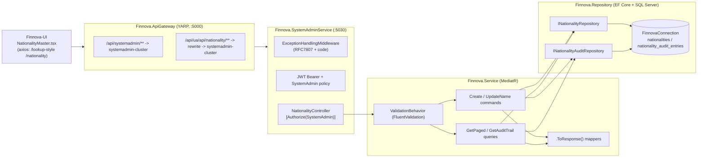
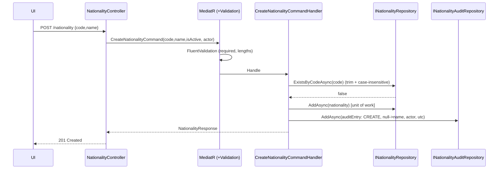
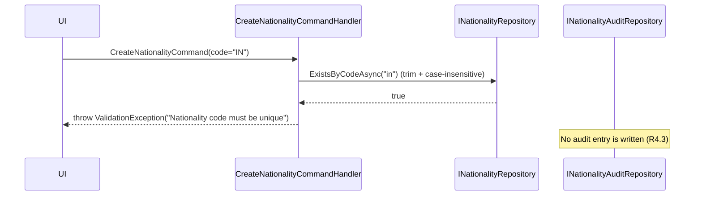
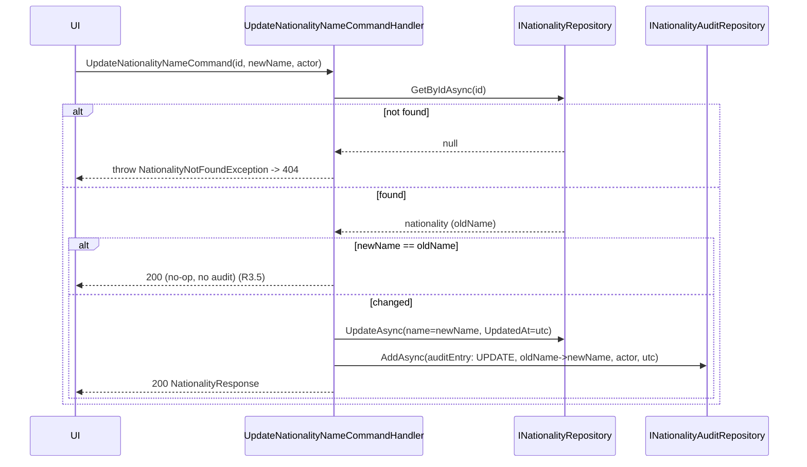
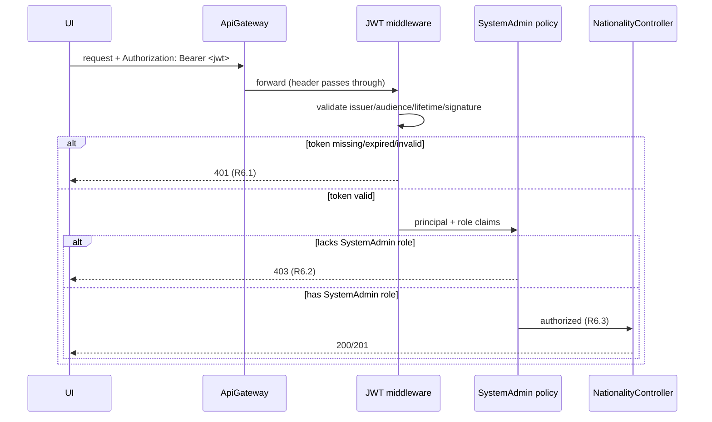

# Design Document — Nationality Master Management

**JIRA:** FINNOVA-9 · **Module:** SystemAdmin · **Master:** Nationality
**Related feature:** Lookup Master Management (FINNOVA-8) — this design mirrors its established layered CQRS conventions.

## Overview

Nationality Master Management is a master-data CRUD capability that lets a System Administrator create nationality records (code + English name), rename an existing nationality, and search nationalities by code or name. Every mutation is captured in an immutable, nationality-scoped audit trail so that changes to standardized reference data are traceable. All operations — including reads — are restricted to System Administrators.

The feature is delivered as an API-only slice inside the **existing** `Finnova.SystemAdminService` host (the same host that already exposes Lookup Master), reached through the **existing** `Finnova.ApiGateway` YARP reverse proxy. The user-facing screen lives in the separate `Finnova-UI` React application.

### What already exists and is reused (NOT re-established by this feature)

The following infrastructure was established by FINNOVA-8 and is treated as a fixed dependency. This design **adds to** it; it does not recreate or re-wire it.

| Concern | Existing asset | Reuse in this feature |
| --- | --- | --- |
| Host | `Finnova.SystemAdminService` (port 5030), `public partial class Program {}` shim present | Add `NationalityController`; no new host |
| AuthN | JWT Bearer (`ValidateIssuer/Audience/Lifetime/SigningKey`, `RoleClaimType = ClaimTypes.Role`) | Reused as-is |
| AuthZ | `SystemAdmin` policy = `RequireRole("SystemAdmin")` | Applied to every nationality endpoint |
| Mediation | MediatR + `Finnova.Service.Behaviors.ValidationBehavior<,>` pipeline | New commands/queries flow through it |
| Errors | `ExceptionHandlingMiddleware` → RFC 7807 `ProblemDetails` with a `code` extension | **Extended** with a Nationality branch (see Error Handling) |
| Persistence | `AddFinnovaRepository` → EF Core + SQL Server, connection string `FinnovaConnection` | Two new repositories + DbSets registered here |
| Gateway | `systemadmin-route` `/api/systemadmin/{**catch-all}` → `systemadmin-cluster`; UI-alias `/api/ua/api/lookup/**` | **Add** an equivalent nationality UI-alias route |
| Contracts | `Finnova.Models`, generic `IRepository<T>` / `RepositoryBase<T>`, `PaginatedResponse<T>`, `.ToResponse()` mappers | Followed exactly |
| Tests | xUnit + FsCheck.Xunit (v2) + `WebApplicationFactory<Program>` in `Finnova.Tests` | Extended with nationality suites |

### What is new in this feature (designed here)

- A `Nationality` entity (`Id`, `Code`, `Name`, `IsActive`, `CreatedAt`, `UpdatedAt`).
- A **new** nationality-scoped audit trail: a `NationalityAuditEntry` entity + repository + table, immutable (no update/delete), written on create and on update within the same unit of work.
- New domain exceptions (`NationalityNotFoundException`) and an extension to `ExceptionHandlingMiddleware` mapping the new exceptions and the duplicate-code validation to `ERR-NAT-xxx` codes.
- `NationalityController` with paged search, create, rename, and audit-trail-read endpoints.
- The `Finnova-UI` Nationality Master screen (React + MUI), mirroring `LookupMaster.tsx`.

### Localization

Finnova is India-only and English-only. A nationality carries a single English `Name` field. There are **no** bilingual fields, no Arabic content, and no right-to-left rendering.

## Requirements Coverage Map

| Requirement | Covered by |
| --- | --- |
| R1 Create nationality | `CreateNationalityCommand` (+ validator, handler), `NationalityController.Create`, `Nationality` entity, audit-on-create |
| R2 Prevent duplicate code | `ExistsByCodeAsync` (case-insensitive, trimmed) + unique index on `Code`; handler raises `"Nationality code must be unique"` |
| R3 Modify nationality name | `UpdateNationalityNameCommand` (+ validator, handler), `NationalityNotFoundException`, no-op-on-same-name, audit-on-update |
| R4 Audit trail | `NationalityAuditEntry` entity/repo, `GetNationalityAuditTrailQuery`, immutability (no update/delete API), no-audit-on-rejection |
| R5 Query & search | `GetNationalitiesPagedQuery` (+ validator, handler), `GetPagedAsync`, `PaginatedResponse<NationalityResponse>` |
| R6 AuthN/AuthZ | `[Authorize(Policy="SystemAdmin")]` on all endpoints; existing JWT scheme + `SystemAdmin` policy; middleware order enforces 401-before-403 |

## Architecture

The feature is a vertical slice through the platform's four layers. Requests enter through the gateway, are authenticated/authorized at the host, dispatched via MediatR (with the validation pipeline), and executed by handlers over the repository layer.



### Request lifecycle (cross-cutting)

`ExceptionHandlingMiddleware` runs first (outermost), then `UseAuthentication` → `UseAuthorization` → controller. This ordering is what guarantees a request that is both unauthenticated and lacking the role is rejected with **401** before authorization evaluates to 403 (R6.4). MediatR's `ValidationBehavior` runs FluentValidation before each handler; a failure throws `FluentValidation.ValidationException`, which the middleware maps to 400.

### Create sequence (happy path + audit)



### Duplicate-code rejection sequence (no audit written)



### Update-with-audit sequence



## Data Models

Two new entities are added to `Finnova.Models/Domain/Entities`. Both use `nvarchar` columns (SQL Server), consistent with the platform.

### `Nationality` entity

```csharp
namespace Finnova.Models.Domain.Entities;

/// <summary>
/// A single nationality reference record used across business modules
/// (e.g. KYC / origination dropdowns). India-only platform: one English Name.
/// </summary>
public class Nationality
{
    public Guid Id { get; set; } = Guid.NewGuid();

    public string Code { get; set; } = string.Empty;   // max 10, unique case-insensitive (R1, R2)
    public string Name { get; set; } = string.Empty;   // max 100, single English name (R1, R3)

    public bool IsActive { get; set; } = true;          // default true (R1.2)

    public DateTime CreatedAt { get; set; } = DateTime.UtcNow;
    public DateTime UpdatedAt { get; set; } = DateTime.UtcNow;
}
```

### `NationalityAuditEntry` entity (new audit trail)

```csharp
namespace Finnova.Models.Domain.Entities;

/// <summary>
/// Immutable audit record capturing one change to a nationality (R4). Written on
/// create and on name update within the same unit of work. Never updated or deleted.
/// </summary>
public class NationalityAuditEntry
{
    public Guid Id { get; set; } = Guid.NewGuid();

    public Guid NationalityId { get; set; }             // affected nationality (R4.1/4.2)
    public NationalityAuditAction Action { get; set; }  // Create | Update (R4.1/4.2)

    public string? OldName { get; set; }                // before value; null on Create
    public string NewName { get; set; } = string.Empty; // after value (resolved Name)

    public string ChangedBy { get; set; } = string.Empty; // acting admin id from JWT (R4.1/4.2)
    public DateTime ChangedAtUtc { get; set; } = DateTime.UtcNow; // UTC timestamp (R4.1/4.2)
}
```

```csharp
namespace Finnova.Models.Domain.Enums;

/// <summary>Discriminates the mutation an audit entry records (R4.1, R4.2).</summary>
public enum NationalityAuditAction
{
    Create = 0,
    Update = 1
}
```

> **Design note (before/after fields):** Because only `Name` is editable (R3), the audit stores the changed field explicitly as `OldName`/`NewName` rather than a generic `FieldName` + serialized-value pair. On `Create`, `OldName` is `null` and `NewName` is the created name (R4.2). This keeps the trail strongly typed and query-friendly; if future editable fields are added, promoting to a generic `FieldName/OldValue/NewValue` shape (or shared audit infra) is the migration path (see Design Decisions).

### EF Core configuration

Two `IEntityTypeConfiguration<T>` classes in `Finnova.Repository/Configuration`, auto-discovered by the existing `ApplyConfigurationsFromAssembly` call.

```csharp
// NationalityConfiguration
builder.ToTable("nationalities");
builder.HasKey(x => x.Id);
builder.Property(x => x.Code).IsRequired().HasMaxLength(10);
builder.Property(x => x.Name).IsRequired().HasMaxLength(100);
builder.Property(x => x.IsActive).IsRequired();
// Uniqueness of Code (R2.1/2.2). SQL Server default collation (e.g. SQL_Latin1_General_CP1_CI_AS)
// is case-insensitive, so the unique index backs the case-insensitive rule. Codes are trimmed
// by the handler before persistence so stored values are canonical.
builder.HasIndex(x => x.Code).IsUnique();
// Query path: search/order by Name (R5.10).
builder.HasIndex(x => x.Name);
```

```csharp
// NationalityAuditEntryConfiguration
builder.ToTable("nationality_audit_entries");
builder.HasKey(x => x.Id);
builder.Property(x => x.NationalityId).IsRequired();
builder.Property(x => x.Action).IsRequired();          // stored as int
builder.Property(x => x.OldName).HasMaxLength(100);    // nullable
builder.Property(x => x.NewName).IsRequired().HasMaxLength(100);
builder.Property(x => x.ChangedBy).IsRequired().HasMaxLength(200);
builder.Property(x => x.ChangedAtUtc).IsRequired();
// Read path: entries for a nationality ordered by time desc then id desc (R4.4).
builder.HasIndex(x => new { x.NationalityId, x.ChangedAtUtc });
```

No FK constraint between `NationalityAuditEntry.NationalityId` and `Nationality.Id` is enforced at the database level, so audit entries survive independently and the "missing id returns empty" read (R4.5) needs no special handling. Immutability (R4.6) is enforced by not exposing any update/delete path (repository or API) for audit entries.

Both are added to `FinnovaDbContext`:

```csharp
public DbSet<Nationality> Nationalities => Set<Nationality>();
public DbSet<NationalityAuditEntry> NationalityAuditEntries => Set<NationalityAuditEntry>();
```

### Migration note

A single EF Core migration adds both tables and the unique index. Generated with the platform's convention:

```
dotnet ef migrations add AddNationalityAndAudit \
  --project Finnova.Repository --startup-project Finnova.SystemAdminService
```

Applied via `dotnet ef database update` (or the host's existing startup migration path). No seed data is required by the requirements; if a smoke seed is desired it must be English-only (e.g. `IN` / `Indian`).

## Contracts

New records under `Finnova.Models/Contracts/Nationalities` (following the `Lookups` folder pattern).

```csharp
// CreateNationalityRequest.cs — IsActive nullable so the service defaults it to true (R1.2).
public record CreateNationalityRequest(string Code, string Name, bool? IsActive);

// UpdateNationalityNameRequest.cs — only Name is editable (R3). Code is immutable post-create.
public record UpdateNationalityNameRequest(string Name);

// NationalityResponse.cs — admin-facing response (R1.1 returns id + resolved IsActive).
public record NationalityResponse(
    Guid Id,
    string Code,
    string Name,
    bool IsActive,
    DateTime CreatedAt,
    DateTime UpdatedAt);

// NationalityAuditEntryResponse.cs — one audit row (R4.4).
public record NationalityAuditEntryResponse(
    Guid Id,
    Guid NationalityId,
    string Action,          // "Create" | "Update"
    string? OldName,
    string NewName,
    string ChangedBy,
    DateTime ChangedAtUtc);
```

The paged search reuses the existing `PaginatedResponse<T>` exactly:

```csharp
PaginatedResponse<NationalityResponse>(List<NationalityResponse> Data, int Total, int Page, int PageSize, int TotalPages)
```

## Components and Interfaces

### Repository Layer (`Finnova.Repository`)

Two feature repositories, each a specialization of the generic base, registered in `DependencyInjection.AddFinnovaRepository`.

```csharp
public interface INationalityRepository : IRepository<Nationality>
{
    /// <summary>Search + page (R5). Term filters Code OR Name (substring, case-insensitive);
    /// null/blank term = no filter. Ordered by Name asc then Code asc (R5.10). Returns page + total.</summary>
    Task<(List<Nationality> Items, int Total)> GetPagedAsync(
        string? searchTerm, int page, int pageSize, CancellationToken ct = default);

    /// <summary>Case-insensitive, trimmed uniqueness check on Code (R2). excludeId supports
    /// future rename scenarios / self-exclusion.</summary>
    Task<bool> ExistsByCodeAsync(string code, Guid? excludeId = null, CancellationToken ct = default);
}

public interface INationalityAuditRepository : IRepository<NationalityAuditEntry>
{
    /// <summary>Audit entries for a nationality, ordered ChangedAtUtc desc then Id desc (R4.4).
    /// Missing id returns an empty list, never an error (R4.5).</summary>
    Task<List<NationalityAuditEntry>> GetByNationalityIdAsync(Guid nationalityId, CancellationToken ct = default);
}
```

`NationalityRepository` implementation notes (mirrors `LookupRepository`):

```csharp
public async Task<(List<Nationality> Items, int Total)> GetPagedAsync(
    string? searchTerm, int page, int pageSize, CancellationToken ct = default)
{
    var query = DbSet.AsNoTracking().AsQueryable();
    if (!string.IsNullOrWhiteSpace(searchTerm))
    {
        var term = searchTerm.Trim();
        // EF Core translates Contains to SQL LIKE; default CI collation makes it case-insensitive (R5.1).
        query = query.Where(x => x.Code.Contains(term) || x.Name.Contains(term));
    }
    var total = await query.CountAsync(ct);                       // total before paging (R5.4)
    var items = await query
        .OrderBy(x => x.Name).ThenBy(x => x.Code)                 // deterministic order (R5.10)
        .Skip((page - 1) * pageSize).Take(pageSize)
        .ToListAsync(ct);
    return (items, total);
}

public async Task<bool> ExistsByCodeAsync(string code, Guid? excludeId = null, CancellationToken ct = default)
{
    var c = code.Trim();
    return await DbSet.AsNoTracking().AnyAsync(
        x => x.Code == c && (excludeId == null || x.Id != excludeId), ct);   // CI via collation (R2.1)
}
```

`NationalityAuditRepository.GetByNationalityIdAsync`:

```csharp
return await DbSet.AsNoTracking()
    .Where(x => x.NationalityId == nationalityId)
    .OrderByDescending(x => x.ChangedAtUtc).ThenByDescending(x => x.Id)   // R4.4
    .ToListAsync(ct);   // empty list when none match (R4.5)
```

DI registration additions:

```csharp
services.AddScoped<INationalityRepository, NationalityRepository>();
services.AddScoped<INationalityAuditRepository, NationalityAuditRepository>();
```

> **Unit of work note:** `RepositoryBase.AddAsync` calls `SaveChangesAsync` per call. To keep the create/update mutation and its audit entry atomic, both handlers share the same scoped `FinnovaDbContext`; the audit `AddAsync` is invoked in the same handler immediately after the nationality change so both are committed within the same request scope. (A single explicit transaction can be layered later if strict all-or-nothing across the two SaveChanges calls is required — flagged in Design Decisions.)

### Service Layer (`Finnova.Service/Nationality`)

CQRS slice mirroring `Finnova.Service/Lookup`. The acting administrator identifier is resolved in the controller from the JWT (`sub`/`name` claim) and passed into commands so handlers stay free of `HttpContext`.

**Commands**

- `CreateNationalityCommand(string Code, string Name, bool? IsActive, string ActingAdmin) : IRequest<NationalityResponse>`
  - Validator (`AbstractValidator`): `Code` NotEmpty + MaxLength(10); `Name` NotEmpty + MaxLength(100) (R1.3, R1.4, R2.5).
  - Handler: trim `Code`; `ExistsByCodeAsync` → throw `ValidationException("Nationality code must be unique")` if duplicate (R2.2), writing no record and no audit (R4.3). Otherwise `AddAsync` the nationality with `IsActive ?? true` (R1.2), then `AddAsync` a `Create` audit entry (`OldName=null`, `NewName=name`, `ChangedBy=ActingAdmin`, `ChangedAtUtc=UtcNow`) (R4.2). Returns `entity.ToResponse()`.

- `UpdateNationalityNameCommand(Guid Id, string Name, string ActingAdmin) : IRequest<NationalityResponse>`
  - Validator: `Id` NotEmpty; `Name` NotEmpty + MaxLength(100) (R3.2, R3.3).
  - Handler: `GetByIdAsync` or throw `NationalityNotFoundException` (R3.4, nothing changed). If submitted `Name` (trimmed-compare) equals current `Name`, return existing record as a successful no-op with **no** audit entry (R3.5). Otherwise capture `oldName`, set `Name`, refresh `UpdatedAt`, `UpdateAsync`, then write an `Update` audit entry (`OldName=oldName`, `NewName=newName`) (R4.1). Returns `entity.ToResponse()`.

**Queries**

- `GetNationalitiesPagedQuery(string? SearchTerm, int Page = 1, int PageSize = 20) : IRequest<PaginatedResponse<NationalityResponse>>`
  - Validator: `Page >= 1` (R5.7); `PageSize` InclusiveBetween(1, 100) (R5.8). Blank/whitespace term is treated as no term by the repository (R5.2).
  - Handler: calls `GetPagedAsync`, computes `TotalPages = ceil(Total / PageSize)`, returns `PaginatedResponse<NationalityResponse>` (R5.4, R5.9, R5.11).

- `GetNationalityAuditTrailQuery(Guid NationalityId) : IRequest<List<NationalityAuditEntryResponse>>`
  - Handler: `GetByNationalityIdAsync`, maps to responses. Missing id → empty list (R4.5).

**Mappers** (`Finnova.Service/Mappers/NationalityMapper.cs`) — static `.ToResponse()` extensions preserving every field:

```csharp
public static NationalityResponse ToResponse(this Nationality x) =>
    new(x.Id, x.Code, x.Name, x.IsActive, x.CreatedAt, x.UpdatedAt);

public static List<NationalityResponse> ToResponseList(this IEnumerable<Nationality> items) =>
    items.Select(i => i.ToResponse()).ToList();

public static NationalityAuditEntryResponse ToResponse(this NationalityAuditEntry a) =>
    new(a.Id, a.NationalityId, a.Action.ToString(), a.OldName, a.NewName, a.ChangedBy, a.ChangedAtUtc);
```

### API Layer (`Finnova.SystemAdminService/Controllers/NationalityController.cs`)

`[ApiController]`, `[Route("api/[controller]")]`, every action `[Authorize(Policy = "SystemAdmin")]` (R6.1–R6.3 — read is admin-only too). The acting admin id is read from `User` claims (`ClaimTypes.NameIdentifier`/`sub` fallback to `Name`).

#### Endpoint summary

| Method | Route | Auth | Body / Query | Success | Purpose | Reqs |
| --- | --- | --- | --- | --- | --- | --- |
| GET | `api/nationality` | SystemAdmin | `?search=&page=1&pageSize=20` | 200 `PaginatedResponse<NationalityResponse>` | Paged search | R5 |
| POST | `api/nationality` | SystemAdmin | `CreateNationalityRequest` | 201 `NationalityResponse` | Create | R1, R2 |
| PUT | `api/nationality/{id:guid}` | SystemAdmin | `UpdateNationalityNameRequest` | 200 `NationalityResponse` | Rename | R3 |
| GET | `api/nationality/{id:guid}/audit` | SystemAdmin | — | 200 `List<NationalityAuditEntryResponse>` | Audit trail (desc) | R4.4, R4.5 |

`Create` returns `CreatedAtAction(nameof(GetPaged), new { search = result.Code }, result)` → 201. `GetAuditTrail` always returns 200 with a possibly-empty list (R4.5).

#### Exception-to-status mapping (Nationality branch)

| Exception / condition | HTTP | `code` | Requirement |
| --- | --- | --- | --- |
| `NationalityNotFoundException` | 404 | `ERR-NAT-404` | R3.4 |
| `FluentValidation.ValidationException` (missing/empty/length) | 400 | `ERR-NAT-400` | R1.3, R1.4, R3.2, R3.3, R5.7, R5.8 |
| Duplicate code (`ValidationException` msg `"Nationality code must be unique"`) | 409 | `ERR-NAT-409` | R2.2, R2.3 |
| Missing/expired/invalid token | 401 | (auth middleware) | R6.1 |
| Authenticated, non-admin | 403 | (auth middleware) | R6.2 |
| Any other exception | 500 | `ERR-NAT-500` | — |

> The duplicate-code case is raised as a `ValidationException` carrying the exact message `"Nationality code must be unique"` (R2.2). The middleware inspects the message to distinguish a duplicate (409) from a generic validation failure (400). This keeps the handler dependency-free while giving the UI a distinct conflict code. See Error Handling for the switch extension.

## Error Handling

The existing `ExceptionHandlingMiddleware` currently switches only on `Lookup*` exceptions. This design **extends** that switch with a nationality branch — it does not replace the lookup branch. The extended switch (conceptual):

```csharp
var (status, code, detail) = ex switch
{
    // ---- existing lookup branch (unchanged) ----
    LookupLockedException => (409, LookupLockedException.ErrorCode, ex.Message),
    LookupNotFoundException => (404, "ERR-LKP-404", ex.Message),
    LookupInUseException => (409, "ERR-LKP-409", ex.Message),

    // ---- new nationality branch ----
    NationalityNotFoundException => (404, "ERR-NAT-404", ex.Message),

    // duplicate-code validation is surfaced as 409 by matching the canonical message
    FluentValidation.ValidationException v when v.Message.Contains("Nationality code must be unique")
        => (409, "ERR-NAT-409", v.Message),

    // all other validation failures -> 400. NOTE: the lookup feature emitted ERR-LKP-400 for
    // every ValidationException. To give nationality its own code we branch on the presence of a
    // nationality-specific failure; see design decision below.
    FluentValidation.ValidationException v => (400, "ERR-LKP-400", v.Message),

    _ => (500, "ERR-LKP-500", "Unexpected error.")
};
```

Because `ValidationException` is shared across both features, the middleware cannot always tell a nationality validation failure from a lookup one by type alone. Two options are documented in Design Decisions; the recommended approach is a dedicated `NationalityValidationException` (or a typed marker) so the nationality validation and duplicate cases map cleanly to `ERR-NAT-400` / `ERR-NAT-409` without string sniffing on generic validation. The `new(...)` `ProblemDetails` shape (`Status`, `Title = code`, `Detail`, `Extensions["code"] = code`) is unchanged, so the UI keeps reading `error.response.data.message` and the `code` extension exactly as it does today.

Key error behaviors:
- Rejected create/update (validation or duplicate) writes **no** nationality record and **no** audit entry (R1.3, R2.2, R3.2, R4.3).
- Not-found update leaves the master unchanged (R3.4).
- Audit read for a missing id is **not** an error — it returns 200 with `[]` (R4.5).
- Audit entries have no update/delete endpoint, so any attempt to mutate them is unsupported by design (R4.6).

## Security & Authentication Flow

This feature adds no new authentication or authorization infrastructure — it consumes the scheme and policy the host already configures.



- Middleware order (`Authentication` before `Authorization`) enforces **401-before-403** for requests that both fail token validity and lack the role (R6.4).
- All four endpoints carry `[Authorize(Policy = "SystemAdmin")]`, so read (query + audit) is admin-only (R6 assumption confirmed: no broader read access). If consuming-module dropdowns later need public/active reads, that is a new requirement to be raised explicitly (localization/product-context rule on assumptions).
- `ChangedBy` is derived from the validated principal's claims, not from request input, so the audit actor cannot be spoofed by the client body.

## Frontend Design (Finnova-UI)

Implemented in `E:\Finnova\Finnova-UI\Finnova-UI` (React 18 + TypeScript + MUI + Vite; hooks + Context; **no Redux, no RxJS**). It mirrors the Lookup/Location master pattern exactly: model → service interface → mock + real implementations → env toggle → MUI page.

### Gateway alias + service base URL

The shared axios instance (`src/services/api.ts`) has a base URL that includes the gateway UA prefix (`.../api/ua/api`) and already injects the JWT and centrally toasts 401/403/409/timeout. To let the UI reach the SystemAdmin-hosted nationality endpoints through that same prefix, add a **gateway alias** mirroring the existing lookup alias, in `Finnova.ApiGateway/appsettings.json`:

```jsonc
"ua-nationality-alias-route": {
  "ClusterId": "systemadmin-cluster",
  "Match": { "Path": "/api/ua/api/nationality/{**catch-all}" },
  "Transforms": [ { "PathRemovePrefix": "/api/ua/api" }, { "PathPrefix": "/api" } ]
},
"ua-nationality-alias-root": {
  "ClusterId": "systemadmin-cluster",
  "Match": { "Path": "/api/ua/api/nationality" },
  "Transforms": [ { "PathRemovePrefix": "/api/ua/api" }, { "PathPrefix": "/api" } ]
}
```

With this alias in place the real service uses a service-relative base path of `'/nationality'` (identical convention to `lookup.real.ts`). Host separation is preserved — nationality stays on `systemadmin-cluster`; no hosts are collapsed.

### Model (`src/models/nationality.model.ts`)

```typescript
export interface Nationality {
  id: string;
  code: string;
  name: string;
  isActive: boolean;
  createdAt: string;
  updatedAt: string;
}
export interface NationalityFormData { code: string; name: string; isActive: boolean; }
export interface NationalityUpdateData { name: string; }
export interface NationalityAuditEntry {
  id: string; nationalityId: string;
  action: 'Create' | 'Update';
  oldName: string | null; newName: string;
  changedBy: string; changedAtUtc: string;
}
```

### Service interface (`src/services/interfaces/nationality.interface.ts`)

```typescript
export interface NationalityQueryParams { search?: string; page?: number; pageSize?: number; }

export interface INationalityService {
  getPaged(params: NationalityQueryParams): Promise<PaginatedResponse<Nationality>>;
  create(data: NationalityFormData): Promise<Nationality>;
  updateName(id: string, data: NationalityUpdateData): Promise<Nationality>;
  getAuditTrail(id: string): Promise<NationalityAuditEntry[]>;
}
```

### Implementations + toggle

- `src/services/real/nationality.real.ts`: uses the shared `api` instance; `basePath = '/nationality'`; maps API DTOs (camelCase JSON) to UI models; `getPaged` passes `search/page/pageSize`; `create` POSTs; `updateName` PUTs `{name}`; `getAuditTrail` GETs `/{id}/audit`.
- `src/services/mock/nationality.mock.ts`: in-memory list seeded with English-only samples (e.g. `IN`/`Indian`); enforces case-insensitive code uniqueness throwing a `409`-shaped error with `{ code: 'ERR-NAT-409', message: 'Nationality code must be unique' }`; supports search substring filtering, `Name asc, Code asc` ordering, pagination, and an in-memory audit list appended on create/update.
- `src/services/nationality.service.ts`: `const useMock = import.meta.env.VITE_USE_MOCK_API === 'true';` selecting mock vs real, exported and re-exported from `src/services/index.ts`.

### Page (`src/pages/NationalityMaster.tsx`)

Mirrors `LookupMaster.tsx` / `LocationMaster.tsx`:
- State via `useState`/`useEffect`/`useCallback`/`useMemo` only.
- A search `TextField` (debounced) driving `nationalityService.getPaged`.
- An `@mui/x-data-grid` grid of nationalities (Code, Name, IsActive, Updated) with row actions Edit (rename) and View Audit.
- MUI `Dialog`s: Add (code + name + active), Edit-name (name only; code shown read-only), and an Audit-trail dialog listing entries newest-first (action, old→new name, changedBy, timestamp).
- Errors (including the 409 duplicate-code) surface through the shared axios interceptor's toast; the grid is left unchanged on failure (same pattern as `LookupMaster`).

## Correctness Properties

*A property is a characteristic or behavior that should hold true across all valid executions of a system — essentially, a formal statement about what the system should do. Properties serve as the bridge between human-readable specifications and machine-verifiable correctness guarantees.*

The properties below are derived from the prework analysis of the acceptance criteria. Redundant criteria were consolidated (e.g. code-uniqueness across R1.5/R2.1/R2.2; search across R5.1/R5.2/R5.11; pagination across R5.3/R5.4/R5.9). Criteria that depend on the host's auth wiring (R6) are verified by integration tests, not property tests, and are noted at the end. Criteria that describe non-input-varying structure (R4.6 immutability, R6.5 config) are covered by design and example tests.

### Property 1: Create round trip

*For any* valid create input (non-empty, in-bounds `Code` and `Name`) applied to a store with no matching code, the create SHALL persist the record and the created record SHALL be retrievable by a subsequent paged query, echoing the submitted `Code` and `Name` with a non-empty generated `Id`.

**Validates: Requirements 1.1, 1.6**

### Property 2: Code uniqueness on create

*For any* stored nationality and *any* casing or surrounding-whitespace variant of its `Code`, a create request using that variant SHALL be rejected with a validation error whose message is exactly `"Nationality code must be unique"`, SHALL create no new record, and SHALL leave the existing record unchanged.

**Validates: Requirements 1.5, 2.1, 2.2**

### Property 3: Create defaults IsActive to true

*For any* valid create input where `IsActive` is not provided, the persisted record SHALL have `IsActive == true`.

**Validates: Requirements 1.2**

### Property 4: Update name round trip

*For any* stored nationality and *any* valid new `Name` that differs from the current one, applying the update SHALL persist the change so that retrieving the record afterward yields the submitted `Name`, and the record's `UpdatedAt` SHALL be no earlier than its previous value.

**Validates: Requirements 3.1**

### Property 5: Same-name update is a no-op with no audit

*For any* stored nationality, submitting an update whose `Name` equals the record's current `Name` SHALL return the existing record unchanged and SHALL write no audit entry.

**Validates: Requirements 3.5, 4.3**

### Property 6: Audit entry written on create

*For any* successful create, exactly one audit entry SHALL be recorded with `Action = Create`, `OldName = null`, `NewName` equal to the created `Name`, `NationalityId` equal to the created id, `ChangedBy` equal to the acting administrator, and a UTC timestamp.

**Validates: Requirements 4.2**

### Property 7: Audit entry written on name update

*For any* successful name change, exactly one audit entry SHALL be recorded with `Action = Update`, `OldName` equal to the prior `Name`, `NewName` equal to the submitted `Name`, `ChangedBy` equal to the acting administrator, and a UTC timestamp.

**Validates: Requirements 4.1**

### Property 8: No audit entry on rejection

*For any* create or update request that is rejected by validation or by the duplicate-code rule, the total count of persisted audit entries SHALL be unchanged.

**Validates: Requirements 4.3**

### Property 9: Audit trail ordering is deterministic

*For any* set of audit entries recorded for a nationality (including the empty set), the audit-trail query SHALL return them ordered by `ChangedAtUtc` descending and, for entries sharing a timestamp, by `Id` descending; repeated queries over identical data SHALL return the same sequence, and a nationality id with no entries SHALL yield an empty result.

**Validates: Requirements 4.4, 4.5**

### Property 10: Search filter conjunction

*For any* dataset and *any* search term, every returned record SHALL contain the trimmed term (case-insensitive) as a substring of its `Code` or its `Name`; a term that is empty or whitespace SHALL impose no filter (returning the same records as no term); and no record matching the term within the requested page window SHALL be omitted.

**Validates: Requirements 5.1, 5.2, 5.3, 5.11**

### Property 11: Pagination consistency

*For any* dataset and *any* valid `page`/`pageSize`, the response `Total` SHALL equal the count of records matching the filter, `TotalPages` SHALL equal `ceil(Total / pageSize)`, at most `pageSize` items SHALL be returned, the reported `Page`/`PageSize` SHALL echo the request, and a page beyond the last SHALL return an empty item collection while still reporting the correct total.

**Validates: Requirements 5.4, 5.9**

### Property 12: List ordering is deterministic

*For any* dataset, the paged list SHALL be ordered by `Name` ascending and, for records sharing a `Name`, by `Code` ascending; repeated queries over identical data SHALL return the same sequence.

**Validates: Requirements 5.10**

### Property 13: Mapper preserves fields

*For any* `Nationality`, `ToResponse` SHALL preserve `Id`, `Code`, `Name`, `IsActive`, `CreatedAt`, and `UpdatedAt`; and *for any* `NationalityAuditEntry`, `ToResponse` SHALL preserve `Id`, `NationalityId`, the `Action` name, `OldName`, `NewName`, `ChangedBy`, and `ChangedAtUtc`.

**Validates: Requirements 1.1, 4.1, 4.2, 4.4**

> **Authorization (R6.1–R6.4)** is not amenable to property-based testing (it exercises the host's JWT/authorization wiring, whose behavior does not vary meaningfully with generated input). It is covered by `WebApplicationFactory<Program>` integration tests asserting 401 (missing/expired/invalid token), 403 (authenticated non-admin), 200/201 (valid admin), and 401-before-403 ordering. **Audit immutability (R4.6)** and **host reuse (R6.5)** are structural/config guarantees covered by design and example tests.

## Testing Strategy

Tests ship in the same change, in the `Finnova.Tests` project (xUnit + FsCheck.Xunit v2 + `WebApplicationFactory<Program>` already referenced), and the frontend suite in `Finnova-UI` (Vitest + React Testing Library). All tests must pass and both builds must be green (`dotnet build` / `npm run build`) before the feature is complete.

### Backend — dual approach

**Property-based tests (FsCheck.Xunit, `[Property(MaxTest = 200)]`, min 100 iterations).** These target pure service-layer logic over a mocked/in-memory repository (mirroring the existing `Finnova.Tests/Infrastructure/InMemoryLookupRepository.cs` + `LookupGenerators.cs`). New infrastructure: `InMemoryNationalityRepository`, `InMemoryNationalityAuditRepository`, `NationalityBuilder`, and `NationalityGenerators` (valid + edge strings within max lengths 10/100, casing/whitespace variants for uniqueness, blank strings, datasets, and audit-entry sets including empty). Each property test is tagged:

`// Feature: nationality-master-management, Property {n}: {property text}`

| Property | Test focus |
| --- | --- |
| 1 create round trip | create-then-getPaged retrievability |
| 2 code uniqueness | case/whitespace variants rejected, exact message, store unchanged |
| 3 default IsActive | null IsActive → true |
| 4 update round trip | new name persisted, UpdatedAt advances |
| 5 same-name no-op | unchanged record, zero audit entries |
| 6 audit on create | exactly one Create entry, fields correct |
| 7 audit on update | exactly one Update entry, old→new |
| 8 no audit on rejection | audit count unchanged after duplicate/invalid |
| 9 audit ordering | desc time, desc id, empty set |
| 10 search filter | term conjunction over Code/Name, blank = no filter |
| 11 pagination | Total/TotalPages/window/beyond-last-empty |
| 12 list ordering | Name asc, Code asc, deterministic |
| 13 mapper | field preservation for both mappers |

Each correctness property is implemented by a **single** property-based test; property tests use randomization (not example enumeration).

**Example / edge unit tests (plain xUnit facts/theories, mocked or in-memory repo).** Focused, few, complementary to the properties:
- Validator boundaries: `Code` length 10 accepted / 11 rejected; `Name` 100 accepted / 101 rejected; blank Code/Name rejected (R1.3, R1.4, R2.5, R3.2, R3.3).
- Query defaults: `Page == 1`, `PageSize == 20` (R5.5, R5.6); `Page < 1`, `PageSize < 1`/`> 100` rejected (R5.7, R5.8).
- Update unknown id → `NationalityNotFoundException`, `UpdateAsync` never called (R3.4).
- Update contract has no `Code` field (R2.3/2.4 are N/A by design) — a compile/shape assertion documenting immutability of code on update.
- Audit read for a missing id returns `[]` with no exception (R4.5).
- Audit immutability: the audit repository exposes only add + immutable reads (R4.6).

**Integration tests (`WebApplicationFactory<Program>`, mirroring `SystemAdminAppFactory`).** Boot the SystemAdmin host in-process with the EF Core InMemory provider and mint dev-signed JWTs:
- 401 for missing/expired/invalid token on every endpoint (R6.1).
- 403 for a valid non-admin token on every endpoint (R6.2).
- 200/201 for a valid `SystemAdmin` token (R6.3), including an end-to-end **create → list → audit** flow that also exercises SQL-collation-backed case-insensitive uniqueness against SQL Server in the CI DB path where available.
- 401-before-403 for an invalid token lacking the role (R6.4).

### Frontend — Vitest + React Testing Library (jsdom)

Mirrors `LookupMaster.test.tsx`. No RxJS marble tests, no Redux store tests.
- **Service unit tests:** mock service enforces case-insensitive code uniqueness (throws the `ERR-NAT-409`-shaped error), search filtering, ordering, pagination, and audit append; real service maps DTOs↔models and composes the `/nationality` paths correctly (with a mocked `api`).
- **Page/component tests:** `NationalityMaster` renders the grid, opens Add/Edit/Audit dialogs, submits create/rename, and surfaces the duplicate-code error path (asserting the grid is unchanged and the toast message is read from `error.response.data.message`). Success and error paths both covered.

## Design Decisions & Tradeoffs

1. **Reuse the existing SystemAdmin host, do not create a new one.** Nationality is a SystemAdmin concern and the host already has JWT + `SystemAdmin` policy + validation pipeline + ProblemDetails middleware. Adding a controller keeps host separation intact and avoids duplicating auth wiring. Tradeoff: the shared host grows; acceptable and consistent with FINNOVA-8.

2. **Code is immutable after create; only `Name` is editable.** The requirements' editable surface (R3) is the name. Making `Code` immutable removes the code-collision-on-update path (R2.3/2.4 become N/A) and simplifies the audit model to `OldName`/`NewName`. `INationalityRepository.ExistsByCodeAsync` still accepts an `excludeId` so a future "rename code" feature can reuse it without an interface change. Tradeoff: a mistyped code requires delete+recreate (delete is out of scope here); flagged for confirmation if inline code edit is later desired.

3. **New nationality-scoped audit trail vs shared audit infra.** No platform-wide audit capability exists today. This feature introduces a dedicated `NationalityAuditEntry` table/repository with a strongly-typed `OldName`/`NewName` shape, which is the simplest correct fit for a single editable field. **Recommendation:** if a second master soon needs auditing, promote to a shared `AuditEntry` (generic `EntityType`, `EntityId`, `FieldName`, `OldValue`, `NewValue`, `ChangedBy`, `ChangedAtUtc`) in `Finnova.Models` with a shared repository, and migrate nationality onto it. Until then, a bespoke table avoids premature abstraction. This is flagged for confirmation in review.

4. **Audit immutability by omission.** Immutability (R4.6) is guaranteed by never exposing an update/delete path for audit entries — no repository method and no controller action mutates them. This is simpler and safer than DB triggers or row-versioning for the current scope.

5. **Atomicity of mutation + audit.** Both handlers write the nationality change and its audit entry within the same scoped `FinnovaDbContext` in one request. Because `RepositoryBase.SaveChangesAsync` commits per `AddAsync`/`UpdateAsync`, strict single-transaction atomicity across the two saves is not guaranteed by the base. For the current scope the sequential writes in one scope are acceptable; if strict all-or-nothing is required, wrap the two operations in an explicit `IDbContextTransaction` (or add a repository method that persists both in one `SaveChanges`). Flagged as a low-risk enhancement.

6. **`ExceptionHandlingMiddleware` extension for nationality codes.** The middleware currently maps `Lookup*` exceptions and emits `ERR-LKP-400/500` for generic validation. Nationality needs its own `ERR-NAT-404`/`ERR-NAT-409`/`ERR-NAT-400`. Because `FluentValidation.ValidationException` is shared, the cleanest approach is a **dedicated `NationalityValidationException` / `NationalityDuplicateCodeException`** (thrown by the handler for the duplicate case) so the switch maps by type — avoiding brittle message-string matching. Recommended over the message-sniffing alternative shown in Error Handling. The duplicate exception still carries the exact user message `"Nationality code must be unique"` (R2.2). The `ProblemDetails` shape and the UI's `code`/`message` contract are unchanged.

7. **Gateway UI-alias for the `/api/ua/api` prefix.** The UI's shared axios base URL includes the gateway UA prefix, so nationality gets an alias route (`/api/ua/api/nationality/**` rewritten via `PathRemovePrefix /api/ua/api` + `PathPrefix /api` to `systemadmin-cluster`), mirroring the existing lookup alias. The direct `/api/systemadmin/**` route also reaches the controller. Hosts are not collapsed. Tradeoff: one more alias pair in gateway config; consistent with the established pattern.

8. **Read is admin-only.** All endpoints (including query and audit read) require `SystemAdmin` (R6). If consuming-module dropdowns later need active-only public reads, that is a new requirement to raise explicitly rather than assume — consistent with the product-context rule on surfacing multi-scope/localization needs for confirmation.

9. **English-only, single `Name`.** Per product-context (India-only), one `Name` field, no bilingual/Arabic fields, no RTL. Any future multi-language need must be raised explicitly for confirmation.
