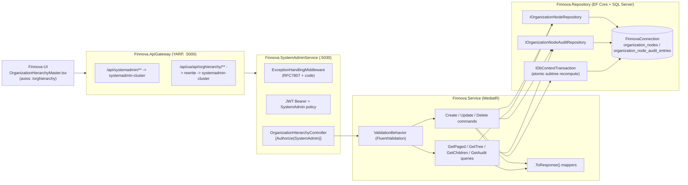
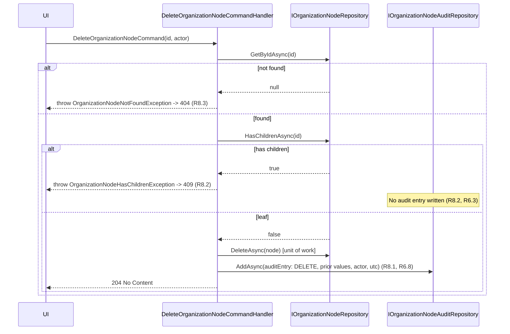
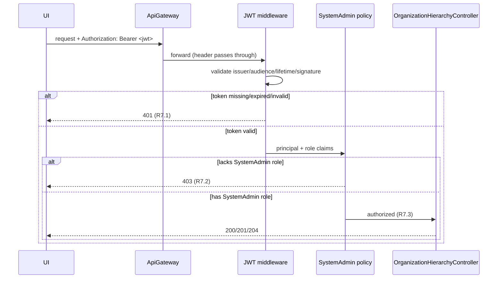

# Design Document — Organization Hierarchy Master Management

**JIRA:** FINNOVA-5 · **Module:** SystemAdmin · **Master:** Organization Hierarchy
**Related features:** Nationality Master Management (FINNOVA-9) and Lookup Master Management (FINNOVA-8) — this design mirrors their established layered CQRS conventions and extends them for a tree-structured master.

## Overview

Organization Hierarchy Master Management is a master-data capability that lets a System Administrator define the Finnova organization as a tree of nodes (for example, Head Office → Region → Branch). A node carries a code, a single English display name, a hierarchy level, an optional parent, and an active flag. A System Administrator can create nodes (root or child), rename a node and re-parent it, delete a leaf node, search nodes by code or name with pagination, read a node's direct children, and read the full hierarchy tree. Every mutation is captured in an immutable, organization-hierarchy-scoped audit trail so that changes to the standardized structure are traceable. All operations — including reads — are restricted to System Administrators.

Unlike the flat Nationality Master, this feature is **tree-structured**: creating and re-parenting nodes must preserve tree validity (unique code, valid parent, no self-parenting, no cycles, level consistency, bounded depth), and re-parenting a node cascades a level recomputation across its whole subtree. That subtree recompute must be all-or-nothing, which is the one place this design deliberately departs from the nationality per-call `SaveChanges` model (see Design Decisions).

The feature is delivered as an API-only slice inside the **existing** `Finnova.SystemAdminService` host (the same host that already exposes Lookup Master and Nationality Master), reached through the **existing** `Finnova.ApiGateway` YARP reverse proxy. The user-facing screen lives in the separate `Finnova-UI` React application.

### What already exists and is reused (NOT re-established by this feature)

The following infrastructure was established by FINNOVA-8 and reused by FINNOVA-9. It is treated as a fixed dependency. This design **adds to** it; it does not recreate or re-wire it.

| Concern | Existing asset | Reuse in this feature |
| --- | --- | --- |
| Host | `Finnova.SystemAdminService` (port 5030), `public partial class Program {}` shim present | Add `OrganizationHierarchyController`; no new host |
| AuthN | JWT Bearer (`ValidateIssuer/Audience/Lifetime/SigningKey`, `RoleClaimType = ClaimTypes.Role`) | Reused as-is |
| AuthZ | `SystemAdmin` policy = `RequireRole("SystemAdmin")` | Applied to every org-hierarchy endpoint |
| Mediation | MediatR + `Finnova.Service.Behaviors.ValidationBehavior<,>` pipeline | New commands/queries flow through it |
| Errors | `ExceptionHandlingMiddleware` → RFC 7807 `ProblemDetails` with a `code` extension | **Extended** with an OrgHierarchy branch (see Error Handling) |
| Persistence | `AddFinnovaRepository` → EF Core + SQL Server, connection string `FinnovaConnection` | Two new repositories + DbSets registered here |
| Transactions | `FinnovaDbContext` / `Database.BeginTransactionAsync` (EF Core `IDbContextTransaction`) | Used for the atomic subtree level recompute (new usage) |
| Gateway | `systemadmin-route` `/api/systemadmin/{**catch-all}` → `systemadmin-cluster`; UI-aliases `/api/ua/api/lookup/**`, `/api/ua/api/nationality/**` | **Add** an equivalent org-hierarchy UI-alias route |
| Contracts | `Finnova.Models`, generic `IRepository<T>` / `RepositoryBase<T>`, `PaginatedResponse<T>`, `.ToResponse()` mappers | Followed exactly |
| Tests | xUnit + FsCheck.Xunit (v2) + `WebApplicationFactory<Program>` in `Finnova.Tests` | Extended with org-hierarchy suites |

### What is new in this feature (designed here)

- An `OrganizationNode` entity (`Id`, `Code`, `Name`, `Level`, `ParentId?`, `IsActive`, `CreatedAt`, `UpdatedAt`) with a self-referencing parent relationship.
- A **new** organization-hierarchy-scoped audit trail: an `OrganizationNodeAuditEntry` entity + repository + table, immutable (no update/delete), written on create, update, and delete within the same unit of work. Because two fields are editable (`Name` and `ParentId`), the audit carries a **multi-field** before/after shape (`OldName`/`NewName`, `OldParentId`/`NewParentId`) — a deliberate departure from nationality's single-field shape (see Data Models design note).
- Tree-structural service logic: level resolution from parent, self-parent rejection, cycle detection via descendant walk, atomic subtree level recompute inside an explicit `IDbContextTransaction`, bounded depth (≤ 10), and leaf-only delete.
- New domain exceptions (`OrganizationNodeNotFoundException`, `OrganizationNodeHasChildrenException`, and typed validation exceptions for duplicate code / self-parent / cycle / depth-exceeded) plus an extension to `ExceptionHandlingMiddleware` mapping them to `ERR-ORG-xxx` codes.
- `OrganizationHierarchyController` with paged search, tree read, children read, create, update/re-parent, leaf delete, and audit-trail-read endpoints.
- The `Finnova-UI` Organization Hierarchy Master screen (React + MUI), mirroring `LookupMaster.tsx` / `NationalityMaster.tsx`.

### Localization

Finnova is India-only and English-only. An organization node carries a single English `Name` field. There are **no** bilingual fields, no Arabic content, and no right-to-left rendering. Any future multi-language need must be raised explicitly for confirmation.

## Requirements Coverage Map

| Requirement | Covered by |
| --- | --- |
| R1 Create node (level resolution, defaults, bounds, parent-exists, depth) | `CreateOrganizationNodeCommand` (+ validator, handler), `OrganizationHierarchyController.Create`, `OrganizationNode` entity, audit-on-create |
| R2 Prevent duplicate node code | `ExistsByCodeAsync` (case-insensitive, trimmed, `excludeId`) + unique index on `Code`; typed `OrganizationNodeDuplicateCodeException` (`"Node code must be unique"`); validation-before-duplicate ordering in validator/handler |
| R3 Enforce structural validity (self-parent, cycle, level consistency, atomic cascade, depth) | Cycle-detection descendant walk + `RecomputeSubtreeLevels` inside `IDbContextTransaction`; typed self-parent/cycle/depth exceptions; level = parent+1 invariant |
| R4 Modify node & relationships (rename, re-parent, promote-to-root, no-op) | `UpdateOrganizationNodeCommand` (+ validator, handler), `OrganizationNodeNotFoundException`, no-op detection, cascade recompute, audit-on-update |
| R5 Query, search, tree, children | `GetOrganizationNodesPagedQuery`, `GetHierarchyTreeQuery`, `GetNodeChildrenQuery` (+ validators, handlers), `GetPagedAsync`, `GetByParentIdAsync`, `GetAllForTreeAsync`, `PaginatedResponse<OrganizationNodeResponse>` |
| R6 Audit trail (create/update/delete, no-audit-on-reject/no-op, ordering, immutability) | `OrganizationNodeAuditEntry` entity/repo, `GetNodeAuditTrailQuery`, immutability (no update/delete API), audit written in the same unit of work |
| R7 AuthN/AuthZ | `[Authorize(Policy="SystemAdmin")]` on all endpoints; existing JWT scheme + `SystemAdmin` policy; middleware order enforces 401-before-403 |
| R8 Node deletion scope (leaf-only, not-found, invalid id) | `DeleteOrganizationNodeCommand` (+ validator, handler), `HasChildrenAsync`, `OrganizationNodeHasChildrenException`, audit-on-delete |

## Architecture

The feature is a vertical slice through the platform's four layers. Requests enter through the gateway, are authenticated/authorized at the host, dispatched via MediatR (with the validation pipeline), and executed by handlers over the repository layer. The re-parent handler additionally opens an explicit transaction to make the subtree level recompute atomic.



### Request lifecycle (cross-cutting)

`ExceptionHandlingMiddleware` runs first (outermost), then `UseAuthentication` → `UseAuthorization` → controller. This ordering is what guarantees a request that is both unauthenticated and lacking the role is rejected with **401** before authorization evaluates to 403 (R7.4). MediatR's `ValidationBehavior` runs FluentValidation before each handler; a failure throws a validation exception, which the middleware maps to 400. Structural rules that need the data store (parent-exists, self-parent, cycle, depth-after-recompute, duplicate-code, has-children) are enforced inside the handler and raised as typed exceptions.

### Create sequence (child node + level resolution + audit)

```mermaid
sequenceDiagram
    participant UI
    participant Ctrl as OrganizationHierarchyController
    participant Med as MediatR (+Validation)
    participant H as CreateOrganizationNodeCommandHandler
    participant NR as IOrganizationNodeRepository
    participant AR as IOrganizationNodeAuditRepository
    UI->>Ctrl: POST /orghierarchy {code,name,parentId?}
    Ctrl->>Med: CreateOrganizationNodeCommand(code,name,parentId,isActive, actor)
    Med->>Med: FluentValidation (required, lengths)
    Med->>H: Handle
    H->>NR: ExistsByCodeAsync(code)  (trim + case-insensitive)
    NR-->>H: false
    alt parentId provided
        H->>NR: GetByIdAsync(parentId)
        NR-->>H: parent (or null -> ParentNotExists validation error)
        H->>H: level = parent.Level + 1; reject if level > 10
    else no parent
        H->>H: level = 1 (root)
    end
    H->>NR: AddAsync(node{level, parentId, isActive ?? true})  [unit of work]
    H->>AR: AddAsync(auditEntry: CREATE, null->name, null->parentId, actor, utc)
    H-->>Ctrl: OrganizationNodeResponse
    Ctrl-->>UI: 201 Created
```

### Re-parent sequence (cycle check + atomic subtree level recompute + audit)

```mermaid
sequenceDiagram
    participant UI
    participant H as UpdateOrganizationNodeCommandHandler
    participant NR as IOrganizationNodeRepository
    participant TX as IDbContextTransaction
    participant AR as IOrganizationNodeAuditRepository
    UI->>H: UpdateOrganizationNodeCommand(id, newName, newParentId, actor)
    H->>NR: GetByIdAsync(id)
    alt not found
        NR-->>H: null
        H-->>UI: throw OrganizationNodeNotFoundException -> 404
    else found
        NR-->>H: node (oldName, oldParentId, oldLevel)
        alt newName == oldName AND newParentId == oldParentId
            H-->>UI: 200 (no-op, no audit)  (R4.8, R6.7)
        else changed
            H->>H: reject if newParentId == id (self-parent -> 400)
            H->>NR: GetDescendantsAsync(id)
            H->>H: reject if newParentId in descendants (cycle -> 400)
            opt newParentId provided
                H->>NR: GetByIdAsync(newParentId)  (reject if missing -> 400)
            end
            H->>H: compute new levels for node + subtree; reject if any > 10
            H->>TX: BeginTransactionAsync
            H->>NR: UpdateAsync(node: name, parentId, level)
            H->>NR: UpdateAsync(each descendant: recomputed level)
            H->>AR: AddAsync(auditEntry: UPDATE, old->new name, old->new parentId)
            H->>TX: CommitAsync   (all-or-nothing; rollback on any failure)
            H-->>UI: 200 OrganizationNodeResponse
        end
    end
```

### Leaf-only delete sequence (has-children guard + audit)



## Data Models

Two new entities are added to `Finnova.Models/Domain/Entities`. Both use `nvarchar` columns (SQL Server), consistent with the platform.

### `OrganizationNode` entity

```csharp
namespace Finnova.Models.Domain.Entities;

/// <summary>
/// A single node in the organization hierarchy tree (e.g. Head Office, a Region, a Branch).
/// Self-referencing via ParentId; a root node has ParentId == null and Level 1.
/// India-only platform: one English Name.
/// </summary>
public class OrganizationNode
{
    public Guid Id { get; set; } = Guid.NewGuid();

    public string Code { get; set; } = string.Empty;   // max 20, unique case-insensitive (R1, R2)
    public string Name { get; set; } = string.Empty;   // max 150, single English name (R1, R4)

    public int Level { get; set; }                      // resolved from parent; root = 1 (R1.2, R1.3, R3.3)
    public Guid? ParentId { get; set; }                 // null for a root node (R1.2, R3.6)

    public bool IsActive { get; set; } = true;          // default true (R1.4)

    public DateTime CreatedAt { get; set; } = DateTime.UtcNow;
    public DateTime UpdatedAt { get; set; } = DateTime.UtcNow;
}
```

### `OrganizationNodeAuditEntry` entity (new audit trail)

```csharp
namespace Finnova.Models.Domain.Entities;

/// <summary>
/// Immutable audit record capturing one change to an organization node (R6). Written on
/// create, update (rename and/or re-parent), and delete within the same unit of work.
/// Never updated or deleted. Because two fields are editable (Name, ParentId), before/after
/// values are captured per editable field.
/// </summary>
public class OrganizationNodeAuditEntry
{
    public Guid Id { get; set; } = Guid.NewGuid();

    public Guid NodeId { get; set; }                        // affected node (R6.1/6.2/6.8)
    public OrganizationNodeAuditAction Action { get; set; } // Create | Update | Delete

    // Editable-field before/after pairs. On Create, Old* are null and New* are the created values.
    // On Delete, New* are null and Old* are the prior values of the deleted node.
    public string? OldName { get; set; }
    public string? NewName { get; set; }
    public Guid? OldParentId { get; set; }                  // absent parent = null (root) (R6.1)
    public Guid? NewParentId { get; set; }

    public string ChangedBy { get; set; } = string.Empty;   // acting admin id from JWT (R6.1/6.2/6.8)
    public DateTime ChangedAtUtc { get; set; } = DateTime.UtcNow; // UTC timestamp (R6.1/6.2/6.8)
}
```

```csharp
namespace Finnova.Models.Domain.Enums;

/// <summary>Discriminates the mutation an audit entry records (R6.1, R6.2, R6.8).</summary>
public enum OrganizationNodeAuditAction
{
    Create = 0,
    Update = 1,
    Delete = 2
}
```

> **Design note (multi-field before/after shape):** Nationality's audit stores a single `OldName`/`NewName` pair because only `Name` is editable. Here **two** fields are editable — `Name` (rename) and `ParentId` (re-parent) — and R6.1 requires the prior and new values of **each changed field**. So the audit captures both pairs (`OldName`/`NewName`, `OldParentId`/`NewParentId`). An absent parent is represented as `null` on the parent columns (a root node), satisfying R6.1's "absent Parent is represented as no parent value". On `Create`, the `Old*` columns are `null` and the `New*` columns hold the resolved values (R6.2); on `Delete`, the `New*` columns are `null` and the `Old*` columns hold the prior values (R6.8). `Level` is intentionally **not** audited as an editable field — it is a derived value (always parent level + 1), not an operator-supplied field, so recording `Name` and `ParentId` fully explains every recorded change. If the editable surface grows further, promoting to a generic `FieldName/OldValue/NewValue` shape (or shared audit infra) is the migration path (see Design Decisions).

### EF Core configuration

Two `IEntityTypeConfiguration<T>` classes in `Finnova.Repository/Configuration`, auto-discovered by the existing `ApplyConfigurationsFromAssembly` call.

```csharp
// OrganizationNodeConfiguration
builder.ToTable("organization_nodes");
builder.HasKey(x => x.Id);
builder.Property(x => x.Code).IsRequired().HasMaxLength(20);
builder.Property(x => x.Name).IsRequired().HasMaxLength(150);
builder.Property(x => x.Level).IsRequired();
builder.Property(x => x.IsActive).IsRequired();
// Uniqueness of Code (R2.1/2.2). SQL Server default collation (e.g. SQL_Latin1_General_CP1_CI_AS)
// is case-insensitive, so the unique index backs the case-insensitive rule. Codes are trimmed
// by the handler before persistence so stored values are canonical.
builder.HasIndex(x => x.Code).IsUnique();
// Query path: search/order by Name (R5.9).
builder.HasIndex(x => x.Name);
// Children lookup and cycle/descendant walks read by ParentId (R5.10, R3.2, R8.2).
builder.HasIndex(x => x.ParentId);
// Self-referencing parent relationship. NO cascade delete at the DB level — leaf-only delete is
// enforced in the service (R8.2), so the DB must never silently remove a subtree.
builder.HasOne<OrganizationNode>()
       .WithMany()
       .HasForeignKey(x => x.ParentId)
       .OnDelete(DeleteBehavior.Restrict);
```

```csharp
// OrganizationNodeAuditEntryConfiguration
builder.ToTable("organization_node_audit_entries");
builder.HasKey(x => x.Id);
builder.Property(x => x.NodeId).IsRequired();
builder.Property(x => x.Action).IsRequired();          // stored as int
builder.Property(x => x.OldName).HasMaxLength(150);    // nullable
builder.Property(x => x.NewName).HasMaxLength(150);    // nullable (null on Delete)
builder.Property(x => x.OldParentId);                  // nullable
builder.Property(x => x.NewParentId);                  // nullable
builder.Property(x => x.ChangedBy).IsRequired().HasMaxLength(200);
builder.Property(x => x.ChangedAtUtc).IsRequired();
// Read path: entries for a node ordered by time desc then id desc (R6.4).
builder.HasIndex(x => new { x.NodeId, x.ChangedAtUtc });
```

No FK constraint is enforced between `OrganizationNodeAuditEntry.NodeId` and `OrganizationNode.Id`, so audit entries survive a node's deletion (a Delete entry must outlive the node it records, per R6.8) and the "missing id returns empty" read (R6.5) needs no special handling. Immutability (R6.6) is enforced by not exposing any update/delete path (repository or API) for audit entries.

Both are added to `FinnovaDbContext`:

```csharp
public DbSet<OrganizationNode> OrganizationNodes => Set<OrganizationNode>();
public DbSet<OrganizationNodeAuditEntry> OrganizationNodeAuditEntries => Set<OrganizationNodeAuditEntry>();
```

### Migration note

A single EF Core migration adds both tables, the unique index on `Code`, the `Name` and `ParentId` indexes, the composite `(NodeId, ChangedAtUtc)` audit index, and the restricted self-referencing FK. Generated with the platform's convention:

```
dotnet ef migrations add AddOrganizationHierarchyAndAudit \
  --project Finnova.Repository --startup-project Finnova.SystemAdminService
```

Applied via `dotnet ef database update` (or the host's existing startup migration path). No seed data is required by the requirements; if a smoke seed is desired it must be English-only (e.g. `HO` / `Head Office`).

## Contracts

New records under `Finnova.Models/Contracts/OrganizationHierarchy` (following the `Lookups` / `Nationalities` folder pattern).

```csharp
// CreateOrganizationNodeRequest.cs — ParentId nullable (root when absent, R1.2);
// IsActive nullable so the service defaults it to true (R1.4). Level is NOT accepted from the
// client; it is always resolved from the parent (R1.3).
public record CreateOrganizationNodeRequest(string Code, string Name, Guid? ParentId, bool? IsActive);

// UpdateOrganizationNodeRequest.cs — Name (rename) and ParentId (re-parent) are editable (R4).
// A null ParentId promotes the node to a root (R4.3). Code is immutable post-create.
public record UpdateOrganizationNodeRequest(string Name, Guid? ParentId);

// OrganizationNodeResponse.cs — admin-facing response (R1.1 returns id + resolved Level/Parent/IsActive).
public record OrganizationNodeResponse(
    Guid Id,
    string Code,
    string Name,
    int Level,
    Guid? ParentId,
    bool IsActive,
    DateTime CreatedAt,
    DateTime UpdatedAt);

// OrganizationNodeTreeResponse.cs — recursive tree node (R5.11, R5.15).
public record OrganizationNodeTreeResponse(
    Guid Id,
    string Code,
    string Name,
    int Level,
    Guid? ParentId,
    bool IsActive,
    List<OrganizationNodeTreeResponse> Children);

// OrganizationNodeAuditEntryResponse.cs — one audit row (R6.4).
public record OrganizationNodeAuditEntryResponse(
    Guid Id,
    Guid NodeId,
    string Action,          // "Create" | "Update" | "Delete"
    string? OldName,
    string? NewName,
    Guid? OldParentId,
    Guid? NewParentId,
    string ChangedBy,
    DateTime ChangedAtUtc);
```

The paged search reuses the existing `PaginatedResponse<T>` exactly:

```csharp
PaginatedResponse<OrganizationNodeResponse>(List<OrganizationNodeResponse> Data, int Total, int Page, int PageSize, int TotalPages)
```

## Components and Interfaces

### Repository Layer (`Finnova.Repository`)

Two feature repositories, each a specialization of the generic base, registered in `DependencyInjection.AddFinnovaRepository`.

```csharp
public interface IOrganizationNodeRepository : IRepository<OrganizationNode>
{
    /// <summary>Search + page (R5). Term filters Code OR Name (substring, case-insensitive);
    /// null/blank term = no filter. Ordered by Level asc, then Name asc, then Code asc (R5.9).
    /// Returns page + total.</summary>
    Task<(List<OrganizationNode> Items, int Total)> GetPagedAsync(
        string? searchTerm, int page, int pageSize, CancellationToken ct = default);

    /// <summary>Case-insensitive, trimmed uniqueness check on Code (R2). excludeId excludes the
    /// node being updated so a future code-edit path can reuse it (currently Code is immutable).</summary>
    Task<bool> ExistsByCodeAsync(string code, Guid? excludeId = null, CancellationToken ct = default);

    /// <summary>Direct children of a node, ordered Name asc then Code asc (R5.10). Empty when leaf.</summary>
    Task<List<OrganizationNode>> GetByParentIdAsync(Guid parentId, CancellationToken ct = default);

    /// <summary>All descendants of a node (transitive closure), used for cycle detection and
    /// subtree level recompute (R3.2, R3.4). Excludes the node itself.</summary>
    Task<List<OrganizationNode>> GetDescendantsAsync(Guid nodeId, CancellationToken ct = default);

    /// <summary>True if the node has at least one direct child — leaf-only delete guard (R8.2).</summary>
    Task<bool> HasChildrenAsync(Guid nodeId, CancellationToken ct = default);

    /// <summary>Full node set for building the hierarchy tree in memory (R5.11, R5.15).</summary>
    Task<List<OrganizationNode>> GetAllForTreeAsync(CancellationToken ct = default);
}

public interface IOrganizationNodeAuditRepository : IRepository<OrganizationNodeAuditEntry>
{
    /// <summary>Audit entries for a node, ordered ChangedAtUtc desc then Id desc (R6.4).
    /// Missing id returns an empty list, never an error (R6.5).</summary>
    Task<List<OrganizationNodeAuditEntry>> GetByNodeIdAsync(Guid nodeId, CancellationToken ct = default);
}
```

`OrganizationNodeRepository` implementation notes (mirrors `NationalityRepository` / `LookupRepository`):

```csharp
public async Task<(List<OrganizationNode> Items, int Total)> GetPagedAsync(
    string? searchTerm, int page, int pageSize, CancellationToken ct = default)
{
    var query = DbSet.AsNoTracking().AsQueryable();
    if (!string.IsNullOrWhiteSpace(searchTerm))
    {
        var term = searchTerm.Trim();
        // EF Core translates Contains to SQL LIKE; default CI collation makes it case-insensitive (R5.1).
        query = query.Where(x => x.Code.Contains(term) || x.Name.Contains(term));
    }
    var total = await query.CountAsync(ct);                            // total before paging (R5.3)
    var items = await query
        .OrderBy(x => x.Level).ThenBy(x => x.Name).ThenBy(x => x.Code)  // deterministic order (R5.9)
        .Skip((page - 1) * pageSize).Take(pageSize)
        .ToListAsync(ct);
    return (items, total);
}

public async Task<bool> ExistsByCodeAsync(string code, Guid? excludeId = null, CancellationToken ct = default)
{
    var c = code.Trim();
    return await DbSet.AsNoTracking().AnyAsync(
        x => x.Code == c && (excludeId == null || x.Id != excludeId), ct);   // CI via collation (R2.1)
}

public async Task<List<OrganizationNode>> GetByParentIdAsync(Guid parentId, CancellationToken ct = default) =>
    await DbSet.AsNoTracking()
        .Where(x => x.ParentId == parentId)
        .OrderBy(x => x.Name).ThenBy(x => x.Code)   // R5.10
        .ToListAsync(ct);

public async Task<bool> HasChildrenAsync(Guid nodeId, CancellationToken ct = default) =>
    await DbSet.AsNoTracking().AnyAsync(x => x.ParentId == nodeId, ct);   // R8.2
```

`GetDescendantsAsync` walks the tree breadth-first over the loaded set (or a recursive CTE where the provider supports it) to produce the transitive closure used by cycle detection and subtree recompute:

```csharp
public async Task<List<OrganizationNode>> GetDescendantsAsync(Guid nodeId, CancellationToken ct = default)
{
    var all = await DbSet.AsNoTracking().ToListAsync(ct);
    var byParent = all.ToLookup(x => x.ParentId);
    var result = new List<OrganizationNode>();
    var frontier = new Queue<Guid>(byParent[nodeId].Select(c => c.Id));
    var seen = new HashSet<Guid>();
    while (frontier.Count > 0)
    {
        var id = frontier.Dequeue();
        if (!seen.Add(id)) continue;                 // guards against pre-existing bad data
        var node = all.First(x => x.Id == id);
        result.Add(node);
        foreach (var child in byParent[id]) frontier.Enqueue(child.Id);
    }
    return result;                                    // excludes nodeId itself (R3.2, R3.4)
}
```

`OrganizationNodeAuditRepository.GetByNodeIdAsync`:

```csharp
return await DbSet.AsNoTracking()
    .Where(x => x.NodeId == nodeId)
    .OrderByDescending(x => x.ChangedAtUtc).ThenByDescending(x => x.Id)   // R6.4
    .ToListAsync(ct);   // empty list when none match (R6.5)
```

DI registration additions:

```csharp
services.AddScoped<IOrganizationNodeRepository, OrganizationNodeRepository>();
services.AddScoped<IOrganizationNodeAuditRepository, OrganizationNodeAuditRepository>();
```

> **Unit of work note:** `RepositoryBase.AddAsync`/`UpdateAsync` call `SaveChangesAsync` per call. For **create** and **delete**, the mutation and its single audit entry are written sequentially in the same scoped `FinnovaDbContext` (identical to nationality). For **re-parent updates** the moved node plus every descendant's recomputed `Level` plus the audit entry must be all-or-nothing, so the update handler opens an explicit `IDbContextTransaction` (`Database.BeginTransactionAsync`) around the whole recompute and commits once, rolling back on any failure. This is a **deliberate deviation** from nationality's per-call `SaveChanges` because a partially recomputed subtree would violate the level invariant (see Design Decisions).

### Service Layer (`Finnova.Service/OrganizationHierarchy`)

CQRS slice mirroring `Finnova.Service/Nationality`. The acting administrator identifier is resolved in the controller from the JWT (`sub`/`name` claim) and passed into commands so handlers stay free of `HttpContext`. A shared, pure `MaxDepth = 10` constant governs depth checks (R1.8, R3.5).

**Commands**

- `CreateOrganizationNodeCommand(string Code, string Name, Guid? ParentId, bool? IsActive, string ActingAdmin) : IRequest<OrganizationNodeResponse>`
  - Validator (`AbstractValidator`): `Code` NotEmpty + MaxLength(20); `Name` NotEmpty + MaxLength(150) (R1.5, R1.6, R2.5). Length/required validation runs **before** the handler's duplicate check (R2.6).
  - Handler: trim `Code`; `ExistsByCodeAsync` → throw `OrganizationNodeDuplicateCodeException("Node code must be unique")` if duplicate (R2.2), writing no record and no audit (R6.3). Resolve level: if `ParentId` is null → `Level = 1` (root, R1.2); else `GetByIdAsync(ParentId)` → throw typed parent-not-exists validation error if missing (R1.7), else `Level = parent.Level + 1` (R1.3); reject with typed depth-exceeded error if `Level > 10` (R1.8). Ignore any client-supplied level (R1.3). `AddAsync` the node with `IsActive ?? true` (R1.4), then `AddAsync` a `Create` audit entry (`OldName=null`, `NewName=name`, `OldParentId=null`, `NewParentId=parentId`, `ChangedBy=ActingAdmin`, `ChangedAtUtc=UtcNow`) (R6.2). Returns `node.ToResponse()`.

- `UpdateOrganizationNodeCommand(Guid Id, string Name, Guid? ParentId, string ActingAdmin) : IRequest<OrganizationNodeResponse>`
  - Validator: `Id` NotEmpty; `Name` NotEmpty + MaxLength(150) (R4.4, R4.5).
  - Handler:
    1. `GetByIdAsync(Id)` or throw `OrganizationNodeNotFoundException` (R4.7, nothing changed).
    2. **No-op detection:** if trimmed `Name` equals current `Name` **and** `ParentId` equals current `ParentId`, return the existing record unchanged with **no** audit entry and **no** `UpdatedAt` change (R4.8, R6.7).
    3. **Self-parent:** if `ParentId == Id`, throw typed self-parent validation error (R3.1).
    4. **Cycle:** if `ParentId` is non-null, load `GetDescendantsAsync(Id)`; if `ParentId` is in that descendant set, throw typed cycle validation error (R3.2). Also validate the parent exists via `GetByIdAsync(ParentId)` (R4.6).
    5. **Level recompute + depth bound:** new level of the moved node = `1` if `ParentId` null (promote to root, R4.3) else `parent.Level + 1`; recompute each descendant's level as `parentLevel + 1` walking down; if any recomputed level `> 10` or `< 1`, throw typed depth-exceeded validation error and change nothing (R3.5).
    6. **Atomic apply:** open `IDbContextTransaction`; capture `oldName`/`oldParentId`; set `Name`, `ParentId`, `Level`, refresh `UpdatedAt`; `UpdateAsync` the node and each descendant with its recomputed level (R3.4, R4.1, R4.2); `AddAsync` one `Update` audit entry (`OldName→NewName`, `OldParentId→NewParentId`) (R6.1); commit. Rollback on any exception. Returns `node.ToResponse()`.

- `DeleteOrganizationNodeCommand(Guid Id, string ActingAdmin) : IRequest<Unit>`
  - Validator: `Id` NotEmpty (R8.4).
  - Handler: `GetByIdAsync(Id)` or throw `OrganizationNodeNotFoundException` (R8.3). `HasChildrenAsync(Id)` → if true, throw `OrganizationNodeHasChildrenException` (R8.2), writing no audit (R6.3). Otherwise capture prior values, `DeleteAsync` the node, then `AddAsync` a `Delete` audit entry (`OldName=priorName`, `NewName=null`, `OldParentId=priorParentId`, `NewParentId=null`) (R6.8, R8.1). Returns `Unit`.

**Queries**

- `GetOrganizationNodesPagedQuery(string? SearchTerm, int Page = 1, int PageSize = 20) : IRequest<PaginatedResponse<OrganizationNodeResponse>>`
  - Validator: `Page >= 1` (R5.6); `PageSize` InclusiveBetween(1, 100) (R5.7). Blank/whitespace term is treated as no term by the repository (R5.2).
  - Handler: calls `GetPagedAsync`, computes `TotalPages = ceil(Total / PageSize)`, returns `PaginatedResponse<OrganizationNodeResponse>` (R5.3, R5.4, R5.5, R5.8, R5.13).

- `GetNodeChildrenQuery(Guid NodeId) : IRequest<List<OrganizationNodeResponse>>`
  - Handler: `GetByIdAsync(NodeId)` → throw `OrganizationNodeNotFoundException` if missing (R5.12). Otherwise `GetByParentIdAsync(NodeId)` → maps to responses; a leaf yields an empty list, not an error (R5.10, R5.14).

- `GetHierarchyTreeQuery() : IRequest<List<OrganizationNodeTreeResponse>>`
  - Handler: `GetAllForTreeAsync`, builds nested `OrganizationNodeTreeResponse` roots in memory. Roots (`ParentId == null`) at the top level ordered by `Name asc, Code asc`; each node's children ordered the same way (R5.11). Empty set → empty list, no error (R5.15).

- `GetNodeAuditTrailQuery(Guid NodeId) : IRequest<List<OrganizationNodeAuditEntryResponse>>`
  - Handler: `GetByNodeIdAsync`, maps to responses. Missing id → empty list (R6.5).

**Tree building (pure helper).** The tree is assembled from the flat node set with deterministic ordering, so it is fully unit-testable without a database:

```csharp
public static List<OrganizationNodeTreeResponse> BuildTree(IReadOnlyCollection<OrganizationNode> nodes)
{
    var byParent = nodes.ToLookup(n => n.ParentId);
    List<OrganizationNodeTreeResponse> Children(Guid? parentId) =>
        byParent[parentId]
            .OrderBy(n => n.Name).ThenBy(n => n.Code)          // R5.11 ordering
            .Select(n => new OrganizationNodeTreeResponse(
                n.Id, n.Code, n.Name, n.Level, n.ParentId, n.IsActive, Children(n.Id)))
            .ToList();
    return Children(null);                                      // roots first; empty when no nodes (R5.15)
}
```

**Cycle detection (pure helper).** Re-parenting is rejected when the target parent is the node itself or any of its descendants:

```csharp
// reject if newParentId == nodeId (R3.1) OR newParentId is a descendant of nodeId (R3.2)
bool WouldCreateCycle(Guid nodeId, Guid? newParentId, ISet<Guid> descendantIds) =>
    newParentId is Guid p && (p == nodeId || descendantIds.Contains(p));
```

**Mappers** (`Finnova.Service/Mappers/OrganizationNodeMapper.cs`) — static `.ToResponse()` extensions preserving every field:

```csharp
public static OrganizationNodeResponse ToResponse(this OrganizationNode x) =>
    new(x.Id, x.Code, x.Name, x.Level, x.ParentId, x.IsActive, x.CreatedAt, x.UpdatedAt);

public static List<OrganizationNodeResponse> ToResponseList(this IEnumerable<OrganizationNode> items) =>
    items.Select(i => i.ToResponse()).ToList();

public static OrganizationNodeAuditEntryResponse ToResponse(this OrganizationNodeAuditEntry a) =>
    new(a.Id, a.NodeId, a.Action.ToString(), a.OldName, a.NewName,
        a.OldParentId, a.NewParentId, a.ChangedBy, a.ChangedAtUtc);
```

### API Layer (`Finnova.SystemAdminService/Controllers/OrganizationHierarchyController.cs`)

`[ApiController]`, `[Route("api/orghierarchy")]`, every action `[Authorize(Policy = "SystemAdmin")]` (R7.1–R7.3 — read is admin-only too). The acting admin id is read from `User` claims (`ClaimTypes.NameIdentifier`/`sub` fallback to `Name`).

#### Endpoint summary

| Method | Route | Auth | Body / Query | Success | Purpose | Reqs |
| --- | --- | --- | --- | --- | --- | --- |
| GET | `api/orghierarchy` | SystemAdmin | `?search=&page=1&pageSize=20` | 200 `PaginatedResponse<OrganizationNodeResponse>` | Paged search | R5.1–R5.9, R5.13 |
| GET | `api/orghierarchy/tree` | SystemAdmin | — | 200 `List<OrganizationNodeTreeResponse>` | Full hierarchy tree | R5.11, R5.15 |
| GET | `api/orghierarchy/{id:guid}/children` | SystemAdmin | — | 200 `List<OrganizationNodeResponse>` | Direct children | R5.10, R5.12, R5.14 |
| POST | `api/orghierarchy` | SystemAdmin | `CreateOrganizationNodeRequest` | 201 `OrganizationNodeResponse` | Create (root or child) | R1, R2, R3 |
| PUT | `api/orghierarchy/{id:guid}` | SystemAdmin | `UpdateOrganizationNodeRequest` | 200 `OrganizationNodeResponse` | Rename / re-parent | R3, R4 |
| DELETE | `api/orghierarchy/{id:guid}` | SystemAdmin | — | 204 No Content | Leaf-only delete | R8 |
| GET | `api/orghierarchy/{id:guid}/audit` | SystemAdmin | — | 200 `List<OrganizationNodeAuditEntryResponse>` | Audit trail (desc) | R6.4, R6.5 |

`Create` returns `CreatedAtAction(nameof(GetChildren), new { id = result.Id }, result)` → 201. `GetChildren` returns 200 with a possibly-empty list for a leaf (R5.14) but 404 for a missing node (R5.12). `GetAuditTrail` always returns 200 with a possibly-empty list (R6.5). `Delete` returns 204 on success.

#### Exception-to-status mapping (OrgHierarchy branch)

| Exception / condition | HTTP | `code` | Requirement |
| --- | --- | --- | --- |
| `OrganizationNodeNotFoundException` | 404 | `ERR-ORG-404` | R4.7, R5.12, R8.3 |
| `OrganizationNodeDuplicateCodeException` (`"Node code must be unique"`) | 409 | `ERR-ORG-409` | R2.2, R2.3 |
| `OrganizationNodeHasChildrenException` | 409 | `ERR-ORG-409` | R8.2 |
| Validation: missing/empty/length, page/pageSize range | 400 | `ERR-ORG-400` | R1.5, R1.6, R2.5, R4.4, R4.5, R5.6, R5.7, R8.4 |
| Validation: parent-not-exists, self-parent, cycle, depth-exceeded | 400 | `ERR-ORG-400` | R1.7, R1.8, R3.1, R3.2, R3.5, R4.6 |
| Missing/expired/invalid token | 401 | (auth middleware) | R7.1 |
| Authenticated, non-admin | 403 | (auth middleware) | R7.2 |
| Any other exception | 500 | `ERR-ORG-500` | — |

> Structural and duplicate/has-children failures are raised as **typed** exceptions (not string-sniffed generic validation), so the middleware maps them by type to the correct `ERR-ORG-4xx` code. This mirrors nationality design decision 6, which recommended typed exceptions over message matching.

## Error Handling

The existing `ExceptionHandlingMiddleware` currently switches on `Lookup*` and `Nationality*` exceptions. This design **extends** that switch with an org-hierarchy branch — it does not replace the existing branches. The extended switch (conceptual):

```csharp
var (status, code, detail) = ex switch
{
    // ---- existing lookup / nationality branches (unchanged) ----
    LookupNotFoundException => (404, "ERR-LKP-404", ex.Message),
    NationalityNotFoundException => (404, "ERR-NAT-404", ex.Message),
    // ... existing nationality duplicate/validation mappings ...

    // ---- new org-hierarchy branch (typed, no message sniffing) ----
    OrganizationNodeNotFoundException => (404, "ERR-ORG-404", ex.Message),
    OrganizationNodeDuplicateCodeException => (409, "ERR-ORG-409", ex.Message),
    OrganizationNodeHasChildrenException => (409, "ERR-ORG-409", ex.Message),
    OrganizationNodeValidationException => (400, "ERR-ORG-400", ex.Message), // self-parent / cycle / depth / parent-not-exists

    // generic FluentValidation (required/length/page-range) -> 400
    FluentValidation.ValidationException v => (400, "ERR-ORG-400", v.Message),

    _ => (500, "ERR-ORG-500", "Unexpected error.")
};
```

Because a plain `FluentValidation.ValidationException` is shared across features, the org-hierarchy structural failures (self-parent, cycle, depth, parent-not-exists) are raised as a dedicated `OrganizationNodeValidationException` (or per-case subclasses) so they map cleanly to `ERR-ORG-400` by type. The duplicate-code and has-children conflicts get their own typed exceptions mapping to `ERR-ORG-409`. The `new(...)` `ProblemDetails` shape (`Status`, `Title = code`, `Detail`, `Extensions["code"] = code`) is unchanged, so the UI keeps reading `error.response.data.message` and the `code` extension exactly as it does today.

Key error behaviors:
- Rejected create/update (validation, duplicate, self-parent, cycle, depth, parent-not-exists) writes **no** node record and **no** audit entry (R1.5–R1.8, R2.2, R3.1, R3.2, R3.5, R4.4–R4.6, R6.3).
- Rejected leaf-delete (has children) preserves the node and its children and writes **no** audit entry (R8.2, R6.3).
- Not-found update/delete/children-read leaves the master unchanged (R4.7, R5.12, R8.3).
- Same-name-and-same-parent update is a no-op: no field change, no `UpdatedAt` change, no audit (R4.8, R6.7).
- Audit read for a missing id is **not** an error — it returns 200 with `[]` (R6.5).
- Tree read on an empty master returns 200 with `[]` (R5.15); children read on a leaf returns 200 with `[]` (R5.14).
- Audit entries have no update/delete endpoint, so any attempt to mutate them is unsupported by design (R6.6).
- The subtree level recompute commits within one explicit transaction, so a mid-recompute failure rolls the whole re-parent back with no partial persistence (R3.4).

## Security & Authentication Flow

This feature adds no new authentication or authorization infrastructure — it consumes the scheme and policy the host already configures.



- Middleware order (`Authentication` before `Authorization`) enforces **401-before-403** for requests that both fail token validity and lack the role (R7.4).
- All seven endpoints carry `[Authorize(Policy = "SystemAdmin")]`, so read (query, tree, children, audit) is admin-only (R7 assumption confirmed: no broader read access). If consuming-module reads later need active-only public access, that is a new requirement to be raised explicitly (product-context rule on assumptions).
- `ChangedBy` is derived from the validated principal's claims, not from request input, so the audit actor cannot be spoofed by the client body.

## Frontend Design (Finnova-UI)

Implemented in `E:\Finnova\Finnova-UI\Finnova-UI` (React 18 + TypeScript + MUI + Vite; hooks + Context; **no Redux, no RxJS**; tests in **Vitest + React Testing Library**). This section is a **file-by-file manual implementation guide** — the developer applies every change by hand. It mirrors the **Nationality Master** (the closest analog: a code+name master with an audit trail) and extends it for the tree structure.

> **⚠️ NAMING-COLLISION WARNING — read first.** The Finnova-UI repo **already contains** a completely unrelated **Company Master** feature that owns these exact names:
> `src/models/organization.model.ts`, `src/services/organization.service.ts`, `src/pages/OrganizationForm.tsx`, the interface `IOrganizationService`, the exported `organizationService`, and the route `/organizations` (labeled **"Company Master"** in `Layout.tsx`). That feature is a single-company profile (PAN / GST / constitution type / addresses) and has **nothing to do** with this hierarchy.
>
> This feature MUST NOT reuse, rename, or overwrite any of those. Use the distinct **`orgHierarchy` / `OrgHierarchy`** namespace everywhere:
> `orgHierarchy.model.ts`, `orgHierarchy.service.ts`, `orgHierarchy.interface.ts`, `IOrgHierarchyService`, `orgHierarchyService`, `orgHierarchyMockService`, `orgHierarchyRealService`, `OrgHierarchyMaster.tsx`, components under `src/components/orgHierarchy/`, and the UI route **`/org-hierarchy`**. The backend controller route `/orghierarchy` and the gateway alias `/api/ua/api/orghierarchy/**` (defined elsewhere in this design) are unchanged; the UI real-service `basePath` is `'/orghierarchy'`.

> **⚠️ UI-STACK NOTE (grounded in the actual `package.json`).** The masters render lists with **`DataGrid` from `@mui/x-data-grid`** — that package **is already a dependency** (`@mui/x-data-grid@^7.18.0`) and `NationalityGrid.tsx` uses it. Reuse it; **no new dependency is needed for the flat list.** However, **`@mui/x-tree-view` is NOT installed.** For the hierarchy tree, the recommended approach is a **custom recursive MUI component** built from `List` / `ListItemButton` / `Collapse` (the same nested-`Collapse` pattern already used in `Layout.tsx`), which adds **zero** dependencies. Adding `@mui/x-tree-view` (for `RichTreeView`/`SimpleTreeView`) is the **only** case that introduces a new npm dependency and is optional — choose it only if a richer built-in tree UX is wanted.

### Established repo conventions to follow

Every master in this repo is wired the same way; mirror it exactly for `orgHierarchy`:

| Concern | Location / convention |
| --- | --- |
| Model | `src/models/<feature>.model.ts`, barrel-exported via `export * from './<feature>.model';` in `src/models/index.ts`. `PaginatedResponse<T>` comes from `src/models/api.model.ts`. |
| Service interface | `src/services/interfaces/<feature>.interface.ts`, barrel-exported via `export type { ... } from './<feature>.interface';` in `src/services/interfaces/index.ts`. |
| Mock service | `src/services/mock/<feature>.mock.ts` — a class implementing the interface, exported as `<feature>MockService`. |
| Real service | `src/services/real/<feature>.real.ts` — a class using the shared `api` axios instance, exported as `<feature>RealService`. |
| Toggle | `src/services/<feature>.service.ts` — `const useMock = import.meta.env.VITE_USE_MOCK_API === 'true'; export const <feature>Service = useMock ? <feature>MockService : <feature>RealService;`, re-exported via `export { <feature>Service } from './<feature>.service';` in `src/services/index.ts`. |
| Page | `src/pages/<Feature>Master.tsx` (hooks only), route registered in `src/App.tsx` inside the `ProtectedRoute`/`Layout` group, nav item added to the `Administration` group in `src/components/Layout.tsx`. |
| Components | `src/components/<feature>/` split per concern: `<Feature>Grid.tsx`, `<Feature>AddDialog.tsx`, `<Feature>EditDialog.tsx`, `<Feature>AuditDialog.tsx`. |
| HTTP | Shared axios `src/services/api.ts` — base URL already carries the gateway UA prefix (`.../api/ua/api`), injects the JWT Bearer token from `localStorage('finnova_token')`, and centrally toasts 401/403/409/timeout by reading `error.response.data.message`. Never create an ad-hoc axios client. |

### Gateway alias + service base URL (backend/gateway — already specified elsewhere)

So the UI can reach the SystemAdmin-hosted endpoints through the shared axios base URL, the gateway aliases `/api/ua/api/orghierarchy/**` to `systemadmin-cluster` (mirroring the existing lookup/nationality aliases in `Finnova.ApiGateway/appsettings.json`). With that alias present, the real service uses a service-relative `basePath = '/orghierarchy'` — identical convention to `nationality.real.ts`'s `'/nationality'`. Host separation is preserved; nothing is collapsed. (This is the same alias described in Architecture; the UI does not add gateway config.)

---

### FILE 1 — CREATE `src/models/orgHierarchy.model.ts`

India-only, English-only: a node carries a **single** `name` field (no bilingual/`nameEn`/`nameAr` fields, no RTL).

```typescript
// India-only platform: a node carries ONE English `name`. No bilingual fields, no RTL.

/** A single organization-hierarchy node as returned by the API (paged/list read). */
export interface OrgHierarchyNode {
  id: string;
  code: string;
  name: string;              // single English display name
  level: number;             // resolved from parent; root = 1
  parentId: string | null;   // null => root node
  isActive: boolean;
  createdAt: string;
  updatedAt: string;
}

/** Recursive tree node returned by getTree(). */
export interface OrgHierarchyNodeTree
  extends Omit<OrgHierarchyNode, 'createdAt' | 'updatedAt'> {
  children: OrgHierarchyNodeTree[];
}

/** Payload for creating a node (Add dialog). Level is resolved server-side from parentId. */
export interface OrgHierarchyNodeFormData {
  code: string;
  name: string;
  parentId: string | null;   // null => create a root
  isActive: boolean;
}

/** Payload for updating a node (Edit dialog): rename and/or re-parent. Code is immutable. */
export interface OrgHierarchyNodeUpdateData {
  name: string;
  parentId: string | null;   // null => promote to root
}

/** One immutable audit row. Two editable fields => before/after pairs for name and parent. */
export interface OrgHierarchyNodeAuditEntry {
  id: string;
  nodeId: string;
  action: 'Create' | 'Update' | 'Delete';
  oldName: string | null;      // null on Create
  newName: string | null;      // null on Delete
  oldParentId: string | null;  // null = root (or on Create)
  newParentId: string | null;  // null = root (or on Delete)
  changedBy: string;
  changedAtUtc: string;
}
```

### FILE 2 — MODIFY `src/models/index.ts`

Append one line (keep alphabetical-ish grouping consistent with the file):

```typescript
export * from './orgHierarchy.model';
```

### FILE 3 — CREATE `src/services/interfaces/orgHierarchy.interface.ts`

```typescript
import type {
  OrgHierarchyNode,
  OrgHierarchyNodeTree,
  OrgHierarchyNodeFormData,
  OrgHierarchyNodeUpdateData,
  OrgHierarchyNodeAuditEntry,
} from '../../models';
import type { PaginatedResponse } from '../../models';

export interface OrgHierarchyQueryParams {
  search?: string;
  page?: number;
  pageSize?: number;
}

export interface IOrgHierarchyService {
  getPaged(params: OrgHierarchyQueryParams): Promise<PaginatedResponse<OrgHierarchyNode>>;
  getTree(): Promise<OrgHierarchyNodeTree[]>;
  getChildren(id: string): Promise<OrgHierarchyNode[]>;
  create(data: OrgHierarchyNodeFormData): Promise<OrgHierarchyNode>;
  update(id: string, data: OrgHierarchyNodeUpdateData): Promise<OrgHierarchyNode>;
  remove(id: string): Promise<void>;
  getAuditTrail(id: string): Promise<OrgHierarchyNodeAuditEntry[]>;
}
```

### FILE 4 — MODIFY `src/services/interfaces/index.ts`

Append:

```typescript
export type { IOrgHierarchyService, OrgHierarchyQueryParams } from './orgHierarchy.interface';
```

### FILE 5 — CREATE `src/services/real/orgHierarchy.real.ts`

Reuses the shared `api` instance (JWT + central error toasts). Maps camelCase API DTOs to UI models, exactly like `nationality.real.ts`.

```typescript
import api from '../api';
import type {
  OrgHierarchyNode,
  OrgHierarchyNodeTree,
  OrgHierarchyNodeFormData,
  OrgHierarchyNodeUpdateData,
  OrgHierarchyNodeAuditEntry,
  PaginatedResponse,
} from '../../models';
import type { IOrgHierarchyService, OrgHierarchyQueryParams } from '../interfaces';

class OrgHierarchyRealService implements IOrgHierarchyService {
  // Gateway aliases /api/ua/api/orghierarchy/** to the SystemAdmin cluster, so the
  // service-relative path here is simply '/orghierarchy' (mirrors nationality's '/nationality').
  private readonly basePath = '/orghierarchy';

  async getPaged(params: OrgHierarchyQueryParams): Promise<PaginatedResponse<OrgHierarchyNode>> {
    const res = await api.get<PaginatedResponse<OrgHierarchyNode>>(this.basePath, {
      params: { search: params.search, page: params.page, pageSize: params.pageSize },
    });
    return res.data; // DTO shape already matches OrgHierarchyNode (camelCase JSON)
  }

  async getTree(): Promise<OrgHierarchyNodeTree[]> {
    const res = await api.get<OrgHierarchyNodeTree[]>(`${this.basePath}/tree`);
    return res.data;
  }

  async getChildren(id: string): Promise<OrgHierarchyNode[]> {
    const res = await api.get<OrgHierarchyNode[]>(`${this.basePath}/${id}/children`);
    return res.data;
  }

  async create(data: OrgHierarchyNodeFormData): Promise<OrgHierarchyNode> {
    const res = await api.post<OrgHierarchyNode>(this.basePath, {
      code: data.code,
      name: data.name,
      parentId: data.parentId,
      isActive: data.isActive,
    });
    return res.data;
  }

  async update(id: string, data: OrgHierarchyNodeUpdateData): Promise<OrgHierarchyNode> {
    const res = await api.put<OrgHierarchyNode>(`${this.basePath}/${id}`, {
      name: data.name,
      parentId: data.parentId,
    });
    return res.data;
  }

  async remove(id: string): Promise<void> {
    await api.delete(`${this.basePath}/${id}`);
  }

  async getAuditTrail(id: string): Promise<OrgHierarchyNodeAuditEntry[]> {
    const res = await api.get<OrgHierarchyNodeAuditEntry[]>(`${this.basePath}/${id}/audit`);
    return res.data;
  }
}

export const orgHierarchyRealService = new OrgHierarchyRealService();
```

### FILE 6 — CREATE `src/services/mock/orgHierarchy.mock.ts`

In-memory implementation that throws **backend-shaped** errors (an object whose `error.response = { status, data: { code, message } }`) so mock and real modes behave identically through the shared interceptor. Seed **English-only** samples. It must:
- resolve `level` from the parent (root = 1) and **recompute subtree levels** on re-parent;
- reject duplicate code (409, `ERR-ORG-409`, `"Node code must be unique"`), self-parent / cycle / depth > 10 (400, `ERR-ORG-400`), non-leaf delete (409, `ERR-ORG-409`), and unknown id (404, `ERR-ORG-404`);
- support substring search, `Level asc → Name asc → Code asc` ordering, pagination, in-memory tree building, and appending an audit entry on **create/update/delete** (never on a rejected op or a no-op).

```typescript
import type {
  OrgHierarchyNode,
  OrgHierarchyNodeTree,
  OrgHierarchyNodeFormData,
  OrgHierarchyNodeUpdateData,
  OrgHierarchyNodeAuditEntry,
  PaginatedResponse,
} from '../../models';
import type { IOrgHierarchyService, OrgHierarchyQueryParams } from '../interfaces';

// Backend-shaped error codes (match the ERR-ORG-xxx branch in ExceptionHandlingMiddleware).
export const ERR_ORG_409_CODE = 'ERR-ORG-409';
export const ERR_ORG_400_CODE = 'ERR-ORG-400';
export const ERR_ORG_404_CODE = 'ERR-ORG-404';
const MAX_DEPTH = 10;

function apiError(status: number, code: string, message: string): Error {
  const err = new Error(message) as Error & {
    response: { status: number; data: { code: string; message: string } };
  };
  err.response = { status, data: { code, message } };
  return err;
}

const SEED_DATE = '2024-01-01T00:00:00Z';

// English-only seed nodes (India-only platform).
const nodes: OrgHierarchyNode[] = [
  { id: 'org-ho', code: 'HO', name: 'Head Office', level: 1, parentId: null, isActive: true, createdAt: SEED_DATE, updatedAt: SEED_DATE },
  { id: 'org-rgn-n', code: 'RGN-N', name: 'North Region', level: 2, parentId: 'org-ho', isActive: true, createdAt: SEED_DATE, updatedAt: SEED_DATE },
];
const audit: OrgHierarchyNodeAuditEntry[] = [];

class OrgHierarchyMockService implements IOrgHierarchyService {
  async getPaged(params: OrgHierarchyQueryParams): Promise<PaginatedResponse<OrgHierarchyNode>> {
    const term = (params.search ?? '').trim().toLowerCase();
    const page = params.page ?? 1;
    const pageSize = params.pageSize ?? 20;
    const filtered = nodes
      .filter((n) => !term || n.code.toLowerCase().includes(term) || n.name.toLowerCase().includes(term))
      .sort((a, b) => a.level - b.level || a.name.localeCompare(b.name) || a.code.localeCompare(b.code));
    const total = filtered.length;
    const start = (page - 1) * pageSize;
    return {
      data: filtered.slice(start, start + pageSize),
      total, page, pageSize,
      totalPages: Math.max(1, Math.ceil(total / pageSize)),
    };
  }

  async getTree(): Promise<OrgHierarchyNodeTree[]> {
    const build = (parentId: string | null): OrgHierarchyNodeTree[] =>
      nodes
        .filter((n) => n.parentId === parentId)
        .sort((a, b) => a.name.localeCompare(b.name) || a.code.localeCompare(b.code))
        .map((n) => ({ id: n.id, code: n.code, name: n.name, level: n.level, parentId: n.parentId, isActive: n.isActive, children: build(n.id) }));
    return build(null);
  }

  async getChildren(id: string): Promise<OrgHierarchyNode[]> {
    return nodes
      .filter((n) => n.parentId === id)
      .sort((a, b) => a.name.localeCompare(b.name) || a.code.localeCompare(b.code));
  }

  async create(data: OrgHierarchyNodeFormData): Promise<OrgHierarchyNode> {
    const code = data.code.trim();
    if (nodes.some((n) => n.code.toLowerCase() === code.toLowerCase()))
      throw apiError(409, ERR_ORG_409_CODE, 'Node code must be unique');
    let level = 1;
    if (data.parentId) {
      const parent = nodes.find((n) => n.id === data.parentId);
      if (!parent) throw apiError(400, ERR_ORG_400_CODE, 'Parent node does not exist');
      level = parent.level + 1;
      if (level > MAX_DEPTH) throw apiError(400, ERR_ORG_400_CODE, 'Maximum hierarchy depth exceeded');
    }
    const now = new Date().toISOString();
    const node: OrgHierarchyNode = {
      id: `org-${Math.random().toString(36).slice(2, 10)}`,
      code, name: data.name, level, parentId: data.parentId, isActive: data.isActive,
      createdAt: now, updatedAt: now,
    };
    nodes.push(node);
    audit.unshift({ id: `aud-${node.id}-c`, nodeId: node.id, action: 'Create', oldName: null, newName: node.name, oldParentId: null, newParentId: node.parentId, changedBy: 'mock-admin', changedAtUtc: now });
    return node;
  }

  async update(id: string, data: OrgHierarchyNodeUpdateData): Promise<OrgHierarchyNode> {
    const node = nodes.find((n) => n.id === id);
    if (!node) throw apiError(404, ERR_ORG_404_CODE, `Node '${id}' was not found`);
    const noop = node.name === data.name && node.parentId === data.parentId;
    if (noop) return node; // no audit on a no-op
    if (data.parentId === id) throw apiError(400, ERR_ORG_400_CODE, 'A node cannot be its own parent');
    const descendants = this.descendantIds(id);
    if (data.parentId && descendants.has(data.parentId))
      throw apiError(400, ERR_ORG_400_CODE, 'Re-parenting would create a cycle');
    let newLevel = 1;
    if (data.parentId) {
      const parent = nodes.find((n) => n.id === data.parentId);
      if (!parent) throw apiError(400, ERR_ORG_400_CODE, 'Parent node does not exist');
      newLevel = parent.level + 1;
    }
    // Depth check across the moved subtree.
    const delta = newLevel - node.level;
    const maxSubtreeLevel = Math.max(node.level, ...[...descendants].map((d) => nodes.find((n) => n.id === d)!.level));
    if (maxSubtreeLevel + delta > MAX_DEPTH)
      throw apiError(400, ERR_ORG_400_CODE, 'Maximum hierarchy depth exceeded');
    const now = new Date().toISOString();
    const oldName = node.name, oldParentId = node.parentId;
    node.name = data.name; node.parentId = data.parentId; node.level = newLevel; node.updatedAt = now;
    descendants.forEach((d) => { const c = nodes.find((n) => n.id === d)!; c.level += delta; c.updatedAt = now; });
    audit.unshift({ id: `aud-${id}-u-${audit.length}`, nodeId: id, action: 'Update', oldName, newName: node.name, oldParentId, newParentId: node.parentId, changedBy: 'mock-admin', changedAtUtc: now });
    return node;
  }

  async remove(id: string): Promise<void> {
    const node = nodes.find((n) => n.id === id);
    if (!node) throw apiError(404, ERR_ORG_404_CODE, `Node '${id}' was not found`);
    if (nodes.some((n) => n.parentId === id))
      throw apiError(409, ERR_ORG_409_CODE, 'Cannot delete a node that has children');
    const now = new Date().toISOString();
    nodes.splice(nodes.indexOf(node), 1);
    audit.unshift({ id: `aud-${id}-d`, nodeId: id, action: 'Delete', oldName: node.name, newName: null, oldParentId: node.parentId, newParentId: null, changedBy: 'mock-admin', changedAtUtc: now });
  }

  async getAuditTrail(id: string): Promise<OrgHierarchyNodeAuditEntry[]> {
    return audit.filter((a) => a.nodeId === id); // newest-first (we unshift); empty if unknown id
  }

  private descendantIds(id: string): Set<string> {
    const out = new Set<string>();
    const walk = (pid: string) => nodes.filter((n) => n.parentId === pid).forEach((c) => { if (!out.has(c.id)) { out.add(c.id); walk(c.id); } });
    walk(id);
    return out;
  }
}

export const orgHierarchyMockService = new OrgHierarchyMockService();
```

### FILE 7 — CREATE `src/services/orgHierarchy.service.ts`

```typescript
import type { IOrgHierarchyService } from './interfaces';
import { orgHierarchyMockService } from './mock/orgHierarchy.mock';
import { orgHierarchyRealService } from './real/orgHierarchy.real';

const useMock = import.meta.env.VITE_USE_MOCK_API === 'true';

export const orgHierarchyService: IOrgHierarchyService = useMock
  ? orgHierarchyMockService
  : orgHierarchyRealService;
```

### FILE 8 — MODIFY `src/services/index.ts`

Append:

```typescript
export { orgHierarchyService } from './orgHierarchy.service';
```

### FILE 9 — CREATE `src/pages/OrgHierarchyMaster.tsx`

Mirrors `NationalityMaster.tsx`: hooks only (`useState`/`useEffect`/`useCallback`/`useMemo`), a **debounced search** `TextField` (300ms), loads via `orgHierarchyService`, and **leaves the current list/tree unchanged on error** (the shared interceptor shows the toast). Adds a **grid ↔ tree view toggle** (e.g. MUI `ToggleButtonGroup`). Opens the Add / Edit / Delete / Audit dialogs. Behavior:
- **Grid view:** `<OrgHierarchyGrid>` (DataGrid) with search + pagination via `getPaged`; columns Code, Name, Level, Parent, Active, Updated; row actions Edit / Delete / View Audit.
- **Tree view:** `getTree()` rendered by a **custom recursive MUI component** (nested `List` + `Collapse` + `ListItemButton`) — no `@mui/x-tree-view` dependency (see UI-stack note). Each row exposes the same Edit / Delete / Audit actions.
- **Parent picker:** a MUI `Select` of existing nodes. In Add it may pick any node (or none = root). In Edit it excludes **the node itself and all its descendants** (client-side cycle avoidance; the server still enforces R3).
- **Delete:** leaf-only confirmation dialog; on a `409 ERR-ORG-409` the toast surfaces `error.response.data.message` and the list/tree is untouched.

### FILES 10–13 — CREATE the four components under `src/components/orgHierarchy/`

Split per concern, exactly like `src/components/nationality/`:
- `OrgHierarchyGrid.tsx` — the `DataGrid` list (Code, Name, Level, Parent, Active, Updated + Edit/Delete/Audit actions and an empty-state overlay), plus the custom recursive tree renderer (or a sibling `OrgHierarchyTree.tsx` if preferred).
- `OrgHierarchyAddDialog.tsx` — MUI `Dialog` with Code, Name, parent `Select`, Active switch; submits `OrgHierarchyNodeFormData`.
- `OrgHierarchyEditDialog.tsx` — Name field + parent `Select` (excluding self + descendants); **Code shown read-only**; submits `OrgHierarchyNodeUpdateData`.
- `OrgHierarchyAuditDialog.tsx` — lists audit entries **newest-first**, showing Action, old→new Name, old→new Parent, ChangedBy, and timestamp.

### FILE 14 — MODIFY `src/App.tsx`

Import the page and add the route **inside** the existing `ProtectedRoute`/`Layout` group (alongside `/nationalities`):

```tsx
import OrgHierarchyMaster from './pages/OrgHierarchyMaster';
// ...
<Route path="/org-hierarchy" element={<OrgHierarchyMaster />} />
```

### FILE 15 — MODIFY `src/components/Layout.tsx`

Add a nav item to the **`Administration`** `menuGroups` entry (next to Company/Branch/Lookup/Nationality). Use an installed `@mui/icons-material` icon (e.g. `AccountTreeIcon`):

```tsx
{ text: 'Organization Hierarchy', icon: <AccountTreeIcon />, path: '/org-hierarchy' },
```

Remember to `import AccountTreeIcon from '@mui/icons-material/AccountTree';` at the top. (Label it "Organization Hierarchy", distinct from the existing "Company Master".)

### FILES 16–18 — CREATE Vitest tests (Vitest + React Testing Library; no RxJS/Redux tests)

- `src/services/mock/orgHierarchy.mock.test.ts` — asserts the mock's logic: duplicate-code 409, self-parent/cycle/depth 400, leaf-only delete 409, unknown-id 404, level resolution from parent, subtree level recompute on re-parent, ordering (`Level→Name→Code`), tree building, and audit append on create/update/delete (and **no** audit on no-op/rejected). Assert errors expose `error.response.data.{code,message}`.
- `src/services/real/orgHierarchy.real.test.ts` — mocks the shared `api` module and asserts each method hits the right path/verb (`GET /orghierarchy`, `GET /orghierarchy/tree`, `GET /orghierarchy/{id}/children`, `POST`, `PUT /orghierarchy/{id}`, `DELETE /orghierarchy/{id}`, `GET /orghierarchy/{id}/audit`) and maps responses.
- `src/pages/OrgHierarchyMaster.test.tsx` — mirrors `NationalityMaster.test.tsx`: `vi.mock('../services', ...)` to inject a controllable fake `orgHierarchyService`; renders the grid and the tree, toggles between them, opens Add/Edit/Delete/Audit, submits create (root **and** child), rename, and re-parent, and covers the error paths (duplicate-code 409, has-children 409, cycle/self-parent/depth 400) — asserting the list/tree is **unchanged** and the toast message comes from `error.response.data.message`. Verify the Edit parent picker excludes the node and its descendants.

Run with `npm test` (`vitest run`); the build must be green via `npm run build`.

### Frontend implementation checklist (manual)

Work through these by hand in the `Finnova-UI` repo. **CREATE** = new file, **MODIFY** = edit existing file.

- **New model** — CREATE `src/models/orgHierarchy.model.ts`
- **Model index** — MODIFY `src/models/index.ts` (add `export * from './orgHierarchy.model';`)
- **New interface** — CREATE `src/services/interfaces/orgHierarchy.interface.ts`
- **Interface index** — MODIFY `src/services/interfaces/index.ts` (add `export type { IOrgHierarchyService, OrgHierarchyQueryParams } from './orgHierarchy.interface';`)
- **Real service** — CREATE `src/services/real/orgHierarchy.real.ts` (`basePath = '/orghierarchy'`, shared `api`)
- **Mock service** — CREATE `src/services/mock/orgHierarchy.mock.ts` (backend-shaped `ERR-ORG-4xx/409` errors, English-only seeds)
- **Service toggle** — CREATE `src/services/orgHierarchy.service.ts`
- **Service index** — MODIFY `src/services/index.ts` (add `export { orgHierarchyService } from './orgHierarchy.service';`)
- **Page** — CREATE `src/pages/OrgHierarchyMaster.tsx`
- **Components** — CREATE `src/components/orgHierarchy/OrgHierarchyGrid.tsx`, `OrgHierarchyAddDialog.tsx`, `OrgHierarchyEditDialog.tsx`, `OrgHierarchyAuditDialog.tsx` (optionally a separate `OrgHierarchyTree.tsx`)
- **Route** — MODIFY `src/App.tsx` (import page + `<Route path="/org-hierarchy" ... />` inside the `ProtectedRoute`/`Layout` group)
- **Navigation** — MODIFY `src/components/Layout.tsx` (add an "Organization Hierarchy" item to the `Administration` group + icon import)
- **Tests** — CREATE `src/services/mock/orgHierarchy.mock.test.ts`, `src/services/real/orgHierarchy.real.test.ts`, `src/pages/OrgHierarchyMaster.test.tsx`

**New npm dependency?** **None required.** `@mui/x-data-grid` is already installed and reused for the flat list; the tree uses a custom recursive MUI `List`/`Collapse` component. Add `@mui/x-tree-view` **only** if the team prefers a built-in `RichTreeView`/`SimpleTreeView` — that is the single optional new dependency.

## Correctness Properties

*A property is a characteristic or behavior that should hold true across all valid executions of a system — essentially, a formal statement about what the system should do. Properties serve as the bridge between human-readable specifications and machine-verifiable correctness guarantees.*

The properties below are derived from the prework analysis of the acceptance criteria. Redundant criteria were consolidated: the level rules (R1.2, R1.3, R3.3, R3.6) fold into one **level invariant**; the depth bound (R1.8, R3.5) into one **depth-bound** property; code uniqueness (R1.5, R2.1, R2.2) into one property; search (R5.1, R5.2, R5.13) into one property; pagination (R5.3, R5.8) into one property; the leaf/empty read cases (R5.14, R5.15) fold into the children/tree properties; no-audit-on-rejection (R6.3, R8.2) into one property; and re-parent recompute (R3.4, R4.2, R4.3) folds into the update round trip plus the level invariant. Criteria that depend on the host's auth wiring (R7) are verified by integration tests, not property tests, and are noted at the end. Criteria describing non-input-varying structure (R6.6 immutability, R7.5 host config) are covered by design and structural tests. Boundary lengths (R1.6, R2.5, R4.5) and fixed defaults/range checks (R5.4–R5.7, R8.4) are covered by generator edge cases and example tests.

### Property 1: Create round trip

*For any* valid create input (non-empty, in-bounds `Code` and `Name`, with either no parent or an existing parent) applied to a store with no matching code, the create SHALL persist the record and the created record SHALL be retrievable by a subsequent paged query, echoing the submitted `Code` and `Name`, with a non-empty generated `Id`, the resolved `Level`, the resolved `ParentId`, and the resolved `IsActive`.

**Validates: Requirements 1.1, 1.9**

### Property 2: Code uniqueness on create

*For any* stored node and *any* casing or surrounding-whitespace variant of its `Code`, a create request using that variant SHALL be rejected with a validation error whose message is exactly `"Node code must be unique"`, SHALL create no new record, and SHALL leave the existing record unchanged.

**Validates: Requirements 1.5, 2.1, 2.2**

### Property 3: Create defaults IsActive to true

*For any* valid create input where `IsActive` is not provided, the persisted record SHALL have `IsActive == true`; where it is provided, the persisted value SHALL equal the provided value.

**Validates: Requirements 1.4**

### Property 4: Required/length validation precedes duplicate check

*For any* create request whose `Code` is empty, whitespace-only, or over-length **and** also collides with an existing code, the request SHALL be rejected as a required/length validation failure (`ERR-ORG-400`) rather than as a duplicate-code conflict (`ERR-ORG-409`).

**Validates: Requirements 2.5, 2.6**

### Property 5: Level invariant (root = 1, child = parent + 1)

*For any* organization node set reachable through create and update operations, every persisted node SHALL satisfy: a node with no parent has `Level == 1`, and a node with a parent has `Level == parentLevel + 1`. In particular, creating or assigning a parent resolves `Level` from the parent (ignoring any client-supplied level), and clearing a parent makes the node a root at `Level 1`.

**Validates: Requirements 1.2, 1.3, 3.3, 3.6**

### Property 6: No self-parenting

*For any* node, a create or update request that sets the node's `ParentId` to the node's own `Id` SHALL be rejected with a validation error and SHALL make no change to the master.

**Validates: Requirements 3.1**

### Property 7: No cycle on re-parent

*For any* hierarchy and *any* node, an update that sets the node's `ParentId` to any node in the node's own descendant set SHALL be rejected with a cycle validation error and SHALL make no change to the master.

**Validates: Requirements 3.2**

### Property 8: Bounded hierarchy depth

*For any* create or re-parent that would give the affected node or any of its descendants a recomputed `Level` outside the range 1 through 10, the request SHALL be rejected with a maximum-depth validation error and SHALL make no change to the master.

**Validates: Requirements 1.8, 3.5**

### Property 9: Update round trip (rename, re-parent, promote-to-root) with cascade

*For any* stored node and *any* valid update that changes `Name` and/or `ParentId` (including clearing the parent to promote the node to a root), applying the update SHALL persist the submitted `Name` and `ParentId`, recompute the moved node's and every descendant's `Level` so the level invariant holds across the whole tree, refresh the record's `UpdatedAt` to no earlier than its previous value, and return the updated record.

**Validates: Requirements 3.4, 4.1, 4.2, 4.3**

### Property 10: Update with non-existent parent is rejected

*For any* update request whose `ParentId` is non-null and does not correspond to an existing node, the request SHALL be rejected with a validation error and SHALL preserve the existing record unchanged.

**Validates: Requirements 4.6**

### Property 11: Same-name-and-same-parent update is a no-op with no audit

*For any* stored node, submitting an update whose `Name` equals the record's current `Name` and whose `ParentId` equals the record's current `ParentId` SHALL return the existing record unchanged, SHALL NOT alter `UpdatedAt` or any stored field, and SHALL write no audit entry.

**Validates: Requirements 4.8, 6.7**

### Property 12: Audit entry written on create

*For any* successful create, exactly one audit entry SHALL be recorded with `Action = Create`, `OldName = null`, `OldParentId = null`, `NewName` equal to the created `Name`, `NewParentId` equal to the created `ParentId`, `NodeId` equal to the created id, `ChangedBy` equal to the acting administrator, and a UTC timestamp.

**Validates: Requirements 6.2**

### Property 13: Audit entry written on update

*For any* successful update that changes `Name` and/or `ParentId`, exactly one audit entry SHALL be recorded with `Action = Update`, `OldName`/`OldParentId` equal to the prior values, `NewName`/`NewParentId` equal to the submitted values, `ChangedBy` equal to the acting administrator, and a UTC timestamp.

**Validates: Requirements 6.1**

### Property 14: Audit entry written on delete

*For any* successful leaf delete, exactly one audit entry SHALL be recorded with `Action = Delete`, `OldName`/`OldParentId` equal to the deleted node's prior values, `NewName = null`, `NewParentId = null`, `NodeId` equal to the deleted id, `ChangedBy` equal to the acting administrator, and a UTC timestamp.

**Validates: Requirements 6.8, 8.1**

### Property 15: No audit entry on rejection

*For any* create, update, or delete request that is rejected by validation, by the duplicate-code rule, by a structural-validity rule, or by the has-children guard, the total count of persisted audit entries SHALL be unchanged.

**Validates: Requirements 6.3, 8.2**

### Property 16: Audit trail ordering is deterministic

*For any* set of audit entries recorded for a node (including the empty set), the audit-trail query SHALL return them ordered by `ChangedAtUtc` descending and, for entries sharing a timestamp, by `Id` descending; repeated queries over identical data SHALL return the same sequence, and a node id with no entries SHALL yield an empty result.

**Validates: Requirements 6.4, 6.5**

### Property 17: Leaf-only delete round trip

*For any* leaf node (no children), deleting it SHALL remove it so it no longer appears in paged-query, children-read, or tree-read results; *for any* node with at least one child, the delete SHALL be rejected with a has-children error and the node and all its children SHALL remain unchanged.

**Validates: Requirements 8.1, 8.2**

### Property 18: Children query returns direct children only

*For any* existing node, the children query SHALL return exactly the nodes whose `ParentId` equals that node, ordered by `Name` ascending then `Code` ascending; an existing node with no children SHALL yield an empty list (not an error).

**Validates: Requirements 5.10, 5.14**

### Property 19: Tree structure and ordering

*For any* organization node set (including the empty set), the hierarchy tree SHALL contain every node exactly once, place each node under its parent (roots at the top level), order roots and each node's children by `Name` ascending then `Code` ascending, and yield an empty tree for an empty set.

**Validates: Requirements 5.11, 5.15**

### Property 20: Search filter conjunction

*For any* dataset and *any* search term, every returned record SHALL contain the trimmed term (case-insensitive) as a substring of its `Code` or its `Name`; a term that is empty or whitespace SHALL impose no filter (returning the same records as no term); and a term matching no records SHALL yield an empty item collection with a total count of 0.

**Validates: Requirements 5.1, 5.2, 5.13**

### Property 21: Pagination consistency

*For any* dataset and *any* valid `page`/`pageSize`, the response `Total` SHALL equal the count of records matching the filter, `TotalPages` SHALL equal `ceil(Total / pageSize)`, at most `pageSize` items SHALL be returned, the reported `Page`/`PageSize` SHALL echo the request, and a page beyond the last SHALL return an empty item collection while still reporting the correct total.

**Validates: Requirements 5.3, 5.8**

### Property 22: List ordering is deterministic

*For any* dataset, the paged list SHALL be ordered by `Level` ascending, then `Name` ascending, then `Code` ascending; repeated queries over identical data SHALL return the same sequence.

**Validates: Requirements 5.9**

### Property 23: Mapper preserves fields

*For any* `OrganizationNode`, `ToResponse` SHALL preserve `Id`, `Code`, `Name`, `Level`, `ParentId`, `IsActive`, `CreatedAt`, and `UpdatedAt`; and *for any* `OrganizationNodeAuditEntry`, `ToResponse` SHALL preserve `Id`, `NodeId`, the `Action` name, `OldName`, `NewName`, `OldParentId`, `NewParentId`, `ChangedBy`, and `ChangedAtUtc`.

**Validates: Requirements 1.1, 6.1, 6.2, 6.4, 6.8**

> **Authorization (R7.1–R7.4)** is not amenable to property-based testing (it exercises the host's JWT/authorization wiring, whose behavior does not vary meaningfully with generated input). It is covered by `WebApplicationFactory<Program>` integration tests asserting 401 (missing/expired/invalid token), 403 (authenticated non-admin), 200/201/204 (valid admin), and 401-before-403 ordering. **Audit immutability (R6.6)** and **host reuse (R7.5)** are structural/config guarantees covered by design and structural tests. **Atomicity of the subtree recompute (R3.4)** is asserted by the level-invariant property for success and by a dedicated integration/example test that induces a mid-recompute failure and confirms no partial persistence.

## Testing Strategy

Tests ship in the same change, in the `Finnova.Tests` project (xUnit + FsCheck.Xunit v2 + `WebApplicationFactory<Program>` already referenced), and the frontend suite in `Finnova-UI` (Vitest + React Testing Library). All tests must pass and both builds must be green (`dotnet build` / `npm run build`) before the feature is complete.

### Backend — dual approach

**Property-based tests (FsCheck.Xunit, `[Property(MaxTest = 200)]`, min 100 iterations).** These target pure service-layer logic over a mocked/in-memory repository (mirroring the existing `Finnova.Tests/Infrastructure/InMemoryLookupRepository.cs` + `LookupGenerators.cs`, and the nationality suites). New infrastructure: `InMemoryOrganizationNodeRepository`, `InMemoryOrganizationNodeAuditRepository`, `OrganizationNodeBuilder`, and `OrganizationNodeGenerators` — the generators produce valid + edge strings within max lengths 20/150, casing/whitespace code variants for uniqueness, blank/over-length strings, and, crucially, **random valid trees** (with depths spanning 1..10 and beyond for rejection cases), random descendant selections for cycle tests, and audit-entry sets including the empty set. Each property test is tagged:

`// Feature: organization-hierarchy-master-management, Property {n}: {property text}`

| Property | Test focus |
| --- | --- |
| 1 create round trip | create-then-getPaged retrievability; resolved level/parent/isActive |
| 2 code uniqueness | case/whitespace variants rejected, exact message, store unchanged |
| 3 default IsActive | null IsActive → true; provided value preserved |
| 4 validation-before-duplicate | invalid+duplicate code → 400 not 409 |
| 5 level invariant | every node level == parent level + 1 (root == 1) across generated trees |
| 6 no self-parent | ParentId = own Id rejected, store unchanged |
| 7 no cycle | re-parent under any descendant rejected, store unchanged |
| 8 depth bound | recomputed level > 10 rejected on create and re-parent |
| 9 update round trip | rename + re-parent + promote-to-root persisted; subtree levels recomputed; UpdatedAt advances |
| 10 parent-not-exists on update | non-existent parentId rejected, record unchanged |
| 11 no-op no-audit | same Name+Parent → unchanged record, zero new audit entries |
| 12 audit on create | exactly one Create entry, Old* null, New* resolved |
| 13 audit on update | exactly one Update entry, old→new Name and Parent |
| 14 audit on delete | exactly one Delete entry, Old* prior, New* null |
| 15 no audit on rejection | audit count unchanged after duplicate/invalid/structural/has-children |
| 16 audit ordering | desc time, desc id, empty set |
| 17 leaf-only delete | leaf removed from all reads; non-leaf rejected, subtree preserved |
| 18 children query | direct children only, ordered; leaf → empty |
| 19 tree structure | every node once, correct parenting, ordering, empty set → empty tree |
| 20 search filter | term conjunction over Code/Name, blank = no filter, no-match empty |
| 21 pagination | Total/TotalPages/window/beyond-last-empty |
| 22 list ordering | Level asc, Name asc, Code asc, deterministic |
| 23 mapper | field preservation for both mappers |

Each correctness property is implemented by a **single** property-based test; property tests use randomization (not example enumeration).

**Example / edge unit tests (plain xUnit facts/theories, mocked or in-memory repo).** Focused, few, complementary to the properties:
- Validator boundaries: `Code` length 20 accepted / 21 rejected; `Name` 150 accepted / 151 rejected; blank Code/Name rejected (R1.5, R1.6, R2.5, R4.4, R4.5).
- Create with non-existent parent → parent-not-exists validation error (R1.7).
- Query defaults: `Page == 1`, `PageSize == 20` (R5.4, R5.5); `Page < 1`, `PageSize < 1`/`> 100` rejected (R5.6, R5.7).
- Update/delete/children on unknown id → `OrganizationNodeNotFoundException`, no mutation (R4.7, R5.12, R8.3).
- Delete with empty/malformed id → validation error / route-constraint rejection (R8.4).
- Update contract has no `Code` field — a compile/shape assertion documenting code immutability (R2.3, R2.4 N/A by design; `ExistsByCodeAsync` `excludeId` self-exclusion unit test retained).
- Audit read for a missing id returns `[]` with no exception (R6.5).
- Audit immutability: the audit repository exposes only add + immutable reads; no controller mutate action (R6.6).
- **Atomic subtree recompute:** an induced mid-recompute failure (e.g. a repository stub that throws on the Nth descendant update) leaves the tree unchanged and writes no audit entry, confirming the transaction rolls back (R3.4).

**Integration tests (`WebApplicationFactory<Program>`, mirroring the SystemAdmin app factory).** Boot the SystemAdmin host in-process with the EF Core InMemory provider and mint dev-signed JWTs:
- 401 for missing/expired/invalid token on every endpoint (R7.1).
- 403 for a valid non-admin token on every endpoint (R7.2).
- 200/201/204 for a valid `SystemAdmin` token (R7.3), including an end-to-end **create-root → create-child → re-parent → tree → children → audit → leaf-delete** flow that also exercises SQL-collation-backed case-insensitive uniqueness against SQL Server in the CI DB path where available.
- 401-before-403 for an invalid token lacking the role (R7.4).
- Host boots with the existing JWT scheme and `SystemAdmin` policy (R7.5).

### Frontend — Vitest + React Testing Library (jsdom)

Mirrors `LookupMaster.test.tsx` / `NationalityMaster.test.tsx`. No RxJS marble tests, no Redux store tests.
- **Service unit tests:** the mock service enforces case-insensitive code uniqueness (throws the `ERR-ORG-409`-shaped error), self-parent/cycle/depth rejection, leaf-only delete (throws `ERR-ORG-409` for a parent), level resolution and subtree recompute on re-parent, search filtering, `Level asc, Name asc, Code asc` ordering, pagination, tree building, and audit append on create/update/delete; the real service maps DTOs↔models and composes the `/orghierarchy`, `/tree`, `/{id}/children`, `/{id}/audit` paths correctly (with a mocked `api`).
- **Page/component tests:** `OrganizationHierarchyMaster` renders the grid and the tree view, opens Add/Edit/Delete/Audit dialogs, submits create (root and child), rename, and re-parent, and surfaces the error paths — duplicate-code (409), has-children (409), cycle/self-parent/depth (400) — asserting the grid/tree is unchanged and the toast message is read from `error.response.data.message`. The parent picker excludes the node and its descendants. Success and error paths both covered.

## Design Decisions & Tradeoffs

1. **Reuse the existing SystemAdmin host, do not create a new one.** Organization Hierarchy is a SystemAdmin concern and the host already has JWT + `SystemAdmin` policy + validation pipeline + ProblemDetails middleware. Adding a controller keeps host separation intact and avoids duplicating auth wiring. Tradeoff: the shared host grows; acceptable and consistent with FINNOVA-8/9.

2. **Code is immutable after create; only `Name` and `ParentId` are editable.** The requirements' editable surface (R4) is name and parent. Making `Code` immutable removes the code-collision-on-update path (R2.3/2.4 become N/A). `IOrganizationNodeRepository.ExistsByCodeAsync` still accepts an `excludeId` so a future "rename code" feature can reuse it without an interface change. Tradeoff: a mistyped code requires delete+recreate (allowed for a leaf); flagged for confirmation if inline code edit is later desired.

3. **New org-hierarchy-scoped audit trail with a multi-field before/after shape.** No platform-wide audit capability exists today. Nationality used a single `OldName`/`NewName` pair because only one field was editable; here two fields are editable, so the audit captures `OldName`/`NewName` **and** `OldParentId`/`NewParentId`, with `Level` deliberately excluded as a derived value. **Recommendation:** if a third master soon needs auditing, promote to a shared generic `AuditEntry` (`EntityType`, `EntityId`, `FieldName`, `OldValue`, `NewValue`, `ChangedBy`, `ChangedAtUtc`) in `Finnova.Models` and migrate both nationality and org-hierarchy onto it. Until then, a bespoke table avoids premature abstraction. **Whether the audit trail should be promoted to a shared, platform-wide capability is flagged for confirmation** (per the requirements' cross-cutting assumption).

4. **Audit immutability by omission.** Immutability (R6.6) is guaranteed by never exposing an update/delete path for audit entries — no repository method and no controller action mutates them. No FK to `OrganizationNode` is enforced so a `Delete` audit entry survives its node's removal (R6.8). This is simpler and safer than DB triggers or row-versioning for the current scope.

5. **Explicit transaction for the atomic subtree level recompute (deliberate deviation from nationality).** Create and delete write the mutation plus one audit entry sequentially in one scope, exactly like nationality. **Re-parent is different:** it must recompute `Level` for the moved node and every descendant and write the audit entry as a single all-or-nothing unit (R3.4), because a partially recomputed subtree would violate the level invariant. Since `RepositoryBase.SaveChangesAsync` commits per call, the update handler wraps the whole recompute in an explicit `IDbContextTransaction` (`Database.BeginTransactionAsync` … `CommitAsync`, rollback on any failure). This is the one place the design intentionally departs from nationality's per-call `SaveChanges` model. Tradeoff: slightly more handler complexity; justified by the atomicity requirement.

6. **Cycle detection by descendant walk, not by walking ancestors of the target.** Re-parenting is rejected when the new parent is the node itself (R3.1) or lies in the node's descendant set (R3.2). Computing the descendant set once (`GetDescendantsAsync`) also feeds the subtree recompute, so a single traversal serves both validation and the level update. Tradeoff: loads the node set for the walk; acceptable for master-data scale and consistent with in-memory tree building.

7. **Typed exceptions over message-sniffing for error mapping.** Nationality decision 6 recommended typed exceptions; this feature adopts that from the start. `OrganizationNodeNotFoundException` → 404, `OrganizationNodeDuplicateCodeException` and `OrganizationNodeHasChildrenException` → 409, and `OrganizationNodeValidationException` (self-parent / cycle / depth / parent-not-exists) → 400 all map by **type** in `ExceptionHandlingMiddleware`, avoiding brittle string matching. The duplicate exception still carries the exact user message `"Node code must be unique"` (R2.2). The `ProblemDetails` shape and the UI's `code`/`message` contract are unchanged.

8. **Gateway UI-alias for the `/api/ua/api` prefix.** The UI's shared axios base URL includes the gateway UA prefix, so org-hierarchy gets an alias route (`/api/ua/api/orghierarchy/**` rewritten via `PathRemovePrefix /api/ua/api` + `PathPrefix /api` to `systemadmin-cluster`), mirroring the existing lookup/nationality aliases. The direct `/api/systemadmin/**` route also reaches the controller. Hosts are not collapsed. Tradeoff: one more alias pair in gateway config; consistent with the established pattern.

9. **Read is admin-only.** All endpoints (including query, tree, children, and audit read) require `SystemAdmin` (R7). If consuming-module reads later need active-only public access, that is a new requirement to raise explicitly rather than assume — consistent with the product-context rule on surfacing multi-scope/localization needs for confirmation.

10. **English-only, single `Name`.** Per product-context (India-only), one `Name` field, no bilingual/Arabic fields, no RTL. Any future multi-language need must be raised explicitly for confirmation.

### Confirmation-flagged assumptions carried from requirements

These decisions come from requirement-level assumptions and remain open for confirmation during review:

- **Length bounds** — `Code` ≤ 20, `Name` ≤ 150 (R1.6, R2.5). Proposed values, not specified in the ticket.
- **Maximum hierarchy depth = 10** (R1.8, R3.5). Proposed bound; not specified in the ticket.
- **Create and delete are audited** in addition to updates (R6.2, R6.8). The ticket calls out auditing on modification; auditing create and delete is proposed for a complete trail.
- **Re-parenting is allowed**, and clearing a parent promotes a node to a root (R4.2, R4.3, R4.8). The ticket calls for modifying relationships; if re-parenting must be restricted, raise it.
- **Leaf-only hard delete** (R8.1, R8.2). Delete behavior is unspecified in the ticket; leaf-only hard delete is the proposed safe default (cascade delete and soft delete are the alternatives).
- **Audit trail scope** — introduced as an org-hierarchy-scoped trail; whether to promote it to a shared platform-wide capability is flagged (see decision 3).
