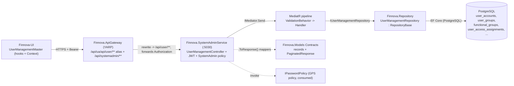
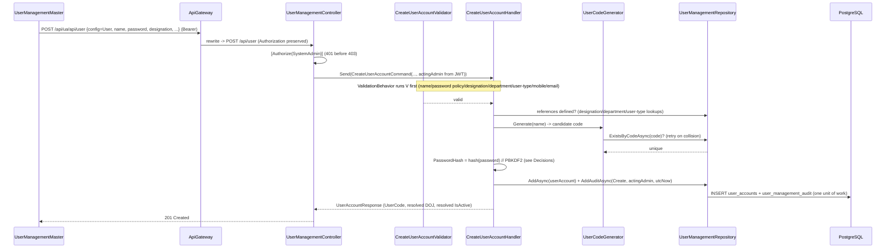
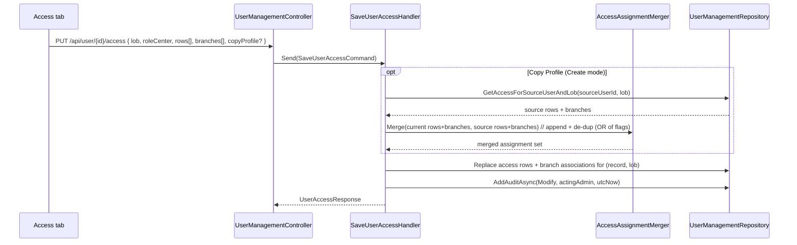

# Design Document — User Management (SystemAdmin · Functional Spec §9)

**Module:** SystemAdmin · **Master:** User Management · **Functional Spec:** section 9
**Scope:** Full stack — **Backend** (`e:\Finnova\Finnova-API`, .NET solution `Finnova.Backend.slnx`) **and** **Frontend** (`E:\Finnova\Finnova-UI\Finnova-UI`, React 18 + TypeScript + Vite + MUI).
**Related masters (mirrored):** Lookup Master (FINNOVA-8), Nationality Master (FINNOVA-9), Organization Hierarchy Master (FINNOVA-5), Court Master (FINNOVA-13), Entity Master (FINNOVA-11). This feature reuses the host, auth, middleware, gateway, and UI service patterns those masters established.

> **Localization (India-only).** Finnova is India-only and English-only. Every display value is a single English field (`Name`, `Value`); there are no bilingual (`...En`/`...Ar`) fields, no Arabic seed/sample data, and no right-to-left rendering. Location-tree samples use India-appropriate names (MAHARASHTRA → MUMBAI → HEAD OFFICE, FORT BRANCH).

---

## Overview

User Management gives a System Administrator a single master to provision **who can log in**, **what they can reach**, **which access rights (Add / Modify / Query / Delete) they hold per program**, and **which branches and lines of business** they operate against. One screen drives three creation configurations selected from a **User Configuration** list of values:

- **User** — an individual employee account (code, name, password, DOJ, designation, department, mobile, email, user type, active flag).
- **User Group** — a named collection of existing active users, assigned access as a unit.
- **Functional Group** — a named grouping of program functions (clubbed from a Role Center), assignable later to a User or a User Group.

The master operates in three modes: **Create**, **Modify** (populate/edit by generated code; code is read-only; Reset Password available), and **Query** (read-only, Save disabled). Access is expressed through a **Line of Business → Role Center → Program** chain with a per-program **access-rights matrix** (Add/Modify/Query/Delete/Select All), a separate **LOB / Role Code / Program** grid with add/delete rows, a **branch Location Tree** (with `ALL`), and a Create-mode **Copy Profile** facility. Every create/modify records an immutable **audit entry** (acting admin id + transaction date).

The backend follows the platform's layered CQRS conventions exactly:
`Finnova.Models` (entities + enums + record contracts + `.ToResponse()` mappers) → `Finnova.Repository` (EF Core + PostgreSQL, generic `IRepository<T>` + `RepositoryBase<T>`, per-entity repos, `IEntityTypeConfiguration<T>`, `FinnovaDbContext` DbSets) → `Finnova.Service` (MediatR Commands/Queries, FluentValidation validators, mappers, the shared `ValidationBehavior<,>`) → the existing host **`Finnova.SystemAdminService`** (`:5030`, controllers injecting `IMediator`, `ExceptionHandlingMiddleware`) → the **`Finnova.ApiGateway`** YARP proxy. The UI lives in the separate **`Finnova-UI`** app (hooks + Context, shared axios instance, service interface / mock / real / toggle via `VITE_USE_MOCK_API`).

### Grounded facts confirmed against the current codebase

These are confirmed by reading the repository (not assumed), and shape the design:

1. **The SystemAdmin host already exists and is wired.** `Finnova.SystemAdminService` (`:5030`) already hosts Lookup, Nationality, Org-Hierarchy, DCN, Court, and Entity controllers, with JWT Bearer auth, a `"SystemAdmin"` authorization policy, the MediatR `ValidationBehavior<,>` pipeline, and `ExceptionHandlingMiddleware` already registered. User Management **adds a controller and a middleware branch** to this host — it does **not** establish auth or a new host.
2. **The gateway already routes `/api/systemadmin/**`** to `systemadmin-cluster`, and already carries per-feature **UA-prefix aliases** (`/api/ua/api/<feature>/**`) that rewrite onto the SystemAdmin cluster (see `lookup`, `nationality`, `orghierarchy`, `dcn`, `court`, `entity`). The UI's shared axios base URL carries the UA prefix (`.../api/ua/api`), so this feature **adds a `user` alias pair** mirroring the existing entries.
3. **Name collision — a `User` entity already exists.** `Finnova.Models/Domain/Entities/User.cs` is the **authentication/UA** user (FirstName/LastName/Email/PasswordHash/`UserRole`/`UserStatus`), unrelated to this master-data feature. The `UserRole`/`UserStatus` enums are likewise taken. This design therefore uses **distinct domain names**: `UserAccount`, `UserGroup`, `FunctionalGroup`, `UserAccessAssignment`, `UserManagementAuditEntry`, and enums `UserType` / `UserConfiguration`. Tables are `user_accounts`, `user_groups`, etc. **Do not reuse or edit `User.cs`.**
4. **Persistence is PostgreSQL.** `FinnovaDbContext` + the repository registration target PostgreSQL; EF configuration mirrors `EntityConfiguration` / `LookupValueConfiguration` (snake_case table names, `HasMaxLength`, unique `HasIndex`, enum-as-int). `ApplyConfigurationsFromAssembly` auto-registers new `IEntityTypeConfiguration<T>` classes.
5. **The acting admin is resolved from the JWT**, not the request body — controllers call a `GetActingAdmin()` helper (NameIdentifier/sub/Name), exactly as `EntityController` does, so the audit actor cannot be spoofed.

### Consumed dependencies (owned outside this feature)

- **GPS password policy** — complexity/validity rules are configured and evaluated outside this feature; User Management **invokes** the policy (an `IPasswordPolicy` abstraction) and rejects non-compliant passwords. Concrete parameters are a config dependency (see Design Decisions).
- **Prerequisite master data** — Branch (from Organization Hierarchy / Location), Line of Business, Role Center, Role Code, Program, and the Lookup values for Designation / Department / User Type must exist. User Management consumes these as references via reference-LOV queries and does not create them.
- **Token issuance** — login/JWT issuance is owned by `Finnova.UAService`; this feature only validates the token and reads the `SystemAdmin` role claim.

---

## What is reused vs. what is new

### Reused (no change, consumed as-is)

| Concern | Reused artifact |
|---|---|
| Host | `Finnova.SystemAdminService` (:5030) — already running with controllers for 6 masters |
| Auth | JWT Bearer scheme + `"SystemAdmin"` authorization policy (role claim), already registered in the host |
| Validation pipeline | MediatR `ValidationBehavior<TRequest,TResponse>` (already registered) |
| Error transport | `ExceptionHandlingMiddleware` + RFC 7807 `ProblemDetails` with a `code` extension (add a branch) |
| Repository base | `IRepository<T>` + `RepositoryBase<T>`, `FinnovaDbContext`, `ApplyConfigurationsFromAssembly` |
| Pagination contract | `Finnova.Models.Contracts.Common.PaginatedResponse<T>` |
| Gateway | `/api/systemadmin/**` route + `systemadmin-cluster` (add a `user` UA-prefix alias pair, mirroring existing ones) |
| Acting-admin resolution | `GetActingAdmin()` controller helper reading the JWT principal |
| UI HTTP | Shared axios `src/services/api.ts` (JWT injection; central 401/403/409/timeout toasts) |
| UI pagination model | `src/models/api.model.ts` `PaginatedResponse<T>` |
| UI list/dialogs | `@mui/x-data-grid` (`^7.x`, already a dependency), MUI dialogs — mirror `LookupMaster` / `EntityMaster` pages |

### New (created by this feature)

- **Backend domain:** `UserAccount`, `UserGroup`, `FunctionalGroup`, `UserAccessAssignment`, `UserManagementAuditEntry` entities; `UserType`, `UserConfiguration`, `UserManagementAuditAction` enums.
- **Backend exceptions:** `UserNotFoundException`, `UserDuplicateCodeException`, `UserValidationException`, `UserInactiveMemberException`, `AuditEntryImmutableException` (ERR-USR-xxx family).
- **Backend contracts:** request/response records under `Finnova.Models/Contracts/UserManagement/` + `.ToResponse()` mappers.
- **Backend EF:** `UserAccountConfiguration` et al.; new `FinnovaDbContext` DbSets; one EF migration `AddUserManagement`.
- **Backend repository:** `IUserManagementRepository` + `UserManagementRepository` + DI registration.
- **Backend helpers:** `UserCodeGenerator`, `RoleCodeBuilder`, `AccessAssignmentMerger` (pure, property-testable).
- **Backend service:** CQRS slices under `Finnova.Service/UserManagement/` (commands, queries, validators, mapper).
- **Backend API:** `UserManagementController`; `ExceptionHandlingMiddleware` ERR-USR branch; gateway `user` alias.
- **Frontend:** `userManagement` model + service interface/mock/real/toggle + barrels; `UserManagementMaster` landing page (`UserListGrid`) that launches a guided **`UserManagementWizard`** (MUI `Stepper`) with steps `ConfigurationStep`, `IdentityStep` (`UserDetailsFields` / `UserGroupMemberPicker` / `FunctionalGroupPanel`), `AccessStep` (`LineOfBusinessSelect`, `RoleCenterSelect`, `AccessRightsGrid`, `AccessRowsGrid`, `BranchLocationTree`, `CopyProfilePanel`), `ReviewStep`; a `WizardContext` + `useUserManagementDraft` localStorage autosave hook; `AuditDialog`; route in `App.tsx`; nav item in `Layout.tsx`; Vitest tests. The wizard is a pure UI reshaping over the unchanged 17-endpoint API (no new/changed endpoints).

---

## Requirements coverage map

| Requirement | Covered by |
|---|---|
| **R1** User Configuration selection & prerequisites | `UserConfiguration` enum; config-aware validators (`CreateUserAccount`/`CreateUserGroup`/`CreateFunctionalGroup`); reference-existence checks in repository (R1.1–R1.6) |
| **R2** System-generated unique codes | `UserCodeGenerator` helper (4–6 chars, alphanumeric, first char alpha, uppercase, name/role-center + number, collision retry); `ExistsByCodeAsync`; read-only code in UI (R2.1–R2.8) |
| **R3** Create individual user — details | `CreateUserAccountCommand` + validator (name/password/designation/department/user-type/DOJ default/active default); `IPasswordPolicy` enforcement; UI masking (R3.1–R3.15) |
| **R4** Mobile & email validation | `CreateUserAccountValidator` mobile/email rules (R4.1–R4.6) |
| **R5** Create user group | `CreateUserGroupCommand` + validator; `UserGroupMember` link; active-member guard (`UserInactiveMemberException`); User Group popup (R5.1–R5.8) |
| **R6** Create functional group | `CreateFunctionalGroupCommand`; `FunctionalGroupFunction` clubbing from Role Center; many-to-many assignment target (user/group) (R6.1–R6.7) |
| **R7** Access tab — LOB selection | `GetAccessibleLinesOfBusiness` query (admin-scoped, active, Role-Code-linked); single-select UI; validator (R7.1–R7.5) |
| **R8** Access tab — Role Center / program / rights | `GetRoleCenterPrograms` query; `RoleCodeBuilder` (RoleCenterName + ProgramName); `UserAccessAssignment` with Add/Modify/Query/Delete flags; access-rights grid + Select All; LOB/RoleCode/Program grid (R8.1–R8.9) |
| **R9** Access tab — branch / Location Tree | `GetBranchLocationTree` query; `UserBranchAssociation` link; `ALL` option; at-least-one-branch guard (R9.1–R9.6) |
| **R10** Copy Profile | `GetCopyProfileSource` query + `AccessAssignmentMerger` (append + de-dup); Create-mode only (R10.1–R10.4) |
| **R11** Modify mode | `GetUserRecordByCode` query; `Update*` commands; read-only code; Reset Password command; blank-password = no-change (R11.1–R11.8) |
| **R12** Query mode | `GetUserRecordByCode` (read); the whole `UserManagementWizard` renders read-only and the Review step's Save/Submit is disabled; 404 not-found (R12.1–R12.3) |
| **R13** List & pagination | `GetUserRecordsPagedQuery` → `PaginatedResponse<T>`; substring search; active filter; defaults page 1 / size 20; bounds 1–100; UserCode-asc + Id-asc ordering (R13.1–R13.9) |
| **R14** Audit trail | `UserManagementAuditEntry` (create/modify, acting admin, txn date); no entry on rejection; immutability (`AuditEntryImmutableException`) (R14.1–R14.4) |
| **R15** AuthN/AuthZ | `[Authorize(Policy="SystemAdmin")]` on every endpoint; 401 before 403 via host pipeline (R15.1–R15.5) |
| **R16** Admin UI | `UserManagementMaster` (landing `UserListGrid`) → `UserManagementWizard` (MUI `Stepper` + `WizardContext`): `ConfigurationStep` (three configs + Create/Modify/Query entry), `IdentityStep` (`UserDetailsFields` / `UserGroupMemberPicker` / `FunctionalGroupPanel`), `AccessStep` (reference screens: LOB/Role-Center/access-rights grid, LOB/RoleCode/Program grid, branch Location Tree, Copy Profile), `ReviewStep`; `useUserManagementDraft` localStorage autosave; 10s timeout; shared axios JWT; hooks+Context; MUI/DataGrid (R16.1–R16.10) |

---

## Architecture



### Create-user request flow



### Access-assignment + Copy Profile flow



---

## Data Models

All entities live in `Finnova.Models/Domain/Entities/`, enums in `Finnova.Models/Domain/Enums/`, mirroring `EntityMaster` / `CourtAuditEntry`. Enums are stored as `int`. Guid PKs default to `Guid.NewGuid()`. Timestamps are UTC.

### Enums

```csharp
// Finnova.Models/Domain/Enums/UserConfiguration.cs
namespace Finnova.Models.Domain.Enums;

/// <summary>Which kind of record is being provisioned (FS §9 R1). Exactly one per record.</summary>
public enum UserConfiguration
{
    User = 0,
    UserGroup = 1,
    FunctionalGroup = 2
}
```

```csharp
// Finnova.Models/Domain/Enums/UserType.cs
namespace Finnova.Models.Domain.Enums;

/// <summary>Classification of an individual user (FS §9 R3.12). Lookup-backed, two values.</summary>
public enum UserType
{
    Corporate = 0,
    Branch = 1
}
```

```csharp
// Finnova.Models/Domain/Enums/UserManagementAuditAction.cs
namespace Finnova.Models.Domain.Enums;

/// <summary>The mutation an audit entry records (FS §9 R14).</summary>
public enum UserManagementAuditAction
{
    Create = 0,
    Modify = 1
}
```

### `UserAccount` entity (individual user)

```csharp
// Finnova.Models/Domain/Entities/UserAccount.cs
using Finnova.Models.Domain.Enums;

namespace Finnova.Models.Domain.Entities;

/// <summary>
/// A provisioned individual user in the User Management master (FS §9). Named UserAccount (not
/// User) to avoid clashing with the existing authentication User entity. India-only: a single
/// English Name. Maps to table "user_accounts".
/// </summary>
public class UserAccount
{
    public Guid Id { get; set; } = Guid.NewGuid();

    public string UserCode { get; set; } = string.Empty;     // generated, 4-6, uppercase, unique (R2)
    public string Name { get; set; } = string.Empty;         // max 50, English, mandatory (R3.2/3.3)
    public string PasswordHash { get; set; } = string.Empty; // PBKDF2 "salt.hash" (never plaintext) (R3.4/3.5)

    public DateTime DateOfJoining { get; set; }              // defaults to system date (R3.7)
    public string Designation { get; set; } = string.Empty;  // max 40, Lookup-backed (R3.9/3.13)
    public string Department { get; set; } = string.Empty;   // max 40, Lookup-backed (R3.10/3.14)
    public string? MobileNumber { get; set; }                // numeric, <=12, optional (R4.1-4.3)
    public string? Email { get; set; }                       // <=60, format rules, optional (R4.4-4.6)
    public UserType UserType { get; set; }                   // Corporate | Branch (R3.11/3.12)
    public bool IsActive { get; set; } = true;               // default active (R3.15)

    public DateTime CreatedAt { get; set; } = DateTime.UtcNow;
    public DateTime UpdatedAt { get; set; } = DateTime.UtcNow;

    // Access assignments + branch associations hang off the user (and off groups) via FKs below.
    public ICollection<UserAccessAssignment> AccessAssignments { get; set; } = new List<UserAccessAssignment>();
    public ICollection<UserBranchAssociation> BranchAssociations { get; set; } = new List<UserBranchAssociation>();
}
```

### `UserGroup` + `UserGroupMember`

```csharp
// Finnova.Models/Domain/Entities/UserGroup.cs
namespace Finnova.Models.Domain.Entities;

/// <summary>A named collection of active users (FS §9 R5). Maps to table "user_groups".</summary>
public class UserGroup
{
    public Guid Id { get; set; } = Guid.NewGuid();
    public string UserGroupCode { get; set; } = string.Empty; // generated, 4-6, unique (R2.2)
    public string Name { get; set; } = string.Empty;          // max 30, English, mandatory (R5.2/5.3)
    public bool IsActive { get; set; } = true;

    public DateTime CreatedAt { get; set; } = DateTime.UtcNow;
    public DateTime UpdatedAt { get; set; } = DateTime.UtcNow;

    public ICollection<UserGroupMember> Members { get; set; } = new List<UserGroupMember>();
}

// Finnova.Models/Domain/Entities/UserGroupMember.cs
public class UserGroupMember
{
    public Guid Id { get; set; } = Guid.NewGuid();
    public Guid UserGroupId { get; set; }                     // FK -> user_groups
    public Guid UserAccountId { get; set; }                   // FK -> user_accounts (must be active, R5.8)
}
```

### `FunctionalGroup` + `FunctionalGroupFunction`

```csharp
// Finnova.Models/Domain/Entities/FunctionalGroup.cs
namespace Finnova.Models.Domain.Entities;

/// <summary>A grouping of program functions clubbed from a Role Center (FS §9 R6). Table "functional_groups".</summary>
public class FunctionalGroup
{
    public Guid Id { get; set; } = Guid.NewGuid();
    public string FunctionalGroupCode { get; set; } = string.Empty; // generated from Role Center Name (R2.3)
    public string RoleCenterName { get; set; } = string.Empty;      // source Role Center (R6.1)
    public bool IsActive { get; set; } = true;

    public DateTime CreatedAt { get; set; } = DateTime.UtcNow;
    public DateTime UpdatedAt { get; set; } = DateTime.UtcNow;

    public ICollection<FunctionalGroupFunction> Functions { get; set; } = new List<FunctionalGroupFunction>();
}

// Finnova.Models/Domain/Entities/FunctionalGroupFunction.cs
/// <summary>One clubbed program function under a functional group (R6.3).</summary>
public class FunctionalGroupFunction
{
    public Guid Id { get; set; } = Guid.NewGuid();
    public Guid FunctionalGroupId { get; set; }               // FK -> functional_groups
    public string ProgramName { get; set; } = string.Empty;
    public string RoleCode { get; set; } = string.Empty;      // RoleCenterName + ProgramName (R8.4)
}
```

Functional-group assignment to users/groups (R6.5/R6.6 many-to-many) is a join table:

```csharp
// Finnova.Models/Domain/Entities/FunctionalGroupAssignment.cs
/// <summary>Assigns a functional group to a target user OR user group (R6.5/6.6). Exactly one target set.</summary>
public class FunctionalGroupAssignment
{
    public Guid Id { get; set; } = Guid.NewGuid();
    public Guid FunctionalGroupId { get; set; }               // FK -> functional_groups
    public Guid? UserAccountId { get; set; }                  // target: a user ...
    public Guid? UserGroupId { get; set; }                    // ... or a user group (exactly one non-null)
}
```

### `UserAccessAssignment` (the access-rights model)

One row per **(record, LOB, Role Code / Program)** carrying the four access-right flags. The owning record is either a user or a user group (one of the two FKs is set).

```csharp
// Finnova.Models/Domain/Entities/UserAccessAssignment.cs
namespace Finnova.Models.Domain.Entities;

/// <summary>
/// A single access line: a Program (under a Role Center) within a Line of Business, with the four
/// access-right flags. RoleCode = RoleCenterName + ProgramName (R8.4). Owned by a user OR a group.
/// Table "user_access_assignments". (R8.6/8.9)
/// </summary>
public class UserAccessAssignment
{
    public Guid Id { get; set; } = Guid.NewGuid();

    public Guid? UserAccountId { get; set; }                  // owner: a user ...
    public Guid? UserGroupId { get; set; }                    // ... or a user group (exactly one non-null)

    public string LineOfBusiness { get; set; } = string.Empty; // selected LOB (R7)
    public string RoleCenterName { get; set; } = string.Empty; // "ALL" allowed (R9.5)
    public string ProgramName { get; set; } = string.Empty;
    public string RoleCode { get; set; } = string.Empty;       // RoleCenterName + ProgramName (R8.4)

    public bool CanAdd { get; set; }                           // (R8.6)
    public bool CanModify { get; set; }
    public bool CanQuery { get; set; }
    public bool CanDelete { get; set; }
}
```

### `UserBranchAssociation`

```csharp
// Finnova.Models/Domain/Entities/UserBranchAssociation.cs
namespace Finnova.Models.Domain.Entities;

/// <summary>A branch (or ALL) associated with a user/group access scope (FS §9 R9). Table "user_branch_associations".</summary>
public class UserBranchAssociation
{
    public Guid Id { get; set; } = Guid.NewGuid();
    public Guid? UserAccountId { get; set; }                  // owner: a user ...
    public Guid? UserGroupId { get; set; }                    // ... or a user group (exactly one non-null)

    public string LineOfBusiness { get; set; } = string.Empty; // branches are scoped to the LOB selection
    public string BranchCode { get; set; } = string.Empty;     // concrete branch code, or "ALL" (R9.3/9.4)
    public bool IsAll { get; set; }                            // true when BranchCode == "ALL"
}
```

### `UserManagementAuditEntry` (immutable)

```csharp
// Finnova.Models/Domain/Entities/UserManagementAuditEntry.cs
using Finnova.Models.Domain.Enums;

namespace Finnova.Models.Domain.Entities;

/// <summary>
/// Immutable audit record for a create/modify of a user, user group, or functional group (FS §9 R14).
/// Written in the same unit of work as the mutation; never updated or deleted. Table "user_management_audit".
/// </summary>
public class UserManagementAuditEntry
{
    public Guid Id { get; set; } = Guid.NewGuid();

    public Guid RecordId { get; set; }                        // the user/group/functional-group id
    public UserConfiguration RecordKind { get; set; }         // which master kind was affected
    public UserManagementAuditAction Action { get; set; }     // Create | Modify

    public string? OldValues { get; set; }                    // JSON snapshot (null on Create)
    public string NewValues { get; set; } = string.Empty;     // JSON snapshot of result
    public string Summary { get; set; } = string.Empty;       // human-readable change summary

    public string ChangedBy { get; set; } = string.Empty;     // acting admin id from JWT (R14.1/14.2)
    public DateTime ChangedAtUtc { get; set; } = DateTime.UtcNow; // transaction date (UTC)
}
```

### EF configuration

One `IEntityTypeConfiguration<T>` per entity in `Finnova.Repository/Configuration/`, auto-registered by `ApplyConfigurationsFromAssembly`. Representative config (others follow the same style):

```csharp
// Finnova.Repository/Configuration/UserAccountConfiguration.cs
using Microsoft.EntityFrameworkCore;
using Microsoft.EntityFrameworkCore.Metadata.Builders;
using Finnova.Models.Domain.Entities;

namespace Finnova.Repository.Configuration;

public class UserAccountConfiguration : IEntityTypeConfiguration<UserAccount>
{
    public void Configure(EntityTypeBuilder<UserAccount> b)
    {
        b.ToTable("user_accounts");
        b.HasKey(x => x.Id);
        b.Property(x => x.UserCode).IsRequired().HasMaxLength(6);
        b.Property(x => x.Name).IsRequired().HasMaxLength(50);
        b.Property(x => x.PasswordHash).IsRequired().HasMaxLength(400);
        b.Property(x => x.Designation).IsRequired().HasMaxLength(40);
        b.Property(x => x.Department).IsRequired().HasMaxLength(40);
        b.Property(x => x.MobileNumber).HasMaxLength(12);
        b.Property(x => x.Email).HasMaxLength(60);
        b.Property(x => x.UserType).IsRequired();              // int
        b.Property(x => x.IsActive).IsRequired();

        b.HasIndex(x => x.UserCode).IsUnique();                // company-wide uniqueness (R2.4)
        b.HasIndex(x => x.Name);                               // search/order (R13.2/13.9)

        b.HasMany(x => x.AccessAssignments).WithOne()
            .HasForeignKey(a => a.UserAccountId).OnDelete(DeleteBehavior.Cascade);
        b.HasMany(x => x.BranchAssociations).WithOne()
            .HasForeignKey(a => a.UserAccountId).OnDelete(DeleteBehavior.Cascade);
    }
}
```

Key configuration points for the other tables:

- `user_groups.UserGroupCode` unique; `functional_groups.FunctionalGroupCode` unique.
- `user_group_members` unique index on `(UserGroupId, UserAccountId)` (no duplicate members).
- `user_access_assignments`: index `(UserAccountId, LineOfBusiness, RoleCode)` and `(UserGroupId, LineOfBusiness, RoleCode)`; a check that exactly one of the two owner FKs is non-null.
- `user_branch_associations`: index `(UserAccountId, LineOfBusiness)` / `(UserGroupId, LineOfBusiness)`.
- `user_management_audit`: index `(RecordId, ChangedAtUtc desc)`; **no update/delete** path exposed (immutability enforced in the handler, R14.4).

### DbContext DbSets

Add to `Finnova.Repository/Context/FinnovaDbContext.cs` (after the existing Entity sets):

```csharp
public DbSet<UserAccount> UserAccounts => Set<UserAccount>();
public DbSet<UserGroup> UserGroups => Set<UserGroup>();
public DbSet<UserGroupMember> UserGroupMembers => Set<UserGroupMember>();
public DbSet<FunctionalGroup> FunctionalGroups => Set<FunctionalGroup>();
public DbSet<FunctionalGroupFunction> FunctionalGroupFunctions => Set<FunctionalGroupFunction>();
public DbSet<FunctionalGroupAssignment> FunctionalGroupAssignments => Set<FunctionalGroupAssignment>();
public DbSet<UserAccessAssignment> UserAccessAssignments => Set<UserAccessAssignment>();
public DbSet<UserBranchAssociation> UserBranchAssociations => Set<UserBranchAssociation>();
public DbSet<UserManagementAuditEntry> UserManagementAuditEntries => Set<UserManagementAuditEntry>();
```

### Migration command (PostgreSQL)

```
dotnet ef migrations add AddUserManagement \
  --project Finnova.Repository \
  --startup-project Finnova.SystemAdminService
dotnet ef database update --project Finnova.Repository --startup-project Finnova.SystemAdminService
```

---

## Contracts (records)

Live in `Finnova.Models/Contracts/UserManagement/`, mirroring the `Entities` / `Lookups` contract style (records; nullable fields where the service defaults them). camelCase on the wire.

```csharp
namespace Finnova.Models.Contracts.UserManagement;

using Finnova.Models.Domain.Enums;

// ---- Create ----

// Individual user (R3). DOJ/IsActive nullable so the service can default them (R3.7/3.15).
public record CreateUserAccountRequest(
    string Name,
    string Password,
    DateTime? DateOfJoining,
    string Designation,
    string Department,
    string? MobileNumber,
    string? Email,
    UserType UserType,
    bool? IsActive
);

// User group (R5). MemberUserCodes: the active users tagged to the group.
public record CreateUserGroupRequest(
    string Name,
    IReadOnlyList<string> MemberUserCodes,
    bool? IsActive
);

// Functional group (R6). Code is generated from the Role Center Name.
public record CreateFunctionalGroupRequest(
    string RoleCenterName,
    bool? IsActive
);

// ---- Update (Modify mode, R11) ----

// Blank Password => no change (R11.8); use ResetPassword for a real change (R11.5).
public record UpdateUserAccountRequest(
    string Name,
    DateTime? DateOfJoining,
    string Designation,
    string Department,
    string? MobileNumber,
    string? Email,
    UserType UserType,
    bool IsActive
);

public record ResetPasswordRequest(string NewPassword);        // Modify mode only (R11.4/11.5)

public record UpdateUserGroupRequest(
    string Name,
    IReadOnlyList<string> MemberUserCodes,
    bool IsActive
);

// ---- Access assignment (R7/R8/R9/R10) ----

public record AccessRightRow(
    string RoleCode,
    string RoleCenterName,
    string ProgramName,
    bool CanAdd,
    bool CanModify,
    bool CanQuery,
    bool CanDelete
);

public record CopyProfileRequest(string SourceUserCode, string SourceLineOfBusiness);

public record SaveUserAccessRequest(
    string LineOfBusiness,
    IReadOnlyList<AccessRightRow> Rows,
    IReadOnlyList<string> BranchCodes,                         // may contain "ALL" (R9.3/9.4)
    CopyProfileRequest? CopyProfile                            // Create mode only (R10)
);

// ---- Responses ----

public record UserAccountResponse(
    Guid Id, string UserCode, string Name, DateTime DateOfJoining,
    string Designation, string Department, string? MobileNumber, string? Email,
    UserType UserType, bool IsActive, DateTime CreatedAt, DateTime UpdatedAt
);

public record UserGroupMemberResponse(string UserCode, string Name, bool IsActive);

public record UserGroupResponse(
    Guid Id, string UserGroupCode, string Name,
    IReadOnlyList<UserGroupMemberResponse> Members, bool IsActive,
    DateTime CreatedAt, DateTime UpdatedAt
);

public record FunctionalGroupFunctionResponse(string ProgramName, string RoleCode);

public record FunctionalGroupResponse(
    Guid Id, string FunctionalGroupCode, string RoleCenterName,
    IReadOnlyList<FunctionalGroupFunctionResponse> Functions, bool IsActive,
    DateTime CreatedAt, DateTime UpdatedAt
);

public record UserAccessResponse(
    string LineOfBusiness,
    IReadOnlyList<AccessRightRow> Rows,
    IReadOnlyList<string> BranchCodes
);

// Slim list projection (R13): one row covers all three record kinds via a discriminator.
public record UserListItemResponse(
    Guid Id, string Code, string Name, UserConfiguration Kind, bool IsActive
);

public record UserManagementAuditEntryResponse(
    Guid Id, Guid RecordId, UserConfiguration RecordKind,
    UserManagementAuditAction Action, string Summary, string ChangedBy, DateTime ChangedAtUtc
);

// ---- Reference LOVs (consumed master data) ----
public record ReferenceItemResponse(string Code, string Label);     // designation/department/user-type/role-center/LOB
public record BranchTreeNodeResponse(
    string Code, string Name, string Level,                         // Location | Region | Branch
    IReadOnlyList<BranchTreeNodeResponse> Children
);
```

Paginated listing reuses `PaginatedResponse<UserListItemResponse>` (R13.1).

---

## API / Contracts (endpoint surface)

Controller route base `api/user` (gateway exposes `/api/systemadmin/user...` and the UA alias `/api/ua/api/user...`). Every endpoint is `[Authorize(Policy="SystemAdmin")]`.

| # | Method | Route | Body | Success | Errors |
|---|---|---|---|---|---|
| 1 | GET | `/api/user` | query `search?`, `kind?`, `isActive?`, `page?`(1), `pageSize?`(20, 1–100) | 200 `PaginatedResponse<UserListItemResponse>` | 400, 401, 403 |
| 2 | GET | `/api/user/by-code/{code}` | — | 200 user/group/functional record (by kind) | 401, 403, 404 |
| 3 | POST | `/api/user` | `CreateUserAccountRequest` | 201 `UserAccountResponse` | 400, 401, 403, 409 |
| 4 | PUT | `/api/user/{id}` | `UpdateUserAccountRequest` | 200 `UserAccountResponse` | 400, 401, 403, 404 |
| 5 | POST | `/api/user/{id}/reset-password` | `ResetPasswordRequest` | 204 | 400, 401, 403, 404 |
| 6 | POST | `/api/user/group` | `CreateUserGroupRequest` | 201 `UserGroupResponse` | 400, 401, 403, 409 |
| 7 | PUT | `/api/user/group/{id}` | `UpdateUserGroupRequest` | 200 `UserGroupResponse` | 400, 401, 403, 404 |
| 8 | POST | `/api/user/functional-group` | `CreateFunctionalGroupRequest` | 201 `FunctionalGroupResponse` | 400, 401, 403, 409 |
| 9 | PUT | `/api/user/{id}/access` | `SaveUserAccessRequest` | 200 `UserAccessResponse` | 400, 401, 403, 404 |
| 10 | GET | `/api/user/{id}/access?lob=` | — | 200 `UserAccessResponse` | 401, 403, 404 |
| 11 | GET | `/api/user/{id}/audit` | — | 200 `List<UserManagementAuditEntryResponse>` (newest-first) | 401, 403 |
| 12 | GET | `/api/user/ref/active-users` | query `search?` | 200 `List<UserGroupMemberResponse>` (active users; group members + copy-profile source) | 401, 403 |
| 13 | GET | `/api/user/ref/lines-of-business` | — | 200 `List<ReferenceItemResponse>` (admin-accessible, active, Role-Code-linked) | 401, 403 |
| 14 | GET | `/api/user/ref/role-centers` | — | 200 `List<ReferenceItemResponse>` (active; includes `ALL`) | 401, 403 |
| 15 | GET | `/api/user/ref/role-centers/{name}/programs` | — | 200 `List<AccessRightRow>` (programs + RoleCode, flags default false) | 401, 403, 404 |
| 16 | GET | `/api/user/ref/branch-tree?lob=` | — | 200 `List<BranchTreeNodeResponse>` (includes `ALL`) | 401, 403 |
| 17 | GET | `/api/user/ref/lookups?type=` | `type` ∈ {Designation, Department, UserType} | 200 `List<ReferenceItemResponse>` | 400, 401, 403 |

**Endpoint notes:**
- **(1) List** — `search` filters UserCode / Name / group code+name / functional-group code (case-insensitive substring, R13.2); `kind` and `isActive` optional filters (R13.3); ordered `UserCode asc → Id asc` (R13.9); a page beyond the last returns empty data with correct `total` (R13.8).
- **(3) Create** — `UserCode` generated from `Name` after name is present (R2.1/2.7); DOJ defaults to system date (R3.7); `IsActive` defaults true (R3.15); password hashed, never echoed.
- **(5) Reset Password** — Modify-mode facility; non-compliant password rejected with "Please enter a valid Password" and the existing hash preserved (R11.6).
- **(9) Save access** — replaces the access rows + branch associations for the (record, LOB). When `CopyProfile` is present, source rows/branches are merged (append + de-dup) before persisting (R10.2). Requires ≥1 branch (R9.6) and ≥1 LOB linked to Role Codes (R7.3/7.5).
- **(2/10) by-code / access read** — serve both Modify (editable) and Query (read-only) modes; mode is a UI concern, the read payload is identical.

---

## Components and Interfaces

### Repository Layer

```csharp
// Finnova.Repository/Interfaces/IUserManagementRepository.cs
public interface IUserManagementRepository
{
    // Users
    Task<UserAccount?> GetUserByCodeAsync(string code, CancellationToken ct = default);
    Task<UserAccount?> GetUserWithAccessAsync(Guid id, CancellationToken ct = default);
    Task<bool> UserCodeExistsAsync(string code, CancellationToken ct = default);
    Task AddUserAsync(UserAccount user, CancellationToken ct = default);
    Task UpdateUserAsync(UserAccount user, CancellationToken ct = default);

    // Groups / functional groups
    Task<UserGroup?> GetGroupByCodeAsync(string code, CancellationToken ct = default);
    Task<bool> GroupCodeExistsAsync(string code, CancellationToken ct = default);
    Task AddGroupAsync(UserGroup group, CancellationToken ct = default);
    Task UpdateGroupAsync(UserGroup group, CancellationToken ct = default);
    Task<FunctionalGroup?> GetFunctionalGroupByCodeAsync(string code, CancellationToken ct = default);
    Task<bool> FunctionalGroupCodeExistsAsync(string code, CancellationToken ct = default);
    Task AddFunctionalGroupAsync(FunctionalGroup fg, CancellationToken ct = default);

    // Members / references
    Task<List<UserAccount>> GetActiveUsersByCodesAsync(IEnumerable<string> codes, CancellationToken ct = default);
    Task<List<UserAccount>> SearchActiveUsersAsync(string? search, CancellationToken ct = default);

    // Access
    Task ReplaceAccessAsync(Guid ownerUserId, string lob,
        IEnumerable<UserAccessAssignment> rows, IEnumerable<UserBranchAssociation> branches, CancellationToken ct = default);
    Task<(List<UserAccessAssignment> Rows, List<UserBranchAssociation> Branches)> GetAccessAsync(
        Guid ownerUserId, string lob, CancellationToken ct = default);

    // List + audit
    Task<(List<UserListItemResult> Items, int Total)> GetPagedAsync(
        string? search, UserConfiguration? kind, bool? isActive, int page, int pageSize, CancellationToken ct = default);
    Task AddAuditAsync(UserManagementAuditEntry entry, CancellationToken ct = default);
    Task<List<UserManagementAuditEntry>> GetAuditAsync(Guid recordId, CancellationToken ct = default);
}
```

`UserManagementRepository : RepositoryBase<UserAccount>` (or a plain `DbContext`-backed repo if a single generic base entity does not fit the multi-entity surface) implements these against `FinnovaDbContext`. The paged query unions the three record kinds into `UserListItemResult` and orders `UserCode asc → Id asc`. Register in `Finnova.Repository/DependencyInjection.cs`:

```csharp
services.AddScoped<IUserManagementRepository, UserManagementRepository>();
```

### Domain helpers (pure, property-testable)

```csharp
// Finnova.Service/UserManagement/Helpers/UserCodeGenerator.cs
public static class UserCodeGenerator
{
    // From a source string (user name OR role-center name) + a number, produce a 4-6 char,
    // uppercase, alphanumeric code whose first char is a letter, with no spaces/specials (R2.1-2.3,2.5).
    // isTaken: collision predicate (repository ExistsByCode*). Retries by varying the numeric suffix.
    public static string Generate(string source, Func<string, bool> isTaken);
}

// Finnova.Service/UserManagement/Helpers/RoleCodeBuilder.cs
public static class RoleCodeBuilder
{
    // RoleCode = RoleCenterName concatenated with ProgramName per FS §9 (e.g. SSCMP, OOASM, OOETM) (R8.4).
    public static string Build(string roleCenterName, string programName);
}

// Finnova.Service/UserManagement/Helpers/AccessAssignmentMerger.cs
public static class AccessAssignmentMerger
{
    // Append source rows/branches to current and de-dup by (RoleCode) / (BranchCode): duplicate
    // access rows collapse to a single row whose flags are the OR of the duplicates (R10.2 + R10 assumption).
    public static (List<AccessRightRow> Rows, List<string> Branches) Merge(
        (IEnumerable<AccessRightRow> Rows, IEnumerable<string> Branches) current,
        (IEnumerable<AccessRightRow> Rows, IEnumerable<string> Branches) source);
}
```

### Service Layer (CQRS slices)

Feature slice `Finnova.Service/UserManagement/` with `Commands/`, `Queries/`, `Validators`, `Mappers/`, mirroring the `Entity` slice. Each request is a record `IRequest<TResponse>`; validators are `AbstractValidator<T>` run by the shared `ValidationBehavior<,>`; handlers inject `IUserManagementRepository` (and `IPasswordPolicy`).

Commands:
- `CreateUserAccountCommand` / handler / validator — R2.1/2.7, R3, R4; generates code, hashes password, defaults DOJ/active, writes audit.
- `UpdateUserAccountCommand` / handler / validator — R11.1/11.3; code immutable; blank password = no change (R11.8); writes audit.
- `ResetPasswordCommand` / handler / validator — R11.4–11.6; policy-checked; preserves old hash on failure.
- `CreateUserGroupCommand` / `UpdateUserGroupCommand` — R5; active-member guard (R5.8); audit.
- `CreateFunctionalGroupCommand` — R6; clubs Role Center programs; audit.
- `SaveUserAccessCommand` — R7/R8/R9/R10; copy-profile merge; ≥1 branch + LOB-RoleCode guards.

Queries:
- `GetUserRecordsPagedQuery` → `PaginatedResponse<UserListItemResponse>` (R13).
- `GetUserRecordByCodeQuery` → user/group/functional record (R11.1/R12.1).
- `GetUserAccessQuery` (R10 read / Access tab populate).
- `GetUserAuditTrailQuery` (R14 read).
- Reference LOV queries: `GetActiveUsersQuery`, `GetAccessibleLinesOfBusinessQuery`, `GetRoleCentersQuery`, `GetRoleCenterProgramsQuery`, `GetBranchLocationTreeQuery`, `GetUserLookupsQuery` (designation/department/user-type).

Example create validator (abbreviated):

```csharp
public class CreateUserAccountValidator : AbstractValidator<CreateUserAccountCommand>
{
    public CreateUserAccountValidator()
    {
        RuleFor(x => x.Name).NotEmpty().WithMessage("Please enter the User Name").MaximumLength(50);          // R3.2/3.3
        RuleFor(x => x.Password).NotEmpty().WithMessage("Please enter the User Password");                     // R3.4
        RuleFor(x => x.Designation).NotEmpty().WithMessage("Please select the Designation").MaximumLength(40); // R3.9/3.13
        RuleFor(x => x.Department).NotEmpty().WithMessage("Please select the Department").MaximumLength(40);    // R3.10/3.14
        RuleFor(x => x.UserType).IsInEnum().WithMessage("Please select the User Type");                        // R3.11/3.12
        RuleFor(x => x.MobileNumber)
            .Matches("^[0-9]{1,12}$").WithMessage("Special characters are not allowed in this field")
            .When(x => !string.IsNullOrEmpty(x.MobileNumber));                                                 // R4.1-4.3
        RuleFor(x => x.Email)
            .MaximumLength(60)
            .Must(BeValidEmail).WithMessage("Please enter a valid Email id")
            .When(x => !string.IsNullOrEmpty(x.Email));                                                        // R4.4/4.5
    }
    // Password-policy compliance (R3.5) is enforced in the handler via IPasswordPolicy
    // because the policy is externally configured, not a static rule.
}
```

Mapper `Finnova.Service/UserManagement/Mappers/UserManagementMapper.cs` provides `.ToResponse()` for each entity and `ToResponseList()`, exactly like `LookupMapper`/`EntityMapper`. **Password hash is never mapped into any response.**

### API Layer — `UserManagementController`

Lives in `Finnova.SystemAdminService/Controllers/UserManagementController.cs`, mirroring `EntityController` (attribute routing `api/user`, `IMediator`, `[Authorize(Policy="SystemAdmin")]`, `GetActingAdmin()` reading the JWT principal, `CreatedAtAction` for POSTs). Each action maps a request record to a MediatR command/query and passes the acting-admin id for audit.

### `IPasswordPolicy` (consumed abstraction)

```csharp
// Finnova.Service/UserManagement/Abstractions/IPasswordPolicy.cs
public interface IPasswordPolicy
{
    bool IsCompliant(string password);   // GPS policy evaluation (owned externally; wired via DI/config)
}
```

A default config-driven implementation can live in the host; the real GPS policy is injected when available (Design Decisions).

---

## Error Handling

Errors are modeled as typed domain exceptions plus FluentValidation's `ValidationException`, translated to RFC 7807 `ProblemDetails` by the existing `ExceptionHandlingMiddleware`. This feature **adds a typed ERR-USR branch** and a path-scoped validation/fallback code family for `/api/user`.

### New domain exceptions (`Finnova.Models/Domain/Exceptions/`)

```csharp
public class UserNotFoundException : Exception
{
    public const string ErrorCode = "ERR-USR-404";
    public UserNotFoundException(string key) : base($"User record '{key}' was not found.") { }
}

public class UserDuplicateCodeException : Exception
{
    public const string ErrorCode = "ERR-USR-409";
    public UserDuplicateCodeException() : base("Generated code collided and could not be made unique.") { }
}

public class UserInactiveMemberException : Exception           // R5.8
{
    public const string ErrorCode = "ERR-USR-409";
    public UserInactiveMemberException() : base("Only active users can be tagged to a group.") { }
}

public class AuditEntryImmutableException : Exception          // R14.4
{
    public const string ErrorCode = "ERR-USR-409";
    public AuditEntryImmutableException() : base("Audit entries are immutable and cannot be changed or removed.") { }
}

public class UserValidationException : Exception               // domain validation not expressible in a static validator
{
    public const string ErrorCode = "ERR-USR-400";
    public UserValidationException(string message) : base(message) { }
}
```

### Error-code table (ERR-USR family)

| Condition | HTTP | `code` | Exception |
|---|---|---|---|
| Record (user/group/functional) not found by code/id | 404 | `ERR-USR-404` | `UserNotFoundException` |
| Code collision cannot be resolved | 409 | `ERR-USR-409` | `UserDuplicateCodeException` |
| Tagging a non-active user to a group (R5.8) | 409 | `ERR-USR-409` | `UserInactiveMemberException` |
| Attempt to update/delete an audit entry (R14.4) | 409 | `ERR-USR-409` | `AuditEntryImmutableException` |
| Missing LOB / LOB has no Role Codes / missing branch / missing role center / missing prerequisite reference (R1.6, R7.4/7.5, R8.2, R9.6) | 400 | `ERR-USR-400` | `UserValidationException` |
| Field/format/length validation + password-policy failure (R3, R4, R11.6) | 400 | `ERR-USR-400` | `FluentValidation.ValidationException` (path-scoped) |
| Missing/expired/invalid token | 401 | (auth) | pipeline |
| Authenticated non-SystemAdmin | 403 | (auth) | pipeline |
| Unexpected | 500 | `ERR-USR-500` | fallback (path-scoped) |

### Middleware branch (add to `ExceptionHandlingMiddleware`)

Mirror the existing typed branches; add path-scoping for `/api/user` so the shared `ValidationException`/fallback surface `ERR-USR-400` / `ERR-USR-500`:

```csharp
var isUser = ctx.Request.Path.StartsWithSegments("/api/user", StringComparison.OrdinalIgnoreCase);
// extend the existing validation/fallback selection with isUser -> "ERR-USR-400" / "ERR-USR-500"

// typed branch inside the switch:
UserNotFoundException        => (404, "ERR-USR-404", ex.Message),
UserDuplicateCodeException   => (409, "ERR-USR-409", ex.Message),
UserInactiveMemberException  => (409, "ERR-USR-409", ex.Message),
AuditEntryImmutableException => (409, "ERR-USR-409", ex.Message),
UserValidationException      => (400, "ERR-USR-400", ex.Message),
```

**Guarantees:** validators run before handlers, so invalid requests never mutate state; domain guards (collision, inactive member, missing prerequisite) throw before persisting; rejected create/modify requests write **no** audit entry (R14.3); on any error the UI leaves the current screen state unchanged and the shared interceptor toasts `error.response.data.message`.

---

## Security (authentication & authorization)

Requirement 15 is satisfied by the host's existing wiring — this feature adds no new auth code, only `[Authorize]` attributes.

- **Scheme:** JWT Bearer, already registered in `Finnova.SystemAdminService` (validates signature, issuer, audience, lifetime). A missing/expired/malformed/invalid token → **401** (R15.1).
- **Policy:** `"SystemAdmin"` (role claim). Every `UserManagementController` action carries `[Authorize(Policy = "SystemAdmin")]`. An authenticated non-admin → **403** (R15.2).
- **401 before 403 (R15.4):** guaranteed by the ASP.NET Core pipeline order (`UseAuthentication()` precedes `UseAuthorization()`), which the host already configures. A request that is both unauthenticated and non-admin is rejected 401.
- **Acting admin from token (R14.1/14.2):** the controller resolves the audit actor via `GetActingAdmin()` (NameIdentifier/sub/Name), never from the request body — the audit actor cannot be spoofed.
- **Password handling:** passwords arrive over TLS, are hashed (PBKDF2) before persistence, and are never returned in any response or audit snapshot. The GPS policy is enforced via `IPasswordPolicy` before hashing.
- **Gateway:** YARP forwards the `Authorization` header by default; CORS already allows the UI origin with any header/method. The new `user` alias reuses the same passthrough.

Gateway alias to add in `Finnova.ApiGateway/appsettings.json` (mirrors the existing `entity`/`court` alias pairs; UI composes `/api/ua/api/user/...`):

```jsonc
"ua-user-alias-route": {
  "ClusterId": "systemadmin-cluster",
  "Match": { "Path": "/api/ua/api/user/{**catch-all}" },
  "Transforms": [ { "PathRemovePrefix": "/api/ua/api" }, { "PathPrefix": "/api" } ]
},
"ua-user-alias-root": {
  "ClusterId": "systemadmin-cluster",
  "Match": { "Path": "/api/ua/api/user" },
  "Transforms": [ { "PathRemovePrefix": "/api/ua/api" }, { "PathPrefix": "/api" } ]
}
```

---

## Frontend Design (Finnova-UI)

Implemented in `E:\Finnova\Finnova-UI\Finnova-UI` (React 18 + TypeScript + MUI + Vite; hooks + Context; **no Redux, no RxJS**; Vitest + RTL). The landing list mirrors `LookupMaster` / `EntityMaster` wiring and the Org-Hierarchy custom-tree pattern; the data-entry experience is modernized into a **guided wizard** (MUI `Stepper`) that is the module's product USP.

> **This is a UI reshaping only — the API is byte-for-byte unchanged.** The wizard composes exactly the same 17 endpoints and the same request/response contracts described above. There is **no new or changed endpoint**, no draft/persistence endpoint, and no backend behavior change. Everything new here (stepper, progressive disclosure, draft autosave) lives entirely in the browser.

> **⚠️ Naming-collision check.** The existing `OrganizationForm` ("Company Master") owns the `organization*` namespace, and there is an auth `User` concept elsewhere. To stay distinct, this feature uses the **`userManagement` / `UserManagement`** namespace everywhere: `userManagement.model.ts`, `userManagement.interface.ts`, `IUserManagementService`, `userManagementService` / `userManagementMockService` / `userManagementRealService`, page `UserManagementMaster.tsx`, the wizard `UserManagementWizard.tsx` and its `WizardContext`, the `useUserManagementDraft` hook, components under `src/components/userManagement/`, and route **`/user-management`**. The real-service `basePath` is `'/user'` (the gateway UA alias handles routing; the UI adds no gateway config).

> **⚠️ Tree component.** `@mui/x-data-grid` (`^7.x`) **is** installed — use `DataGrid` for the list and the LOB/RoleCode/Program grid. `@mui/x-tree-view` is **NOT** installed — build the branch **Location Tree** as a **custom recursive `List`/`ListItemButton`/`Collapse`** component (the nested-`Collapse` pattern already in `Layout.tsx`), with checkboxes and an `ALL` node. **Zero new dependencies.**

### Established conventions to follow

| Concern | Location |
|---|---|
| Model | `src/models/userManagement.model.ts`, barrel `export * from './userManagement.model'` in `src/models/index.ts`; reuse `PaginatedResponse<T>` from `api.model.ts` |
| Interface | `src/services/interfaces/userManagement.interface.ts`, barrel in `interfaces/index.ts` |
| Mock | `src/services/mock/userManagement.mock.ts` → `userManagementMockService` |
| Real | `src/services/real/userManagement.real.ts` → `userManagementRealService` (shared `api`, `basePath='/user'`) |
| Toggle | `src/services/userManagement.service.ts` (`VITE_USE_MOCK_API`), re-export in `services/index.ts` |
| Page | `src/pages/UserManagementMaster.tsx`; route in `src/App.tsx`; nav item in `Administration` group in `src/components/Layout.tsx` |
| Components | `src/components/userManagement/` split per concern |

### Component tree

The landing page is the paginated list; data entry happens inside the wizard. The three legacy
screens from the functional spec map onto wizard steps (see "Legacy-screen → step mapping" below).

```
UserManagementMaster                     // landing: list + "New User" launches wizard (R13/R16.1)
├─ UserListGrid                          // DataGrid: paginated list, debounced search, active filter;
│                                        //   row action opens wizard in Modify/Query for that record (R13/R16)
├─ AuditDialog                           // read-only audit trail for a selected record (R14)
└─ UserManagementWizard                  // MUI Stepper host; wraps steps in WizardContext + draft autosave (R16.1)
   │                                     //   props: mode (Create/Modify/Query); non-linear nav to completed steps
   ├─ WizardContext (provider)           // wizard state (config, identity, access, dirty/validity per step) + actions
   │  └─ useUserManagementDraft          // localStorage autosave hook (restore/save/discard; password never stored)
   ├─ 1. ConfigurationStep               // choose User / User Group / Functional Group + Create vs Modify/Query
   │                                     //   (code lookup for Modify/Query); replaces old dropdown mode-switch (R1.1/R16.1)
   ├─ 2. IdentityStep                    // progressive disclosure by chosen configuration:
   │  ├─ UserDetailsFields               //   User: code(read-only), name, password(masked), DOJ, designation,
   │  │                                  //     department, mobile, email, user type, active, Reset Password (Modify) (R3/R4/R16.2)
   │  ├─ UserGroupMemberPicker           //   User Group: group name + active-user member add/remove (inline slide-over/dialog) (R5/R16.3)
   │  └─ FunctionalGroupPanel            //   Functional Group: role-center select + clubbed-functions list + target selector (R6/R16.5)
   ├─ 3. AccessStep                       // (R7/R8/R9/R10/R16.4)
   │  ├─ LineOfBusinessSelect            //   single-select, admin-accessible active LOBs (R7)
   │  ├─ RoleCenterSelect                //   active role centers + ALL (R8.1/9.5)
   │  ├─ AccessRightsGrid                //   DataGrid: RoleCode, Program, Add/Modify/Query/Delete, Select All (R8.5/8.7)
   │  ├─ AccessRowsGrid                  //   DataGrid: LOB / RoleCode / Program with add+delete rows (R8.8)
   │  ├─ BranchLocationTree              //   custom recursive Collapse tree + ALL node + checkboxes (R9.1-9.4)
   │  └─ CopyProfilePanel                //   Create mode only: source user + source LOB, append semantics (R10)
   └─ 4. ReviewStep                      // read-only summary of all steps, per-section "Edit" jumps back to the
                                         //   step, single Save/Submit calls create/update then save-access in sequence;
                                         //   Save disabled in Query mode (R12.2/R16.10)
```

### Service interface (TypeScript)

```typescript
export interface IUserManagementService {
  getPaged(p: UserListQuery): Promise<PaginatedResponse<UserListItem>>;
  getByCode(code: string): Promise<UserRecord>;                 // discriminated by kind
  createUser(d: UserAccountFormData): Promise<UserAccount>;
  updateUser(id: string, d: UserAccountUpdateData): Promise<UserAccount>;
  resetPassword(id: string, newPassword: string): Promise<void>;
  createGroup(d: UserGroupFormData): Promise<UserGroup>;
  updateGroup(id: string, d: UserGroupUpdateData): Promise<UserGroup>;
  createFunctionalGroup(d: FunctionalGroupFormData): Promise<FunctionalGroup>;
  getAccess(id: string, lob: string): Promise<UserAccess>;
  saveAccess(id: string, d: SaveUserAccessData): Promise<UserAccess>;
  getAudit(id: string): Promise<UserManagementAuditEntry[]>;
  // reference LOVs
  getActiveUsers(search?: string): Promise<UserGroupMember[]>;
  getLinesOfBusiness(): Promise<ReferenceItem[]>;
  getRoleCenters(): Promise<ReferenceItem[]>;                   // includes ALL
  getRoleCenterPrograms(name: string): Promise<AccessRightRow[]>;
  getBranchTree(lob: string): Promise<BranchTreeNode[]>;        // includes ALL
  getLookups(type: 'Designation' | 'Department' | 'UserType'): Promise<ReferenceItem[]>;
}
```

The **mock** seeds English-only, India-appropriate data (branches: MAHARASHTRA → MUMBAI → HEAD OFFICE / FORT BRANCH; role centers: `System Admin`, `Origination`; programs producing `SSCMP`, `OOASM`, `OOETM`) and throws backend-shaped errors (`err.response = { status, data: { code: 'ERR-USR-xxx', message } }`) so mock and real behave identically through the shared interceptor. It enforces client-visible rules (name required, mobile numeric, email format, blank-password-no-change, Query read-only, ≥1 branch/LOB).

### Legacy-screen → step mapping

The functional spec's three physical screens are preserved as behavior, reshaped onto the wizard:

| Legacy screen (FS §9) | Wizard home |
|---|---|
| **User Details tab** | `IdentityStep` → `UserDetailsFields` (User configuration) |
| **User Group popup** | `IdentityStep` → `UserGroupMemberPicker`, rendered as an inline slide-over / `Dialog` for member add/remove |
| **Access tab** | `AccessStep` (LOB → Role Center → access-rights grid, LOB/RoleCode/Program grid, branch Location Tree, Copy Profile) |
| **Functional group list** | `IdentityStep` → `FunctionalGroupPanel` (Functional Group configuration) |

The old monolithic `UserManagementToolbar` mode-switch and the per-tab layout are replaced by the stepper; `UserListGrid` remains as the **landing/entry list** that launches the wizard (Create) or opens it in Modify/Query for a selected row.

### Wizard state, context & draft hook

- **`WizardContext`** holds the full wizard state — `{ mode, step, configuration, identity, access }` plus per-step `dirty` / `valid` / `errors` — and exposes actions (`setConfiguration`, `goToStep`, `patchIdentity`, `patchAccess`, `reset`, `submit`). State lives in React hooks (`useReducer`/`useState` + `useCallback`); **no Redux, no RxJS**. Changing the `configuration` on step 1 safely resets dependent `identity`/`access` slices so stale fields from a previous configuration can't leak into a submit.
- **`useUserManagementDraft(actingAdminId, draftId)`** is a localStorage autosave hook:
  - **Draft shape** — a serializable snapshot of wizard state: `{ version, mode, configuration, identity, access, step, savedAtUtc }`. It is JSON-serializable only (no functions, no `File`/DOM handles).
  - **Storage key convention** — `finnova:um:draft:{actingAdminId}:{draftId}` where `draftId` is `"new"` for a Create session or the record code for a Modify session. Keying per acting admin keeps drafts from different admins on a shared browser isolated.
  - **Security — password is never persisted.** The hook strips the `identity.password` (and any `resetPassword`) field before writing to localStorage; the draft snapshot carries a `passwordOmitted: true` marker instead. On restore, the password field is empty and the user must re-enter it before submit. localStorage is plaintext, same-origin, and not cleared on logout, so a password must never land there.
  - **Autosave** — debounced (≈500 ms) write on any state change; a visible status indicator shows **"All changes saved"** after a successful write and **"Draft restored"** when a saved draft was loaded on reopen. A **Discard Draft** action clears the key and resets the wizard.
  - **Lifecycle** — on wizard open the hook restores a matching draft (prompting before overwriting server-loaded Modify data); on **successful submit** the draft key is cleared so a stale draft never resurfaces. Drafts are per-browser and **not** cross-device (no backend draft endpoint exists — see Design Decision 11).

### UI behavior rules (modern wizard)

- **Step-gating validation.** Each step exposes a `valid` flag; **Next** is disabled until the current step's required fields pass (Configuration: a configuration + mode chosen; Identity: the per-configuration required fields; Access: ≥1 LOB linked to Role Codes and ≥1 branch, R7.5/R9.6). Navigation **back** to any already-completed step is always allowed (non-linear stepper); a step with unresolved errors shows an **error badge** on its `StepLabel`.
- **Progressive disclosure.** `IdentityStep` renders only the fields for the chosen configuration — `UserDetailsFields` for User, `UserGroupMemberPicker` for User Group, `FunctionalGroupPanel` for Functional Group (R1.3/1.4). The old "disable the other config's fields" behavior becomes "don't render them".
- **Inline, debounced field validation.** Fields validate on blur/change (debounced ≈300 ms) and show the **exact R3–R6 spec messages** inline ("Please enter the User Name", "Please enter the User Password", "Please select the Designation", "Please select the Department", "Please select the User Type", "Special characters are not allowed in this field", "Please enter a valid Email id", "Please enter the User Code & Name" for an empty group). Client rules mirror the backend validators but the server remains authoritative.
- **Mode gating.** **Query** renders the entire wizard read-only and disables Review's Save/Submit (R12.2/R16.10); **Reset Password** is available only in Modify (R11.4/R16.2); **Copy Profile** is shown only in Create (R10.3).
- **Code fields** are always read-only (R2.6/R11.2); the generated code is shown once derivable — after Name (User) / Role Center (Functional Group) is provided (R2.7/2.8).
- **Password** input uses `type="password"` masking (R3.6) and is never written to the draft (see above).
- **Review → submit.** `ReviewStep` is a read-only summary of every step with per-section **Edit** affordances that jump back to the owning step. A single **Save/Submit** calls the existing endpoints **in sequence** — `createUser`/`updateUser` (or `createGroup`/`createFunctionalGroup`) first, then `saveAccess(id, …)` with the returned id — exactly as the API requires; no new orchestration endpoint is introduced. On success the draft is cleared.
- **Loading / empty / error states.** Each step shows loading skeletons/spinners while reference LOVs load, an empty-state for no results, and an error state on failure. Requests go through the shared `api` instance (JWT auto-attached, R16.8); the interceptor's central 401/403/409/timeout toasts read `error.response.data.message`; the 10 s timeout surfaces a retry-able error the user can retry (R16.7). A failed submit leaves wizard state (and the draft) intact so nothing is lost.
- **Accessibility & keyboard navigation.** The `Stepper` uses `aria-current` on the active step and labelled `StepButton`s for non-linear jumps; each step moves focus to its heading/first field on entry (focus management); all fields are labelled (`<label>`/`aria-label`) and errors are associated via `aria-describedby`. Full WCAG conformance requires manual testing with assistive technologies and expert review — this design covers the structural basics only.

---

## Design Decisions & Tradeoffs

1. **Domain naming — `UserAccount`, not `User`.** A `User` entity already exists for authentication (`UserRole`/`UserStatus`). Reusing it would conflate login identity with master-data provisioning and break EF/DbSet mapping. Using `UserAccount` + sibling entities keeps the two concerns separate. *Tradeoff:* a slightly longer name; worth it to avoid a destructive collision.

2. **Password hashing — PBKDF2, stored as `salt.hash` (Base64).** Mirrors the existing `User.PasswordHash` convention already in the codebase, so the platform has one hashing style. Passwords are never stored or returned in plaintext. *Alternative:* bcrypt/Argon2 (stronger KDF) — deferred to avoid introducing a new dependency and diverging from the established pattern; flagged for confirmation if a stronger KDF is mandated.

3. **GPS password policy — consumed via `IPasswordPolicy`, not defined here.** The policy is externally configured; enforcing it in the handler (not a static FluentValidation rule) lets the rules change without redeploying this feature. A config-driven default implementation is provided for dev; the real policy is injected when available. *Dependency flagged* (R3.5/R11.6).

4. **Code generation — deterministic seed + numeric retry.** `UserCodeGenerator` derives a 4–6 char uppercase alphanumeric code (first char alpha) from the name/role-center plus a number, and on collision varies the numeric suffix and retries against `ExistsByCode*` (R2.5). After a bounded number of retries it throws `UserDuplicateCodeException` (ERR-USR-409) rather than looping forever. *Tradeoff:* generated codes are not human-memorable; this matches the spec's "system-generated, read-only" requirement.

5. **Copy-Profile de-duplication — append + OR-merge.** Per the R10 assumption, copying appends the source LOB's branches and program access to the current selection; duplicate access rows (same RoleCode) collapse to a single row whose Add/Modify/Query/Delete flags are the **OR** of the duplicates, and duplicate branches collapse to one. This is a pure function (`AccessAssignmentMerger`), making it property-testable. *Alternative:* replace-not-append — rejected because the spec says "append".

6. **Access model shape — one flat `UserAccessAssignment` row per (owner, LOB, RoleCode/Program).** Flat rows (rather than a nested LOB→RoleCenter→Program tree in storage) keep queries, de-dup, and the UI grid simple and map 1:1 to the "separate LOB/RoleCode/Program grid" (R8.8). An `IsAll` branch flag models the `ALL` branch selection; `RoleCenterName == "ALL"` models the all-role-centers selection (R9.4/9.5). *Tradeoff:* `ALL` is a sentinel string rather than a typed concept; documented and validated centrally.

7. **Owner polymorphism — nullable `UserAccountId` / `UserGroupId` with an exactly-one-set check.** Access and branch rows can belong to a user or a group; a single table with two nullable FKs (plus a DB check constraint) avoids duplicating the access schema per owner type. *Alternative:* separate tables per owner — rejected as duplicative.

8. **Tree component — custom recursive MUI `Collapse`, zero new deps.** `@mui/x-tree-view` is not installed; adding it is the only path that introduces a dependency. The custom tree reuses the pattern already in `Layout.tsx`, so the branch Location Tree ships with no new npm package (R9.1). *Alternative:* add `@mui/x-tree-view` for richer UX — optional, flagged, not chosen by default.

9. **Audit immutability — enforced in the handler, no update/delete surface.** No endpoint or repository method updates or deletes an audit row; any such attempt throws `AuditEntryImmutableException` (R14.4). The audit write shares the mutation's unit of work so it is atomic with the change and absent on rejection (R14.3).

10. **List projection — a unioned `UserListItemResponse` with a `Kind` discriminator.** One paged endpoint lists users, groups, and functional groups together, ordered `UserCode asc → Id asc` (R13.9), rather than three separate list endpoints. *Tradeoff:* a union query; simpler UI and one pagination surface.

11. **Guided wizard flow (product USP) with client-side draft autosave.** The frontend data-entry experience is a modern MUI `Stepper` wizard (Configuration → Identity → Access → Review) rather than the legacy dropdown-driven mode-switch with per-tab fields. The rationale: a four-step guided flow with **progressive disclosure** (only the chosen configuration's fields render) and **per-step validation gating** reduces the error surface, teaches the LOB → Role Center → Program → branch access model one decision at a time, and makes the three legacy screens coherent as one task — a differentiator worth positioning as a product USP. Non-linear back-navigation plus a read-only Review step with per-section Edit affordances keep power users fast while a final single Save/Submit sequences the existing create/update + save-access calls. **Draft autosave is deliberately client-side only (localStorage).** *Tradeoff:* there is **no backend draft/persistence endpoint**, so drafts are **per-browser, not cross-device**, and are lost if the user clears site data; the win is zero backend/API change, zero new dependency, and instant restore-on-reopen. For security the **plaintext password is never persisted** to localStorage (stripped before write, re-entered on restore), since localStorage is same-origin plaintext that survives logout. The draft is cleared on successful submit. *Crucially, this decision is purely a UI reshaping over the unchanged 17-endpoint API* — no entity, contract, endpoint, or backend behavior changes; the wizard is a different front-end over the exact same server surface. *Alternative:* keep the single-screen tabbed form — rejected as the legacy UX the modernization is explicitly replacing; a server-side draft table — rejected because it would change the API surface and add persistence the ticket excludes.

### Open questions / assumptions carried from requirements

- **A1 (Email optional vs required):** R4.6 implies a workflow-conditional required email; this design treats email as optional at storage and surfaces the required-prompt only where a workflow demands it. Confirm the exact workflows.
- **A2 (Branch blank-selection message):** R9.6 requires ≥1 branch but states no explicit message; this design rejects with a generic ERR-USR-400 ("at least one branch association is required"). Confirm wording.
- **A3 (Audit promotion):** whether the per-feature audit should become a shared platform capability (mirrors other masters' flag) — deferred.
- **A4 (Transaction date timezone):** stored UTC, displayed `DD/MM/YYYY` by the UI (R14 assumption). Confirm.
- **A5 (Reset vs blank password semantics):** blank password in Modify = no change; password changes only via Reset Password (R11.8 assumption). Confirm.
- **A6 (Reference master ownership):** Branch/LOB/Role Center/Role Code/Program are consumed; this feature does not create them. Confirm the source services for the reference LOVs (Org-Hierarchy for branches, Lookup for designation/department/user-type).

---

## Correctness Properties

*A property is a characteristic or behavior that should hold true across all valid executions of a system — essentially, a formal statement about what the system should do. Properties serve as the bridge between human-readable specifications and machine-verifiable correctness guarantees.*

These properties are the universally-quantified correctness statements for the pure service-layer logic (`UserCodeGenerator`, `RoleCodeBuilder`, `AccessAssignmentMerger`) and the create/modify/list handlers over a mocked `IUserManagementRepository`. They are implemented 1:1 by the property-based tests P1–P9 in the Testing Strategy (FsCheck.Xunit, ≥100 iterations each). India-only / English-only: generators produce English-only values; no bilingual, Arabic, or RTL inputs are generated.

### Property 1: Generated codes satisfy the format invariant and are unique

*For all* source strings (user name or role-center name) and *for all* sets of already-taken codes, `UserCodeGenerator.Generate` returns a code that is 4–6 characters long, uppercase, alphanumeric, whose first character is alphabetic (matching `^[A-Z][A-Z0-9]{3,5}$`), and that is not a member of the taken set.

**Validates: Requirements 2.1, 2.2, 2.3, 2.4, 2.5**

### Property 2: Role Code is a deterministic pure function of its inputs

*For all* role-center names and *for all* program names, `RoleCodeBuilder.Build(roleCenterName, programName)` equals the uppercased concatenation of the role-center name with the program name (no separators), and is deterministic — the same inputs always produce the same Role Code.

**Validates: Requirements 8.4**

### Property 3: Copy-Profile merge is OR-merge + de-dup union, and never loses a granted flag

*For all* current and source access sets, `AccessAssignmentMerger.Merge` produces a result in which every RoleCode present in either input appears exactly once; each merged row's Add/Modify/Query/Delete flags equal the logical OR of that RoleCode's flags across the inputs (so the merge is commutative on flags and no flag granted in either input is ever dropped); and the merged branch set is the de-duplicated union of both inputs' branches.

**Validates: Requirements 10.1, 10.2, 10.3**

### Property 4: Copy-Profile merge is idempotent

*For all* access sets, merging a set with itself yields the same set — no duplicate rows or branches are introduced and no flag changes.

**Validates: Requirements 10.2**

### Property 5: Mobile and email validators accept exactly the strings matching the documented format rules

*For all* strings, the mobile validator accepts the string if and only if it is 1–12 characters all of which are digits; and the email validator accepts the string if and only if it is at most 60 characters, contains exactly one `@`, contains at least one `.`, and has no leading or trailing `@` / `.` / special character.

**Validates: Requirements 4.1, 4.2, 4.3, 4.4, 4.5**

### Property 6: List ordering is deterministic and total count is invariant to paging

*For all* datasets and *for all* page / pageSize parameters within bounds, the paged result is ordered by UserCode ascending with Id ascending as the tiebreak, echoes the requested page and pageSize, reports `Total` equal to the count of all matching records (invariant to page and pageSize), reports `TotalPages` equal to ceil(Total / pageSize), returns at most pageSize items, and returns empty data (with the correct `Total`) for any page beyond the last.

**Validates: Requirements 13.8, 13.9**

### Property 7: Create round-trips editable fields, applies defaults, and never persists plaintext

*For all* valid create requests, the persisted-then-read user has the submitted editable fields, a generated UserCode (set by the generator, never taken from the request), DateOfJoining defaulted to the system date when omitted, and IsActive defaulted to true when omitted; and the stored `PasswordHash` is never equal to the submitted plaintext password and the plaintext never appears in any response or audit snapshot.

**Validates: Requirements 3.1, 3.7, 3.15, 3.4, 3.5, 11.1**

### Property 8: Blank-password modify preserves the stored hash

*For all* existing users, a modify request carrying a blank password leaves the stored `PasswordHash` unchanged.

**Validates: Requirements 11.8**

### Property 9: Audit entries are written on success only and are append-only

*For all* create and modify operations, exactly one audit entry is written when the operation succeeds and no audit entry is written when the operation is rejected by validation, code collision, or authorization; audit entries, once written, are never updated or deleted (append-only / immutable).

**Validates: Requirements 14.1, 14.2, 14.3, 14.4**

---

## Testing Strategy

Dual approach: **property-based tests** for the pure service-layer logic (helpers + handlers over mocked repository), and **example / edge / integration** tests for concrete scenarios, authorization, and the database. Property tests use **FsCheck.Xunit** (do not hand-roll generators), **minimum 100 iterations** each, with a mocked `IUserManagementRepository`, each tagged `// Feature: user-management, Property {n}: {text}`.

### Backend (xUnit, `Finnova.Tests`)

**Property-based** (the pure, universally-quantified logic):

- **P1 — Code format & uniqueness.** *For any* source name/role-center string and any set of taken codes, `UserCodeGenerator.Generate` returns a 4–6 char, uppercase, alphanumeric code whose first char is a letter and which is not in the taken set. (R2.1–2.5)
- **P2 — Role Code concatenation.** *For any* role-center name and program name, `RoleCodeBuilder.Build` equals the role-center-name concatenated with the program name (uppercased, no separators). (R8.4)
- **P3 — Copy-Profile merge is append + OR + de-dup.** *For any* current and source access sets, the merged set contains every RoleCode present in either input exactly once, each merged row's flags equal the OR of the inputs' flags for that RoleCode, and the merged branch set is the de-duplicated union. (R10.2)
- **P4 — Copy-Profile merge is idempotent.** *For any* access set, merging it with itself yields the same set (no duplicate rows/branches, flags unchanged). (R10.2)
- **P5 — Mobile/email validation.** *For any* string, the mobile validator accepts it iff it is 1–12 digits with no other characters; the email validator accepts it iff ≤60 chars, exactly one `@`, ≥1 `.`, and no leading/trailing `@`/`.`/special. (R4.1–4.5)
- **P6 — List ordering & pagination.** *For any* dataset and page/size, the paged result is ordered `UserCode asc → Id asc`, echoes page/size, reports `Total` = all matching and `TotalPages` = ceil(Total/size), returns ≤ size items, and returns empty data (with correct Total) beyond the last page. (R13.8/13.9)
- **P7 — Create round trip.** *For any* valid create request, the persisted-then-read user has the submitted editable fields, a generated UserCode, DOJ defaulted to system date when omitted, and IsActive defaulted true when omitted. (R3.1/3.7/3.15)
- **P8 — Blank-password modify preserves hash.** *For any* existing user, a modify with a blank password leaves the stored PasswordHash unchanged. (R11.8)
- **P9 — Audit on success only.** *For any* create/modify, exactly one audit entry is written on success and none on a validation/collision/authorization rejection. (R14.1–14.3)

**Property reflection:** P7 subsumes a separate "code is read-only" property (code is set by the generator, never from the request); a separate "active-member" property is folded into the example tests below (it is a concrete guard, not a wide-input property). No further redundancy.

**Example / edge (mocked repository):**
- Required-field messages (R3.2/3.4/3.9/3.10/3.11), user-type enum rejection (R3.12), mobile special-char message (R4.2), email message (R4.5).
- User-group: no-member rejection "Please enter the User Code & Name" (R5.6), inactive-member rejection (R5.8), member add/delete.
- Functional group: role-center-required (R6.7), clubbing all programs (R6.1/6.3), many-to-many assignment target (R6.5/6.6).
- Access: no-LOB rejection (R7.4), LOB-without-role-codes rejection (R7.5), no-role-center rejection (R8.2), Select-All sets four flags (R8.7), ≥1 branch guard (R9.6), ALL branch/role-center (R9.4/9.5).
- Modify/Query: not-found (R11.7/R12.3), code immutable (R11.2), Reset-Password compliance + preserve-on-failure (R11.5/11.6).
- Audit immutability: update/delete attempt throws `AuditEntryImmutableException` (R14.4).

**Integration (`WebApplicationFactory<Program>` against the SystemAdmin host, PostgreSQL / Testcontainers):**
- Authorization: 401 for missing/expired/tampered tokens (R15.1), 403 for authenticated non-admin (R15.2), 2xx for SystemAdmin (R15.3), 401-before-403 (R15.4).
- Smoke: host boots with the ERR-USR middleware branch and the `user` routes mapped.
- End-to-end create → list → by-code against a real database (validates the migration, unique indexes, union list ordering, and the audit write).

### Frontend (Vitest + React Testing Library, jsdom)

The service layer and contracts are unchanged, so service tests are as before. The modernized
wizard adds step-gating, draft, and review-then-submit coverage.

- **Service tests (mock + real):** mock enforces client rules and throws backend-shaped `ERR-USR-*` errors; real composes the correct `/user...` paths on the shared `api` instance and attaches the JWT. (Unchanged — the 17-endpoint surface is the same.)
- **Wizard navigation & step-gating:**
  - **Next** is disabled until the current step's required fields pass; it enables once they do, and **Back** to a completed step is always allowed (non-linear stepper).
  - A step with unresolved errors shows an error badge on its `StepLabel`.
  - `ConfigurationStep` selection drives progressive disclosure: `IdentityStep` renders `UserDetailsFields` for User, `UserGroupMemberPicker` for User Group, `FunctionalGroupPanel` for Functional Group (R1.3/1.4); changing the configuration resets dependent identity/access state (no stale fields survive).
  - Query mode renders the whole wizard read-only + Review Save/Submit disabled (R12.2/R16.10); Reset Password enabled only in Modify (R11.4); Copy Profile only in Create (R10.3).
  - Code field read-only and appears only after name/role-center (R2.6/2.7/2.8).
- **AccessStep behavior:** Select All ticks four flags (R8.7); add/delete rows in the LOB/RoleCode/Program grid (R8.8); Location Tree expand/collapse, checkbox select, and `ALL` (R9.1–9.4); Copy Profile appends rows/branches de-duped in the UI (R10.2) and is blocked when no source is selected (R10.4).
- **Inline validation:** fields show the exact spec messages (R3–R6) and block advancing/Save (R16.6); the 10 s timeout surfaces a retry-able error (R16.7).
- **Draft autosave (`useUserManagementDraft`):**
  - Save: editing wizard state writes a debounced snapshot under `finnova:um:draft:{admin}:{draftId}` and shows "All changes saved".
  - **Password is never persisted** — the written snapshot omits `identity.password` (asserts the field is absent / `passwordOmitted` marker set) even after the password field was filled.
  - Restore: reopening with a saved draft rehydrates wizard state, shows "Draft restored", and leaves the password field empty for re-entry.
  - Discard: the Discard Draft action clears the key and resets the wizard.
  - Submit lifecycle: a successful submit clears the draft key; a failed submit leaves state and the draft intact.
- **Review → submit:** `ReviewStep` renders a read-only summary of every step; per-section Edit jumps back to the owning step; a single Save/Submit calls `createUser`/`updateUser` (or group/functional-group create) **then** `saveAccess` in sequence against the existing endpoints (assert the call order and that the second call uses the id returned by the first).
- **Accessibility:** stepper exposes `aria-current`/labelled step buttons, focus moves to each step on entry, and fields are labelled with errors wired via `aria-describedby`. Note: automated jsdom checks cover structure only — full WCAG validation needs manual testing with assistive technologies and expert review.
- Do **not** use RxJS marble tests or Redux store tests — they do not apply to this stack.

---

## Implementation-ordered task list

The `tasks.md` file applies work in this dependency order (dependencies before dependents):

**Backend**
1. **Domain enums** — `UserConfiguration`, `UserType`, `UserManagementAuditAction`.
2. **Domain entities** — `UserAccount`, `UserGroup`, `UserGroupMember`, `FunctionalGroup`, `FunctionalGroupFunction`, `FunctionalGroupAssignment`, `UserAccessAssignment`, `UserBranchAssociation`, `UserManagementAuditEntry`.
3. **Domain exceptions** — `UserNotFoundException`, `UserDuplicateCodeException`, `UserInactiveMemberException`, `AuditEntryImmutableException`, `UserValidationException`.
4. **Contracts** — request/response records under `Finnova.Models/Contracts/UserManagement/`.
5. **EF configuration + DbContext + migration** — `*Configuration` classes, new `FinnovaDbContext` DbSets, `dotnet ef migrations add AddUserManagement`.
6. **Repository + DI** — `IUserManagementRepository`, `UserManagementRepository`, register in `AddFinnovaRepository`.
7. **Domain helpers** — `UserCodeGenerator`, `RoleCodeBuilder`, `AccessAssignmentMerger`, `IPasswordPolicy` (+ default impl).
8. **Service CQRS slices** — commands, queries, validators, `UserManagementMapper` under `Finnova.Service/UserManagement/`.
9. **Controller + middleware + gateway alias** — `UserManagementController`; add the ERR-USR branch + `/api/user` path-scoping to `ExceptionHandlingMiddleware`; add the `ua-user-alias-*` routes to `Finnova.ApiGateway/appsettings.json`.
10. **Backend tests** — FsCheck property tests (P1–P9), xUnit example/edge, `WebApplicationFactory` integration/authorization.

**Frontend** (a UI reshaping over the unchanged API — no endpoint/contract work here)
11. **Model + barrel** — `src/models/userManagement.model.ts` (+ `models/index.ts`). Add the draft-snapshot type (`UserManagementDraft`) alongside the request/response models.
12. **Service interface + mock + real + toggle + barrels** — `interfaces/userManagement.interface.ts`, `mock/userManagement.mock.ts`, `real/userManagement.real.ts`, `userManagement.service.ts`, barrels. (Unchanged signatures — same 17 endpoints.)
13. **Wizard context + draft hook** — `WizardContext` (wizard state + per-step validity/errors + actions, hooks/`useReducer`, no Redux/RxJS) and `useUserManagementDraft` (localStorage autosave: key convention, debounced save, restore, discard, clear-on-submit, **password never persisted**).
14. **Wizard + steps + components** — `UserManagementWizard.tsx` (MUI `Stepper`, step-gating, non-linear nav) with `ConfigurationStep`, `IdentityStep` (`UserDetailsFields` / `UserGroupMemberPicker` / `FunctionalGroupPanel`), `AccessStep` (`LineOfBusinessSelect`, `RoleCenterSelect`, `AccessRightsGrid`, `AccessRowsGrid`, `BranchLocationTree`, `CopyProfilePanel`), `ReviewStep`, plus `AuditDialog`, under `src/components/userManagement/`.
15. **Landing page + route + nav** — `UserManagementMaster.tsx` (`UserListGrid` landing that launches the wizard for Create and opens it in Modify/Query for a row); route `/user-management` in `App.tsx`; nav item in the `Administration` group in `Layout.tsx`.
16. **Vitest tests** — service (mock/real), wizard step-gating + progressive disclosure, draft save/restore/discard (and password-never-persisted), AccessStep (grids, Location Tree, Copy Profile), inline validation + timeout, review-then-submit call order, accessibility structure.
